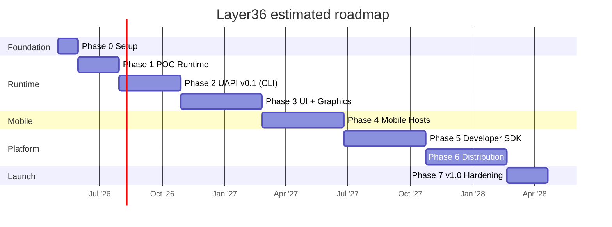
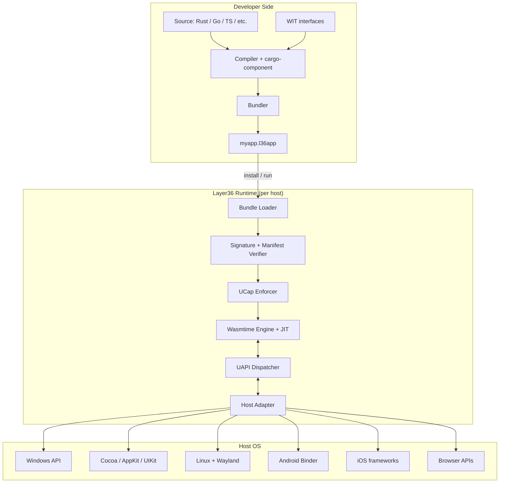
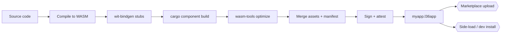
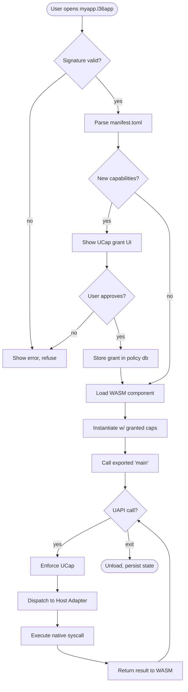
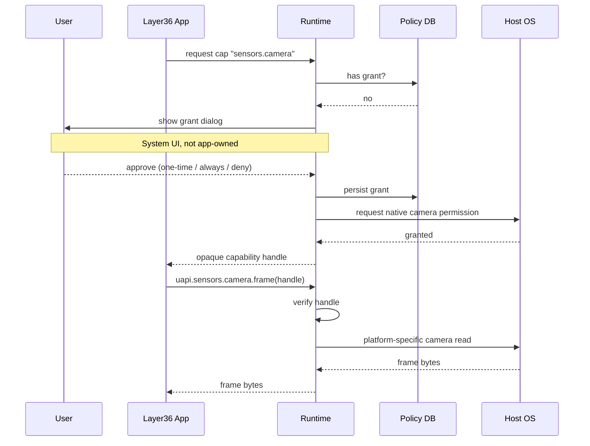
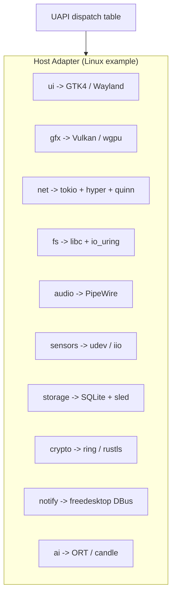
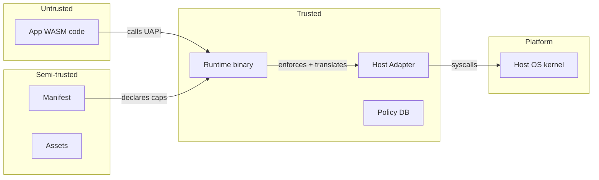
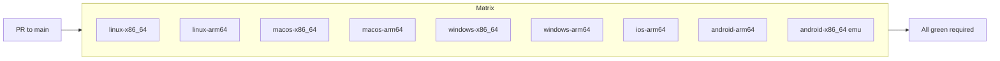
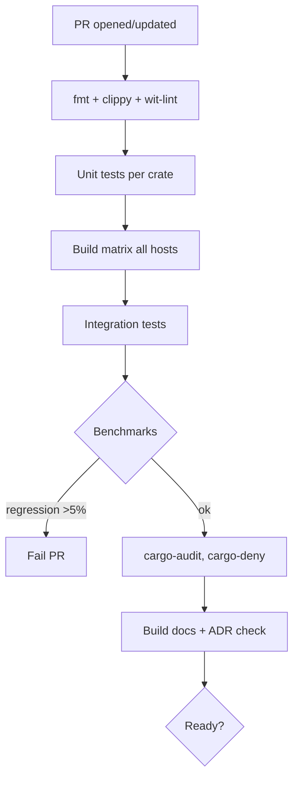
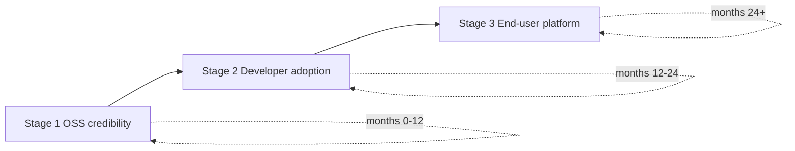

# Layer36 Build Plan

> **Version:** 0.1: Working draft
> **Status:** Phase 1 engineering proof complete; Phase 0 external launch items still pending.
> **Horizon:** estimated. The plan is phase based, not a fixed 24 month promise.
> **Name:** Layer36
> **Development repo:** `incyashraj/layer6x6` while the 6x6 portability matrix is being built.
> **Tagline:** Write once. Run on everything. Natively.

---

## Table of Contents

0. [How to Use This Document](#0-how-to-use-this-document)
1. [Executive Summary](#1-executive-summary)
2. [Vision & First Principles](#2-vision--first-principles)
3. [Core Concepts](#3-core-concepts)
4. [Architecture](#4-architecture)
5. [Technology Stack](#5-technology-stack)
6. [Phased Roadmap](#6-phased-roadmap)
7. [Detailed Task Breakdown](#7-detailed-task-breakdown)
8. [Testing Strategy](#8-testing-strategy)
9. [Build & CI/CD](#9-build--cicd)
10. [Security Model (UCap in depth)](#10-security-model-ucap-in-depth)
11. [Performance Targets](#11-performance-targets)
12. [Documentation Strategy](#12-documentation-strategy)
13. [Governance & Open Source](#13-governance--open-source)
14. [Risk Register](#14-risk-register)
15. [Go-to-Market](#15-go-to-market)
16. [Team & Hiring](#16-team--hiring)
17. [Infrastructure & Tools](#17-infrastructure--tools)
18. [Glossary](#18-glossary)
19. [References & Prior Art](#19-references--prior-art)
20. [Appendices](#20-appendices)
21. [Development Status](#21-development-status)

---

## 0. How to Use This Document

This is a **living build plan**. Treat it like a runbook, not a pitch deck.

- **When stuck during development:** jump to the relevant Phase in §6 and §7, find the task ID, follow the linked doc/RFC.
- **When making a decision:** check §5 (tech stack) for existing calls, §14 (risks) for known tradeoffs. If your decision isn't covered, write an ADR (Architecture Decision Record) following the template in Appendix D and add it to `docs/adr/`.
- **When onboarding someone new:** have them read §1, §2, §3, §4, §18 in that order. That's ~45 minutes and gives them full context.
- **When tempted to skip a phase:** don't. Each phase exists because the one after depends on it. If Phase 2 seems slow, the Phase 3 you build without it will be worse.

All task IDs follow the pattern `P{phase}-{area}-{n}` (e.g. `P2-UAPI-05`). Reference them in commits, PRs, and issues.

---

## 1. Executive Summary

### 1.1 What we're building

**Layer36** is a universal application platform: a portable runtime, a universal standard library (UAPI), a capability-based permission system (UCap), a package format, and a distribution layer that together let developers write an app **once** and have it run natively: with access to each platform's hardware and performance: on Windows, macOS, Linux, iOS, Android, and the web.

It is not:
- A new operating system in the Linux kernel sense
- An emulator or compatibility layer for existing apps (that's Project B: separate track)
- A browser or web framework

It is:
- A meta-platform that sits on top of existing OSes as a runtime
- The target developers compile to, not the OS users install instead of Windows
- The place software lives, independent of the device it lives on

### 1.2 Why now

Four forces are converging:

1. **WebAssembly is production-ready.** The bytecode is stable. The Component Model has shipped. WASI Preview 2 exists. Tooling for Rust, Go, C++, JS, and Python is mature.
2. **Device fragmentation is worse than ever.** Laptops (x86/ARM), phones (iOS/Android), tablets, watches, cars, TVs, XR headsets: each with a different SDK. No dev wants to ship seven codebases.
3. **Native cross-platform solutions are incomplete.** Flutter is UI-only. React Native is JS-only. Electron is bloated. None of them deliver true native capability + performance + cross-platform in one package.
4. **Hardware converges on ARM.** When every device runs the same ISA family, the primary reason to target different CPU backends evaporates. Only the OS layer differs, which is exactly what we abstract.

### 1.3 Success criteria (v1.0)

At v1.0 launch, Layer36 must be able to:

| # | Criterion | Target |
|---|-----------|--------|
| 1 | Run the same `.l36app` binary on | Windows 11+, macOS 13+, Ubuntu 22.04+, iOS 16+, Android 12+, browsers w/ WASM2 |
| 2 | Hello-world startup time | < 100 ms cold, < 20 ms warm |
| 3 | GUI app frame budget | 16.7 ms (60 fps) on M1/Snapdragon 8 Gen 2 |
| 4 | Binary size overhead vs native | < 3x for a typical productivity app |
| 5 | Supported source languages | Rust, Go, TypeScript (first-class); C/C++, Python, Swift (compatible) |
| 6 | Anchor tenant | ParkSure migrated end-to-end |
| 7 | Developer docs coverage | 100% of UAPI + every phase gate has a walkthrough |
| 8 | Passing CI on all target hosts | Nightly, zero red >=7 consecutive days before release |

### 1.4 Timeline at a glance



---

## 2. Vision & First Principles

### 2.1 The problem

An application today is coupled to six independent things: its CPU architecture, its kernel's syscall table, its system libraries, its framework APIs, its bundle format, and its security model. Supporting N operating systems requires N implementations of each layer: an O(N²) cost that compounds with every new device category.

The result is the Reddit compatibility chart users see: Android apps don't run on macOS, iOS apps don't run on Android, half the cells are "Not possible." Users pay for it in device lock-in. Developers pay for it in duplicated work. Innovation pays for it because new ideas have to be rewritten six times before they reach users.

### 2.2 The first-principles insight

Every scalable computing abstraction has solved fragmentation the same way: **insert a universal intermediate layer.**

- Multiple CPUs -> **LLVM IR** -> any backend
- Multiple OSes (server) -> **JVM bytecode / .NET CLR** -> any OS
- Multiple devices (web) -> **HTML/JS/CSS** -> any browser

Each time, the N² problem became 2N. Layer36 applies the same change to native apps: **one portable bytecode, one standard library, one permission model** at the center; a thin adapter per host on the outside.

### 2.3 Prior art (what we learn from each)

| System | What it got right | Why it didn't achieve full META-OS |
|---|---|---|
| **JVM** | Portable bytecode, rich stdlib, huge ecosystem | Enterprise server focus; desktop stalled (Swing/AWT); no mobile capture |
| **.NET** | Strong tooling, multi-language | Microsoft-first; late cross-platform (Mono -> .NET Core); tied to MS identity |
| **Flash / AIR** | Ubiquitous deployment, good graphics | Proprietary; Apple killed mobile in 2010; security reputation |
| **Silverlight** | In-browser + desktop, good MVVM | Killed by MS before maturity; plugin-dependent |
| **Browser + JS** | Universal reach, huge ecosystem | Sandbox too tight for native apps; perf ceiling; UI "not native" |
| **Electron** | Actually shipped cross-platform desktop | 100MB+ binaries; one Chromium per app; heavy battery cost |
| **Flutter** | Beautiful UI, consistent everywhere | Dart-only; doesn't use native controls; no iOS runtime, only compile-time |
| **React Native** | JS devs ship mobile | Bridge overhead; fights platform conventions; JS-only |
| **WASM + WASI** | Clean bytecode, emerging component model | **Missing UI, GPU, hardware capabilities: gaps we fill** |

### 2.4 Our wedge

We do not compete with these. We **complete WASM + WASI** for native app scenarios.

Specifically:
1. **We ship the UI/GPU/hardware UAPIs that WASI doesn't have yet** (upstream what we can, fork what we must).
2. **We ship a productized runtime + SDK** developers install in five minutes.
3. **We have an anchor tenant (ParkSure) that forces us to dogfood production-quality from day one.**

---

## 3. Core Concepts

Every concept here has a one-sentence canonical definition. Memorize them: they will appear in every RFC, ADR, and PR description.

### 3.1 Universal IR (UIR)

The portable bytecode and ABI that every Layer36 app compiles to. **Base: WebAssembly Core + Component Model.** Extensions we add: structured Unicode strings at ABI level, SIMD 128 mandatory, threads mandatory, exception handling (proposal) required, GC (proposal) required.

### 3.2 Universal API (UAPI)

The standard library every Layer36 app calls. **Defined as WIT interfaces** (WebAssembly Interface Types). Implemented by the runtime on each host by calling native OS APIs.

UAPI modules (target set for v1.0):

```
layer36:
  io/              # stdio, files, pipes, stdout, stderr
  net/             # TCP, UDP, QUIC, HTTP, WebSocket, DNS
  time/            # clocks, timers, scheduling
  fs/              # filesystem, paths, file metadata
  ui/              # window, widgets, layout, input, text rendering
  gfx/             # 2D canvas, 3D GPU (WebGPU-compat), shaders
  audio/           # playback, capture, mixing, MIDI
  sensors/         # accelerometer, gyro, GPS, camera, mic
  storage/         # key-value, SQL (SQLite), object store
  crypto/          # hash, symmetric, asymmetric, random, PQ-safe
  identity/        # DID-based user identity, signing, attestation
  ipc/             # intra-device messaging, cross-app calls
  notify/          # system notifications, toasts, badges
  locale/          # i18n, l10n, formatting
  accessibility/   # screen reader, high-contrast, reduced motion
  ai/              # local inference, model loading, embeddings
  platform/        # device info, capabilities query, power state
```

### 3.3 Universal Capabilities (UCap)

The permission model every app uses. **Capability-based** (not role-based, not sandbox-based). An app declares required capabilities in its manifest; the runtime issues unforgeable handles only to granted capabilities; users grant/revoke through a system UI owned by the runtime.

Canonical capability examples:
- `fs.read:~/Documents`
- `net.connect:api.parksure.com:443`
- `ui.window:create`
- `sensors.camera:frontfacing`
- `identity.sign:user`

### 3.4 Runtime

The binary installed on each host that loads and executes `.l36app` bundles. Responsibilities: bytecode JIT/AOT, UAPI dispatch, UCap enforcement, app lifecycle, window/surface management, update delivery.

**One runtime per host OS.** Internal architecture is shared across hosts; only the host-adapter layer differs.

### 3.5 Host Adapter

The per-OS module inside the runtime that translates UAPI calls into native OS calls. Example: `uapi::ui::window::create` on macOS host adapter calls AppKit `NSWindow`; on Windows, `CreateWindowExW`; on Android, `Activity` binder calls.

### 3.6 App Bundle (`.l36app`)

The distributable package. A zip-structured container:

```
myapp.l36app/
"""""" manifest.toml        # app id, version, capabilities, entry point, locale, deps
"""""" code.wasm            # WASM component (main entry)
"""""" modules/             # additional WASM components (lazy-loaded)
"""""" assets/              # images, fonts, sounds, shaders
"""""" locale/              # translations (TOML or fluent)
"""""" schema/              # storage schemas (SQL migrations)
"""""" signature.p7s        # developer signature (optional dev-mode skip)
""""" attest.json          # build attestation (reproducible build info)
```

### 3.7 Marketplace & Identity

Distribution channel and user identity layer. Marketplace serves signed bundles with update deltas. Identity uses DIDs (decentralized identifiers) so users own their account and carry it between devices. Apps authenticate users via `uapi::identity` without knowing the underlying DID method.

---

## 4. Architecture

### 4.1 Layered architecture



### 4.2 Developer build pipeline



### 4.3 Runtime execution flow



### 4.4 Capability grant sequence



### 4.5 Host adapter internals



### 4.6 Trust boundaries



---

## 5. Technology Stack

Every choice below is a **decision**, not a suggestion. Departing from it requires an ADR.

### 5.1 Base bytecode: WebAssembly (WASM)

- **Decision:** WASM 2.0 core + Component Model + WASI Preview 2.
- **Why:** stable, cross-platform, multi-language, has momentum (Bytecode Alliance, Fastly, Shopify).
- **What we add beyond baseline:** mandatory SIMD128, mandatory threads, EH + GC proposals required, tail calls required.

### 5.2 Interface types: WIT + Component Model

- **Decision:** All UAPI interfaces defined in WIT (`*.wit` files); apps are WASM components, not plain modules.
- **Why:** structured types cross language boundaries; component-to-component composition; version negotiation built in.

### 5.3 Runtime engine

- **Decision: Wasmtime.**
- **Why:** Bytecode Alliance stewarded, fastest to track new proposals, clean Rust embedding API, already used in production (Shopify Functions, Fermyon Spin, Microsoft Hyperlight).
- **Runners-up:** WasmEdge (strong mobile, reconsider for Phase 4), Wasmer (weaker Component Model today).
- **Embedding:** `wasmtime` crate, API stability pinned to Wasmtime's LTS line.

### 5.4 Source languages (priority order)

| Priority | Language | Toolchain | Notes |
|---|---|---|---|
| 1 | Rust | `cargo`, `cargo-component`, `wit-bindgen` | First-class; runtime itself is Rust |
| 2 | Go | TinyGo | Subset only; no full goroutines yet |
| 3 | TypeScript | ComponentizeJS / Jco | Smallest dev barrier, widest reach |
| 4 | C / C++ | clang + wasi-sdk | Legacy ports, game engines |
| 5 | Python | componentize-py | Data/AI workloads |
| 6 | Swift | embedded Swift -> WASM | Experimental; blocked on Apple tooling |

### 5.5 UI stack

- **Decision:** Hybrid retained-mode with a native-backed widget protocol.
  - Widget tree defined in WIT (abstract).
  - Runtime lowers tree to native controls where possible (NSView, UIView, Android View, HTMLElement, GTK widget).
  - Custom-drawn fallback via our 2D canvas (§5.6) for widgets the host doesn't have.
- **Rationale:** Flutter rejects native widgets and pays with "not feeling native"; Electron uses web and pays with size/perf. We split the difference: structure abstract, chrome native.
- **Implementation reference:** Xilem (Rust), SwiftUI's layout engine, React Native's "Fabric" architecture.

### 5.6 GPU / 2D graphics

- **Decision:** WebGPU as the portable GPU API (via `wgpu` on the runtime side). 2D canvas built on top (via `vello` or equivalent tile-based renderer).
- **Why:** WebGPU is converging across browser and native; `wgpu` already targets Metal, Vulkan, D3D12, and WebGPU itself.

### 5.7 Storage

- **Decision:**
  - Small structured: SQLite (via `rusqlite` bundled in runtime).
  - Unstructured blobs: content-addressed object store (initially just filesystem, later plug in S3-compatible remote).
  - Sync: app's responsibility via `uapi::net`; we provide primitives, not opinion.

### 5.8 Networking

- **Decision:**
  - HTTP/1.1, HTTP/2: `hyper` + `rustls`.
  - HTTP/3 / QUIC: `quinn`.
  - WebSocket: `tokio-tungstenite`.
  - DNS: `hickory-dns`.
- All wrapped by `uapi::net` WIT definitions; apps never see these crates directly.

### 5.9 Crypto

- **Decision:**
  - Symmetric / hash / MAC: `ring`.
  - TLS: `rustls`.
  - Post-quantum: `pqcrypto` for Kyber/Dilithium once stabilized; tracked as an app-opt-in capability.
  - Key storage: OS keychain on each host via adapter.

### 5.10 Package format

- **Decision:** `.l36app` = zip with deterministic ordering, using `zip` crate.
- **Signing:** Ed25519 signature over the manifest + content hashes; signature verified before any WASM executes.
- **Reproducible builds:** deterministic timestamps, sorted file order, locked toolchain versions.

### 5.11 Identity

- **Decision:** DID (Decentralized Identifier) with `did:key` initially, `did:web` as first remote method, optional bridge to OpenID Connect.
- **Rationale:** user portability (bring identity between hosts), no central auth server dependency, future-proof for Web3/credential ecosystems.

### 5.12 Observability

- Logging: `tracing` crate throughout the runtime; app logs go through `uapi::io::log`.
- Metrics: OpenTelemetry (OTLP) optional; `uapi::platform::telemetry` for app-level.
- Crash reporting: Sentry-compatible endpoint; symbolicated via build attestation.

### 5.13 Build & dev tools

| Tool | Use |
|---|---|
| `cargo` | Rust build |
| `cargo-component` | Build WASM components |
| `wit-bindgen` | Generate language bindings from WIT |
| `wasm-tools` | Component composition, optimization, validation |
| `wasmtime` CLI | Local execution for debugging |
| `layer36` CLI | Our product CLI (built Phase 5) |
| `just` | Task runner (thin layer over make) |
| `pre-commit` | Lint + format hooks |

### 5.14 Infra & deployment

| Layer | Choice |
|---|---|
| Source hosting | GitHub (public monorepo) |
| CI | GitHub Actions (matrix: linux-x64, linux-arm64, macos-x64, macos-arm64, windows-x64; later: android, iOS) |
| Artifact hosting | GitHub Releases + OCI registry (ghcr.io) |
| Docs hosting | GitHub Pages via mdBook + custom theme |
| Marketplace backend | Rust + axum; Postgres; S3-compatible blob store |
| CDN | Cloudflare (free tier -> Pro when traffic warrants) |

---

## 6. Phased Roadmap

Eight phases. The timing below is an estimate, not a deadline. Each phase has a single sentence that encodes its purpose; if you cannot map a task back to the current phase sentence, it does not belong in the current phase.

| # | Phase | Sentence | Estimate |
|---|---|---|---|
| 0 | Foundation | Get the project bones set up so real work can start. | mostly done; external items pending |
| 1 | POC Runtime | Prove one binary runs identically on three desktop hosts. | engineering done |
| 2 | UAPI v0.1 (CLI) | Ship the first useful cross-platform CLI app through our runtime. | est. 4 to 8 weeks |
| 3 | UI + Graphics | First GUI app running natively on Win / macOS / Linux. | est. 6 to 10 weeks |
| 4 | Mobile Hosts | Same app runs on iOS and Android. | est. 8 to 12 weeks |
| 5 | Developer SDK | A dev can `layer36 new hello && layer36 run` in under 60 seconds. | est. 6 to 10 weeks |
| 6 | Distribution & Identity | Users discover, install, update, and sign in across devices. | est. 8 to 12 weeks |
| 7 | v1.0 Hardening | ParkSure migrated end-to-end; public launch. | est. after Phase 6 |

### Phase 0: Foundation (mostly done; external items pending)

**Objective:** Everything a new contributor needs to start writing code on day 1.

**Deliverables:**
- Monorepo `layer36/layer36` on GitHub (MIT + Apache-2.0 dual license).
- README, CONTRIBUTING, SECURITY, CODE_OF_CONDUCT.
- Repo skeleton (see §7.0).
- First ADR (ADR-0001: "We use Rust for the runtime").
- CI pipeline running on Linux that builds + tests an empty Rust workspace.
- Issue templates, PR templates, labels.
- Discord / Matrix server for contributors.
- Documentation site scaffolded (mdBook).

**Exit criteria:**
- `git clone && cargo build` succeeds on a fresh laptop in <= 10 minutes.
- CI green on `main`.
- One external contributor (besides founder) has opened a PR and merged it.

### Phase 1: POC Runtime (engineering done)

**Objective:** "Same `.wasm` file runs via our CLI on Linux, macOS, Windows and prints Hello World. Nothing else."

**Deliverables:**
- `layer36-runtime` crate wrapping Wasmtime with the beginnings of our API surface.
- `layer36` CLI v0.0.1 with `layer36 run <file.wasm>`.
- Cross-platform CI matrix green.
- ADR-0002: "We use Wasmtime." ADR-0003: "We adopt Component Model."

**Exit criteria:**
- One Rust file -> `cargo component build` -> `layer36 run foo.wasm` prints hello on all three desktop OSes.
- Startup time < 200 ms cold on mid-range hardware.
- Runtime binary size < 30 MB.

### Phase 2: UAPI v0.1 (est. 4 to 8 weeks)

**Objective:** First CLI modules of UAPI defined, implemented on three hosts, and used by a real small app.

**Scope for v0.1:** `io`, `fs`, `net` (HTTP client only), `time`, `locale`.

**Deliverables:**
- WIT files for each v0.1 module in `wit/layer36/*.wit`.
- Host adapter implementations for Linux, macOS, Windows.
- `wit-bindgen` generated Rust, Go, and TypeScript stubs.
- Sample apps: `layer36-curl` (HTTP client), `layer36-cat` (file reader), `layer36-clock` (time demo).
- Integration test harness that runs sample apps under `layer36 run` on all three hosts and diffs stdout.

**Exit criteria:**
- All three sample apps pass on all three hosts in CI.
- A dev who knows Rust but nothing about WASM can write a new CLI app in < 30 minutes using our docs.

### Phase 3: UI + Graphics (est. 6 to 10 weeks)

**Objective:** First windowed GUI app running natively on three desktop hosts with consistent layout and native-feeling chrome.

**Scope:** `ui` (windowing, widget tree, input), `gfx` (2D canvas).

**Deliverables:**
- `ui.wit` defining widget protocol (Window, Stack, Button, Text, Input, Image, List).
- Retained-mode widget lowering:
  - macOS adapter -> AppKit.
  - Windows adapter -> Win32 + XAML Islands or native Win32.
  - Linux adapter -> GTK4.
- 2D canvas fallback (vello / wgpu) for custom-drawn widgets.
- Layout engine (flexbox subset based on Taffy).
- Input (keyboard, mouse, touch surrogate).
- Sample app: `layer36-notes`: minimal note-taking app with list, editor, save to disk.

**Exit criteria:**
- `layer36-notes` runs on all three desktop OSes and feels native (no Electron-style "web app in a chrome").
- 60 fps steady on 2020+ hardware.

### Phase 4: Mobile Hosts (est. 8 to 12 weeks)

**Objective:** The same `.l36app` that ran on desktop in Phase 3 runs on iOS and Android without source changes, only with mobile-appropriate layout.

**Deliverables:**
- Runtime port to iOS (via Embedded Swift bridge + Wasmtime-on-iOS).
- Runtime port to Android (via JNI + Wasmtime-on-Android).
- Touch input, gesture recognition (`uapi::ui::input::gesture`).
- `sensors` UAPI module (accelerometer, GPS, camera: read-only in v0.1).
- Mobile-specific lifecycle (background, suspend, resume).
- Mobile CI (GitHub Actions macOS runners for iOS; Linux for Android via AVD).

**Exit criteria:**
- `layer36-notes` runs on iPhone and Android phone.
- Battery usage comparable to a native Swift/Kotlin equivalent of the same app (<= 1.5x acceptable for v0.1).

### Phase 5: Developer SDK (est. 6 to 10 weeks)

**Objective:** A developer's first 60 seconds.

**Deliverables:**
- `layer36` CLI: `new`, `build`, `run`, `test`, `deploy`, `doctor`.
- Project templates (Rust, Go, TypeScript).
- Hot reload during dev.
- Debugger integration (DWARF via `wasm-tools component-debug`, VSCode extension).
- Profiler (wall-clock, heap, UAPI call timing).
- Language servers / IntelliSense work for WIT-generated bindings in all three first-class languages.

**Exit criteria:**
- `layer36 new hello --lang rust && cd hello && layer36 run` produces a running GUI on the dev's machine in under 60 seconds.
- Stack traces in app crashes point to app source, not WASM offsets.

### Phase 6: Distribution & Identity (est. 8 to 12 weeks)

**Objective:** Users and developers have a real platform: apps are published, discovered, installed, updated, and sign in with one identity across devices.

**Deliverables:**
- Marketplace backend (axum + Postgres + S3).
- Marketplace frontend (itself a Layer36 app: deep dogfood).
- Signing infrastructure (developer keypairs, revocation, transparency log).
- Delta updates (`.l36app` diff format).
- Identity: `did:key` support in runtime, `uapi::identity` module, DID resolution UI.
- Age-rating, content guidelines, moderation tooling (basic).

**Exit criteria:**
- A new user can install runtime, sign in, install 3 apps, and each app recognizes them as same user: on two different devices: without manual account setup in each app.
- Developer can `layer36 deploy` and the update reaches users' devices within 24 hours.

### Phase 7: v1.0 Hardening (est. after Phase 6)

**Objective:** Ship.

**Deliverables:**
- ParkSure migrated to Layer36 (all 6 client apps -> 1 codebase).
- Security audit by external firm (Trail of Bits or similar).
- Performance work: meet all §1.3 + §11 targets.
- Documentation pass: every UAPI function documented with examples.
- Localization: runtime + marketplace in EN + DE + FR + ES + ZH + HI.
- Accessibility audit.
- Marketing site, launch blog post, HN / Product Hunt coordinated launch.

**Exit criteria:** All §1.3 criteria met. Zero P0 bugs open.

---

## 7. Detailed Task Breakdown

Each phase's tasks are listed with an ID. Tasks are independent enough to be assigned to a single engineer-week unless noted.

### 7.0 Repo skeleton (Phase 0)

```
layer36/
"""""" Cargo.toml              # workspace
"""""" rust-toolchain.toml     # pinned stable + wasm32 targets
"""""" .github/
"   """""" workflows/
"   "   """""" ci.yml
"   "   """""" nightly.yml
"   "   """"" release.yml
"   """""" ISSUE_TEMPLATE/
"   """"" PULL_REQUEST_TEMPLATE.md
"""""" crates/
"   """""" runtime/            # the host runtime (Phase 1+)
"   """""" cli/                # `layer36` command (Phase 1+)
"   """""" bundle/             # .l36app format (Phase 6)
"   """""" policy/             # UCap policy engine (Phase 2+)
"   """"" host-adapter/
"       """""" linux/
"       """""" macos/
"       """""" windows/
"       """""" ios/            # Phase 4
"       """"" android/        # Phase 4
"""""" wit/
"   """"" layer36/
"       """""" io.wit
"       """""" net.wit
"       """"" ...             # one file per UAPI module
"""""" apps/                   # sample & dogfood apps
"   """""" layer36-curl/
"   """""" layer36-notes/
"   """"" marketplace/        # Phase 6
"""""" docs/
"   """""" adr/                # decision records
"   """""" book/               # mdBook source
"   """"" rfc/                # proposals
"""""" scripts/
"""""" test/
"   """""" integration/
"   """"" fixtures/
"""""" LICENSE-MIT
"""""" LICENSE-APACHE
"""""" README.md
"""""" CONTRIBUTING.md
"""""" SECURITY.md
""""" CODE_OF_CONDUCT.md
```

### 7.1 Phase 0 tasks

| ID | Task | Est |
|---|---|---|
| P0-REPO-01 | Initialize monorepo, licenses, README | 0.5d |
| P0-REPO-02 | Set up rust-toolchain, cargo workspace, cargo-deny | 0.5d |
| P0-REPO-03 | GitHub Actions: fmt, clippy, test, matrix build | 1d |
| P0-DOCS-01 | mdBook site with first chapter (Vision) | 1d |
| P0-DOCS-02 | ADR template + ADR-0001 (Rust choice) | 0.5d |
| P0-DOCS-03 | CONTRIBUTING.md covering PR flow, DCO, commit style | 0.5d |
| P0-COMM-01 | Discord server + #general, #dev, #design, #help | 0.5d |
| P0-COMM-02 | Twitter/X account, first announcement thread draft | 0.5d |
| P0-LEGAL-01 | Trademark search for "Layer36" (defer filing) | 0.5d |
| P0-HIRE-01 | Write contributor guide for first external PR | 0.5d |

### 7.2 Phase 1 tasks

| ID | Task | Est |
|---|---|---|
| P1-RT-01 | Create `runtime` crate; integrate Wasmtime | 2d |
| P1-RT-02 | Load + instantiate a WASM component | 1d |
| P1-RT-03 | Define minimal host import table (print, exit) | 1d |
| P1-RT-04 | Configurable fuel / memory limits | 1d |
| P1-CLI-01 | `layer36` binary using `clap` | 1d |
| P1-CLI-02 | `layer36 run <file>` subcommand | 1d |
| P1-CLI-03 | `layer36 version`, `layer36 doctor` basic | 0.5d |
| P1-CI-01 | Cross-platform CI matrix | 2d |
| P1-CI-02 | Release artifacts (tar.gz, zip, .msi, .pkg) | 2d |
| P1-TEST-01 | Integration test: hello-world.wasm runs on all hosts | 1d |
| P1-DOC-01 | Quickstart: "Run your first WASM under layer36" | 1d |
| P1-DOC-02 | ADR-0002 (Wasmtime), ADR-0003 (Component Model) | 1d |
| P1-PERF-01 | Baseline startup, memory benchmarks | 2d |
| P1-SEC-01 | Threat model document v0.1 | 2d |

### 7.3 Phase 2 tasks

| ID | Task | Est |
|---|---|---|
| P2-UAPI-01 | Write `wit/layer36/io.wit` (stdio, log) | 1d |
| P2-UAPI-02 | Write `wit/layer36/fs.wit` (open, read, write, stat) | 2d |
| P2-UAPI-03 | Write `wit/layer36/net.wit` (HTTP client only) | 2d |
| P2-UAPI-04 | Write `wit/layer36/time.wit` (clock, sleep, timer) | 1d |
| P2-UAPI-05 | Write `wit/layer36/locale.wit` (current locale, format) | 1d |
| P2-ADPT-01 | Implement io/fs/net/time adapters on Linux | 3d |
| P2-ADPT-02 | Implement same on macOS | 3d |
| P2-ADPT-03 | Implement same on Windows | 3d |
| P2-BIND-01 | Rust bindings via wit-bindgen | 1d |
| P2-BIND-02 | Go bindings via TinyGo | 2d |
| P2-BIND-03 | TypeScript bindings via jco | 2d |
| P2-APP-01 | Write `layer36-curl` sample | 2d |
| P2-APP-02 | Write `layer36-cat` sample | 1d |
| P2-APP-03 | Write `layer36-clock` sample | 1d |
| P2-TEST-01 | Harness: run sample, diff stdout across hosts | 2d |
| P2-SEC-01 | UCap minimum: cap per UAPI module, grant-at-launch | 3d |
| P2-DOC-01 | WIT style guide | 1d |
| P2-DOC-02 | UAPI reference (auto-gen from WIT) | 2d |

### 7.4 Phase 3 tasks

| ID | Task | Est |
|---|---|---|
| P3-UI-01 | Widget protocol design RFC | 3d |
| P3-UI-02 | `wit/layer36/ui.wit` | 2d |
| P3-UI-03 | Layout engine (Taffy integration) | 3d |
| P3-UI-04 | Window + event loop abstractions | 3d |
| P3-UI-05 | macOS adapter: NSWindow + NSView widget bridge | 5d |
| P3-UI-06 | Windows adapter: Win32 + DirectComposition | 5d |
| P3-UI-07 | Linux adapter: GTK4 bridge | 5d |
| P3-GFX-01 | `wit/layer36/gfx.wit` (2D canvas) | 2d |
| P3-GFX-02 | `wgpu` integration in runtime | 3d |
| P3-GFX-03 | 2D canvas via vello | 5d |
| P3-GFX-04 | 3D API (WebGPU-compatible subset) | 5d |
| P3-INPUT-01 | Keyboard + mouse input | 2d |
| P3-INPUT-02 | Text input + IME | 3d |
| P3-APP-01 | Design and build `layer36-notes` | 5d |
| P3-A11Y-01 | Screen reader integration per platform | 5d |
| P3-TEST-01 | UI snapshot testing harness | 3d |
| P3-PERF-01 | Frame budget dashboard | 2d |
| P3-DOC-01 | "Build a GUI app" tutorial | 3d |

### 7.5 Phase 4 tasks

| ID | Task | Est |
|---|---|---|
| P4-IOS-01 | Compile Wasmtime for iOS (arm64 + simulator) | 3d |
| P4-IOS-02 | iOS host app shell (Swift + embedded runtime) | 5d |
| P4-IOS-03 | UIKit widget bridge | 7d |
| P4-IOS-04 | iOS lifecycle adapter | 3d |
| P4-IOS-05 | Metal-backed wgpu | 2d |
| P4-IOS-06 | Sensors adapter (Core Motion, Core Location) | 3d |
| P4-IOS-07 | TestFlight-compatible packaging | 2d |
| P4-AND-01 | Compile Wasmtime for Android (arm64, x86_64) | 3d |
| P4-AND-02 | Android host app shell (Kotlin + JNI) | 5d |
| P4-AND-03 | Android View widget bridge | 7d |
| P4-AND-04 | Android lifecycle adapter | 3d |
| P4-AND-05 | Vulkan-backed wgpu | 2d |
| P4-AND-06 | Sensors adapter (SensorManager, FusedLocation) | 3d |
| P4-AND-07 | APK/AAB packaging | 2d |
| P4-UI-01 | Touch + gesture UAPI | 3d |
| P4-UI-02 | Mobile-appropriate default layouts | 3d |
| P4-APP-01 | `layer36-notes` port verified on both mobile OSes | 3d |
| P4-CI-01 | iOS CI on GitHub Actions macOS runners | 3d |
| P4-CI-02 | Android CI via emulator | 3d |

### 7.6 Phase 5 tasks

| ID | Task | Est |
|---|---|---|
| P5-CLI-01 | `layer36 new <name> --lang <rust\|go\|ts>` scaffolding | 3d |
| P5-CLI-02 | `layer36 build` wrapper around component builds | 2d |
| P5-CLI-03 | `layer36 test` harness integration | 2d |
| P5-CLI-04 | `layer36 doctor` environment check | 2d |
| P5-HOT-01 | Hot reload architecture RFC | 2d |
| P5-HOT-02 | Hot reload implementation (re-instantiate w/ state migration) | 7d |
| P5-DBG-01 | DWARF in component format | 5d |
| P5-DBG-02 | VSCode extension skeleton | 3d |
| P5-DBG-03 | Breakpoints + step-through | 7d |
| P5-PROF-01 | Flamegraph for UAPI calls | 3d |
| P5-PROF-02 | Heap snapshots | 3d |
| P5-LSP-01 | WIT language server | 3d |
| P5-LSP-02 | Integrate WIT LSP with rust-analyzer / gopls / tsserver | 3d |
| P5-TMPL-01 | Rust GUI template | 1d |
| P5-TMPL-02 | Go CLI template | 1d |
| P5-TMPL-03 | TS GUI template | 1d |
| P5-DOC-01 | "Your first 60 seconds" tutorial | 2d |

### 7.7 Phase 6 tasks

| ID | Task | Est |
|---|---|---|
| P6-BUNDLE-01 | `.l36app` format spec | 3d |
| P6-BUNDLE-02 | Packer / unpacker in bundle crate | 3d |
| P6-BUNDLE-03 | Delta update diff format | 5d |
| P6-SIGN-01 | Developer keypair enrollment flow | 3d |
| P6-SIGN-02 | Signature verification in runtime | 3d |
| P6-SIGN-03 | Transparency log (Sigstore-style) | 5d |
| P6-MP-01 | Marketplace schema (Postgres) | 2d |
| P6-MP-02 | Upload + storage pipeline | 5d |
| P6-MP-03 | Search + discovery API | 3d |
| P6-MP-04 | Reviews + ratings | 3d |
| P6-MP-05 | Categories + featured content | 2d |
| P6-MP-06 | Age-rating + moderation tooling | 5d |
| P6-MP-07 | Marketplace frontend (itself a Layer36 app) | 10d |
| P6-ID-01 | `did:key` implementation | 3d |
| P6-ID-02 | `did:web` resolver | 3d |
| P6-ID-03 | `uapi::identity` module | 3d |
| P6-ID-04 | Key storage in OS keychains | 3d |
| P6-ID-05 | Cross-device sync flow | 5d |
| P6-UPD-01 | Background update service per host | 5d |
| P6-UPD-02 | Rollback mechanism | 3d |

### 7.8 Phase 7 tasks

| ID | Task | Est |
|---|---|---|
| P7-PARK-01 | ParkSure architecture review for Layer36 port | 3d |
| P7-PARK-02 | Port driver app | 10d |
| P7-PARK-03 | Port operator app | 10d |
| P7-PARK-04 | Port valet ops + lot admin | 10d |
| P7-PARK-05 | Port public dashboard | 5d |
| P7-PARK-06 | Cross-device user journey end-to-end | 5d |
| P7-SEC-01 | External security audit | 20d (elapsed) |
| P7-SEC-02 | Remediation of findings | 10d |
| P7-PERF-01 | Meet §1.3 and §11 targets | 20d |
| P7-DOC-01 | Documentation pass (every UAPI fn) | 15d |
| P7-DOC-02 | Migration guide "from Electron/Flutter/RN to Layer36" | 5d |
| P7-I18N-01 | Runtime + marketplace in 6 locales | 10d |
| P7-A11Y-01 | Full accessibility audit | 5d |
| P7-LAUNCH-01 | Marketing site | 5d |
| P7-LAUNCH-02 | Launch blog, HN post, video demo | 3d |
| P7-LAUNCH-03 | Press outreach | 3d |

---

## 8. Testing Strategy

### 8.1 Test pyramid

| Level | Tool | What it covers | Where it lives |
|---|---|---|---|
| Unit | `cargo test`, language-native | Pure functions, parsers, small modules | Inside each crate |
| Component | `wasmtime`-based harness | Single WASM component calling UAPI | `test/integration/component/` |
| Integration | Custom harness | Runtime + adapter + real native calls (sandboxed) | `test/integration/` |
| E2E | Real devices / VMs | Full user flows | `test/e2e/` |
| Snapshot | `insta` (Rust) | UI layouts, stdout captures | Per-app |
| Property | `proptest` | WIT ABI invariants, encoding | Runtime crates |
| Fuzz | `cargo-fuzz` | Bundle parser, manifest parser, UCap enforcer | `fuzz/` |

### 8.2 Cross-platform test matrix



### 8.3 Performance benchmarks

Every phase owns a benchmark suite. Results published to a dashboard.

- `bench_startup`: cold start, warm start, first frame.
- `bench_uapi_hot_path`: UAPI call overhead (measured in ns).
- `bench_ui_frame`: build + render a 1000-widget tree.
- `bench_bundle_install`: extract + verify `.l36app`.

CI fails if benchmarks regress > 5% without an approved ADR.

### 8.4 Security testing

- Static: `cargo-audit`, `cargo-deny`, `semgrep` per PR.
- Dynamic: `cargo-fuzz` nightly on bundle parser and UCap enforcer (minimum 4h budget).
- Pen test: external firm in Phase 7.
- Bug bounty: opens with Phase 6.

---

## 9. Build & CI/CD

### 9.1 CI pipeline



### 9.2 Release pipeline

Triggered by `v*` tag on `main`:

1. Build all host binaries.
2. Sign each artifact (Sigstore for OSS; OS-specific signing keys for Windows/macOS store).
3. Run full E2E against the release artifacts.
4. Publish to GitHub Releases + ghcr.io.
5. Publish WIT files to a public registry (own implementation or reuse wa.dev).
6. Generate release notes from conventional-commit log.
7. Update `docs/` site.
8. Announce on Discord + Twitter + blog.

---

## 10. Security Model (UCap in depth)

### 10.1 Design principles

1. **Capability = unforgeable reference to an operation on a resource.**
2. **Apps get capabilities only through the runtime's explicit grant.** No ambient authority.
3. **Users own the grant decision.** Runtime UI, not app UI, prompts.
4. **Least privilege by default.** Deny-by-default; manifest declares the maximum set; user grants a subset.
5. **Revocation is real.** Revoking a cap invalidates all outstanding handles immediately.
6. **Every grant is audit-logged.** User can see what was granted when, by whom, to which app.

### 10.2 Capability string format

```
<module>.<action>[:<resource>]
```

Examples:

- `fs.read:~/Documents/**`
- `fs.write:~/.config/myapp/**`
- `net.connect:api.example.com:443`
- `net.connect:*:443` (any host on 443)
- `ui.window:create`
- `sensors.camera:frontfacing`
- `identity.sign:user`
- `ai.inference:localmodel:llama-small`

Wildcards `*` allowed only in documented positions (host, path suffix). Never in action or module.

### 10.3 Grant dialog UX rules

- Shown only when a new capability is requested.
- Categorized: "Always / Just this session / Ask every time / Deny".
- Shows human-readable explanation (manifest provides `rationale` field per cap).
- Shows publisher identity with trust signals (new publisher, known good, revoked).
- Cannot be summoned by app code: runtime-driven only.
- Sensitive capabilities (camera, microphone, location, identity, background net) require elevated confirmation (biometric / password / OS-native prompt).

### 10.4 Manifest excerpt

```toml
[app]
id = "com.parksure.driver"
name = "ParkSure Driver"
version = "1.0.0"
entry = "code.wasm"

[[capabilities]]
cap = "net.connect:*.parksure.com:443"
rationale = "Sync bookings and status"
required = true

[[capabilities]]
cap = "sensors.camera:rearfacing"
rationale = "Scan QR codes at parking entrance"
required = false

[[capabilities]]
cap = "sensors.location:precise"
rationale = "Find parking near you"
required = false
```

### 10.5 Policy DB

Per-user, per-device SQLite table:

```sql
CREATE TABLE ucap_grant (
  app_id       TEXT NOT NULL,
  capability   TEXT NOT NULL,
  mode         TEXT NOT NULL CHECK (mode IN ('always','session','once','deny')),
  granted_at   INTEGER NOT NULL,
  expires_at   INTEGER,           -- NULL = no expiry
  granted_by   TEXT,               -- user DID
  PRIMARY KEY (app_id, capability)
);
CREATE INDEX idx_grant_app ON ucap_grant(app_id);
```

---

## 11. Performance Targets

| Metric | Target | Measured how |
|---|---|---|
| Cold start (hello-world CLI) | < 100 ms | `layer36 run` wall time, average of 20 |
| Warm start (same binary) | < 20 ms | As above, after first run |
| UAPI dispatch overhead | < 500 ns | Microbench inside runtime |
| First frame (GUI hello-world) | < 300 ms | Timestamp diff from exec to first paint |
| Steady-state frame | 16.7 ms (60 fps) | Per-frame histogram |
| Bundle install time (10 MB) | < 2 s | `layer36 install` wall time |
| Bundle delta update (1 MB) | < 500 ms | Download + apply |
| Memory overhead (runtime + empty app) | < 40 MB RSS | `ps` after hello-world exits |
| Binary size overhead vs native equivalent | < 3x | Size of `.l36app` vs hand-written native |

Every phase has a subset of these to hit. §7 tasks link to the relevant target.

---

## 12. Documentation Strategy

Three tiers, lives in `docs/book/` built by mdBook.

### 12.1 Tiers

1. **Tutorials**: guided, complete walkthroughs. Each ends with a working app.
2. **How-to guides**: recipe style, for people who already know what they're doing.
3. **Reference**: exhaustive, auto-generated from WIT + Rustdoc.
4. **Explanation**: why things are the way they are; links to ADRs.

(This is the Divio documentation taxonomy: worth adopting wholesale.)

### 12.2 Documentation quality gate

Every new UAPI function must ship with:
- WIT comment (appears in reference).
- At least one example in the module's guide.
- An entry in the changelog.

A PR that adds a public API without docs is rejected by CI.

### 12.3 ADR workflow

1. Draft ADR in `docs/adr/NNNN-short-title.md` using the template in Appendix D.
2. Open a PR titled `ADR: <title>`.
3. Minimum 2 maintainers approve, or 1 approve + 7 days open.
4. Merged ADRs are immutable; supersede via a new ADR that references the old one.

---

## 13. Governance & Open Source

### 13.1 License

Dual MIT / Apache-2.0, the standard in the Rust ecosystem. Bundle format and WIT interfaces under CC-BY-4.0 for maximum spread.

### 13.2 Ownership model

- **Benevolent dictator -> foundation track.**
  - Early project: Y is BDFL. All calls land with Y.
  - After real adoption: establish a steering committee. BDFL retains veto on bytecode and UAPI compatibility.
  - Post-v1.0: transfer trademark + release process to a neutral foundation (Apache, Bytecode Alliance, or standalone).

### 13.3 RFC process

Any change to UIR, UAPI, UCap, or bundle format requires an RFC:

1. Draft in `docs/rfc/NNNN-title.md`.
2. Open PR.
3. 14-day comment period minimum.
4. Core team votes (super-majority).
5. Merge and implement.

### 13.4 Backward compatibility

- **UIR:** never break. Additive only.
- **UAPI:** semantic versioning per module. Breaking changes require a new major version; old major maintained for 18 months minimum.
- **Bundle format:** versioned header; old formats supported indefinitely.
- **Runtime:** semantic versioning; older bundles run on newer runtime; newer bundles may require minimum runtime version declared in manifest.

---

## 14. Risk Register

### 14.1 Technical risks

| Risk | Likelihood | Impact | Mitigation |
|---|---|---|---|
| WASM Component Model instability | Medium | High | Pin to stable subset; contribute upstream; maintain shim layer to absorb churn |
| GPU API fragmentation (WebGPU not universal yet) | Medium | Medium | Fall back to per-host backend via wgpu; ship wgpu copy we control |
| Mobile background execution limits | High | Medium | Design UAPI around foreground-first; use host-specific background services via adapter |
| Binary size too large | Medium | High | Aggressive dead-code elimination; optional lazy-loaded modules; per-platform builds |
| JIT startup vs AOT tradeoff | Medium | Medium | Ship both: JIT for dev, AOT cache for installed apps |
| UCap usability (too many prompts) | High | High | Batch initial grants; rationales; remember-my-choice defaults; study with real users in Phase 3 |
| Font & text rendering parity | High | Medium | Delegate to host text engine via adapter; custom only for logo-style uses |
| Accessibility parity | Medium | High | Bake a11y into widget protocol from Phase 3, not tacked on |

### 14.2 Ecosystem / market risks

| Risk | Likelihood | Impact | Mitigation |
|---|---|---|---|
| Developer cold-start problem | High | Critical | Anchor tenant (ParkSure); pay first 10 migrations; flagship app we own |
| Apple App Store policy blocks us | High | High | Start with developer mode + TestFlight; follow Swift Playgrounds / Pyto precedent; compile-to-native fallback for production |
| Google Play policy blocks us | Medium | High | APK sideload viable on Android; Play Store is nice-to-have, not critical |
| Platform vendors build their own | Medium | Medium | Open standards + governance -> no one owns it -> reduces vendor incentive to kill it |
| Community fragmentation (hard fork) | Low | High | Clear governance + liberal contribution + trademark held by foundation |

### 14.3 Organizational risks

| Risk | Likelihood | Impact | Mitigation |
|---|---|---|---|
| Founder-only team cannot ship the full plan alone | High | Critical | Recruit co-founder or first key systems contributor by end of Phase 1 |
| Funding runway | Medium | Critical | Build MVP (Phase 2) before fundraising; OSS + sponsorships supplement |
| Burnout | Medium | High | Hard 40h/wk default; explicit rest weeks between phases |
| ParkSure time conflict | High | High | Schedule Layer36 work around ParkSure milestones; use Phase 7 to migrate ParkSure itself: one-stone-two-birds |

### 14.4 Legal (deferred per founder instruction; tracked)

Items to revisit at Phase 6:
- Trademark "Layer36" + "META-OS".
- GPL-vs-permissive implications of any linked code.
- Export controls on crypto (BIS EAR classification).
- App Store ToS compliance posture.
- DMA (EU) and similar laws that may *help* us.

---

## 15. Go-to-Market

### 15.1 Three-stage go-to-market



### 15.2 Stage 1 (months 0-12): OSS credibility

- Open source from day one. Public repo, public roadmap, public Discord.
- Regular (monthly) blog posts about what we're building.
- Conference talks: RustConf, Wasm I/O, Web Summit developer track.
- Establish as a serious project in the WASM/component ecosystem.
- Target audience: WASM insiders, Rust systems folks, Bytecode Alliance.
- Goal: 5k GitHub stars, 500 Discord members, 30 external contributors.

### 15.3 Stage 2 (months 12-24): Developer adoption

- Launch Phase 5 SDK publicly with strong DX.
- Target 5 flagship apps built by external teams (subsidize if needed).
- Partnership program: startups get free builds + marketing in exchange for case study.
- Target audience: devs tired of maintaining 3-6 codebases.
- Goal: 10k installs of the dev toolchain, 100 apps shipped.

### 15.4 Stage 3 (months 24+): End-user platform

- Marketplace launches with ParkSure and 20+ quality apps.
- Consumer-targeted install flow (one-click installer per host).
- Content partners for launch-week catalog.
- Press launch; coordinated reviews.
- Target: 100k installs of runtime by end of month 30.

---

## 16. Team & Hiring

### 16.1 Team growth

| Phase | Team size | Critical roles |
|---|---|---|
| 0 | 1 (founder) | Founder, generalist |
| 1 | 1-2 | + Rust systems engineer (possibly part-time) |
| 2 | 2-3 | + 2nd systems engineer or contractor for per-host adapters |
| 3 | 3-5 | + UI engineer (graphics/UX), + designer (part-time) |
| 4 | 5-7 | + iOS specialist, + Android specialist |
| 5 | 6-9 | + DX / devtools engineer, + docs engineer |
| 6 | 8-12 | + backend engineer (marketplace), + security engineer, + community manager |
| 7 | 10-15 | + QA lead, + marketing, + support |

### 16.2 First hire priorities

Rank order for the next three hires after founder:

1. **Senior systems engineer (Rust)**: ideally with WASM runtime experience. Look: Wasmtime contributors, Shopify Functions team alumni, Fermyon ex-eng.
2. **UI engineer**: experience with cross-platform UI systems (Flutter / React Native / Avalonia / Slint). Graphics background is a plus.
3. **Security engineer**: capability-based security experience (a rare bird). Failing that, someone from macOS kernel team, iOS security, or any sandboxing project. Consulting OK for Phase 0-3.

### 16.3 Co-founder question

Y's existing memory says a technical co-founder with DeFi or security background is the highest-impact hire for Bouclier. For Layer36 the best co-founder profile is different: **systems / compiler / OS kernel background**. Not the same person. If Bouclier and Layer36 both need a co-founder, these are two different people and time has to be allocated to recruiting both separately.

---

## 17. Infrastructure & Tools

### 17.1 Core infrastructure

| Need | Tool | Notes |
|---|---|---|
| Source | GitHub | Public monorepo + private tooling sub-repos |
| CI | GitHub Actions | Matrix runners; self-hosted arm64 Linux if needed |
| Container / OCI registry | ghcr.io | Free for public images |
| Binary artifact hosting | GitHub Releases + Cloudflare R2 | R2 for large binaries / delta updates |
| Issue tracking | GitHub Issues | Labels for phase, area, priority |
| Project boards | GitHub Projects | One per phase |
| Docs | mdBook + GitHub Pages | Custom theme matching brand |
| Blog | Astro or Zola | Static, fast, versioned |
| Chat | Discord (or Matrix for purists) | #general, #dev, #help, #design, #rfc |
| Forum | GitHub Discussions | For long-form topics |
| Analytics | Plausible (self-hosted or cloud) | Privacy-respecting |
| Metrics / monitoring | Grafana Cloud (free tier) -> self-host | For marketplace backend |
| Error tracking | Sentry (open source, self-hosted) | For runtime crashes |
| Secrets | 1Password / doppler | For team |
| Project management | Linear or GitHub Projects | Whichever wins after 2 weeks |
| Design | Figma | Free tier adequate |

### 17.2 Developer machine requirements

- 16 GB RAM minimum, 32 recommended.
- 200 GB free disk (all host SDKs add up).
- macOS required for any iOS work.
- Windows required to test the Windows adapter locally (or Parallels).
- All three OS VMs recommended for anyone working on the host adapter.

### 17.3 Budget estimate (lean early path)

| Item | Monthly | Notes |
|---|---|---|
| GitHub org (Team) | $4 x team size | Team plan |
| CI minutes | $0-200 | Free tier + occasional top-ups |
| Cloud (marketplace Phase 6+) | $50-500 | Scale with users |
| Cloudflare | $20-200 | Pro -> Business |
| Error + monitoring | $0-100 | Self-host where possible |
| Domain, certificates | $20 | Multiple domains |
| Legal (trademark + counsel) | Variable, defer | Phase 6+ |
| Salaries | Largest line | Depends on hiring model |

Total infra without salaries: < $1k/month for 18 months, < $2k/month after launch.

---

## 18. Glossary

- **ABI**: Application Binary Interface. The contract between caller and callee in compiled code.
- **ADR**: Architecture Decision Record. A short document capturing a decision and its context.
- **AOT**: Ahead-Of-Time compilation.
- **Capability**: An unforgeable token granting the right to perform an operation on a resource.
- **Component Model**: WebAssembly specification adding typed interfaces and composition to WASM modules.
- **DID**: Decentralized Identifier. A W3C standard for self-sovereign identity.
- **Host Adapter**: The per-OS module inside the Layer36 runtime that maps UAPI to native calls.
- **JIT**: Just-In-Time compilation.
- **Manifest**: `manifest.toml` describing a Layer36 app's metadata and required capabilities.
- **Layer36**: Product name for the META-OS described here.
- **UAPI**: Universal API. The standard library exposed to every Layer36 app.
- **UCap**: Universal Capabilities. The permission model.
- **UIR**: Universal Intermediate Representation. The bytecode every app compiles to (= WASM).
- **WASI**: WebAssembly System Interface. A standard set of host interfaces for WASM.
- **WASM**: WebAssembly.
- **WIT**: WebAssembly Interface Types. The IDL for Component Model interfaces.

---

## 19. References & Prior Art

### 19.1 Specifications

- [WebAssembly Core Specification](https://webassembly.github.io/spec/core/)
- [WebAssembly Component Model](https://github.com/WebAssembly/component-model)
- [WASI Preview 2](https://github.com/WebAssembly/WASI)
- [W3C DID Core](https://www.w3.org/TR/did-core/)
- [WebGPU Specification](https://www.w3.org/TR/webgpu/)

### 19.2 Runtimes

- [Wasmtime](https://wasmtime.dev/)
- [WasmEdge](https://wasmedge.org/)
- [Wasmer](https://wasmer.io/)

### 19.3 Languages / Toolchains

- [cargo-component](https://github.com/bytecodealliance/cargo-component)
- [wit-bindgen](https://github.com/bytecodealliance/wit-bindgen)
- [TinyGo](https://tinygo.org/)
- [ComponentizeJS / Jco](https://github.com/bytecodealliance/ComponentizeJS)

### 19.4 UI frameworks worth studying

- Xilem (Rust; reactive architecture)
- Slint (cross-platform, declarative, tiny)
- Flutter (architecture doc; not the implementation)
- SwiftUI (layout system)
- React Native's Fabric (bridge architecture)

### 19.5 Capability systems worth studying

- seL4 (the canonical capability-kernel)
- CapROS
- Fuchsia's Zircon handles
- Pledge / Unveil (OpenBSD)

### 19.6 Documentation systems

- [Divio documentation system](https://documentation.divio.com/)
- [Diátaxis](https://diataxis.fr/)

---

## 20. Appendices

### Appendix A: Example WIT file (`wit/layer36/fs.wit`)

```wit
package layer36:fs@0.1.0;

interface types {
  record file-stat {
    size: u64,
    modified: u64,          // unix millis
    is-dir: bool,
  }

  variant open-mode {
    read,
    write,
    read-write,
    append,
  }

  variant error {
    not-found,
    permission-denied,
    io(string),
    invalid-path,
  }
}

interface fs {
  use types.{file-stat, open-mode, error};

  resource file {
    read: func(n: u32) -> result<list<u8>, error>;
    write: func(bytes: list<u8>) -> result<u32, error>;
    seek: func(pos: u64) -> result<u64, error>;
    close: func();
  }

  open: func(path: string, mode: open-mode) -> result<file, error>;
  stat: func(path: string) -> result<file-stat, error>;
  list: func(path: string) -> result<list<string>, error>;
  remove: func(path: string) -> result<_, error>;
  mkdir: func(path: string) -> result<_, error>;
}

world fs-consumer {
  import fs;
}
```

### Appendix B: Example manifest (`manifest.toml`)

```toml
[app]
id          = "com.example.notes"
name        = "Notes"
version     = "1.0.0"
entry       = "code.wasm"
runtime-min = "0.1.0"

[metadata]
authors     = ["Jane Dev <jane@example.com>"]
homepage    = "https://notes.example.com"
source      = "https://github.com/example/notes"
license     = "MIT"
categories  = ["productivity"]

[[capabilities]]
cap        = "ui.window:create"
rationale  = "Show the notes UI"
required   = true

[[capabilities]]
cap        = "fs.read:~/Documents/Notes/**"
rationale  = "Read saved notes"
required   = true

[[capabilities]]
cap        = "fs.write:~/Documents/Notes/**"
rationale  = "Save notes"
required   = true

[[capabilities]]
cap        = "net.connect:sync.example.com:443"
rationale  = "Cloud sync (optional)"
required   = false

[locales]
default    = "en"
supported  = ["en", "de", "es", "fr", "hi", "zh"]

[assets]
icon       = "assets/icon.png"
splash     = "assets/splash.png"
```

### Appendix C: Example UAPI use in Rust

```rust
// myapp/src/main.rs
use layer36::fs::{self, OpenMode};
use layer36::ui::{Window, Stack, Text, Button};

fn main() -> layer36::Result<()> {
    let mut file = fs::open("~/notes.txt", OpenMode::Read)?;
    let contents = file.read_to_string()?;

    let window = Window::new("My Notes")
        .size(640, 480)
        .content(
            Stack::vertical()
                .push(Text::new(contents))
                .push(Button::new("Save").on_click(save))
        );

    window.show_and_run()
}

fn save(_ev: layer36::ui::Event) {
    // ...
}
```

### Appendix D: ADR template

```markdown
# ADR-NNNN: <short title>

**Status:** Proposed | Accepted | Superseded by ADR-XXXX
**Date:** YYYY-MM-DD
**Authors:** @handle, @handle

## Context

What is the problem? What forces are at play? What does the current
state look like?

## Decision

What exactly are we deciding? One short imperative paragraph.

## Consequences

What becomes easier? What becomes harder? What do we give up?

## Alternatives considered

- **Alt A**: why rejected
- **Alt B**: why rejected

## References

Links, prior art, discussion threads.
```

### Appendix E: First-week checklist

Day-by-day for Phase 0 week 1, no room for "what do I do next?"

**Monday**
- [ ] Create GitHub org `layer36`
- [ ] Create repo `layer36/layer36`
- [x] Add MIT + Apache-2.0 LICENSE files
- [x] Init Cargo workspace
- [ ] Push first commit: `chore: init workspace`

**Tuesday**
- [x] Write README.md (vision, quickstart placeholder, contribute link)
- [x] Write SECURITY.md (disclosure email, PGP key)
- [x] Write CONTRIBUTING.md (DCO, commit style, PR flow)
- [x] Write CODE_OF_CONDUCT.md (Contributor Covenant 2.1)

**Wednesday**
- [x] Add GitHub Actions: `ci.yml` with fmt + clippy + test
- [ ] Set up branch protection on `main`
- [x] Add issue + PR templates
- [x] Add labels (phase:0""7, area:runtime, area:uapi, "")

**Thursday**
- [ ] Create Discord server; write rules and channel descriptions
- [ ] Cross-link Discord " repo in all files
- [x] mdBook skeleton with TOC matching §1-§20 of this plan
- [ ] Commit this plan as `docs/book/src/BUILD_PLAN.md`

**Friday**
- [x] Write ADR-0001 (Rust choice)
- [x] First blog post draft: "Why I'm building Layer36"
- [x] Twitter/X announcement thread draft
- [x] Retrospective: what took longer than expected; update this plan

### Appendix F: Nomenclature cheat sheet

What we call things vs. what the ecosystem calls them. Keep these consistent in docs and code.

| We say | Others say | Difference |
|---|---|---|
| UIR | WASM bytecode | Same thing; UIR is our platform-branded name. |
| UAPI | WASI + our additions | Superset of WASI. |
| UCap | WASI capabilities + grants + policy | We add the grant UX + policy DB. |
| Layer36 runtime | WASM runtime (Wasmtime) | Ours = Wasmtime + our adapters + loaders + policy. |
| Host Adapter | (no standard name) | Our term for the OS-specific translation layer. |
| .l36app | WASM component + manifest | Packaged form. |

---

---

## 21. Development Status

> **Current Phase:** Phase 2: UAPI v0.1 has started, with formal Phase 0/1 external gates still pending
> **Project Status:** In Progress
> **Phase 0 Start:** 2026-05-01
> **v1.0 Target:** estimated after Phase 7
> **Last Updated:** 2026-05-05

This section is the living status board for all of Layer36. Update it at every phase boundary, major milestone, and architectural pivot. It is the first thing a returning contributor should read.

---

### 21.1 Phase Overview

| # | Phase | Status | Started | Completed | Notes |
|---|-------|--------|---------|-----------|-------|
| 0 | Foundation | Mostly done | 2026-05-01 | pending external gates | Renamed from OneOS to Layer36 on 2026-05-02; local scaffold, docs, Pages, labels/issues, and CI are green. |
| 1 | POC Runtime | Engineering done | 2026-05-02 | pending formal exit gates | Runtime, CLI, WIT host imports, shared hello-world fixture, CI harness, fuel/memory limits, release packaging, quickstart, threat model, benchmarks, ADRs, retrospective, and `v0.1.0-rc1` are in place. |
| 2 | UAPI v0.1 (CLI) | Started | 2026-05-03 | pending | Draft WIT package, manifest/policy checks, manifest generation and text/JSON inspection, manifest entry/run-file match check, terminal grant prompt, effective capability text/JSON dump, local text/JSONL grant logging, runtime guard, host-binding checkpoint, dispatcher scaffold, policy coverage tests, file-handle and stdio stream capability rechecks, generated type bridge, generated host wiring, resource table, initial Phase 2 `layer36 run` linker path, smoke happy/denied proofs, first Rust SDK crate and helper layer, first Rust app walkthrough, Phase 1 to Phase 2 migration note, first Go and TypeScript SDK scaffolds with clock/cat/curl sample variants and shape checks, optional Go/TypeScript runtime fixture assertions wired behind `LAYER36_GO_*`/`LAYER36_TS_*` WASM paths plus language-variant fixture path auto-discovery, `layer36-clock`, first `layer36-cat`, first `layer36-curl`, sample-manifest launch coverage, language-tooling doctor probes, pure Layer36 imports for the Rust cat/curl samples, component import purity checks, permission-denied exit-code alignment, explicit filesystem sandbox-root resolution with symlink escape checks, no-follow final file opens on Unix and Windows, root-like destructive operation guards, bounded per-call filesystem read/list limits, bounded per-call stream/filesystem write limits, raw app-argument transport guardrails, CLI-side app-argument preflight validation, runtime resource-table cap for stream/file handles, runtime close-on-drop resource cleanup wiring, generated-host resource-table cap, and shared path prefix/reserved-name/trailing-segment/path-length hardening plus sandbox-rooted absolute logical-path handling, shared host clock and locale helpers, shared time overflow guards, deterministic baseline locale date/number formatting, locale-tag canonicalization hardening, locale-subtag shape hardening, timezone-shape normalization hardening, plain HTTP request framing with configurable response-size guard, request-line URL validation, plain-HTTP authority and header-value hardening, shared endpoint parsing for policy checks, shared authority parsing reuse across runtime and adapter-common, shared strict HTTP response parsing and validation, shared host-label and IPv4 parsing hardening, shared host-case normalization, host-case policy parity tests, shared URL scheme-case normalization for parser parity, shared ASCII-only URL input hardening for parser parity, shared response read-loop limits and timeout mapping, shared response content-length and transfer-encoding integrity checks, strict buffered content-length matching, shared request-body size guard, shared request-target size guard, typed network errors, and clearer curl messages, deterministic locale/timezone test overrides plus strict clock snapshot fixture coverage, Rust SDK docs and packaged-crate smoke, manifest-derived UAPI reference capability tables, function-level UAPI reference notes, first UAPI dispatch and component startup benchmarks, first `adapter-common` shared network, filesystem path and operation, time, and locale slices, and budget-aware CI mode are in place. |
| 3 | UI + Graphics | Not started | pending | pending | |
| 4 | Mobile Hosts | Not started | pending | pending | |
| 5 | Developer SDK | Not started | pending | pending | |
| 6 | Distribution & Identity | Not started | pending | pending | |
| 7 | v1.0 Hardening | Not started | pending | pending | |

---

### 21.2 Cross-Phase Milestones

| Milestone | Target Phase | Status | Date | Notes |
|-----------|-------------|--------|------|-------|
| First external contributor PR merged | 0 | Pending | pending | |
| `layer36 run hello.wasm` green on 3 desktop OSes | 1 | Done | 2026-05-03 | GitHub CI confirmed Linux, macOS, and Windows with one shared `.wasm` artifact across all three. |
| `layer36-curl` byte-identical across Linux/macOS/Win | 2 | Pending | pending | |
| `layer36-notes` GUI running on Win/macOS/Linux | 3 | Pending | pending | |
| `layer36-notes` running on iOS + Android | 4 | Pending | pending | |
| 60-second `layer36 new && layer36 run` walkthrough | 5 | Pending | pending | |
| First app published via external developer | 6 | Pending | pending | |
| ParkSure fully migrated to Layer36 | 7 | Pending | pending | |
| Co-founder / first key hire onboarded | Phase 1 target | Pending | pending | |
| v1.0 public launch | 7 | Pending | pending | |

---

### 21.3 ADR Log

Append as each ADR is drafted and merged. Full ADR files live in `docs/adr/`.

| ADR | Title | Phase | Status | Merged |
|-----|-------|-------|--------|--------|
| ADR-0001 | Rust for the runtime | 0 | Accepted locally | pending |
| ADR-0002 | Wasmtime as runtime engine | 1 | Accepted | 2026-05-02 |
| ADR-0003 | Adopt WASM Component Model from day one | 1 | Accepted | 2026-05-02 |
| ADR-0006 | WIT versioning strategy | 2 | Accepted | 2026-05-04 |
| ADR-0007 | UCap v0.1 soft enforcement | 2 | Accepted | 2026-05-04 |
| ADR-0008 | Host async runtime | 2 | Accepted | 2026-05-04 |

_ADRs 0009 onward will be added here as they are drafted and merged across phases._

---

### 21.4 Team

| Role | Person | Joined | Notes |
|------|--------|--------|-------|
| Founder / BDFL | Y | 2026-05-01 | |

---

### 21.5 Open Decisions

Decisions actively under discussion, not yet resolved into an ADR.

| # | Question | Context | Target By |
|---|----------|---------|----------|
| none | none | none | none |

---

### 21.6 Running Log

Short time-stamped entries for anything significant: ecosystem developments, pivots, key learnings, notable contributor events.

| Date | Entry |
|------|-------|
| 2026-05-01 | Project initiated. Build Plan and all Phase Plans written. Phase 0 underway. |
| 2026-05-02 | Project renamed from OneOS to Layer36 after preliminary trademark search found material OneOS conflicts. Plans, docs, CLI placeholders, WIT namespace examples, and bundle extension updated. |
| 2026-05-02 | Phase 0 local scaffold verified: Cargo build/test/fmt/clippy, mdBook build, cargo-deny, and setup script are green. |
| 2026-05-02 | Phase 1 local development started: `crates/runtime` and `crates/cli` added, Wasmtime 43.0.2 selected for Rust 1.91.1, and initial `layer36` CLI commands verified. |
| 2026-05-02 | First Phase 1 end-to-end local run: `cargo-component` built the Rust hello-world component and `layer36 run` printed `Hello, Layer36!` through WIT host imports. |
| 2026-05-02 | Local release build verified: `cargo build --release --workspace` produced `target/release/layer36`, and the release binary ran the hello-world component. |
| 2026-05-02 | Phase 1 CI harness added: Linux/macOS/Windows test matrix now builds release binaries, builds the hello component, checks its SHA-256, and runs it through `layer36`. |
| 2026-05-02 | Phase 1 limit enforcement added: `layer36 run --fuel 1` and `layer36 run --mem-limit 0` fail cleanly with exit code 4. |
| 2026-05-02 | Phase 1 release packaging added: `release.yml` builds five planned artifacts on tags and `scripts/package.sh` produced a local 4.4 MB macOS tarball. |
| 2026-05-02 | Phase 1 quickstart added to the mdBook and linked from README. Volunteer timing is still pending. |
| 2026-05-02 | `layer36 doctor` improved to find `cargo-component` under Cargo home and report both Phase 1 WASM targets. |
| 2026-05-02 | Phase 1 Threat Model v0.1 added with STRIDE analysis and explicit deferred security work. |
| 2026-05-02 | Phase 1 benchmark suite added with Criterion, a print-loop component fixture, warning-only CI regression checks, and an Apple M4 local baseline published in the mdBook. |
| 2026-05-02 | Phase 1 test harness consolidated in `scripts/test-phase1.sh` so local setup and CI both build the hello component before running fixture-backed tests. |
| 2026-05-02 | Drafted the Phase 2 kickoff issue under `docs/governance/phase-2-kickoff-issue.md`; actual GitHub issue creation remains pending until Phase 1 exits. |
| 2026-05-02 | Initial Layer36 workspace pushed to GitHub at `incyashraj/layer6x6` with commit `fe41db4`, credited only to `incyashraj`. |
| 2026-05-02 | First GitHub CI exposed two portability issues: host-dependent hello component hashes and an old cargo-deny action unable to parse CVSS 4.0 advisories. CI now logs fixture hashes and installs `cargo-deny 0.19.4`. |
| 2026-05-02 | GitHub CLI setup completed for `incyashraj`; repository homepage/topics, labels, five good-first issues, Phase 1 kickoff issue, and Pages URL were configured for `incyashraj/layer6x6`. |
| 2026-05-03 | Phase 1 shared-fixture CI is green: one uploaded hello `.wasm` artifact is verified by SHA-256 and executed through `layer36` on Linux, macOS, and Windows. |
| 2026-05-03 | Published `v0.1.0-rc1` as a GitHub prerelease with five platform archives and `SHA256SUMS`: Linux x64, Linux ARM64, macOS Intel, macOS Apple Silicon, and Windows x64. |
| 2026-05-03 | Verified ADR-0002 and ADR-0003 are on `main`; Phase 1 ADR gate is closed. |
| 2026-05-03 | Wrote the Phase 1 engineering retrospective. External quickstart timing and governance closeout remain pending. |
| 2026-05-03 | Reworked public docs into simpler human language, added a left-to-right system timeline, and changed roadmap timing from fixed months to estimates. |
| 2026-05-04 | Added the first named Phase 2 sample app, `apps/layer36-clock`, and a hidden fixed-time test flag so clock output can be tested without depending on the real wall clock. |
| 2026-05-04 | Added a Layer36-native `io.args` import, app argument forwarding through `layer36 run ... -- <args>`, and the first `apps/layer36-cat` sample with grant and denial tests. |
| 2026-05-04 | Added the first `apps/layer36-curl` sample and a plain HTTP adapter slice. Local tests now prove granted localhost GET works and missing `net.connect` is denied before network access. |
| 2026-05-04 | Added the first Rust guest SDK crate at `crates/bindings-rust` and migrated the Rust sample apps to `use layer36::{io, fs, net, time, locale}` instead of raw app-local binding paths. |
| 2026-05-04 | Added the first Rust SDK helper layer and public SDK guide. The sample components still import only Layer36 UAPI after the helper work. |
| 2026-05-04 | Added the first terminal grant prompt through `layer36 run --prompt`, while preserving clean missing-grant denials for non-interactive runs. |
| 2026-05-04 | Hardened Phase 2 manifest loading so `app.entry` must match the `.wasm` being executed before grants or runtime execution begin. |
| 2026-05-04 | GitHub Actions account billing/spending limit blocked new jobs, so CI was moved to manual-only temporarily. Local fmt, clippy, mdBook, and full workspace tests are the development gate until Actions is available again. |
| 2026-05-04 | Added `layer36 run --dump-caps` so effective session grants can be inspected without starting the component. |
| 2026-05-04 | Aligned sample-app UCap denial behavior on exit code 5 and added an outside-granted-glob denial test for `layer36-cat`. |
| 2026-05-04 | Repo visibility changed to public, so cheap hosted CI is restored on pushes and PRs. Added a manual self-hosted CI path for a local runner labeled `layer36-local`. |
| 2026-05-04 | Fixed the first self-hosted runner failure by adding Cargo's bin directory to the runner PATH and calling the installed `mdbook` binary directly. |
| 2026-05-04 | Prepared the Rust guest SDK package surface: crate README, crates.io metadata, package include list, local package proof, and CI package dry-runs. |
| 2026-05-04 | Added the first generated UAPI reference page from Phase 2 WIT, linked it in mdBook, and made hosted/self-hosted CI check it stays current. |
| 2026-05-04 | Improved the generated UAPI reference with plain summaries, capability notes, Rust SDK examples, WIT doc comments, and a generator test. |
| 2026-05-04 | Aligned the self-hosted clippy command with hosted CI by checking all targets, after hosted CI caught a generator-test lint. |
| 2026-05-04 | Polished the Rust SDK surface with crate docs, rustdoc comments, owned argument helpers, sample app cleanup, and a self-hosted SDK doc build check. |
| 2026-05-04 | Published the Phase 2 WIT style guide with rules for UAPI naming, resources, errors, capability mapping, comments, versioning, and review. |
| 2026-05-04 | Added a Phase 2 UAPI contract checker and wired it into hosted and self-hosted CI so WIT package shape changes are caught early. |
| 2026-05-04 | Moved the Phase 2 capability table into the manifest crate and exposed it through `layer36 manifest capabilities`. |
| 2026-05-04 | Wired the generated UAPI reference to the manifest crate's capability table, so docs, manifest validation, and `layer36 manifest capabilities` describe the same accepted strings. |
| 2026-05-05 | Hardened shared filesystem path parsing to reject path segments with trailing dots or trailing spaces before host I/O, closing a Windows path normalization edge case and keeping sandbox behavior consistent across hosts. |
| 2026-05-05 | Hardened shared URL parsing so `http` and `https` schemes are treated case-insensitively in both plain HTTP parsing and network capability endpoint checks, keeping grant behavior stable for mixed-case input URLs. |
| 2026-05-05 | Hardened shared locale parsing so locale tags are canonicalized with deterministic subtag casing and malformed tags fall back to `en-US`; timezone normalization now rejects control-character values and falls back to `UTC`. |
| 2026-05-05 | Hardened shared URL parsing to reject non-ASCII URL input in the early plain-HTTP path, keeping request framing and capability endpoint checks conservative and deterministic. |
| 2026-05-05 | Hardened shared timezone normalization to accept only conservative timezone shapes in this phase and cap length, with invalid values falling back to `UTC` for deterministic runtime formatting behavior. |
| 2026-05-05 | Hardened shared filesystem path parsing with segment and total logical-path length caps, so oversized paths are rejected before host I/O in the early sandboxed adapter path. |
| 2026-05-05 | Hardened shared locale-tag parsing with stricter primary-subtag and subtag length validation, with malformed locale-tag shapes now falling back to `en-US`. |
| 2026-05-05 | Hardened runtime filesystem resolution so absolute logical paths are sandbox-rooted instead of host-rooted, keeping absolute and relative app paths under the same sandbox checks. |
| 2026-05-04 | Hardened Phase 2 file-handle UCap checks so read-write opens require both grants and later file resource methods re-check path capabilities before adapter calls. |
| 2026-05-04 | Added filesystem denial-before-adapter coverage for Phase 2 `stat`, `list`, `remove`, `mkdir`, and `rename` dispatcher paths. |
| 2026-05-04 | Added Phase 2 UAPI dispatch microbenchmarks and published first local sub-microsecond readings for IO, filesystem, denial, and network grant paths. |
| 2026-05-04 | Extended the startup benchmark to run real Phase 2 components. The first local read puts the Phase 2 smoke app cold runtime path around 3.47 ms on Apple M4; full CLI and cross-host timing still remain. |
| 2026-05-04 | Cleaned up `layer36-cat` and `layer36-curl` so their rebuilt components import only Layer36 UAPI, not accidental WASI Preview 2 helpers. Explicit fixture-backed CLI tests now pass locally for hello, smoke, clock, cat, and curl. |
| 2026-05-04 | Added an automated component import purity check so built Phase 2 fixtures fail full CI if they import host APIs outside `layer36:*`. |
| 2026-05-04 | Added fixture-backed sample manifest launch tests for `layer36-clock`, `layer36-cat`, and `layer36-curl` using `layer36 run --manifest ... --auto-grant`. |
| 2026-05-04 | Extended `layer36 doctor` to show Phase 2 language-binding tool readiness for TinyGo, Go, Node, npm, and jco before wiring those build paths into CI. |
| 2026-05-04 | Started the TypeScript SDK track with `packages/sdk-ts`, WIT import declarations, helper wrappers, examples, a package shape check, and a docs page. Runtime proof with jco still remains. |
| 2026-05-04 | Started the Go/TinyGo SDK track with `packages/sdk-go`, UAPI helper packages, clock/curl examples, a package shape check, and a docs page. Runtime proof with TinyGo still remains. |
| 2026-05-04 | Added `layer36 manifest init` so developers can generate a valid starter manifest from app id, name, entry, and capability strings instead of copying TOML by hand. |
| 2026-05-04 | Added `layer36 manifest explain` so developers can inspect default grants, launch-grant needs, resources, and rationales before running an app. |
| 2026-05-04 | Added the first end-to-end Rust UAPI walkthrough covering SDK usage, component build, manifest init/explain, granted run, and denial behavior. |
| 2026-05-04 | Published the Phase 1 to Phase 2 migration note so early proof-app experiments have a clear path to the real UAPI, manifest, and grant model. |
| 2026-05-04 | Added `layer36 run --log-grants` to append app identity and effective session grants to a local audit log during Phase 2 test runs. |
| 2026-05-04 | Added `layer36 manifest explain --format json` so CI scripts, editors, and future tools can consume the same manifest grant explanation as the human text view. |
| 2026-05-04 | Added JSON output for `layer36 manifest check` and `layer36 manifest capabilities`, completing the script-friendly manifest inspection surface. |
| 2026-05-04 | Added a 1 MiB cap to the Phase 2 plain HTTP adapter response reader, turning one open network hardening item into deterministic runtime behavior. |
| 2026-05-04 | Added `layer36 run --dump-caps-format json` so effective run grants can be inspected by scripts before runtime execution. |
| 2026-05-04 | Added JSON Lines output for `layer36 run --log-grants` so local audit records can be consumed by scripts. |
| 2026-05-04 | Added `layer36 run --max-http-response-bytes` so the Phase 2 plain HTTP response guard is explicit and tunable per run. |
| 2026-05-04 | Mapped oversized Phase 2 HTTP responses to WIT `net-error.body-too-large` so apps can distinguish response limits from connection failures. |
| 2026-05-04 | Mapped Phase 2 HTTP timeouts and malformed responses to WIT `net-error.timeout` and `net-error.protocol`. |
| 2026-05-04 | Updated `layer36-curl` to print specific messages for response-too-large, timeout, and protocol errors. |
| 2026-05-04 | Deepened the generated UAPI reference with function-level behavior notes for interfaces and resource methods. |
| 2026-05-04 | Added a Rust SDK packaged-crate smoke check that compiles a fresh outside-workspace Layer36 component against the packaged SDK. |
| 2026-05-04 | Expanded the Phase 2 plain HTTP adapter from GET-only framing to lower-level request framing with method, app headers, buffered body, and host-owned transport headers. |
| 2026-05-04 | Hardened Phase 2 stdio stream resources so stdin/stdout/stderr handles carry their origin and stream read/write/flush methods re-check capability metadata before adapter calls. |
| 2026-05-04 | Added Phase 2 UAPI policy coverage tests so every supported capability name maps to a UAPI call and the current dispatcher adapter surface is exercised through the policy gate. |
| 2026-05-04 | Accepted ADR-0006, ADR-0007, and ADR-0008 for Phase 2 WIT versioning, UCap soft enforcement, and host async runtime direction. |
| 2026-05-04 | Started `crates/adapter-common` and moved the plain HTTP URL parser plus request framing into shared adapter code so future Linux, macOS, and Windows adapter crates reuse the same behavior. |
| 2026-05-04 | Added shared filesystem path normalization to `adapter-common`; local filesystem calls and UCap filesystem resource matching now reject parent traversal and use one portable separator rule. |
| 2026-05-04 | Added an explicit Phase 2 filesystem sandbox root to runtime config and `layer36 run --sandbox-root`, so relative app paths resolve through the runtime instead of relying on process CWD. |
| 2026-05-04 | Hardened relative sandbox-root filesystem paths against symlink escapes by checking canonical existing targets or canonical parents before local host I/O. |
| 2026-05-04 | Added no-follow final-symlink flags to Unix Phase 2 file opens, so the OS rejects final symlink swaps after the sandbox path check. |
| 2026-05-04 | Added the Windows final-symlink equivalent (`FILE_FLAG_OPEN_REPARSE_POINT`) to Phase 2 file opens, so final symlink swaps are blocked at open time on both desktop host families. |
| 2026-05-04 | Moved host clock behavior into `adapter-common`, covering fixed test time, Unix-epoch milliseconds, monotonic elapsed time, and sleep. |
| 2026-05-04 | Hardened shared host-clock edge cases so monotonic nanoseconds saturate instead of wrapping and out-of-range Unix-millis conversions fail cleanly before crossing the UAPI boundary. |
| 2026-05-04 | Moved first host locale behavior into `adapter-common`, covering environment locale detection, timezone fallback, and basic locale normalization. |
| 2026-05-04 | Added shared filesystem operation intents and runtime guards so destructive remove and rename calls cannot target root-like paths such as `.` before native host I/O. |
| 2026-05-04 | Hardened the shared plain HTTP URL parser so whitespace/control characters cannot enter the request line, and empty or zero ports are rejected before socket access. |
| 2026-05-04 | Hardened shared plain HTTP parsing and framing to reject unsupported authority forms, reject control-character header values, and keep `Transfer-Encoding` in the host-controlled header denylist. |
| 2026-05-04 | Hardened shared filesystem path parsing to reject colon-based prefix forms, including Windows drive-style prefixes and alternate-data-stream style suffixes, before sandbox resolution or host I/O. |
| 2026-05-04 | Added a shared URL endpoint parser for capability checks and switched runtime network policy gating to use it, removing duplicate endpoint parsing between runtime and shared adapter code. |
| 2026-05-04 | Refactored plain HTTP URL parsing to reuse the same shared authority parser used by runtime network policy checks, and added runtime tests for invalid-URL short-circuiting and default HTTP port grant behavior. |
| 2026-05-04 | Hardened shared filesystem path parsing against Windows device-name edge cases by rejecting reserved path segments such as `CON`, `NUL`, `COM1`-`COM9`, and `LPT1`-`LPT9` before host I/O. |
| 2026-05-04 | Added hidden `layer36 run --test-locale` and `--test-timezone` flags, wired locale/timezone overrides through runtime + adapter-common locale helpers, and added a strict deterministic `layer36-clock` fixture snapshot test for cross-host output comparisons. |
| 2026-05-05 | Added Go and TypeScript `layer36-cat` sample variants and extended both SDK shape checks to validate cat/clock/curl sample behavior contracts, moving the language-variant side of Phase 2 app coverage forward without adding expensive CI runtime jobs. |
| 2026-05-05 | Added optional Go/TypeScript runtime fixture assertions in the CLI integration test harness behind `LAYER36_GO_*` and `LAYER36_TS_*` WASM env vars, plus `scripts/test-phase2-language-variants.sh` and CI workflow hooks that auto-skip until those variant components are provided. |
| 2026-05-05 | Upgraded shared locale formatting from placeholder strings to deterministic baseline date/number formatting in `adapter-common`, and updated runtime/CLI snapshot tests for stable cross-host outputs. |
| 2026-05-05 | Added shared plain HTTP response parsing in `adapter-common` and switched runtime fetch parsing to it, with strict response validation for version, status range, header shape, header count, and header value safety. |
| 2026-05-05 | Tightened shared host parsing for Phase 2 network URLs: domain labels cannot start/end with `-`, label lengths are bounded, and numeric-dot hosts must parse as valid IPv4 addresses. |
| 2026-05-05 | Moved full HTTP response reading into shared adapter-common code so timeout mapping and response-size limit behavior are enforced through one helper across runtime adapter paths. |
| 2026-05-05 | Added shared response integrity checks for the plain HTTP slice: reject unsupported response `Transfer-Encoding`, conflicting `Content-Length`, and mismatched buffered body lengths before runtime-facing response data is returned. |
| 2026-05-05 | Added a shared request-body size guard for the plain HTTP slice so buffered Phase 2 fetch requests reject unbounded payloads before socket writes. |
| 2026-05-05 | Tightened buffered `Content-Length` validation so truncated responses, including empty-body truncation against declared non-zero length, are rejected in shared plain HTTP response parsing. |
| 2026-05-05 | Normalized accepted host names to lowercase in shared URL endpoint parsing, so network capability checks stay case-stable (`EXAMPLE.com` and `example.com` now resolve to the same endpoint shape). |
| 2026-05-05 | Added runtime dispatcher coverage proving mixed-case URL hosts match lowercase `net.connect` grants after shared host normalization. |
| 2026-05-05 | Added a shared request-target size guard for plain HTTP URL parsing so oversized path/query targets are rejected before request framing and socket writes. |
| 2026-05-05 | Added bounded Phase 2 filesystem operations in the local adapter: per-call reads above 8 MiB and directory listings above 4096 entries now fail with explicit runtime I/O errors, with runtime tests covering both guardrails. |
| 2026-05-05 | Added bounded Phase 2 write operations in the local adapter: per-call stream writes and filesystem writes above 8 MiB now fail with explicit runtime I/O errors, with runtime tests covering both oversized write paths. |
| 2026-05-05 | Added raw app-argument transport guardrails in the local adapter: `io.args.raw` now rejects empty args, newline/NUL delimiter characters, and oversized raw payloads above 64 KiB, with runtime tests covering valid and invalid argument shapes. |
| 2026-05-05 | Added CLI preflight checks for Phase 2 app arguments so invalid raw-args shapes fail before runtime execution: empty args, newline/NUL delimiter characters, and oversized raw payloads now return clear CLI errors with dedicated integration coverage. |
| 2026-05-05 | Extended Phase 2 app-argument guardrails with a count limit: runtime and CLI now reject more than 1024 app arguments before guest parsing, with runtime and CLI tests for this path. |
| 2026-05-05 | Added language-variant fixture auto-discovery for Go/TypeScript runtime tests: both CLI integration helpers and `scripts/test-phase2-language-variants.sh` now detect `test/integration/language-variants/*.wasm` when `LAYER36_GO_*` / `LAYER36_TS_*` env vars are not set. |
| 2026-05-05 | Added a local runtime resource-table cap for Phase 2 file/stream handles. Once the open-handle cap is reached, further handle allocation fails with a clear runtime I/O error, and runtime tests cover overflow rejection. |
| 2026-05-05 | Added close-on-drop wiring for Phase 2 file/stream resources: generated host `drop` callbacks now close underlying local adapter handles before removing host-side resource entries, with tests covering drop-close behavior and resource-slot reuse after close. |
| 2026-05-05 | Added a generated-host resource-table cap for Phase 2 file/input/output resources, with overflow now failing through a clear host-table limit error and runtime tests proving overflow rejection. |
| 2026-05-05 | Added Phase 2 resource-ID reuse in both local adapter and generated host resource tables, with runtime tests proving close/drop reuse and free-list-first allocation when ID counters hit their numeric ceiling. |
| 2026-05-05 | Fixed hosted CI clippy failures after resource-lifecycle trait expansion by updating the runtime benchmark `NoopAdapter` to implement new `close_stream` and `close_file` trait methods. |
| 2026-05-05 | Added a new docs page for non technical readers, `docs/book/src/progress-for-everyone.md`, with plain language status, system flow diagrams, and current phase progress; linked it in mdBook navigation for GitHub Pages. |
| 2026-05-05 | Hardened manifest capability resource parsing: filesystem capability resources now use shared logical-path validation and `net.connect` resources must match a valid endpoint shape, so malformed resource patterns fail earlier at manifest parse time. |
| 2026-05-05 | Hardened session-policy network resource matching: `net.connect` grant matching now normalizes host case and numeric ports before wildcard evaluation, so mixed-case hosts and zero-padded ports match canonical runtime endpoint forms. |
| 2026-05-05 | Tightened manifest-side `net.connect` host validation to match earlier shared-host hardening: host patterns now reject invalid dot placement, invalid label-edge `-` forms, and malformed numeric IPv4 literals during manifest parsing, with explicit test coverage for accepted and rejected host shapes. |
| 2026-05-05 | Published the missing Phase 2 language tutorials: added `First Go CLI` and `First TypeScript CLI` walkthroughs in mdBook, linked them in navigation, and closed the "three tutorials, one per language" Phase 2 documentation checklist item. |
| 2026-05-05 | Hardened dependency-audit execution for hosted and self-hosted CI by adding `scripts/check-dependencies.sh`: advisory-db parser/lock-path failures now degrade to a warning, while `cargo-deny` `licenses`, `bans`, and `sources` remain hard gates. Also fixed a wildcard-style path dependency in `crates/manifest/Cargo.toml` so bans checks pass again. |
| 2026-05-05 | Added first Phase 2 fuzz scaffolding under `fuzz/` with `cargo-fuzz` targets for manifest parsing, logical path parsing, and policy matching, plus a short smoke runner script at `scripts/run-phase2-fuzz-smoke.sh`. Checklist now marks fuzz targets defined, with nightly multi-hour fuzz stability still pending. |
| 2026-05-05 | Self-hosted fuzz smoke exposed a real panic in shared path hardening (`is_reserved_windows_segment`) on non-ASCII four-byte inputs. Fixed by switching to ASCII-byte pattern matching for reserved COM/LPT names, and added a regression test so the same crash input now parses safely without panicking. |
| 2026-05-05 | Added stricter sandbox traversal hardening in runtime path resolution: any symlinked segment in the resolved sandbox path is now denied for both existing-target and missing-leaf create operations before native host I/O. Added runtime coverage for in-sandbox symlink-segment denial to reduce directory traversal race exposure. |
| 2026-05-05 | Extended sandbox traversal hardening for Windows parity: runtime path checks now treat any reparse-point segment as blocked link semantics during sandbox traversal, closing junction-style path-hop gaps that symlink-only checks could miss on Windows. |
| 2026-05-05 | Accepted ADR-0009 (`docs/adr/0009-sandbox-link-semantics.md`) to lock cross-host sandbox traversal link semantics for Phase 2: deny symlink traversal on Unix-like hosts, deny reparse-point traversal on Windows, and retain no-follow final-open behavior on both host families. |
| 2026-05-05 | Improved shared locale/timezone discovery in `adapter-common`: locale fallback now includes `LC_MESSAGES`, `LANGUAGE` first-token preference, and `AppleLocale`; timezone fallback now infers from Unix `/etc/localtime` symlink targets under `.../zoneinfo/...` when `TZ` is not set. Added tests for valid and malformed fallback shapes. |

---

## Closing

If you stop after Phase 2, you've built a better curl. If you stop after Phase 3, you've built a better Electron. If you stop after Phase 4, you've built a better Flutter. If you ship Phase 7, you've built the thing the computing industry has needed since the PC stopped being the only device anyone owned.

Every great platform started as a weekend project that refused to die. Make the first commit this week. Revisit this plan in 90 days and again every 90 days after. Update it with reality. Good plans change; bad plans are abandoned. Don't abandon this one.

: end of document :
