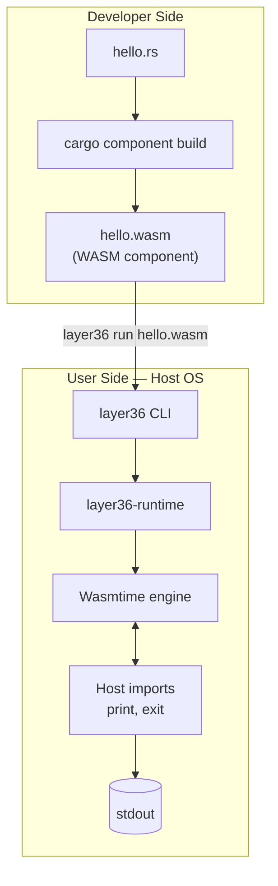
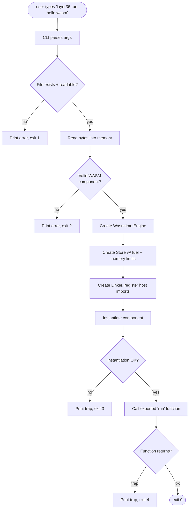
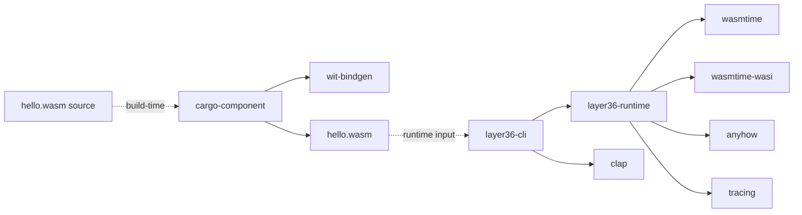
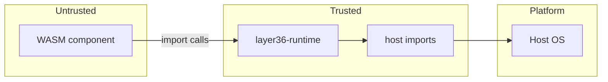

# Layer36 — Phase 1 Detailed Plan: POC Runtime

> **Phase:** 1 of 8
> **Duration:** Months 2–3 (60 calendar days, ~20 engineering days of work)
> **Phase sentence:** *Prove one `.wasm` binary runs identically on three desktop hosts.*
> **Prerequisite:** Phase 0 complete — repo, CI, docs scaffold, Discord, ADR-0001 merged.
> **Supersedes:** nothing. **Superseded by:** nothing.

---

## Table of Contents

0. [How to Use This Document](#0-how-to-use-this-document)
1. [Phase Objective](#1-phase-objective)
2. [Prerequisites from Phase 0](#2-prerequisites-from-phase-0)
3. [Success Criteria](#3-success-criteria)
4. [Architecture (Phase 1 subset)](#4-architecture-phase-1-subset)
5. [Technology Decisions](#5-technology-decisions)
6. [Week-by-Week Breakdown](#6-week-by-week-breakdown)
7. [Task Details](#7-task-details)
8. [Code Skeletons](#8-code-skeletons)
9. [CI & Build](#9-ci--build)
10. [Testing Strategy](#10-testing-strategy)
11. [Performance Baseline](#11-performance-baseline)
12. [Security & Threat Model v0.1](#12-security--threat-model-v01)
13. [Documentation Deliverables](#13-documentation-deliverables)
14. [Architecture Decision Records](#14-architecture-decision-records)
15. [Exit Criteria Checklist](#15-exit-criteria-checklist)
16. [Phase 1 Risks](#16-phase-1-risks)
17. [Handoff to Phase 2](#17-handoff-to-phase-2)
18. [Appendices](#18-appendices)

---

## 0. How to Use This Document

This document is the **single source of truth for Phase 1**. If you are working on Phase 1 and the answer to "what should I do next?" is not in here, the answer is to update this document, not to guess.

- Every task has an ID (`P1-RT-01`, etc.) that matches §7 of the main Build Plan.
- Put the task ID in your commit messages, branch names, PR titles, and issues.
- Code skeletons in §8 are starting points — copy, don't read-and-retype.
- Week labels in §6 are *calendar* weeks, sized for a founder working alongside other commitments. A full-time engineer finishes Phase 1 in ~4 weeks; a part-time founder in ~8.
- The exit criteria in §15 are non-negotiable. Do not declare Phase 1 complete until every box is ticked — the Phase 2 design assumes they hold.

---

## 1. Phase Objective

### 1.1 One-sentence objective

**Same `.wasm` binary, loaded by `layer36 run foo.wasm`, prints "Hello, Layer36!" on Linux, macOS, and Windows. Nothing else.**

### 1.2 What Phase 1 is

- The minimum viable execution vehicle.
- Wasmtime + a thin Rust wrapper + a CLI + three CI runners.
- The bones all future phases will attach to.

### 1.3 What Phase 1 is NOT

- Not a UAPI. We have exactly one host function: `print(bytes)`. That's it.
- Not a GUI. No window, no pixels, no input.
- Not installable for end users. Dev-only binary at the end of Phase 1.
- Not optimized. We measure, we don't tune.
- Not secure against adversaries. The threat model is v0.1 and explicitly assumes a benign WASM input. Phase 2 hardens.

### 1.4 Why this minimum

Because the *dispatcher* — the thing that takes a WASM file, finds the right host capabilities, and runs it — is the single foundation every future phase builds on. If it is wrong, everything above it is wrong. Phase 1 is six weeks of de-risking that one piece before we commit to a UAPI, a UI stack, or a bundle format.

---

## 2. Prerequisites from Phase 0

Before touching a single line of Phase 1 code, verify:

- [ ] `incyashraj/layer6x6` monorepo exists on GitHub, public, dual MIT/Apache-2.0.
- [x] `cargo build` succeeds on Linux, macOS, and Windows.
- [x] GitHub Actions runs `fmt`, `clippy`, and `test` on every PR.
- [ ] Branch protection on `main` requires green CI.
- [x] Issue + PR templates exist.
- [x] mdBook site lives at `docs/book/`, deployed to GitHub Pages.
- [x] ADR-0001 (Rust for the runtime) merged.
- [ ] Discord server created, `#dev` channel active.
- [x] `rust-toolchain.toml` pins stable Rust and includes `wasm32-wasip2` as a target.

If any box is unchecked, finish Phase 0 first. The cost of coming back later is higher than the cost of finishing it now.

---

## 3. Success Criteria

Phase 1 is **done** when, and only when, every row below is true.

| # | Criterion | Measured How |
|---|-----------|--------------|
| 1 | `cargo build --release` produces an `layer36` binary on all three hosts | CI green |
| 2 | `layer36 run hello.wasm` prints `Hello, Layer36!` on all three hosts | Integration test |
| 3 | The `hello.wasm` input is identical across hosts (byte-for-byte) | SHA-256 checked in test harness |
| 4 | Cold start < 200 ms on a 2020+ laptop | Benchmark suite |
| 5 | Release binary size < 30 MB (compressed) | CI artifact size check |
| 6 | Memory RSS < 40 MB after hello-world exits | Benchmark suite |
| 7 | Release artifacts build and upload on `v*` tag | Release CI job |
| 8 | ADR-0002 (Wasmtime) and ADR-0003 (Component Model) merged | Git log |
| 9 | Threat Model v0.1 published in `docs/book/` | Docs site |
| 10 | Quickstart tutorial exists and a new user can run hello-world in ≤ 10 min | Time a volunteer |

---

## 4. Architecture (Phase 1 subset)

### 4.1 System overview

At the end of Phase 1 the system looks like this — intentionally thin.



### 4.2 The `layer36 run` execution flow



### 4.3 Crate dependency graph (Phase 1)



### 4.4 Minimal host import surface

At Phase 1 the entire "UAPI" is two functions. They are temporary — Phase 2 replaces them with real UAPI modules.

```
layer36:phase1/host@0.0.1:
  print: func(msg: string)
  exit:  func(code: s32)
```

That's the whole surface. A hello-world calls `print("Hello, Layer36!")` and optionally `exit(0)`. Anything else and the WASM traps.

### 4.5 Process model

Phase 1 runs one WASM component per `layer36 run` invocation, in-process, single-threaded, no sandboxing beyond what Wasmtime gives us by default (no file access, no network, no env vars). When the component's `run` function returns or traps, the process exits.

This will evolve — Phase 4 needs multi-app lifecycle on mobile — but we do not design for that today.

---

## 5. Technology Decisions

Every item below is frozen for Phase 1. Changes require an ADR.

### 5.1 Runtime engine — **Wasmtime**

- **Crate:** `wasmtime = "27"` (latest LTS at time of writing; check crates.io before starting)
- **Features used:** `component-model`, `async` (off for Phase 1), `cranelift`
- **Documented in:** ADR-0002

Why Wasmtime and not Wasmer or WasmEdge: Component Model maturity, Bytecode Alliance stewardship, Rust embedding API quality, production adopters (Shopify, Fermyon, Microsoft). Full reasoning lives in ADR-0002.

### 5.2 Component Model — **yes, from day one**

- We do *not* build against the core WASM module format.
- All inputs are WASM components (produced by `cargo component build` or equivalent).
- Rationale: if we adopt components in Phase 2 instead of Phase 1, we rewrite the loader. Adopting now costs one afternoon of docs reading; adopting later costs two weeks of refactor.
- **Documented in:** ADR-0003

### 5.3 CLI framework — **`clap` v4 with derive**

- Fastest to get to "looks professional."
- Generates `--help`, shell completions, man pages out of the box.
- No alternative seriously considered.

### 5.4 Error handling — **`anyhow` at binary edges, `thiserror` inside libraries**

- `layer36-cli` uses `anyhow::Result<()>` for `main`.
- `layer36-runtime` uses typed errors via `thiserror`.
- Never return `anyhow::Error` from a library; downstream callers can't match on it.

### 5.5 Logging — **`tracing`**

- Structured spans, filterable by module, standard in the Rust ecosystem.
- `tracing-subscriber` with an env filter (`LAYER36_LOG=debug`).
- Apps log through host `print` in Phase 1; real logging UAPI arrives in Phase 2.

### 5.6 Sample app language — **Rust**

- First-class language per the main plan.
- `cargo component new hello` → one source file → `hello.wasm` in under a minute.
- We will add Go and TypeScript samples in Phase 2, not now.

### 5.7 MSRV (Minimum Supported Rust Version)

- Pin to latest stable minus 2. Revisit every 90 days.
- `rust-toolchain.toml` enforces it for local builds.
- CI tests on pinned stable and nightly (nightly allowed to fail; informational only).

### 5.8 Dependency policy

- New dependencies require justification in the PR description.
- `cargo-deny` runs in CI and fails on license or advisory violations.
- No deps > 1 MB of downloaded source unless unavoidable (looking at you, `syn`-derivative crates).

---

## 6. Week-by-Week Breakdown

Sized for a founder working ~15–25 h/week on this project alongside ParkSure and other commitments. A full-time engineer compresses this to 4 weeks; scale accordingly.

### Week 1 — Wasmtime spike

**Goal:** Convince yourself Wasmtime can do what we need, before committing to the architecture.

- Read the Wasmtime embedding docs end-to-end. Don't skim.
- Read the Component Model docs end-to-end. Don't skim.
- In a scratch folder (outside the repo) write 30 lines of Rust that instantiate a `hello.wasm` and call a function.
- Fight the version matrix: `wasmtime`, `cargo-component`, `wit-bindgen` must align. Write down what worked in a note.
- Success: scratch code runs hello-world on your primary dev machine. Throw the scratch away.

### Week 2 — `runtime` crate scaffold

**Tasks:** P1-RT-01, P1-RT-02

- Create `crates/runtime/` in the monorepo.
- Move your working spike into it, wrapped in a proper API (`Runtime`, `Config`, `RunOutcome`).
- Public API should be minimal — one struct, three methods: `new`, `load_component`, `run`.
- Write unit tests for the happy path and each error path.

### Week 3 — CLI

**Tasks:** P1-CLI-01, P1-CLI-02, P1-CLI-03, P1-RT-03

- Create `crates/cli/`.
- `layer36 run <file>` reads file, calls into runtime, propagates exit code.
- `layer36 version` prints runtime + Wasmtime + Rust version, commit hash.
- `layer36 doctor` checks for `cargo-component` on PATH and prints a short status table.
- Register the two host imports (`print`, `exit`) in the runtime.
- At end of this week: from a clean checkout, `cargo install --path crates/cli && layer36 run hello.wasm` works locally.

### Week 4 — Cross-platform CI

**Tasks:** P1-CI-01, P1-TEST-01

- Matrix across `ubuntu-latest`, `macos-latest`, `windows-latest`.
- Build + test job for each.
- Integration test job that, on all three, builds `hello.wasm` and runs it through `layer36`.
- Fix the platform-specific breakage that will definitely surface here. Budget for it.

### Week 5 — Release artifacts

**Tasks:** P1-CI-02, P1-RT-04

- Release workflow triggered by `v*.*.*` tags.
- Build release binaries, package as tar.gz (Linux, macOS) and zip (Windows).
- No code signing yet — Apple notarization and Windows Authenticode are Phase 6.
- Fuel and memory limits exposed via runtime config and `--fuel`, `--mem-limit` flags.

### Week 6 — Benchmarks + threat model

**Tasks:** P1-PERF-01, P1-SEC-01

- `cargo bench` with `criterion` for startup and dispatch.
- Publish results to a Markdown file under `docs/book/src/phase1/benchmarks.md`.
- Write Threat Model v0.1 — see §12 for the template.

### Week 7 — Documentation + polish

**Tasks:** P1-DOC-01, P1-DOC-02

- Quickstart tutorial in `docs/book/src/quickstart.md`.
- ADR-0002 and ADR-0003 written and merged.
- README updated to reflect what `layer36` actually does now.
- First blog post: "Phase 1 complete — one binary on three OSes."

### Week 8 — Buffer / exit criteria / retro

- Catch-all for slippage.
- Walk through §15 checklist item by item. Fix anything red.
- Have one volunteer (from Discord) do the quickstart, time them, watch where they stumble.
- Retrospective: what took longer than expected, what was easier, what changes for Phase 2.

---

## 7. Task Details

### P1-RT-01 — Create `runtime` crate; integrate Wasmtime

**Estimate:** 2 days.
**Branch:** `p1-rt-01-runtime-crate`.

**Acceptance:**
- `crates/runtime/` exists with `Cargo.toml` and `src/lib.rs`.
- Public struct `Runtime` with `new(config: Config) -> Result<Self>`.
- `Runtime` owns a `wasmtime::Engine`.
- Unit test: `Runtime::new(Config::default())` succeeds.

**Gotchas:**
- Enable the `component-model` feature on `wasmtime` in `Cargo.toml`.
- Do not enable `async` yet — it doubles the API surface and we don't need it.
- Pin Wasmtime to a specific minor version; floating versions will bite in month 4.

### P1-RT-02 — Load + instantiate a WASM component

**Estimate:** 1 day.
**Branch:** `p1-rt-02-component-loader`.

**Acceptance:**
- `Runtime::load_component(&self, bytes: &[u8]) -> Result<LoadedComponent>`.
- `LoadedComponent::run(self, linker: &Linker, store: &mut Store) -> Result<RunOutcome>`.
- Errors distinguish malformed bytecode from instantiation failure.

**Gotchas:**
- Use `wasmtime::component::Component::from_binary`, not `Module::from_binary`. These are different types.
- The `Store` holds host state; keep it simple for Phase 1 (a `()` is fine).

### P1-RT-03 — Define minimal host import table

**Estimate:** 1 day.
**Branch:** `p1-rt-03-host-imports`.

**Acceptance:**
- Two host functions wired through the Linker: `print(&str)` and `exit(i32)`.
- `print` writes to `stdout` with a trailing newline and flushes.
- `exit(n)` propagates `n` as the process exit code (via `RunOutcome::ExitCode(n)`).

**Gotchas:**
- Do NOT use the full `wasmtime-wasi` until Phase 2; it brings in a lot of surface we don't want to lock in.
- Define your own tiny WIT interface (`wit/layer36/phase1.wit`) and bind it.

### P1-RT-04 — Configurable fuel / memory limits

**Estimate:** 1 day.
**Branch:** `p1-rt-04-limits`.

**Acceptance:**
- `Config { fuel: Option<u64>, memory_bytes: u64 }` with sensible defaults (no fuel limit; 256 MB memory cap).
- Exceeding either causes a graceful trap returned as `RunOutcome::LimitExceeded(_)`.
- CLI exposes `--fuel N` and `--mem-limit MB`.

**Gotchas:**
- Fuel metering is opt-in — must call `Config::consume_fuel(true)` on the Wasmtime config *and* set initial fuel on the store.
- Memory limits work via the `StoreLimits` / `StoreLimitsBuilder` API.

### P1-CLI-01 — `layer36` binary using `clap`

**Estimate:** 1 day.
**Branch:** `p1-cli-01-skeleton`.

**Acceptance:**
- `crates/cli/` builds as `layer36` binary (via `[[bin]]` in Cargo.toml or path/name conventions).
- `layer36 --help` works and looks clean.
- `layer36 --version` prints version + commit hash (compile-time via `env!("VERGEN_GIT_SHA")` or similar).

### P1-CLI-02 — `layer36 run <file>` subcommand

**Estimate:** 1 day.
**Branch:** `p1-cli-02-run`.

**Acceptance:**
- `layer36 run hello.wasm` executes the file and propagates its exit code.
- `layer36 run --fuel 1000000 foo.wasm` enforces the fuel limit.
- Invalid path → clear error, exit 1.
- Invalid WASM → clear error with file offset, exit 2.
- Trap during run → formatted trap output, exit 3+.

### P1-CLI-03 — `layer36 version`, `layer36 doctor`

**Estimate:** 0.5 day.
**Branch:** `p1-cli-03-meta-cmds`.

**Acceptance:**
- `layer36 version` prints, with labels: `layer36`, `wasmtime`, `rustc` used for build, build commit, build date.
- `layer36 doctor` prints a table: `cargo-component` on PATH (yes/no, version), `rustup target list` contains wasm32-wasip2, disk free in `~/.layer36` (will be empty in Phase 1 — still check).

### P1-CI-01 — Cross-platform CI matrix

**Estimate:** 2 days.
**Branch:** `p1-ci-01-matrix`.

**Acceptance:**
- `.github/workflows/ci.yml` runs on Linux, macOS, Windows for every PR.
- Jobs: `fmt`, `clippy -- -D warnings`, `test`, `build --release`.
- macOS builds both x86_64 and aarch64 (universal binary or two artifacts).
- Windows build produces a `.exe`.

**Gotchas:**
- Line endings: configure `core.autocrlf=false` and `.gitattributes * text eol=lf` to prevent CI-only breakage.
- Path separators in tests: never hard-code `/`; use `Path::join`.
- Windows tests fail silently if `println!` output doesn't flush — integration tests should explicitly flush or capture child stdout.

### P1-CI-02 — Release artifacts

**Estimate:** 2 days.
**Branch:** `p1-ci-02-release`.

**Acceptance:**
- `.github/workflows/release.yml` triggered on version tags such as `v0.1.0` and
  `v0.1.0-rc1`.
- Produces:
  - `layer36-<version>-x86_64-unknown-linux-gnu.tar.gz`
  - `layer36-<version>-aarch64-unknown-linux-gnu.tar.gz`
  - `layer36-<version>-x86_64-apple-darwin.tar.gz`
  - `layer36-<version>-aarch64-apple-darwin.tar.gz`
  - `layer36-<version>-x86_64-pc-windows-msvc.zip`
- Uploads to GitHub Releases with auto-generated release notes.
- A `SHA256SUMS` file alongside.

**Deferred to later phases:** code signing, notarization, `.msi` installer, `.pkg` installer, Homebrew tap, Chocolatey package.

### P1-TEST-01 — Integration test harness

**Estimate:** 1 day.
**Branch:** `p1-test-01-integration`.

**Acceptance:**
- `test/integration/hello-world/` contains a Rust source that prints `Hello, Layer36!`.
- Test harness (`test/integration/runner.rs`) builds the WASM once, runs `layer36 run` on it across each host, asserts exit 0 and stdout.
- Runs as part of CI on all three OSes.
- SHA-256 of `hello.wasm` is the same on all three hosts and asserted in the harness.

### P1-DOC-01 — Quickstart

**Estimate:** 1 day.
**Branch:** `p1-doc-01-quickstart`.

**Acceptance:**
- `docs/book/src/quickstart.md` exists.
- Walks a reader from zero (no Rust installed) to running hello-world under `layer36`.
- Includes a copy-pasteable code block for `hello.rs` and `Cargo.toml`.
- Tested end-to-end by someone who is not the author, in under 10 minutes.

### P1-DOC-02 — ADRs

**Estimate:** 1 day.
**Branch:** `p1-doc-02-adrs`.

**Acceptance:**
- `docs/adr/0002-runtime-engine-wasmtime.md` merged.
- `docs/adr/0003-adopt-component-model.md` merged.
- Each follows the template in Appendix D of the main Build Plan.

### P1-PERF-01 — Baseline benchmarks

**Estimate:** 2 days.
**Branch:** `p1-perf-01-bench`.

**Acceptance:**
- `crates/runtime/benches/startup.rs` using `criterion`.
- Measures: cold-start to main, first `print` latency, per-call `print` dispatch.
- Results published to `docs/book/src/phase1/benchmarks.md` with machine specs.
- CI job that warns (does not fail) on >10% regression versus recorded baseline.

### P1-SEC-01 — Threat Model v0.1

**Estimate:** 2 days.
**Branch:** `p1-sec-01-threat-model`.

**Acceptance:**
- `docs/book/src/phase1/threat-model.md` exists.
- Uses STRIDE per trust boundary from §4 of the main plan.
- Explicitly lists out-of-scope items (marked "deferred to Phase N").
- Minimum one identified threat per STRIDE category.

---

## 8. Code Skeletons

Copy these, don't retype. Adjust versions against crates.io before using.

### 8.1 Workspace `Cargo.toml`

```toml
[workspace]
resolver = "2"
members = [
    "crates/runtime",
    "crates/cli",
]

[workspace.package]
edition    = "2021"
version    = "0.1.0-dev"
license    = "MIT OR Apache-2.0"
repository = "https://github.com/layer36/layer36"
rust-version = "1.78"

[workspace.dependencies]
wasmtime      = { version = "27", features = ["component-model"] }
anyhow        = "1"
thiserror     = "1"
clap          = { version = "4", features = ["derive"] }
tracing       = "0.1"
tracing-subscriber = { version = "0.3", features = ["env-filter"] }

[profile.release]
lto          = "thin"
codegen-units = 1
strip        = true
panic        = "abort"
```

### 8.2 `crates/runtime/Cargo.toml`

```toml
[package]
name         = "layer36-runtime"
version.workspace = true
edition.workspace = true
license.workspace = true
repository.workspace = true
rust-version.workspace = true

[dependencies]
wasmtime   = { workspace = true }
anyhow     = { workspace = true }
thiserror  = { workspace = true }
tracing    = { workspace = true }

[dev-dependencies]
criterion = { version = "0.5", features = ["html_reports"] }

[[bench]]
name    = "startup"
harness = false
```

### 8.3 `crates/runtime/src/lib.rs` (skeleton)

```rust
//! Layer36 runtime: Phase 1 POC.
//!
//! Loads and executes a WASM component with a minimal host import surface:
//! `print(string)` and `exit(s32)`. Anything else is a trap.

use std::path::Path;

use thiserror::Error;
use wasmtime::{
    Engine, Store,
    component::{Component, Linker},
};

pub struct Runtime {
    engine: Engine,
}

#[derive(Debug, Clone)]
pub struct Config {
    pub fuel: Option<u64>,
    pub memory_bytes: u64,
}

impl Default for Config {
    fn default() -> Self {
        Self {
            fuel: None,
            memory_bytes: 256 * 1024 * 1024, // 256 MB
        }
    }
}

#[derive(Debug)]
pub enum RunOutcome {
    Exited(i32),
    LimitExceeded(String),
}

#[derive(Debug, Error)]
pub enum RuntimeError {
    #[error("failed to create engine: {0}")]
    EngineInit(String),
    #[error("invalid wasm component: {0}")]
    InvalidComponent(String),
    #[error("instantiation failed: {0}")]
    Instantiate(String),
    #[error("trap: {0}")]
    Trap(String),
    #[error("io: {0}")]
    Io(#[from] std::io::Error),
}

pub type Result<T> = std::result::Result<T, RuntimeError>;

impl Runtime {
    pub fn new(config: Config) -> Result<Self> {
        let mut wt_config = wasmtime::Config::new();
        wt_config.wasm_component_model(true);
        if config.fuel.is_some() {
            wt_config.consume_fuel(true);
        }
        let engine = Engine::new(&wt_config)
            .map_err(|e| RuntimeError::EngineInit(e.to_string()))?;
        Ok(Self { engine })
    }

    pub fn run_file(&self, path: &Path, config: &Config) -> Result<RunOutcome> {
        let bytes = std::fs::read(path)?;
        self.run_bytes(&bytes, config)
    }

    pub fn run_bytes(&self, bytes: &[u8], config: &Config) -> Result<RunOutcome> {
        let component = Component::from_binary(&self.engine, bytes)
            .map_err(|e| RuntimeError::InvalidComponent(e.to_string()))?;

        let mut store = Store::new(&self.engine, HostState::default());
        if let Some(fuel) = config.fuel {
            store.set_fuel(fuel).ok();
        }

        let mut linker = Linker::new(&self.engine);
        register_host_imports(&mut linker)?;

        // Instantiate and call the component's default export.
        // TODO(P1-RT-02): wire this up once wit-bindgen is in place.
        let _ = (component, linker, store);

        Ok(RunOutcome::Exited(0))
    }
}

#[derive(Default)]
struct HostState {
    exit_code: Option<i32>,
}

fn register_host_imports<T>(_linker: &mut Linker<T>) -> Result<()> {
    // TODO(P1-RT-03): add layer36:phase1/host interface with print + exit.
    Ok(())
}
```

This compiles as-is and gives you something to grow into.

### 8.4 `crates/cli/src/main.rs` (skeleton)

```rust
use std::path::PathBuf;
use std::process::ExitCode;

use anyhow::Result;
use clap::{Parser, Subcommand};
use layer36_runtime::{Config, Runtime, RunOutcome};

#[derive(Parser)]
#[command(name = "layer36", version, about = "Layer36 — write once, run on everything.")]
struct Cli {
    #[command(subcommand)]
    command: Command,
}

#[derive(Subcommand)]
enum Command {
    /// Run a WASM component through the Layer36 runtime.
    Run {
        /// Path to the .wasm component.
        file: PathBuf,

        /// Max units of fuel to allow (omit for unlimited).
        #[arg(long)]
        fuel: Option<u64>,

        /// Max memory (MiB).
        #[arg(long, default_value_t = 256)]
        mem_limit: u64,
    },
    /// Print version info.
    Version,
    /// Environment check.
    Doctor,
}

fn main() -> ExitCode {
    tracing_subscriber::fmt()
        .with_env_filter(
            tracing_subscriber::EnvFilter::try_from_env("LAYER36_LOG")
                .unwrap_or_else(|_| tracing_subscriber::EnvFilter::new("info")),
        )
        .init();

    match run() {
        Ok(code) => ExitCode::from(code),
        Err(e) => {
            eprintln!("error: {e:#}");
            ExitCode::from(1)
        }
    }
}

fn run() -> Result<u8> {
    let cli = Cli::parse();
    match cli.command {
        Command::Run { file, fuel, mem_limit } => {
            let config = Config { fuel, memory_bytes: mem_limit * 1024 * 1024 };
            let rt = Runtime::new(config.clone())?;
            match rt.run_file(&file, &config)? {
                RunOutcome::Exited(code) => Ok(code.clamp(0, 255) as u8),
                RunOutcome::LimitExceeded(msg) => {
                    eprintln!("limit exceeded: {msg}");
                    Ok(4)
                }
            }
        }
        Command::Version => {
            println!("layer36     {}", env!("CARGO_PKG_VERSION"));
            println!("wasmtime  {}", wasmtime_version());
            println!("rustc     {}", env!("RUSTC_VERSION"));
            println!("commit    {}", env!("GIT_SHA"));
            Ok(0)
        }
        Command::Doctor => doctor(),
    }
}

fn wasmtime_version() -> &'static str {
    // Populate at build time via build.rs or hardcode to workspace dep version.
    "27.x"
}

fn doctor() -> Result<u8> {
    // TODO(P1-CLI-03): check cargo-component, rustup target, disk free.
    println!("cargo-component: ?");
    println!("wasm32-wasip2 target: ?");
    Ok(0)
}
```

### 8.5 Example hello-world component (Rust)

```rust
// test/integration/hello-world/src/lib.rs
//
// This file is compiled to hello.wasm via `cargo component build --release`.
// It imports the layer36:phase1/host interface and calls `print`.

wit_bindgen::generate!({
    path: "../../../wit/layer36/phase1.wit",
    world: "app",
});

struct HelloWorld;

impl Guest for HelloWorld {
    fn run() -> i32 {
        layer36::phase1::host::print("Hello, Layer36!");
        0
    }
}

export!(HelloWorld);
```

### 8.6 The Phase 1 WIT interface

```wit
// wit/layer36/phase1.wit
package layer36:phase1@0.0.1;

interface host {
    /// Write a line to stdout.
    print: func(msg: string);

    /// Terminate the component with a process exit code.
    exit: func(code: s32);
}

world app {
    import host;
    export run: func() -> s32;
}
```

Note the package version `0.0.1`: this interface is explicitly pre-stable and will be deleted in Phase 2 when UAPI v0.1 arrives. Do not depend on it from outside `test/integration/`.

### 8.7 Integration test runner skeleton

```rust
// test/integration/runner.rs
use std::process::Command;

#[test]
fn hello_world_runs() {
    // Assumes `layer36` built via `cargo build --release -p layer36-cli`
    // and hello.wasm built in the test setup phase.
    let layer36 = env!("CARGO_BIN_EXE_layer36");
    let wasm = concat!(env!("CARGO_MANIFEST_DIR"), "/hello.wasm");

    let output = Command::new(layer36)
        .args(["run", wasm])
        .output()
        .expect("failed to run layer36");

    assert!(output.status.success(), "exit: {:?}", output.status);
    let stdout = String::from_utf8_lossy(&output.stdout);
    assert!(stdout.contains("Hello, Layer36!"), "stdout was: {stdout}");
}
```

---

## 9. CI & Build

### 9.1 `.github/workflows/ci.yml`

```yaml
name: CI

on:
  pull_request:
  push:
    branches: [main]

env:
  CARGO_TERM_COLOR: always
  RUSTFLAGS: -D warnings

jobs:
  fmt:
    runs-on: ubuntu-latest
    steps:
      - uses: actions/checkout@v4
      - uses: dtolnay/rust-toolchain@stable
        with:
          components: rustfmt
      - run: cargo fmt --all -- --check

  clippy:
    runs-on: ubuntu-latest
    steps:
      - uses: actions/checkout@v4
      - uses: dtolnay/rust-toolchain@stable
        with:
          components: clippy
      - uses: Swatinem/rust-cache@v2
      - run: cargo clippy --workspace --all-targets -- -D warnings

  test:
    strategy:
      fail-fast: false
      matrix:
        os: [ubuntu-latest, macos-latest, windows-latest]
    runs-on: ${{ matrix.os }}
    steps:
      - uses: actions/checkout@v4
      - uses: dtolnay/rust-toolchain@stable
      - uses: Swatinem/rust-cache@v2
      - name: Install cargo-component
        run: cargo install cargo-component --locked --version 0.15.0
      - name: Add wasm target
        run: rustup target add wasm32-wasip2
      - name: Build workspace
        run: cargo build --workspace --release
      - name: Run unit tests
        run: cargo test --workspace --release
      - name: Build hello-world
        working-directory: test/integration/hello-world
        run: cargo component build --release
      - name: Copy hello.wasm
        shell: bash
        run: cp test/integration/hello-world/target/wasm32-wasip2/release/hello.wasm test/integration/hello.wasm
      - name: Integration test
        run: cargo test -p integration-runner --release

  audit:
    runs-on: ubuntu-latest
    steps:
      - uses: actions/checkout@v4
      - uses: EmbarkStudios/cargo-deny-action@v1
```

### 9.2 `.github/workflows/release.yml`

```yaml
name: Release

on:
  push:
    tags: ['v[0-9]+.[0-9]+.[0-9]+']

permissions:
  contents: write

jobs:
  build:
    strategy:
      fail-fast: false
      matrix:
        include:
          - { os: ubuntu-latest,  target: x86_64-unknown-linux-gnu,  ext: tar.gz }
          - { os: ubuntu-latest,  target: aarch64-unknown-linux-gnu, ext: tar.gz, cross: true }
          - { os: macos-latest,   target: x86_64-apple-darwin,        ext: tar.gz }
          - { os: macos-latest,   target: aarch64-apple-darwin,       ext: tar.gz }
          - { os: windows-latest, target: x86_64-pc-windows-msvc,     ext: zip }
    runs-on: ${{ matrix.os }}
    steps:
      - uses: actions/checkout@v4
      - uses: dtolnay/rust-toolchain@stable
        with:
          targets: ${{ matrix.target }}
      - uses: Swatinem/rust-cache@v2
      - if: matrix.cross
        run: cargo install cross --locked
      - name: Build
        shell: bash
        run: |
          if [ "${{ matrix.cross }}" = "true" ]; then
            cross build --release --target ${{ matrix.target }} -p layer36-cli
          else
            cargo build --release --target ${{ matrix.target }} -p layer36-cli
          fi
      - name: Package
        shell: bash
        run: scripts/package.sh "${{ matrix.target }}" "${{ matrix.ext }}"
      - uses: actions/upload-artifact@v4
        with:
          name: layer36-${{ matrix.target }}
          path: dist/*

  release:
    needs: build
    runs-on: ubuntu-latest
    steps:
      - uses: actions/checkout@v4
      - uses: actions/download-artifact@v4
        with: { path: dist }
      - name: Checksum
        run: cd dist && sha256sum */* > SHA256SUMS
      - uses: softprops/action-gh-release@v2
        with:
          files: |
            dist/**/*
            dist/SHA256SUMS
          generate_release_notes: true
```

### 9.3 `scripts/package.sh`

```bash
#!/usr/bin/env bash
set -euo pipefail
target="$1"
ext="$2"
version=$(grep -m1 '^version' Cargo.toml | awk -F'"' '{print $2}')
name="layer36-${version}-${target}"
dist="dist/${name}"
mkdir -p "$dist"

# binary name differs by OS
if [[ "$target" == *windows* ]]; then
    cp "target/${target}/release/layer36.exe" "$dist/"
else
    cp "target/${target}/release/layer36" "$dist/"
fi

cp README.md LICENSE-MIT LICENSE-APACHE "$dist/"

cd dist
case "$ext" in
    tar.gz) tar czf "${name}.tar.gz" "${name}" ;;
    zip)    zip -r "${name}.zip" "${name}" ;;
esac
```

### 9.4 `deny.toml` (starter)

```toml
[advisories]
vulnerability = "deny"
unmaintained  = "warn"
yanked        = "warn"

[licenses]
allow = ["MIT", "Apache-2.0", "Apache-2.0 WITH LLVM-exception", "BSD-2-Clause", "BSD-3-Clause", "ISC", "Unicode-DFS-2016"]
copyleft = "deny"

[bans]
multiple-versions = "warn"
```

---

## 10. Testing Strategy

### 10.1 Test types in Phase 1

| Type | Where | What |
|---|---|---|
| Unit | inside each crate | Functions, error paths, config defaults |
| Component | `crates/runtime/tests/` | Runtime loading real `.wasm` fixtures |
| Integration | `test/integration/` | Full `layer36 run` invocation |
| Snapshot | `crates/cli/tests/` | `layer36 --help`, `layer36 doctor` output using `insta` |
| Benchmark | `crates/runtime/benches/` | Startup, dispatch; `criterion` |

### 10.2 Coverage expectations

- Not measured quantitatively in Phase 1 (optimizing for coverage % this early produces junk tests).
- Every public function in `layer36-runtime` has at least one happy-path test.
- Every error variant has at least one test that produces it.

### 10.3 Snapshot tests for CLI

Use `insta` so CI detects unintended changes to `--help` output, which is user-facing surface we don't want to wobble.

```rust
#[test]
fn help_snapshot() {
    let output = std::process::Command::new(env!("CARGO_BIN_EXE_layer36"))
        .arg("--help")
        .output()
        .unwrap();
    insta::assert_snapshot!(String::from_utf8_lossy(&output.stdout));
}
```

---

## 11. Performance Baseline

### 11.1 Reference hardware

Pick one machine to be the "canonical" benchmark machine. Options in rough order of preference:

1. A dedicated mini-PC (Intel N100 class) running Ubuntu 22.04.
2. Your primary dev laptop, idle, plugged in, low-power profile disabled.
3. A GitHub Actions runner's reported specs (noisy — last resort).

Document the exact CPU, RAM, SSD, OS version in `docs/book/src/phase1/benchmarks.md`.

### 11.2 Metrics we record

| Metric | Target | Notes |
|---|---|---|
| Cold start to process exit (hello-world) | < 200 ms | `hyperfine` works fine |
| Wasmtime Engine construction | < 100 ms | Microbench (criterion) |
| Component::from_binary (1 KB hello) | < 20 ms | Microbench |
| Per-call `print` dispatch | < 1 µs | Microbench at steady state |
| Binary size (release, stripped) | < 30 MB | `ls -l` on release artifact |
| RSS after hello-world exits | < 40 MB | `/usr/bin/time -v` or equivalent |

### 11.3 How to run

```bash
# microbenches
cargo bench -p layer36-runtime

# end-to-end wall clock
hyperfine --warmup 3 "./target/release/layer36 run hello.wasm"

# memory
/usr/bin/time -v ./target/release/layer36 run hello.wasm 2>&1 | grep 'Maximum resident'
```

### 11.4 What we don't optimize yet

- No AOT caching. Recompile every run. Phase 2+ adds a `~/.layer36/cache/`.
- No shared process. Each `layer36 run` is a fresh process. Good enough for Phase 1.
- No JIT warmup tricks. Single-shot invocation.

---

## 12. Security & Threat Model v0.1

### 12.1 Scope

Phase 1 trust model is intentionally narrow. We enumerate what we defend against *now* and what we defer, so that future phases know what they inherit versus what they add.

### 12.2 Trust boundaries (Phase 1)



Only one boundary: **WASM component ↔ runtime**. The runtime is trusted; the WASM is not.

### 12.3 STRIDE table (Phase 1)

| Category | Threat | Mitigation |
|---|---|---|
| **S**poofing | WASM pretends to be something it isn't | N/A — no identity in Phase 1 |
| **T**ampering | WASM tries to corrupt runtime memory | WASM sandbox isolates linear memory |
| **R**epudiation | Deny having called something | N/A — no audit log in Phase 1 |
| **I**nformation Disclosure | WASM reads host memory or files | No fs/net host imports; only `print`, `exit` |
| **D**enial of Service | Infinite loop, memory exhaustion | Optional fuel limit; mandatory memory limit |
| **E**levation | WASM escapes sandbox | Rely on Wasmtime's soundness; track advisories |

### 12.4 Known out-of-scope (deferred)

- Malicious WASM that tries to call capabilities it doesn't have (Phase 2 — we don't have capabilities yet).
- Tampering with `layer36` binary itself (Phase 6 — code signing).
- Supply chain attacks on dependencies (partial: `cargo-deny`; full review in Phase 7).
- Side-channel attacks (Spectre, rowhammer) — deferred indefinitely; rely on OS mitigations.
- Physical attack on user machine — out of scope forever.

### 12.5 What a Phase 1 user must know

The README's Security section must say, in plain language:

> Layer36 is pre-alpha. Do not run untrusted WASM through `layer36` in Phase 1. Treat `layer36 run foo.wasm` exactly as you would treat `./foo` — the sandbox is real but not adversarially hardened. Real security boundaries arrive in Phase 2 with the capability system.

---

## 13. Documentation Deliverables

Phase 1 ships four user-facing docs. If you run out of time, do them in this order.

### 13.1 Quickstart (`docs/book/src/quickstart.md`)

Target reader: Rust-curious, has `rustup` installed, nothing else.
Target time to first `Hello, Layer36!`: ≤ 10 minutes.

Structure:
1. "What you'll build" (2 sentences + screenshot of final output)
2. Install `layer36` (platform tabs)
3. Install `cargo-component`
4. Create `hello/` with `cargo component new --lib hello`
5. Paste the source from §8.5
6. `cargo component build --release`
7. `layer36 run target/wasm32-wasip2/release/hello.wasm`
8. "You saw Hello, Layer36!. What happened?" (2 paragraphs — not a lecture)

### 13.2 Architecture overview (`docs/book/src/architecture.md`)

Copy §4 of this document with light rewrite for a reader who hasn't seen the plan.

### 13.3 ADR-0002 — Wasmtime

Key points to cover:
- Decision: adopt Wasmtime as the Phase 1 and default runtime engine.
- Alternatives considered: Wasmer, WasmEdge.
- Consequences: we align with Bytecode Alliance release cadence; we get Component Model early; we take a dependency on Cranelift's ISA support which limits some embedded targets. Revisitable at Phase 4 if mobile perf requires.

### 13.4 ADR-0003 — Component Model

Key points to cover:
- Decision: adopt WASM Component Model as the *only* supported input format from Phase 1.
- Alternatives considered: core WASM modules + custom ABI; core WASM + wasi-preview1 and wait.
- Consequences: tighter coupling to Bytecode Alliance tooling (`cargo-component`, `wit-bindgen`); cleaner cross-language story; simpler UAPI definition in Phase 2.

---

## 14. Architecture Decision Records

Expected ADRs in Phase 1:

| ID | Title | Owner | Target week |
|---|---|---|---|
| 0002 | Runtime engine: Wasmtime | Y | W7 |
| 0003 | Adopt Component Model | Y | W7 |
| 0004 | CLI framework: clap | Y | W3 (lightweight) |
| 0005 | Error handling: anyhow at edges, thiserror in libs | Y | W2 (lightweight) |

ADRs 0004 and 0005 can be ≤ 1 page each; 0002 and 0003 are the substantive ones.

If during Phase 1 you find yourself making a choice that affects Phase 2+ architecture, write it down as an ADR *even if it feels obvious right now*. You will forget why you chose what you chose. Your future self will thank you.

---

## 15. Exit Criteria Checklist

Tick every box. No exceptions.

### Code
- [x] `crates/runtime/` compiles on all three hosts.
- [x] `crates/cli/` compiles on all three hosts.
- [x] `layer36 run hello.wasm` prints `Hello, Layer36!` and exits 0 on all three hosts.
- [x] `layer36 version` prints correct info.
- [x] `layer36 doctor` runs without panic.
- [x] `layer36 run --fuel 1 hello.wasm` fails with a clear "limit exceeded" error.
- [x] Invalid `.wasm` file → clear error message, exit code ≠ 0.

### CI
- [ ] `ci.yml` green on `main` for at least 5 consecutive days.
- [ ] `release.yml` has been triggered at least once (can be an RC tag like `v0.1.0-rc1`).
- [ ] All five release artifacts exist on GitHub Releases with SHA256SUMS.
- [x] `cargo-deny` check green.

### Docs
- [x] Quickstart merged and published to docs site.
- [x] Architecture overview merged.
- [ ] ADR-0002 merged.
- [ ] ADR-0003 merged.
- [x] README updated to reflect Phase 1 reality.
- [x] Changelog started (`CHANGELOG.md` following Keep a Changelog format).

### Quality
- [x] All Phase 1 benchmarks recorded, published.
- [x] Threat Model v0.1 published.
- [ ] One external user has completed the quickstart in ≤ 10 minutes.
- [ ] Retrospective written (`docs/book/src/phase1/retro.md`).

### Governance
- [ ] No P0 issues open.
- [ ] Phase 2 kickoff issue created with link to its own detailed plan document.

---

## 16. Phase 1 Risks

### 16.1 Top risks

| Risk | Likelihood | Impact | Mitigation |
|---|---|---|---|
| Wasmtime + cargo-component + wit-bindgen version matrix breaks weekly | High | Medium | Pin every version. Update deliberately. Keep a `versions.md` note. |
| Windows CI is flaky on path/line-ending issues | High | Low | Set `.gitattributes` on day one. Never hardcode `\` or `/`. |
| macOS CI cost or slot exhaustion | Medium | Low | Batch macOS jobs; use a matrix filter to limit macOS runs on non-core branches. |
| Component Model breaking changes mid-phase | Medium | High | Pin. If upstream breaks, stay pinned; open an issue upstream; revisit at phase boundary. |
| Founder time eaten by ParkSure crunch | High | High | Phase 1 is pre-funded. Protect 2 half-days/week minimum. If impossible, extend Phase 1 — don't skip tasks. |
| "Just one more tweak" scope creep | High | Medium | Every PR must reference a Phase 1 task ID. No task ID → not this phase. |
| Benchmarks vary wildly across machines | Medium | Low | One canonical machine. Note others as informational. |

### 16.2 Tripwires

If any of the following happen, stop and reassess:

- Week 4 and hello-world still doesn't run on one of the three OSes.
- Binary size exceeds 50 MB after stripping.
- Cold start exceeds 500 ms on canonical machine.
- You've spent more than 2 days fighting toolchain instead of writing code.

For the last one, the answer is almost always "downgrade to an earlier stable version of Wasmtime and/or cargo-component and open an issue with a repro." Do not become the person who debugs Bytecode Alliance tooling full-time during Phase 1.

---

## 17. Handoff to Phase 2

### 17.1 What Phase 2 inherits

- A working runtime struct + CLI.
- Component loading path.
- Cross-platform CI.
- Release artifact pipeline.
- Benchmark harness.
- Threat model v0.1 to extend.

### 17.2 What Phase 2 must replace

| Thing | Why replaced |
|---|---|
| `layer36:phase1/host` interface | Replaced by real UAPI modules (`io`, `fs`, `net`, `time`, `locale`) |
| `hello-world` sample | Superseded by `layer36-curl`, `layer36-cat`, `layer36-clock` |
| Trust model v0.1 | Extended with UCap enforcement |

### 17.3 What Phase 2 must *not* touch

- `Runtime::new`, `Runtime::run_file` signatures — any change ripples to every language binding.
- Release pipeline — stabilize for at least two releases before modifying.
- CI matrix shape — adding hosts is fine; reshuffling the existing ones just wastes a week.

### 17.4 Kickoff checklist for Phase 2

Before starting Phase 2, produce a `docs/phase2-plan.md` in the same style as this document, covering:

- Phase 2 objective sentence.
- WIT file drafts for each v0.1 UAPI module.
- Capability surface for each module (even if enforcement is soft).
- Sample app specs (`layer36-curl`, `layer36-cat`, `layer36-clock`).
- Language binding strategy per language.
- Per-host adapter scaffolding plan.

Phase 2 is 90 days and 4–5× the scope of Phase 1. Plan accordingly; don't start until the plan exists.

---

## 18. Appendices

### Appendix A — Useful commands cheat sheet

```bash
# Build the runtime + cli
cargo build --release --workspace

# Run unit tests
cargo test --workspace

# Build the hello-world sample
cd test/integration/hello-world && cargo component build --release

# Run it
./target/release/layer36 run test/integration/hello-world/target/wasm32-wasip2/release/hello.wasm

# Benchmarks
cargo bench -p layer36-runtime

# Fresh clippy
cargo clippy --workspace --all-targets -- -D warnings

# Format
cargo fmt --all

# What version are we on
git describe --tags --always --dirty

# Quickly cut a dev release
git tag v0.1.0-rc1 && git push --tags
```

### Appendix B — Debugging a WASM trap

When `layer36 run` prints a trap:

1. Rebuild the component in debug mode (`cargo component build` without `--release`) so DWARF is present.
2. Re-run with `LAYER36_LOG=debug layer36 run ...` for verbose runtime logs.
3. Use `wasm-tools` to inspect the component:
   ```bash
   wasm-tools print hello.wasm | less
   wasm-tools validate hello.wasm
   ```
4. If the trap is "unreachable" with no location, try `wasmtime --wasm-features=all explore hello.wasm`.

### Appendix C — Folder layout at Phase 1 end

```
layer36/
├── Cargo.toml
├── Cargo.lock
├── rust-toolchain.toml
├── deny.toml
├── .gitattributes
├── .github/
│   └── workflows/
│       ├── ci.yml
│       └── release.yml
├── crates/
│   ├── runtime/
│   │   ├── Cargo.toml
│   │   ├── src/
│   │   │   └── lib.rs
│   │   ├── tests/
│   │   └── benches/
│   │       └── startup.rs
│   └── cli/
│       ├── Cargo.toml
│       ├── build.rs
│       └── src/
│           └── main.rs
├── wit/
│   └── layer36/
│       └── phase1.wit
├── test/
│   └── integration/
│       ├── hello-world/          # sample component source
│       └── runner.rs
├── scripts/
│   └── package.sh
├── docs/
│   ├── adr/
│   │   ├── 0001-rust-for-runtime.md
│   │   ├── 0002-runtime-engine-wasmtime.md
│   │   ├── 0003-adopt-component-model.md
│   │   ├── 0004-cli-framework-clap.md
│   │   └── 0005-error-handling.md
│   └── book/
│       └── src/
│           ├── SUMMARY.md
│           ├── quickstart.md
│           ├── architecture.md
│           └── phase1/
│               ├── benchmarks.md
│               ├── threat-model.md
│               └── retro.md
├── CHANGELOG.md
├── LICENSE-MIT
├── LICENSE-APACHE
├── README.md
├── SECURITY.md
├── CONTRIBUTING.md
└── CODE_OF_CONDUCT.md
```

### Appendix D — Retrospective template

Save as `docs/book/src/phase1/retro.md` at the end of Phase 1.

```markdown
# Phase 1 Retrospective

**Planned:** <X weeks> / **Actual:** <Y weeks>
**Written:** YYYY-MM-DD
**Author:** @handle

## What went right
- …

## What went wrong
- …

## What we learned that changes Phase 2
- …

## Technical debt accepted
- …

## Things we thought would be hard that were easy
- …

## Things we thought would be easy that were hard
- …

## Concrete changes to the main Build Plan
- …

## Concrete changes to the Phase 2 plan before we start it
- …
```

### Appendix E — Contact points if stuck

| Stuck on | Who/where to ask |
|---|---|
| Wasmtime API | Bytecode Alliance Zulip, `#wasmtime` |
| Component Model | Bytecode Alliance Zulip, `#component-model` |
| cargo-component issues | GitHub issues on `bytecodealliance/cargo-component` |
| wit-bindgen | GitHub issues on `bytecodealliance/wit-bindgen` |
| Rust embedding questions | `users.rust-lang.org` |
| CI matrix quirks | GitHub Discussions or Stack Overflow |
| Project-level decisions | Your own #dev channel — write it up first, then invite input |

---

---

## Development Log

> **Phase Status:** In Progress  
> **Started:** 2026-05-02  
> **Completed:** —  
> **Last Updated:** 2026-05-02

### Progress Summary

_Phase 1 has started under a local-development waiver for account-bound Phase 0 items. Runtime and CLI crates exist, Wasmtime 43.0.2 is pinned for Rust 1.91.1 compatibility, host `print`/`exit` imports are wired through WIT, the hello-world component runs through `layer36 run`, CI is green across Linux/macOS/Windows, the matrix now consumes one shared hello `.wasm` fixture, fuel/memory limits fail cleanly, release packaging is in place, the first quickstart is published, Threat Model v0.1 is documented, and the first local benchmark baseline is recorded._

---

### Exit Criteria Status

Full criteria in [§3 Success Criteria](#3-success-criteria). Check off as each criterion is met.

| # | Criterion | Status |
|---|-----------|--------|
| 1 | `cargo build --release` produces `layer36` binary on Linux, macOS, Windows | Green in GitHub CI on 2026-05-03 |
| 2 | `layer36 run hello.wasm` prints `Hello, Layer36!` on all three hosts | Green in GitHub CI on 2026-05-03 |
| 3 | `hello.wasm` input is byte-for-byte identical across hosts (SHA-256 verified) | Implemented with a single uploaded CI fixture and `LAYER36_HELLO_SHA256`; remote confirmation pending after this change lands |
| 4 | Cold start < 200 ms on a 2020+ laptop | Locally green on Apple M4 at ~2.45 ms; cross-host baselines pending |
| 5 | Release binary size < 30 MB (compressed) | Locally green on macOS at 4.4 MB compressed; CI artifact check pending |
| 6 | Memory RSS < 40 MB after hello-world exits | Locally green on macOS at ~14.9 MiB; cross-host baselines pending |
| 7 | Release artifacts build and upload correctly on `v*` tag | Workflow added; tag-triggered GitHub run pending |
| 8 | ADR-0002 (Wasmtime) and ADR-0003 (Component Model) merged | Accepted locally; merge pending |
| 9 | Threat Model v0.1 published in `docs/book/` | Published through mdBook/Pages; redeploy after latest status edits |
| 10 | Quickstart tutorial exists; new user can run hello-world in ≤ 10 min | Tutorial exists; volunteer timing pending |

---

### Completed Tasks

| Task ID | Task | Completed | Notes |
|---------|------|-----------|-------|
| P1-RT-01 | Runtime crate scaffold | 2026-05-02 | `crates/runtime` initializes Wasmtime Component Model support and validates components. |
| P1-RT-02 | Component `run` execution + host imports | 2026-05-02 | `layer36:phase1/host` WIT imports for `print` and `exit` execute a component locally. |
| P1-CLI-01 | `layer36` binary using `clap` | 2026-05-02 | `--help`, `version`, and command routing work locally. |
| P1-CLI-02 | `layer36 run <file>` subcommand | 2026-05-02 | Runs the hello-world component locally and maps runtime failures to CLI exit codes. |
| P1-CLI-03 | `layer36 version`, `layer36 doctor` basic | 2026-05-02 | `doctor` reports `cargo-component`, `wasm32-wasip1`, `wasm32-wasip2`, and state directory status. |
| P1-CI-01 | Cross-platform CI matrix | 2026-05-03 | Linux/macOS/Windows CI is green; the test matrix now runs one shared hello `.wasm` artifact across all three hosts. |
| P1-RT-04 | Configurable fuel / memory limits | 2026-05-02 | Store fuel and resource limiter are wired; `--fuel 1` and `--mem-limit 0` return exit code 4 with clear limit messages. |
| P1-DOC-01 | Quickstart | 2026-05-02 | `docs/book/src/quickstart.md` walks from checkout/tooling to `Hello, Layer36!`; external timing still pending. |
| P1-SEC-01 | Threat Model v0.1 | 2026-05-02 | STRIDE model published in `docs/book/src/phase1/threat-model.md`; README/SECURITY warning updated. |
| P1-PERF-01 | Baseline benchmarks | 2026-05-02 | Criterion suite added in `crates/runtime/benches/startup.rs`; local Apple M4 baseline published in `docs/book/src/phase1/benchmarks.md`; CI warns on >10% regression. |
| P1-ADR-01 | ADR-0002 and ADR-0003 | 2026-05-02 | Accepted locally. |

---

### In Progress

| Task ID | Task | Started | Blockers |
|---------|------|---------|----------|
| P1-TEST-01 | Integration test: hello-world.wasm runs on all hosts | 2026-05-02 | GitHub-hosted Linux/macOS/Windows confirmation is green; shared fixture artifact confirmation is pending for this follow-up CI run. |
| P1-CI-02 | Release artifacts | 2026-05-02 | `release.yml` and `scripts/package.sh` added; local macOS tarball packaging is green; tag-triggered remote publish still pending. |
| P1-GOV-01 | Phase 2 kickoff issue draft | 2026-05-02 | Draft exists at `docs/governance/phase-2-kickoff-issue.md`; actual GitHub issue creation waits for Phase 1 exit. |

---

### ADRs Filed This Phase

| ADR | Title | Status | Merged |
|-----|-------|--------|--------|
| ADR-0002 | Wasmtime as runtime engine | Accepted locally | — |
| ADR-0003 | Adopt WASM Component Model from day one | Accepted locally | — |

---

### Blockers & Open Questions

- Initial workspace is pushed to `incyashraj/layer6x6`; branch protection, release tag, and public settings still need owner-side confirmation.
- Cross-host CI is green; the current follow-up makes the CI proof stricter by running one uploaded hello `.wasm` fixture on all three hosts.
- Wasmtime 44.0.1 requires Rust 1.92.0; Phase 1 currently pins Wasmtime 43.0.2 for Rust 1.91.1 compatibility.

---

### Notes & Learnings

- 2026-05-02: Wasmtime latest is 44.0.1 but requires Rust 1.92.0; selected Wasmtime 43.0.2 while repo remains pinned to Rust 1.91.1.
- 2026-05-02: `cargo-component` builds the sample component to `target/wasm32-wasip1/release/hello_world.wasm`; `layer36 run` prints `Hello, Layer36!` locally through the temporary WIT host imports.
- 2026-05-02: `cargo build --release --workspace` succeeds locally and the release `target/release/layer36` binary runs the hello-world component.
- 2026-05-02: Added a CLI integration test that logs the hello component SHA-256 and asserts `layer36 run` prints `Hello, Layer36!`. First GitHub CI showed component bytes differ by host, so byte-for-byte reproducibility remains open.
- 2026-05-02: Replaced the bundled `cargo-deny-action@v1` CI path with `cargo-deny 0.19.4` installed by Cargo, because the older action could not parse RustSec advisories carrying CVSS 4.0 vectors.
- 2026-05-02: Updated `.github/workflows/ci.yml` so the Linux/macOS/Windows test matrix installs `cargo-component`, builds the hello fixture, builds release binaries, and runs the fixture-backed workspace tests.
- 2026-05-02: Enforced Phase 1 runtime limits with Wasmtime fuel and a store resource limiter. CLI now maps out-of-fuel and memory-cap failures to exit code 4.
- 2026-05-02: Added `.github/workflows/release.yml` and `scripts/package.sh` for Phase 1 release artifacts. Local `aarch64-apple-darwin` package is 4.4 MB compressed and includes the binary, README, and dual licenses.
- 2026-05-02: Added `docs/book/src/quickstart.md` and linked it from the mdBook summary and README. It follows the current `cargo-component 0.21.1` / `wasm32-wasip1` output path.
- 2026-05-02: Added Phase 1 Threat Model v0.1 using STRIDE, linked it from mdBook, and updated README/SECURITY to warn against running untrusted WASM in Phase 1.
- 2026-05-02: Added Phase 1 Criterion benchmarks for engine construction, component compilation, cold run, first host print, and 1,000-print dispatch. Local Apple M4 baseline is published in `docs/book/src/phase1/benchmarks.md`; CI uses `scripts/check-benchmark-regression.sh` for warning-only regression checks.
- 2026-05-02: Added `scripts/test-phase1.sh` and wired `scripts/setup.sh` plus CI to use it, preventing fixture-backed tests from silently skipping when `LAYER36_HELLO_WASM` is not already set.
- 2026-05-02: Drafted the Phase 2 kickoff issue in `docs/governance/phase-2-kickoff-issue.md`; the Phase 1 exit checkbox stays open until it is created on GitHub.
- 2026-05-02: Initial Layer36 workspace pushed to GitHub at `incyashraj/layer6x6` with commit `fe41db4`; remote CI/release/Page checks are the next gates.
- 2026-05-02: Local environment note: `cargo-component` currently needs the rustup-managed Cargo earlier in `PATH` so it can see the installed WASM target. `scripts/build-hello-component.sh` handles this for local development.
- 2026-05-02: Improved `layer36 doctor` so it can find `cargo-component` in `CARGO_HOME`/`~/.cargo/bin` and reports both `wasm32-wasip1` and `wasm32-wasip2`.
- 2026-05-02: Added `crates/runtime` and `crates/cli`; `layer36 --help`, `layer36 version`, and `layer36 doctor` run locally.
- 2026-05-03: GitHub CI is green across Linux, macOS, and Windows. Follow-up CI now builds the hello component once on Ubuntu, uploads it as an artifact, and makes every OS assert the same SHA-256 before running it.

---

## Closing

Phase 1 is where Layer36 becomes real. At its end you have a binary, not a slide deck. Every later phase is easier because of it, and every later phase is impossible without it. Resist every temptation to expand scope — "just one UAPI function" is how six-week projects become six-month ones. Ship hello-world on three OSes, write the retrospective, and start Phase 2 with momentum.

— end of document —
