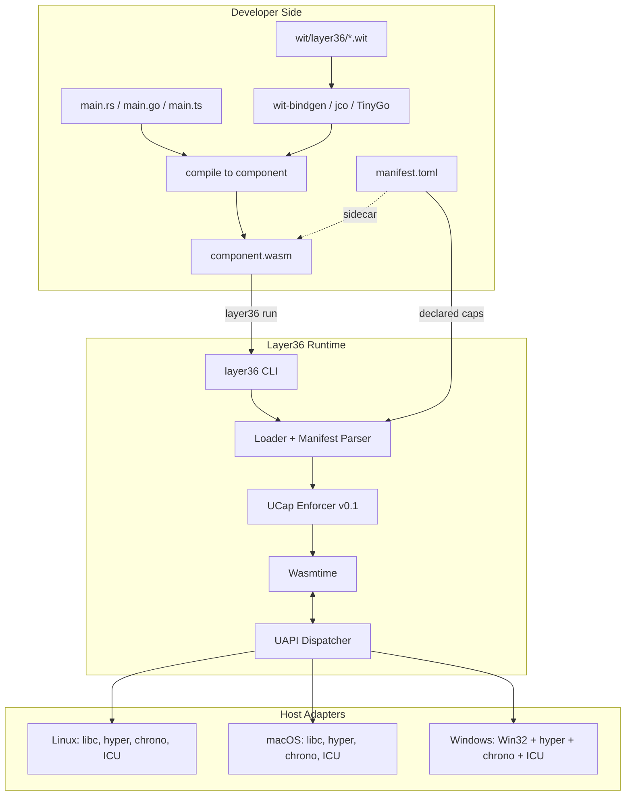
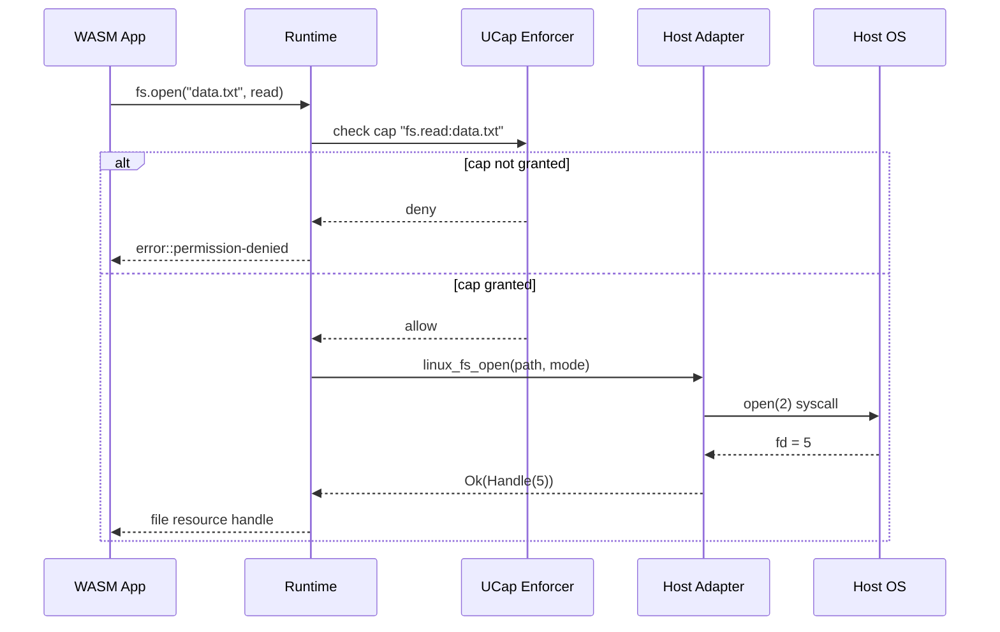
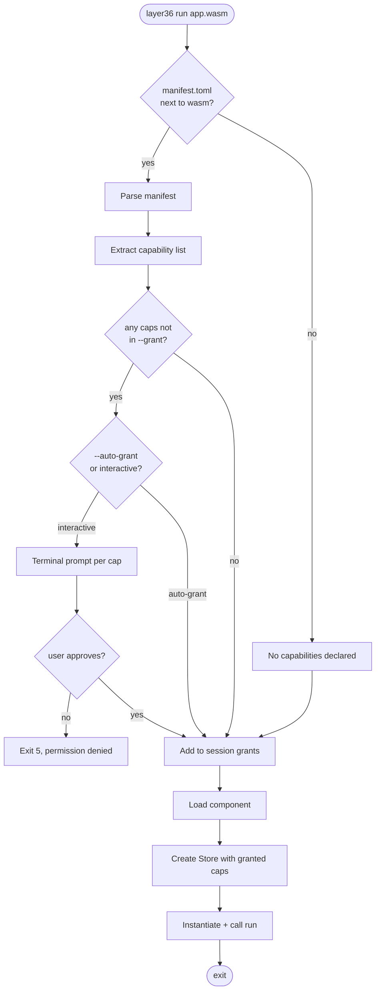
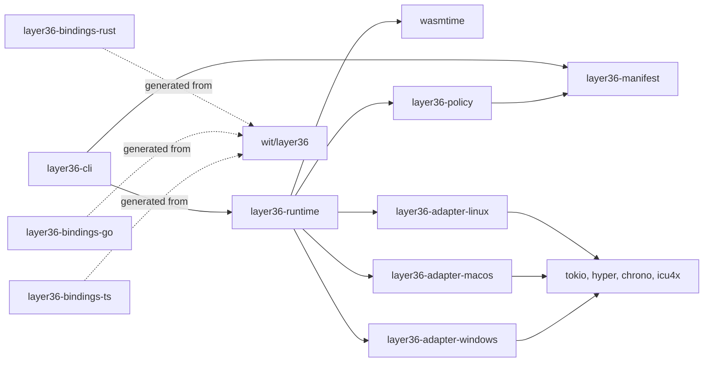
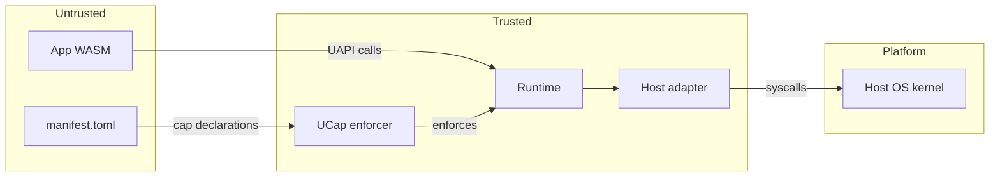

# Layer36 — Phase 2 Detailed Plan: UAPI v0.1 (CLI)

> **Phase:** 2 of 8
> **Duration:** est. 4 to 8 weeks for the first useful CLI slice
> **Phase sentence:** *Ship the first useful cross-platform CLI app through our runtime.*
> **Prerequisite:** Phase 1 complete — runtime + CLI + CI green on three desktop hosts.
> **Supersedes:** `layer36:phase1/host` WIT interface.
> **Superseded by:** nothing.
> **Status:** Started under the Phase 1 engineering-complete waiver; formal external gates still pending.

---

## Table of Contents

0. [How to Use This Document](#0-how-to-use-this-document)
1. [Phase Objective](#1-phase-objective)
2. [Prerequisites from Phase 1](#2-prerequisites-from-phase-1)
3. [Success Criteria](#3-success-criteria)
4. [What Phase 2 Is and Is Not](#4-what-phase-2-is-and-is-not)
5. [Architecture](#5-architecture)
6. [Technology Decisions](#6-technology-decisions)
7. [UAPI v0.1 Module Specifications](#7-uapi-v01-module-specifications)
8. [Host Adapter Design](#8-host-adapter-design)
9. [Language Bindings](#9-language-bindings)
10. [UCap v0.1 (Soft Enforcement)](#10-ucap-v01-soft-enforcement)
11. [Sample Applications](#11-sample-applications)
12. [Week-by-Week Breakdown](#12-week-by-week-breakdown)
13. [Task Details](#13-task-details)
14. [Code Skeletons](#14-code-skeletons)
15. [Testing Strategy](#15-testing-strategy)
16. [Performance Targets](#16-performance-targets)
17. [Security & Threat Model v0.2](#17-security--threat-model-v02)
18. [Documentation Deliverables](#18-documentation-deliverables)
19. [Architecture Decision Records](#19-architecture-decision-records)
20. [Exit Criteria Checklist](#20-exit-criteria-checklist)
21. [Phase 2 Risks](#21-phase-2-risks)
22. [Handoff to Phase 3](#22-handoff-to-phase-3)
23. [Appendices](#23-appendices)

---

## 0. How to Use This Document

Phase 2 is where Layer36 becomes useful. Phase 1 proved we could run a WASM binary; Phase 2 proves we can run a WASM binary that *does something*. It is also the first phase where the decisions you make will live forever — WIT interfaces become ABI commitments, and breaking a v0.1 module costs you every app that ever depended on it.

- Every task has an ID (`P2-UAPI-01`, etc.) matching §7 of the main Build Plan.
- The WIT specs in §7 are the most important artifacts of this phase. They will be copied, pasted, generated from, and depended on by every future phase. Get them right, not fast.
- Phase 2 is larger than Phase 1. Keep the first slice tight: WIT contracts first, then one useful app path, then broaden.
- If a task feels like it belongs to Phase 3 (GUI) or later, it does. Defer it.

---

## 1. Phase Objective

### 1.1 One-sentence objective

**A developer writes a CLI app in Rust, Go, or TypeScript against UAPI v0.1, compiles it to a `.wasm` component, and runs it through `layer36` on Linux, macOS, and Windows — where it reads files, makes HTTP calls, prints to stdout, and uses time/locale primitives correctly.**

### 1.2 Why this matters

Phase 1 had one host import (`print`) and no real I/O. A runtime that cannot read a file or make a network request is not a runtime, it is a demo. Phase 2 is the first phase where an outside developer can reasonably attempt to build a real thing with Layer36. Everything after Phase 2 — GUI, mobile, marketplace — is an extension of primitives that must be correct here.

### 1.3 The five deliverables of Phase 2

1. **Five UAPI modules** — `io`, `fs`, `net`, `time`, `locale` — designed as WIT, implemented on three desktop hosts.
2. **Language bindings** for Rust (first-class), Go via TinyGo, TypeScript via jco.
3. **Three sample CLI apps** — `layer36-curl`, `layer36-cat`, `layer36-clock` — all passing cross-host identity tests.
4. **UCap v0.1 (soft enforcement)** — manifest-declared capabilities, runtime-checked at UAPI call sites, one-time grant at launch via terminal prompt.
5. **An integration test harness** that builds each sample, runs it via `layer36 run` on all three hosts, and asserts byte-identical stdout.

---

## 2. Prerequisites from Phase 1

Before touching a single line of Phase 2 code, verify:

- [ ] All Phase 1 exit criteria met (see Phase 1 Plan §15).
- [ ] `layer36 run hello.wasm` works on Linux, macOS, Windows.
- [ ] `cargo build --release --workspace` produces `layer36` binary on all three hosts.
- [ ] Release artifacts have been cut at least once (`v0.1.0-rc1` or later).
- [ ] Phase 1 benchmarks recorded and published.
- [ ] Threat Model v0.1 published.
- [ ] ADR-0002 (Wasmtime) and ADR-0003 (Component Model) merged.
- [ ] `wasm32-wasip2` is the default WASM target.

If any box is unchecked, finish Phase 1 first. Phase 2 assumes a stable runtime foundation — building on a shaky Phase 1 compounds problems.

---

## 3. Success Criteria

Phase 2 is **done** when, and only when, every row below is true.

| # | Criterion | Measured How |
|---|-----------|--------------|
| 1 | All five UAPI modules defined as stable v0.1 WIT | `wit/layer36/*.wit` frozen |
| 2 | Each module implemented in Linux, macOS, Windows host adapters | CI green on all hosts |
| 3 | Rust bindings generated and usable | `cargo add layer36 && use layer36::fs` works |
| 4 | Go bindings (TinyGo) generated and usable | Sample builds and runs |
| 5 | TypeScript bindings (jco) generated and usable | Sample builds and runs |
| 6 | `layer36-curl <url>` works identically on all three hosts | Integration test |
| 7 | `layer36-cat <file>` works identically on all three hosts | Integration test |
| 8 | `layer36-clock` prints time in user's locale on all three hosts | Integration test |
| 9 | UCap v0.1: manifest-declared caps enforced at UAPI boundary | Attempting unauthorized call traps cleanly |
| 10 | Startup overhead for a UAPI-using app < 150 ms | Benchmark suite |
| 11 | UAPI hot-path dispatch < 1 µs | Microbenchmark |
| 12 | A developer who knows Rust but not WASM can write a new UAPI-using CLI in < 30 min | Timed walkthrough |
| 13 | UAPI Reference docs auto-generated from WIT | Published on docs site |
| 14 | WIT Style Guide merged | `docs/book/src/wit-style.md` |
| 15 | ADRs 0006 through at least 0012 merged | Git log |

---

## 4. What Phase 2 Is and Is Not

### 4.1 Phase 2 IS

- The first real UAPI — stable interface types for five fundamental modules.
- Three per-host adapter implementations.
- Three language binding pipelines.
- The beginning of UCap (soft enforcement, terminal prompts only).
- Three sample CLI apps that prove the UAPI works end-to-end.
- A capability-aware runtime: `layer36 run --grant net,fs:./data/**` style.

### 4.2 Phase 2 is NOT

- Not a GUI. No window, no pixels, no input events. That is Phase 3.
- Not mobile. No iOS, no Android. That is Phase 4.
- Not a server. No HTTP server, no socket listeners. Phase 3+ (and even then, client-first).
- Not the complete UAPI. Missing from v0.1: storage, crypto, sensors, UI, GPU, audio, IPC, notifications, accessibility, AI, identity. Those come later.
- Not complete UCap. No user-facing grant UI (that is Phase 3), no policy DB (that is Phase 6), no revocation flow (Phase 6).
- Not a bundle format. `.l36app` is Phase 6. Phase 2 ships `.wasm` components with a sidecar `manifest.toml` consumed by the CLI.

### 4.3 The scope discipline

Every request during Phase 2 will sound like "can we also add X?" The answer is almost always "Phase N." Keep a running list in `docs/book/src/phase2/deferred.md` so deferrals feel like decisions, not refusals.

---

## 5. Architecture

### 5.1 System overview at end of Phase 2



### 5.2 UAPI call flow



### 5.3 Startup flow with manifest + UCap



### 5.4 Crate layout at end of Phase 2



### 5.5 Trust boundaries (Phase 2)



Change from Phase 1: the manifest is now a trust-boundary input, and UCap enforcement sits between the WASM and the adapter.

---

## 6. Technology Decisions

Every choice below is frozen for Phase 2. Changes require an ADR.

### 6.1 Interface definition: **WIT + Component Model** (continues from ADR-0003)

All UAPI modules are WIT interfaces. Phase 2 produces `wit/layer36/*.wit` files that are *normative* — once published they cannot break in v0.1.x.

### 6.2 WIT package versioning: **semver per module**

- `layer36:io@0.1.0`
- `layer36:fs@0.1.0`
- `layer36:net@0.1.0`
- `layer36:time@0.1.0`
- `layer36:locale@0.1.0`

Every module versions independently. v0.1.0 is *pre-stable* — breaking changes allowed until v1.0.0. Bumping a module version requires an ADR.

### 6.3 Bindings: **Rust (wit-bindgen), Go (TinyGo), TypeScript (jco)**

- **Rust** is first-class: the runtime is Rust, so we eat our own binding output first.
- **Go** via **TinyGo** — the only Go toolchain producing WASM components at acceptable quality today. Full Go's stdlib is too large.
- **TypeScript** via **jco** (ComponentizeJS). Produces components from JS/TS using SpiderMonkey under the hood; binary size is large but DX is best-in-class.

### 6.4 HTTP: **`hyper` + `rustls` + `tokio`**

- `hyper` for HTTP/1.1 and HTTP/2.
- `rustls` for TLS (no OpenSSL dependency).
- `tokio` for async runtime.
- `hickory-dns` for DNS resolution.

HTTP/3 / QUIC deferred to Phase 3 or later.

### 6.5 Async model inside runtime: **tokio single-threaded reactor per `Store`**

- Each WASM component instance gets a dedicated Tokio `current_thread` runtime.
- This avoids `Send` constraints on the host state and keeps per-app isolation simple.
- Multi-threaded Tokio is deferred — Phase 2 apps are CLIs, they don't need work-stealing.

### 6.6 Async exposure to WASM: **synchronous WIT, async under the hood**

Per ADR-0008 (see §19): UAPI functions appear synchronous from WASM's point of view. The runtime drives async I/O while the WASM is parked. This matches the Component Model's `async` proposal trajectory and avoids asking apps to reason about futures across the ABI boundary.

### 6.7 Filesystem path representation: **UTF-8 strings with platform normalization**

- Paths are `string` in WIT.
- On Windows, non-UTF-8 paths are rejected with `error::invalid-path`.
- Tilde expansion (`~/`) is runtime-owned, not app-owned.
- Relative paths are resolved against the app's *sandbox root*, not the CWD.

### 6.8 Time representation: **Unix milliseconds + explicit timezone**

- No `Duration` in v0.1 — just `u64` millis since epoch.
- Timezone is a separate query (`locale::timezone()`).
- Monotonic clock is distinct from wall-clock.

### 6.9 Locale / i18n: **ICU4X**

- Rust-native ICU implementation.
- Bundled statically in the runtime.
- Exposes formatting, collation, case conversion — not translation strings (that's app-owned).

### 6.10 Manifest format: **TOML**

- `manifest.toml` co-located with `.wasm` file (Phase 2 sidecar).
- Parsed by `layer36-manifest` crate using `toml` + `serde`.
- Schema validated on load.

### 6.11 Capability strings: **stable format from Phase 2**

Format `<module>.<action>[:<resource>]` is frozen in Phase 2 per Build Plan §10.2. Future phases may add new modules and actions but cannot change the syntax.

### 6.12 What we explicitly DEFER

| Feature | Deferred to | Reason |
|---|---|---|
| UI, graphics | Phase 3 | Largest surface; needs its own phase |
| Storage (SQLite) | Phase 3 | Needs manifest schema declarations |
| Crypto | Phase 3 | Low priority for CLI; ring needs hardening review |
| Sensors | Phase 4 | Mobile-first feature |
| Audio | Phase 3 | Needs GUI phase's event loop |
| HTTP server | Phase 5 or later | CLIs don't need it |
| WebSockets | Phase 5 | Client-first for now |
| IPC | Phase 5 | Requires process-model decisions |
| Notifications | Phase 3 | GUI-adjacent |
| Accessibility | Phase 3 | GUI-adjacent |
| AI inference | Phase 5+ | Standalone module, not prerequisite |
| Identity | Phase 6 | Requires marketplace |
| Bundle format | Phase 6 | Sidecar manifest adequate until then |

---

## 7. UAPI v0.1 Module Specifications

These five WIT files are the core deliverable of Phase 2. Each is presented with design rationale followed by the authoritative WIT text.

### 7.1 `layer36:io@0.1.0`

**Purpose:** standard I/O, logging.

**Design notes:**
- `stdin`, `stdout`, `stderr` are opened as resources, not raw functions.
- `args.raw` exposes app arguments passed after `--` as a simple newline-separated string while the draft API is still moving.
- Binary-safe: no implicit encoding conversion.
- `log` is structured: level + message + key-value pairs.

```wit
// wit/layer36/io.wit
package layer36:io@0.1.0;

interface types {
    enum log-level {
        trace,
        debug,
        info,
        warn,
        error,
    }

    variant io-error {
        closed,
        interrupted,
        unexpected-eof,
        invalid-utf8,
        other(string),
    }
}

interface streams {
    use types.{io-error};

    resource input-stream {
        read: func(n: u32) -> result<list<u8>, io-error>;
        read-to-string: func() -> result<string, io-error>;
    }

    resource output-stream {
        write: func(bytes: list<u8>) -> result<u32, io-error>;
        write-all: func(bytes: list<u8>) -> result<_, io-error>;
        flush: func() -> result<_, io-error>;
    }
}

interface stdio {
    use streams.{input-stream, output-stream};

    stdin:  func() -> input-stream;
    stdout: func() -> output-stream;
    stderr: func() -> output-stream;
}

interface args {
    raw: func() -> string;
}

interface log {
    use types.{log-level};

    record field {
        key: string,
        value: string,
    }

    emit: func(level: log-level, message: string, fields: list<field>);
}

world consumer {
    import stdio;
    import log;
}
```

### 7.2 `layer36:fs@0.1.0`

**Purpose:** filesystem access within granted paths.

**Design notes:**
- Paths resolved against a per-app sandbox root.
- `file` is a resource — explicit close via drop.
- Directory listing returns names only, not full stat results (stat separately).
- No `O_DIRECTORY`, `O_APPEND`, symlink semantics, or permissions in v0.1.

```wit
// wit/layer36/fs.wit
package layer36:fs@0.1.0;

interface types {
    record file-stat {
        size: u64,
        modified-millis: u64,
        is-dir: bool,
    }

    variant open-mode {
        read,
        write,       // truncates
        read-write,  // truncates
        append,
    }

    variant fs-error {
        not-found,
        permission-denied,
        already-exists,
        invalid-path,
        not-a-directory,
        is-a-directory,
        io(string),
    }
}

interface files {
    use types.{file-stat, open-mode, fs-error};

    resource file {
        read: func(n: u32) -> result<list<u8>, fs-error>;
        write: func(bytes: list<u8>) -> result<u32, fs-error>;
        seek-set: func(pos: u64) -> result<u64, fs-error>;
        seek-end: func() -> result<u64, fs-error>;
        stat: func() -> result<file-stat, fs-error>;
    }

    open: func(path: string, mode: open-mode) -> result<file, fs-error>;
    stat: func(path: string) -> result<file-stat, fs-error>;
    list: func(path: string) -> result<list<string>, fs-error>;
    remove-file: func(path: string) -> result<_, fs-error>;
    remove-dir: func(path: string) -> result<_, fs-error>;
    mkdir: func(path: string) -> result<_, fs-error>;
    rename: func(from: string, to: string) -> result<_, fs-error>;
}

world consumer {
    import files;
}
```

### 7.3 `layer36:net@0.1.0`

**Purpose:** outbound HTTP client.

**Design notes:**
- v0.1 supports HTTP/1.1 and HTTP/2 only.
- TLS mandatory for `https://` (rustls).
- No streaming request bodies yet — full body buffered. Streaming is v0.2.
- Headers are a simple list of pairs (multimap semantics preserved).
- Connect-scoped caps: `net.connect:host:port` — wildcards allowed per Build Plan §10.2.

```wit
// wit/layer36/net.wit
package layer36:net@0.1.0;

interface types {
    enum http-method {
        get,
        post,
        put,
        delete,
        patch,
        head,
        options,
    }

    record header {
        name: string,   // lower-cased
        value: string,
    }

    record request {
        method: http-method,
        url: string,
        headers: list<header>,
        body: list<u8>,
        timeout-millis: option<u32>,
    }

    record response {
        status: u16,
        headers: list<header>,
        body: list<u8>,
    }

    variant net-error {
        invalid-url,
        dns-failure(string),
        connect-failure(string),
        tls-failure(string),
        timeout,
        body-too-large,
        permission-denied,
        protocol(string),
        other(string),
    }
}

interface http-client {
    use types.{request, response, net-error};

    get: func(url: string) -> result<list<u8>, net-error>;
    fetch: func(req: request) -> result<response, net-error>;
}

world consumer {
    import http-client;
}
```

### 7.4 `layer36:time@0.1.0`

**Purpose:** clocks and sleeping.

**Design notes:**
- Wall-clock and monotonic explicitly distinct.
- `sleep` is synchronous-from-WASM (runtime handles async yielding).
- No timers as resources in v0.1 (that is Phase 3 for UI loops).

```wit
// wit/layer36/time.wit
package layer36:time@0.1.0;

interface clock {
    /// Milliseconds since Unix epoch. Wall-clock; can jump.
    now-millis: func() -> u64;

    /// Monotonic nanoseconds since some arbitrary origin.
    /// Guaranteed non-decreasing; suitable for measuring intervals.
    monotonic-nanos: func() -> u64;
}

interface sleep {
    /// Block the calling task for at least `millis` milliseconds.
    sleep-millis: func(millis: u32);
}

world consumer {
    import clock;
    import sleep;
}
```

### 7.5 `layer36:locale@0.1.0`

**Purpose:** formatting, timezone, user locale.

**Design notes:**
- Thin wrapper around ICU4X.
- No translation tables — apps own their translations.
- Locale ID is BCP 47 (e.g. `en-US`, `de-DE`, `hi-IN`).

```wit
// wit/layer36/locale.wit
package layer36:locale@0.1.0;

interface types {
    record locale-id {
        bcp47: string,     // e.g. "en-US", "hi-IN"
    }

    enum date-style {
        short,
        medium,
        long,
        full,
    }

    enum number-style {
        decimal,
        percent,
        currency,
    }
}

interface info {
    use types.{locale-id};

    /// The user's preferred locale as reported by the host.
    current: func() -> locale-id;

    /// IANA timezone name, e.g. "Asia/Singapore".
    timezone: func() -> string;
}

interface format {
    use types.{locale-id, date-style, number-style};

    format-date: func(
        millis: u64,
        tz: string,
        style: date-style,
        loc: locale-id,
    ) -> string;

    format-number: func(
        value: f64,
        style: number-style,
        loc: locale-id,
    ) -> string;
}

world consumer {
    import info;
    import format;
}
```

### 7.6 Consolidated `world`

Phase 2 apps target this composite world:

```wit
// wit/layer36/app.wit
package layer36:app@0.1.0;

world cli {
    import layer36:io/stdio@0.1.0;
    import layer36:io/log@0.1.0;
    import layer36:fs/files@0.1.0;
    import layer36:net/http-client@0.1.0;
    import layer36:time/clock@0.1.0;
    import layer36:time/sleep@0.1.0;
    import layer36:locale/info@0.1.0;
    import layer36:locale/format@0.1.0;

    export run: func() -> s32;
}
```

---

## 8. Host Adapter Design

### 8.1 Adapter structure

Each host adapter is a Rust crate (`crates/adapter-{linux,macos,windows}`) exposing a single trait:

```rust
pub trait HostAdapter: Send + Sync {
    fn io(&self) -> &dyn IoAdapter;
    fn fs(&self) -> &dyn FsAdapter;
    fn net(&self) -> &dyn NetAdapter;
    fn time(&self) -> &dyn TimeAdapter;
    fn locale(&self) -> &dyn LocaleAdapter;
}
```

Each sub-trait mirrors the WIT interface. Binding layer (`crates/runtime/src/uapi/`) translates WIT resource/function calls to `HostAdapter` method calls.

### 8.2 Why separate crates per host

- **Conditional compilation hell avoided.** `#[cfg(target_os)]` across a shared implementation becomes a maintenance nightmare at scale.
- **Cleaner CI.** Each platform builds only its own adapter — faster, clearer failures.
- **Independent evolution.** macOS might need a new Cocoa API that Linux doesn't — platform-specific code stays platform-specific.

### 8.3 Shared adapter logic

Cross-platform logic lives in `crates/adapter-common`:

- HTTP client (all platforms use same `hyper + rustls`).
- Time arithmetic.
- ICU4X formatting.
- Path canonicalization rules.

Per-platform crates consume `adapter-common` for shared bits and implement only the truly OS-specific parts (filesystem case-sensitivity rules, system locale detection, DNS resolver behavior).

### 8.4 Platform-specific gotchas

| Module | Linux | macOS | Windows |
|---|---|---|---|
| `fs` | UTF-8 paths OK | UTF-8 NFD/NFC normalization | UTF-16 internally; reject non-UTF-8 input |
| `fs.stat.modified-millis` | `stat.st_mtime` | Same, but 1-second resolution on some FS | `FILETIME` → millis conversion (100ns ticks) |
| `net` HTTP | Standard | Standard | Firewall prompt on first connect |
| `locale.current` | `LANG` / `LC_ALL` env vars | `CFLocaleCopyCurrent` via CoreFoundation | `GetUserDefaultLocaleName` |
| `locale.timezone` | `/etc/localtime` symlink read | `CFTimeZoneCopySystem` | `GetTimeZoneInformation` |
| `time.monotonic-nanos` | `clock_gettime(CLOCK_MONOTONIC)` | `mach_absolute_time` + scale | `QueryPerformanceCounter` |

Document each gotcha in `docs/book/src/phase2/adapter-notes-{linux,macos,windows}.md` so Phase 3+ contributors inherit the tribal knowledge.

### 8.5 Sandbox root

Every app gets a per-app sandbox directory:

- Linux: `~/.local/share/layer36/apps/<app-id>/`
- macOS: `~/Library/Application Support/layer36/apps/<app-id>/`
- Windows: `%LOCALAPPDATA%\layer36\apps\<app-id>\`

Relative `fs` paths resolve inside the sandbox root. Absolute paths (or `~/`-prefixed) require explicit caps in the manifest.

---

## 9. Language Bindings

### 9.1 Rust (first-class)

- `wit-bindgen` generates `layer36-bindings-rust` crate.
- Published to crates.io as `layer36`.
- Re-exports each module: `layer36::fs`, `layer36::net`, etc.
- Provides ergonomic `Result<T, Error>` wrappers around WIT-generated types.

```rust
// Developer-visible API
use layer36::fs::{open, OpenMode};

let mut file = layer36::fs::open("data.txt", OpenMode::Read)?;
let contents = file.read_to_string()?;
```

### 9.2 Go via TinyGo

- TinyGo project provides WASM component output (component-model support landed 2024).
- Bindings generated via `wit-bindgen-go`.
- Published as `github.com/layer36/layer36-go`.

```go
import "github.com/layer36/layer36-go/fs"

file, err := fs.Open("data.txt", fs.OpenModeRead)
if err != nil { ... }
contents, err := file.ReadToString()
```

**Known limitations:**
- TinyGo's Go is a subset: no `goroutines`-over-syscall, limited reflection, no `cgo`.
- Use for CLI tools that need the Go stdlib's string/parsing functions without needing full goroutine concurrency.

### 9.3 TypeScript via jco

- `jco` (Bytecode Alliance's JS component toolchain) produces components from JS/TS.
- Embeds SpiderMonkey — binary size 5–10 MB overhead.
- Best DX of the three: fastest to prototype, familiar to web developers.

```typescript
import { open, OpenMode } from 'layer36:fs/files';

const file = open('data.txt', OpenMode.Read);
const contents = new TextDecoder().decode(file.read(1_000_000));
```

### 9.4 What we are NOT doing in Phase 2

- No C/C++ bindings. Deferred to Phase 5 (SDK).
- No Python bindings. Deferred to Phase 5.
- No Swift, Kotlin, Java. All deferred.

Each of those deserves deliberate treatment — rushing them in Phase 2 dilutes the quality of the three we *are* shipping.

---

## 10. UCap v0.1 (Soft Enforcement)

### 10.1 What "soft" means

- Capabilities are declared in manifests and enforced at UAPI call sites.
- Grants are session-scoped — no persistent policy DB until Phase 6.
- UI is terminal-only — no system dialogs until Phase 3.
- Fine-grained revocation is Phase 6.

### 10.2 Grant model

Three ways an app obtains capabilities:

1. **`--grant` flag:** `layer36 run --grant net,fs:./data/** app.wasm`.
2. **`--auto-grant` flag:** grants everything declared in the manifest.
3. **Interactive prompt:** default mode; prompts once per unique cap per session.

### 10.3 Interactive prompt example

```
layer36 run hello.wasm

App: com.example.hello (v1.0.0)
Publisher: unsigned — caution
Requests the following capabilities:

  [1] fs.read:~/Documents/notes/**
      "Read saved notes"
  [2] net.connect:api.example.com:443
      "Sync to cloud"

Grant [A]ll / [N]one / per-cap [1,2,...] / [S]kip (exit):
>
```

### 10.4 Enforcement point

Every UAPI function annotated with one or more required capabilities. The dispatcher checks grants before calling the adapter:

```rust
fn fs_open(store: &mut Store<HostState>, path: String, mode: OpenMode)
    -> Result<File, FsError>
{
    let cap_needed = match mode {
        OpenMode::Read => Cap::FsRead(canonicalize(&path)?),
        _ => Cap::FsWrite(canonicalize(&path)?),
    };
    store.data().ucap.check(&cap_needed)?;
    // ...then delegate to adapter
}
```

### 10.5 Manifest schema (Phase 2)

```toml
[app]
id      = "com.example.hello"
name    = "Hello"
version = "1.0.0"
entry   = "hello.wasm"
world   = "layer36:app/cli@0.1.0"

[[capabilities]]
cap       = "fs.read:~/Documents/notes/**"
rationale = "Read saved notes"
required  = true

[[capabilities]]
cap       = "net.connect:api.example.com:443"
rationale = "Sync to cloud"
required  = false
```

### 10.6 Canonical capability enumeration

The complete list of capability strings usable in Phase 2 — locked for v0.1:

```
io.stdin
io.stdout
io.stderr
io.log
fs.read:<path-glob>
fs.write:<path-glob>
fs.list:<path-glob>
fs.remove:<path-glob>
fs.mkdir:<path-glob>
net.connect:<host>:<port>
time.clock
time.monotonic
time.sleep
locale.info
locale.format
```

Any UAPI call not covered by one of these caps — because someone added a new function without updating the cap table — fails a CI check. The canonical list is also exposed by `layer36 manifest capabilities`.

### 10.7 Default grants

- `io.stdin`, `io.stdout`, `io.stderr`, `io.args`, `io.log`, `time.clock`, `time.monotonic`, `time.sleep`, `locale.info`, `locale.format` — **auto-granted**. Apps need these to do anything; no prompt necessary.
- Everything else — **must be declared and granted**.

---

## 11. Sample Applications

The three sample apps drive the UAPI design backward: if a common CLI pattern is hard to write, the UAPI is wrong. Build them in parallel with the UAPI, not after.

### 11.1 `layer36-curl`

**Purpose:** minimal HTTP client — Layer36's version of curl.

**Feature set (v0.1):**
- `layer36-curl <url>` — GET, print body.
- `-X POST` — request method.
- `-H "Name: value"` — custom headers (repeatable).
- `-d @file` or `-d 'text'` — request body.
- `-o file` — write response body to file instead of stdout.
- `-i` — include response headers in output.

**Implementation language:** Rust.
**Caps required:** `net.connect:*:*`, plus `fs.write:<out>` if `-o`, plus `fs.read:<file>` if `-d @`.
**LOC target:** < 300 lines including argument parsing.

### 11.2 `layer36-cat`

**Purpose:** minimal file reader — Layer36's version of cat.

**Feature set (v0.1):**
- `layer36-cat <file1> [file2 ...]` — concatenate and print to stdout.
- `-n` — number lines.
- `-b` — number non-blank lines only.
- Reading `-` reads from stdin.

**Implementation language:** Go (TinyGo).
**Caps required:** `fs.read:<each input path>`.
**Current implementation:** Rust first, Go/TinyGo variant later.
**Reason:** the Rust binding path is already usable, so the file/args behavior can harden now. The Go version still matters for the language-binding track.

### 11.3 `layer36-clock`

**Purpose:** show current time in locale-aware format.

**Feature set (v0.1):**
- `layer36-clock` — print current date and time in user's locale.
- `--tz <iana>` — override timezone (e.g. `--tz Asia/Tokyo`).
- `--format short|medium|long|full` — ICU style.
- `--json` — machine-readable output.

**Implementation language:** Rust first, TypeScript/jco variant later.
**Caps required:** `time.clock`, `locale.info`, `locale.format`.
**Reason:** Rust is the binding path that is already green, so it gives us the
runtime sample now. The TypeScript version still matters for the language SDK
track once the runtime shape is less fluid.

### 11.4 Cross-host identity testing

All three samples have a property: **byte-identical stdout across hosts given byte-identical inputs**. The integration test harness enforces this.

Where the property cannot hold by physics (timestamps differ across runs, DNS varies), tests use frozen inputs:

- `layer36-curl http://localhost:PORT` against a test HTTP server with fixed responses.
- `layer36-cat test-fixtures/*.txt` with checked-in fixtures.
- `layer36-clock` tested with a frozen clock stub via `--test-time <millis>` flag (dev-only).

---

## 12. Week-by-Week Breakdown

Phase 2 is 12 weeks of calendar time, scaled for ~20 hours/week of active development. A full-time engineer compresses to 6–8 weeks.

### Weeks 1–2: WIT design

- Draft all five WIT files. Internal review. Iterate.
- Write WIT style guide (§18.1).
- ADR-0006 (WIT versioning), ADR-0007 (UCap soft enforcement), ADR-0008 (host async runtime).

### Weeks 3–4: `io` + `time` + `locale`

- The easy three. Small adapters. Get the binding + dispatch pipeline working end-to-end on one module before tackling `fs` and `net`.
- Rust bindings via wit-bindgen.
- First sample: `layer36-clock` (TypeScript, jco) — also validates TS pipeline early.

### Weeks 5–6: `fs`

- Design doc for sandbox root (ADR-0009).
- Linux/macOS/Windows adapter implementations.
- Path canonicalization logic.
- `layer36-cat` sample in Go via TinyGo (validates Go pipeline).

### Weeks 7–8: `net`

- HTTP client adapter using hyper + rustls.
- DNS resolver integration.
- Timeout and error mapping.
- `layer36-curl` sample in Rust.

### Week 9: UCap v0.1

- Manifest parser.
- Cap enforcement at dispatch.
- Terminal grant prompts.
- `--grant` and `--auto-grant` CLI flags.

### Week 10: Integration + cross-host testing

- Integration test harness.
- All three samples running green in CI on all three hosts.
- Cross-host stdout diff tests.
- Benchmark suite additions.

### Week 11: Documentation

- UAPI reference auto-generated from WIT.
- Three tutorial walkthroughs (one per language).
- Threat model v0.2.
- Migration note: "from Phase 1 host-imports to Phase 2 UAPI".

### Week 12: Buffer + exit criteria + retro

- Walk the §20 checklist item by item.
- External volunteer does a tutorial cold; time and observe.
- Retrospective.
- Phase 3 kickoff plan.

---

## 13. Task Details

Each task targets approximately one engineer-week unless noted. Task IDs match Build Plan §7.3.

### P2-UAPI-01 — `wit/layer36/io.wit`

**Branch:** `p2-uapi-01-io-wit`.

**Acceptance:**
- File matches §7.1 exactly.
- Parses via `wasm-tools component wit`.
- Style guide checked.

### P2-UAPI-02 — `wit/layer36/fs.wit`

**Branch:** `p2-uapi-02-fs-wit`.

**Acceptance:**
- File matches §7.2.
- Parses via `wasm-tools`.
- Sandbox root concept documented in companion markdown.

### P2-UAPI-03 — `wit/layer36/net.wit`

**Branch:** `p2-uapi-03-net-wit`.

**Acceptance:**
- File matches §7.3.
- HTTP/1.1 and HTTP/2 explicit in module README.
- DNS error semantics documented.

### P2-UAPI-04 — `wit/layer36/time.wit`

**Branch:** `p2-uapi-04-time-wit`.

**Acceptance:**
- File matches §7.4.
- Wall vs monotonic distinction documented.

### P2-UAPI-05 — `wit/layer36/locale.wit`

**Branch:** `p2-uapi-05-locale-wit`.

**Acceptance:**
- File matches §7.5.
- BCP 47 linked from docs.

### P2-ADPT-01 — Linux adapters

**Estimate:** 3 days.
**Branch:** `p2-adpt-01-linux`.

**Acceptance:**
- `crates/adapter-linux/` implements all five UAPI modules.
- Sandbox root created on first run.
- Unit tests per module, integration tests run under `layer36 run` on Ubuntu in CI.

### P2-ADPT-02 — macOS adapters

**Estimate:** 3 days.
**Branch:** `p2-adpt-02-macos`.

**Acceptance:**
- `crates/adapter-macos/` implements all five UAPI modules.
- Uses CoreFoundation for locale detection.
- CI green on macOS runners (both x86_64 and aarch64).

### P2-ADPT-03 — Windows adapters

**Estimate:** 3 days.
**Branch:** `p2-adpt-03-windows`.

**Acceptance:**
- `crates/adapter-windows/` implements all five UAPI modules.
- UTF-16 path conversion correct.
- CI green on windows-latest.

### P2-BIND-01 — Rust bindings

**Estimate:** 1 day.
**Branch:** `p2-bind-01-rust`.

**Acceptance:**
- `crates/bindings-rust/` (published as `layer36` on crates.io) re-exports each module.
- Generated via `wit-bindgen` with additional ergonomic wrappers.
- `cargo doc` generates clean reference.

### P2-BIND-02 — Go bindings

**Estimate:** 2 days.
**Branch:** `p2-bind-02-go`.

**Acceptance:**
- `layer36-go` repo with generated bindings.
- TinyGo build verified for a hello-world.
- Documented limitations of TinyGo stdlib.

### P2-BIND-03 — TypeScript bindings

**Estimate:** 2 days.
**Branch:** `p2-bind-03-ts`.

**Acceptance:**
- `@layer36/sdk` NPM package with type definitions.
- jco componentization pipeline documented.
- Hello-world TS sample < 10 MB as component.

### P2-APP-01 — `layer36-curl`

**Estimate:** 2 days.
**Branch:** `p2-app-01-curl`.

**Acceptance:**
- Source in `apps/layer36-curl/` (Rust).
- Behaves as §11.1.
- CI runs against test HTTP server, diffs stdout across hosts.

### P2-APP-02 — `layer36-cat`

**Estimate:** 1 day.
**Branch:** `p2-app-02-cat`.

**Acceptance:**
- Source in `apps/layer36-cat/` (Rust first; Go/TinyGo variant later).
- Behaves as §11.2.
- Cross-host stdout-identical against fixtures.

### P2-APP-03 — `layer36-clock`

**Estimate:** 1 day.
**Branch:** `p2-app-03-clock`.

**Acceptance:**
- Source in `apps/layer36-clock/` (Rust first; TypeScript/jco variant later).
- Behaves as §11.3.
- Snapshot tested with `--test-time` flag for determinism.

### P2-TEST-01 — Integration harness

**Estimate:** 2 days.
**Branch:** `p2-test-01-harness`.

**Acceptance:**
- `test/integration/runner.rs` builds each sample, runs via `layer36`, diffs stdout.
- Fixtures checked into `test/fixtures/`.
- Test HTTP server (simple hyper-based) for `layer36-curl` tests.
- CI runs on all three hosts.

### P2-SEC-01 — UCap soft enforcement

**Estimate:** 3 days.
**Branch:** `p2-sec-01-ucap`.

**Acceptance:**
- `crates/policy/` implements cap matching and checking.
- Manifest parser in `crates/manifest/`. Started as `crates/manifest/`, package name `layer36-manifest`.
- Dispatcher calls `policy.check()` at every UAPI entry.
- CLI flags `--grant`, `--auto-grant`, interactive prompt.

### P2-DOC-01 — WIT style guide

**Estimate:** 1 day.
**Branch:** `p2-doc-01-wit-style`.

**Acceptance:**
- `docs/book/src/wit-style.md`.
- Covers: naming, resource-vs-function, error variants, versioning.
- Linked from CONTRIBUTING.md.

### P2-DOC-02 — UAPI reference

**Estimate:** 2 days.
**Branch:** `p2-doc-02-uapi-ref`.

**Acceptance:**
- Auto-generated from WIT files via `wit-bindgen` markdown output (or custom tool).
- Included in mdBook site under `docs/book/src/reference/uapi/`.
- Regenerated in CI on every WIT change.

---

## 14. Code Skeletons

### 14.1 Runtime dispatcher pattern

```rust
// crates/runtime/src/uapi/fs.rs
use crate::policy::Cap;
use crate::adapter::HostAdapter;

pub fn wire_fs<A: HostAdapter + 'static>(
    linker: &mut wasmtime::component::Linker<HostState<A>>,
) -> anyhow::Result<()> {
    let mut fs = linker.instance("layer36:fs/files@0.1.0")?;

    fs.func_wrap(
        "open",
        |mut store: wasmtime::StoreContextMut<HostState<A>>,
         (path, mode): (String, OpenMode)|
         -> Result<(Resource<File>,), FsError> {
            let canonical = canonicalize(&store.data().sandbox_root, &path)?;
            let cap = match mode {
                OpenMode::Read => Cap::FsRead(canonical.clone()),
                _ => Cap::FsWrite(canonical.clone()),
            };
            store.data().policy.check(&cap).map_err(|_| FsError::PermissionDenied)?;

            let file = store.data().adapter.fs().open(&canonical, mode)?;
            let res = store.data_mut().resources.push(file)?;
            Ok((res,))
        },
    )?;

    // …open, stat, list, remove-file, remove-dir, mkdir, rename
    Ok(())
}
```

### 14.2 Linux `FsAdapter` implementation

```rust
// crates/adapter-linux/src/fs.rs
use std::fs;
use std::path::{Path, PathBuf};

pub struct LinuxFsAdapter;

impl FsAdapter for LinuxFsAdapter {
    fn open(&self, path: &Path, mode: OpenMode) -> Result<Box<dyn File>, FsError> {
        let mut opts = fs::OpenOptions::new();
        match mode {
            OpenMode::Read       => { opts.read(true); }
            OpenMode::Write      => { opts.write(true).create(true).truncate(true); }
            OpenMode::ReadWrite  => { opts.read(true).write(true).create(true).truncate(true); }
            OpenMode::Append     => { opts.append(true).create(true); }
        }
        let f = opts.open(path).map_err(map_io_error)?;
        Ok(Box::new(LinuxFile(f)))
    }

    fn stat(&self, path: &Path) -> Result<FileStat, FsError> {
        let md = fs::metadata(path).map_err(map_io_error)?;
        Ok(FileStat {
            size: md.len(),
            modified_millis: md.modified()
                .map_err(map_io_error)?
                .duration_since(std::time::UNIX_EPOCH)
                .unwrap_or_default()
                .as_millis() as u64,
            is_dir: md.is_dir(),
        })
    }

    fn list(&self, path: &Path) -> Result<Vec<String>, FsError> {
        let entries = fs::read_dir(path).map_err(map_io_error)?;
        let mut out = Vec::new();
        for entry in entries {
            let e = entry.map_err(map_io_error)?;
            let name = e.file_name()
                .into_string()
                .map_err(|_| FsError::InvalidPath)?;
            out.push(name);
        }
        out.sort();  // cross-platform determinism
        Ok(out)
    }

    // …remove_file, remove_dir, mkdir, rename
}

fn map_io_error(e: std::io::Error) -> FsError {
    use std::io::ErrorKind::*;
    match e.kind() {
        NotFound         => FsError::NotFound,
        PermissionDenied => FsError::PermissionDenied,
        AlreadyExists    => FsError::AlreadyExists,
        _                => FsError::Io(e.to_string()),
    }
}
```

### 14.3 HTTP client skeleton (shared across hosts)

```rust
// crates/adapter-common/src/net.rs
use hyper::{Body, Client, Request as HyperRequest, Method};
use hyper_rustls::HttpsConnectorBuilder;
use tokio::runtime::Handle;

pub struct SharedNetAdapter {
    client: Client<hyper_rustls::HttpsConnector<hyper::client::HttpConnector>, Body>,
    rt: Handle,
}

impl NetAdapter for SharedNetAdapter {
    fn fetch(&self, req: Request) -> Result<Response, NetError> {
        let hreq = build_hyper_request(req)?;
        let fut = self.client.request(hreq);

        let resp = self.rt.block_on(async {
            tokio::time::timeout(
                std::time::Duration::from_millis(req.timeout_millis.unwrap_or(30_000) as u64),
                fut,
            )
            .await
        })
        .map_err(|_| NetError::Timeout)?
        .map_err(|e| NetError::ConnectFailure(e.to_string()))?;

        read_full_response(resp, self.rt.clone())
    }
}
```

### 14.4 UCap policy engine

```rust
// crates/policy/src/lib.rs
use std::collections::HashSet;
use thiserror::Error;

#[derive(Debug, Clone, Hash, Eq, PartialEq)]
pub enum Cap {
    IoStdout,
    IoStderr,
    IoLog,
    IoStdin,
    FsRead(String),      // canonicalized path pattern
    FsWrite(String),
    FsList(String),
    FsRemove(String),
    FsMkdir(String),
    NetConnect { host: String, port: u16 },
    TimeClock,
    TimeMonotonic,
    TimeSleep,
    LocaleInfo,
    LocaleFormat,
}

#[derive(Debug, Error)]
#[error("capability denied: {0:?}")]
pub struct CapDenied(pub Cap);

#[derive(Default)]
pub struct Policy {
    grants: Vec<Cap>,
}

impl Policy {
    pub fn grant(&mut self, cap: Cap) {
        self.grants.push(cap);
    }

    pub fn check(&self, requested: &Cap) -> Result<(), CapDenied> {
        if self.grants.iter().any(|g| cap_covers(g, requested)) {
            Ok(())
        } else {
            Err(CapDenied(requested.clone()))
        }
    }
}

fn cap_covers(granted: &Cap, requested: &Cap) -> bool {
    // Exact match for non-resource caps; glob match for fs/net.
    // Full implementation in crates/policy/src/matcher.rs
    todo!()
}
```

### 14.5 Manifest parser

```rust
// crates/manifest/src/lib.rs
use serde::Deserialize;

#[derive(Debug, Deserialize)]
pub struct Manifest {
    pub app: AppMeta,
    #[serde(default)]
    pub capabilities: Vec<CapabilityDecl>,
}

#[derive(Debug, Deserialize)]
pub struct AppMeta {
    pub id: String,
    pub name: String,
    pub version: String,
    pub entry: String,
    pub world: String,
}

#[derive(Debug, Deserialize)]
pub struct CapabilityDecl {
    pub cap: String,
    pub rationale: String,
    #[serde(default)]
    pub required: bool,
}

impl Manifest {
    pub fn parse(s: &str) -> Result<Self, toml::de::Error> {
        toml::from_str(s)
    }

    pub fn load_sibling(wasm_path: &std::path::Path)
        -> std::io::Result<Option<Self>>
    {
        let path = wasm_path.with_file_name("manifest.toml");
        if !path.exists() {
            return Ok(None);
        }
        let text = std::fs::read_to_string(&path)?;
        Self::parse(&text)
            .map(Some)
            .map_err(|e| std::io::Error::new(std::io::ErrorKind::InvalidData, e))
    }
}
```

### 14.6 Interactive grant prompt

```rust
// crates/cli/src/prompt.rs
use layer36_manifest::CapabilityDecl;
use layer36_policy::Cap;
use std::io::{self, Write};

pub fn interactive_grant(caps: &[CapabilityDecl], app_id: &str)
    -> io::Result<Vec<Cap>>
{
    println!("App: {app_id}");
    println!("Requests the following capabilities:");
    for (i, c) in caps.iter().enumerate() {
        println!("  [{}] {}\n      {:?}", i + 1, c.cap, c.rationale);
    }
    print!("Grant [A]ll / [N]one / per-cap numbers / [S]kip (exit): ");
    io::stdout().flush()?;

    let mut input = String::new();
    io::stdin().read_line(&mut input)?;
    parse_grant_response(input.trim(), caps)
}
```

### 14.7 Rust sample: `layer36-curl` excerpt

```rust
// apps/layer36-curl/src/main.rs
use layer36::net::http_client::{fetch, HttpMethod, Request};

fn main() -> i32 {
    let args: Vec<String> = std::env::args().collect();
    let url = args.get(1).cloned().unwrap_or_else(|| {
        eprintln!("usage: layer36-curl <url>");
        std::process::exit(1);
    });

    let req = Request {
        method: HttpMethod::Get,
        url,
        headers: vec![],
        body: vec![],
        timeout_millis: Some(30_000),
    };

    match fetch(req) {
        Ok(resp) => {
            layer36::io::stdio::stdout().write_all(&resp.body).ok();
            if resp.status >= 400 { 22 } else { 0 }
        }
        Err(e) => {
            eprintln!("error: {e:?}");
            1
        }
    }
}
```

### 14.8 Go sample: `layer36-cat` excerpt

```go
// apps/layer36-cat/main.go
package main

import (
    "os"

    fs   "github.com/layer36/layer36-go/fs/files"
    stdio "github.com/layer36/layer36-go/io/stdio"
)

func main() {
    args := os.Args[1:]
    if len(args) == 0 {
        os.Exit(1)
    }
    out := stdio.Stdout()
    defer out.Drop()

    for _, path := range args {
        f, err := fs.Open(path, fs.OpenModeRead())
        if err != nil {
            os.Exit(2)
        }
        for {
            chunk, err := f.Read(8192)
            if err != nil || len(chunk) == 0 {
                break
            }
            out.WriteAll(chunk)
        }
        f.Drop()
    }
}
```

### 14.9 TypeScript sample: `layer36-clock` excerpt

```typescript
// apps/layer36-clock/src/main.ts
import { current, timezone } from 'layer36:locale/info@0.1.0';
import { formatDate, DateStyle } from 'layer36:locale/format@0.1.0';
import { nowMillis } from 'layer36:time/clock@0.1.0';
import { stdout } from 'layer36:io/stdio@0.1.0';

export function run(): number {
    const loc = current();
    const tz = timezone();
    const now = nowMillis();
    const formatted = formatDate(now, tz, DateStyle.Medium, loc);
    const out = stdout();
    const encoder = new TextEncoder();
    out.writeAll(encoder.encode(formatted + '\n'));
    return 0;
}
```

---

## 15. Testing Strategy

### 15.1 Test pyramid (Phase 2 additions)

| Level | Tool | What's new in Phase 2 |
|---|---|---|
| Unit | `cargo test` | Per-adapter modules, manifest parser, policy matcher |
| Component | `wasmtime` harness | Single UAPI module integration tests |
| Integration | runner | Full sample apps across hosts |
| Cross-host diff | runner | Byte-identical stdout across Linux/macOS/Windows |
| Fuzz | `cargo-fuzz` | Manifest parser, capability matcher, path canonicalizer |

### 15.2 Fixture strategy

`test/fixtures/` contains:
- Deterministic text files for `layer36-cat`.
- Checked-in HTTP response bodies, replayed via the test HTTP server.
- Frozen-clock test data (`--test-time` flag outputs known strings).

### 15.3 Differential testing

Cross-host diff tests take the form:

```rust
#[test]
fn layer36_cat_identical_across_hosts() {
    let output_linux = run_on_host("linux", "layer36-cat fixtures/hello.txt");
    let output_macos = run_on_host("macos", "layer36-cat fixtures/hello.txt");
    let output_windows = run_on_host("windows", "layer36-cat fixtures/hello.txt");
    assert_eq!(output_linux, output_macos);
    assert_eq!(output_linux, output_windows);
}
```

These run in a CI matrix job that collects each host's output as an artifact, then a separate job downloads and diffs them.

### 15.4 Fuzz targets

| Target | Input | What we're looking for |
|---|---|---|
| `manifest_parser` | arbitrary bytes | panics, infinite loops |
| `cap_matcher` | pair of cap strings | false grants/denies |
| `path_canonicalize` | arbitrary paths | sandbox escapes via `..`, symlinks, null bytes |

Phase 2 fuzz runs: 4 hours nightly minimum.

### 15.5 Snapshot testing for CLIs

Each sample's `--help` output snapshotted via `insta`. Errors surface on help-text drift — catches regressions in clap config and argument docs.

---

## 16. Performance Targets

| Metric | Target | Measured how |
|---|---|---|
| UAPI dispatch overhead (hot) | < 1 µs | `criterion` microbench |
| UCap check overhead (cached grant) | < 500 ns | microbench |
| `layer36 run` cold start w/ UAPI app | < 150 ms | `hyperfine` |
| `layer36 run` warm start | < 30 ms | `hyperfine` |
| `layer36-curl` vs native `curl` (GET localhost) | < 3× overhead | comparison bench |
| `layer36-cat` vs native `cat` (1 MB file) | < 2× overhead | comparison bench |
| Runtime binary size | < 50 MB (up from 30 in Phase 1, due to adapters) | artifact size |
| RSS per running app | < 60 MB | `ps`/`Get-Process`/`Activity Monitor` |

Misses > 10% from any target trigger an issue blocking exit criteria.

---

## 17. Security & Threat Model v0.2

### 17.1 What v0.2 adds over v0.1

| v0.1 (Phase 1) | v0.2 (Phase 2) |
|---|---|
| One boundary: WASM ↔ runtime | Plus: WASM ↔ UCap, UCap ↔ adapter, adapter ↔ host |
| No filesystem access | Sandboxed filesystem; cap-scoped |
| No network access | Cap-scoped outbound HTTP |
| No concept of grants | Session-scoped grants |
| No manifest | Manifest is a trust-boundary input |

### 17.2 Updated STRIDE table

| Category | Threat | v0.2 mitigation |
|---|---|---|
| **S**poofing | Fake manifest claiming wrong app ID | Manifest signing deferred to Phase 6; Phase 2 accepts unsigned; CLI warns "unsigned app" |
| **T**ampering | Modify capability list post-grant | Grants are held in trusted Policy; WASM cannot modify |
| **R**epudiation | Deny capability was granted | `--log-grants` writes each grant to a log file; full audit DB is Phase 6 |
| **I**nformation Disclosure | Read files outside sandbox | Path canonicalization rejects `..` escapes; symlink-following disabled across sandbox boundary |
| **D**enial of Service | Infinite HTTP request, huge file | Timeouts on net; fuel/memory limits still available |
| **E**levation | Use HTTP to reach localhost when granted `net.connect:api.com:443` | Cap matching is strict on host AND port; localhost requires explicit separate grant |

### 17.3 New attack surfaces

- **Path canonicalization.** Classic source of sandbox escape. Extensive fuzzing mandatory. Also run `https://github.com/google/honggfuzz` if budget allows.
- **TLS verification.** rustls defaults are strict; we do not expose "ignore cert" toggle in v0.1.
- **DNS resolution.** Resolver uses system resolver by default. `hickory-dns` under evaluation for a controlled-resolver future.
- **Time-of-check / time-of-use (TOCTOU).** Policy is checked at `open`, but long-lived file handles persist. We do not yet handle "grant revoked while file is open"; Phase 6 will.

### 17.4 Explicitly out of scope (still)

- Persistent policy DB (Phase 6).
- Revocation (Phase 6).
- Code signing (Phase 6).
- System-UI grant prompts (Phase 3 for desktop, Phase 4 for mobile).
- Rate limiting / quotas (Phase 5+).

### 17.5 README update required

`SECURITY.md` should be updated at end of Phase 2 to:

> Layer36 is pre-alpha. Phase 2 introduces capability-based sandboxing, but sandboxes are defense-in-depth — not a substitute for trusting the apps you run. Do not run malicious WASM expecting the sandbox to save you. Real hardening arrives in Phase 6 with signed bundles and persistent policy.

---

## 18. Documentation Deliverables

Phase 2 ships five user-facing docs. Priority order:

### 18.1 WIT Style Guide

`docs/book/src/wit-style.md`. Covers:
- Package naming: `layer36:<module>@<semver>`.
- Interface organization: `types` / functional interfaces / consumer `world`.
- Error variants: always `variant`, always include an `other(string)` bucket as last option.
- Resource vs function: resources for anything with lifecycle; functions for stateless operations.
- Versioning policy and stability markers.

### 18.2 UAPI Reference

Auto-generated from WIT. Published under `docs/book/src/reference/uapi/`. Rebuilt in CI on every merge to main that touches `wit/`.

### 18.3 Tutorial: "Your first UAPI app in Rust"

Step-by-step walkthrough: install `cargo-component`, define `world`, write Rust, compile, run, add a capability, run again.

### 18.4 Tutorial: "Your first UAPI app in Go / TypeScript"

Two more tutorials, one per non-Rust binding. Shorter than the Rust one (which is canonical).

### 18.5 Migration note: Phase 1 → Phase 2

`docs/book/src/phase2/migrating-from-phase1.md`. Tells anyone who was experimenting with Phase 1's `print`/`exit` imports how to move to real UAPI. Even if the audience is small (you), the doc discipline matters.

---

## 19. Architecture Decision Records

Expected ADRs in Phase 2:

| ID | Title | Target week |
|---|---|---|
| 0006 | WIT versioning strategy | W1 |
| 0007 | UCap v0.1 soft enforcement model | W1 |
| 0008 | Host async runtime | W2 |
| 0009 | Filesystem path representation and sandbox root | W5 |
| 0010 | HTTP client stack | W7 |
| 0011 | Cross-host adapter contract | W9 |
| 0012 | Adapter crate split (per-OS, not cfg-gated) | W3 |

Additional ADRs as decisions surface. Rule of thumb: if you have to ask "should I write an ADR?" the answer is yes.

---

## 20. Exit Criteria Checklist

### WIT & UAPI
- [ ] All five WIT files merged and frozen at v0.1.0.
- [x] `wasm-tools` validates each.
- [x] WIT style guide merged.
- [x] UAPI reference auto-generation working in CI.

### Adapters
- [ ] Linux adapter implements all five modules; unit tests green.
- [ ] macOS adapter implements all five modules; unit tests green.
- [ ] Windows adapter implements all five modules; unit tests green.
- [ ] `crates/adapter-common/` shared logic passes on all three.

### Bindings
- [ ] `layer36` Rust crate published to crates.io (or ready to publish).
- [ ] `layer36-go` Go module; TinyGo build verified.
- [ ] `@layer36/sdk` TypeScript package; jco pipeline documented.

### Samples
- [ ] `layer36-curl` runs on all three hosts, cross-host stdout identical for fixture URLs.
- [ ] `layer36-cat` runs on all three hosts, cross-host stdout identical for fixture files.
- [ ] `layer36-clock` runs on all three hosts, snapshot-tested with frozen clock.

### UCap
- [x] Manifest parser handles all §10.5 fields.
- [x] Policy engine enforces caps at every current UAPI entry.
- [x] File resource methods re-check opened path capabilities before adapter calls.
- [x] Stdio stream resource methods re-check stdin/stdout/stderr capabilities before adapter calls.
- [x] Filesystem path operations have denial-before-adapter coverage.
- [x] `--grant`, `--auto-grant`, interactive prompt all work.
- [x] Attempt to open a file outside granted glob → clear error, exit code 5.

### CI & Quality
- [ ] Cross-host CI matrix green for ≥ 7 consecutive days.
- [x] Fuzz targets defined.
- [ ] Nightly fuzz run for ≥ 4 h succeeds without crash.
- [x] Built Phase 2 sample components checked for pure `layer36:*` imports.
- [x] First UAPI dispatch microbenchmark target exists.
- [x] First UAPI component startup benchmark target exists.
- [ ] Benchmark regressions ≤ 10% vs Phase 1 baseline.
- [ ] `cargo-deny` still clean with new deps.

### Documentation
- [x] WIT style guide published.
- [x] UAPI reference published.
- [x] Three tutorials published (one per language).
- [x] Migration note from Phase 1 published.
- [x] Threat model v0.2 published.

### ADRs
- [x] ADR-0006 through ADR-0012 merged (7 ADRs).

### External validation
- [ ] One external developer has built and run a UAPI app via tutorial in < 30 min.
- [ ] Retrospective written.
- [ ] Phase 3 kickoff issue opened with link to Phase 3 plan doc.

---

## 21. Phase 2 Risks

### 21.1 Technical risks

| Risk | Likelihood | Impact | Mitigation |
|---|---|---|---|
| WIT + Component Model breaking changes land during Phase 2 | Medium | High | Pin versions in `Cargo.lock`. Upgrade deliberately at phase boundary. |
| TinyGo's component-model support is incomplete for our WITs | Medium | Medium | Prototype Go binding in Week 3. If blocker, degrade Go to "experimental" for Phase 2, defer to Phase 5. |
| jco-produced components are 10+ MB | High | Medium | Acknowledge and document. TS is valued for DX, not size. Bundle-size optimization is Phase 7. |
| Path canonicalization has sandbox-escape edge cases | High | Critical | Fuzz aggressively. Port tests from well-trodden capability systems (sandboxie, chromium sandbox docs). |
| Async-over-sync UAPI pattern causes deadlocks | Medium | High | Architectural RFC in Week 1 (ADR-0008); single-threaded Tokio per store enforced. |
| HTTP client memory blowup on large responses | Medium | Medium | Hard cap on response body size (16 MB v0.1). Streaming is v0.2 of `net`. |
| Cross-host stdout differs subtly (line endings, locale formatting) | High | Medium | Test fixtures explicit about encoding; LF-only output; `layer36-clock` tests use `--test-time` for determinism. |

### 21.2 Process risks

| Risk | Likelihood | Impact | Mitigation |
|---|---|---|---|
| Scope creep — "let's add one more UAPI module" | High | High | Every UAPI beyond the five is explicitly a Phase 3+ decision. Deferred list is a living doc. |
| WIT interfaces designed in isolation from sample apps | Medium | High | Sample apps built in parallel — if a WIT makes a sample awkward, the WIT is wrong. |
| Testing infrastructure under-built; bugs caught late | Medium | High | Integration harness in Week 1–2, not "later." Tests-first discipline. |
| Adapter implementations diverge in behavior | High | High | Shared trait defined once in `adapter-common`; cross-host diff tests catch drift. |
| Founder time eaten by ParkSure | High | Critical | Phase 2 is the longest so far. Protect 2 full days/week minimum. Extend calendar if needed — don't skip tasks. |

### 21.3 Tripwires

Stop and reassess if:
- Week 6 and `fs` is not working on all three hosts.
- Week 9 and any sample app fails the cross-host stdout-identical test.
- Binary size exceeds 80 MB.
- Cold start exceeds 300 ms on canonical machine.
- More than 2 ADRs deferred "I'll write this later" for more than 2 weeks.

The last one is the most common failure mode in real projects — document debt accumulates invisibly.

---

## 22. Handoff to Phase 3

### 22.1 What Phase 3 inherits

- Five stable UAPI modules (`io`, `fs`, `net`, `time`, `locale`).
- Three host adapter crates with clean shared-logic/platform-specific split.
- Three language bindings.
- UCap policy engine (extensible to GUI prompts in Phase 3).
- Manifest parser (extensible to UI manifests).
- Integration test harness ready to take on GUI tests.
- Sample-app pattern for stress-testing new WIT surface.

### 22.2 What Phase 3 builds on top of

- `ui.wit` (new) — imports `gfx.wit` (new) for low-level drawing.
- New adapter traits `UiAdapter`, `GfxAdapter`.
- System-UI grant dialogs (supersedes terminal prompts for GUI apps).
- `audio.wit` likely, `storage.wit` likely.

### 22.3 What Phase 3 must NOT touch

- v0.1 WIT files — frozen. If a change is needed, publish `@0.2.0` side-by-side.
- Adapter trait signatures for v0.1 modules.
- Manifest schema (additive only).
- UCap capability string format.

### 22.4 Lessons-learned capture for Phase 3

Before kicking off Phase 3, update the main Build Plan with anything the Phase 2 retrospective surfaces. Common candidates:
- WIT patterns that worked / didn't.
- Adapter structure adjustments.
- Testing harness gaps.
- Benchmark methodology improvements.

---

## 23. Appendices

### Appendix A — Complete WIT package index

At end of Phase 2, `wit/layer36/` contains:

```
wit/layer36/
├── io.wit           # 0.1.0
├── fs.wit           # 0.1.0
├── net.wit          # 0.1.0
├── time.wit         # 0.1.0
├── locale.wit       # 0.1.0
└── app.wit          # 0.1.0 (consolidated world)
```

Deleted at end of Phase 2:
- `wit/layer36/phase1.wit` — removed; apps migrated to real UAPI.

### Appendix B — Capability quick reference

```
Auto-granted (no prompt):
  io.stdout
  io.stderr
  io.log
  time.clock
  time.monotonic
  time.sleep
  locale.info
  locale.format

Requires explicit grant:
  io.stdin
  fs.read:<path-glob>
  fs.write:<path-glob>
  fs.list:<path-glob>
  fs.remove:<path-glob>
  fs.mkdir:<path-glob>
  net.connect:<host>:<port>
```

### Appendix C — Commands cheat sheet (Phase 2 additions)

```bash
# Validate WIT
wasm-tools component wit wit/layer36/fs.wit

# Generate Rust bindings
cargo component bindings

# Build the Rust sample
cd apps/layer36-curl && cargo component build --release

# Build the Go sample
cd apps/layer36-cat && tinygo build -target=wasi-p2 -o layer36-cat.wasm ./main.go

# Build the clock sample
scripts/build-layer36-clock-component.sh

# Run with specific grants
layer36 run --grant net.connect:api.example.com:443,fs.read:./data/** app.wasm

# Auto-grant everything in manifest
layer36 run --auto-grant app.wasm

# Interactive mode (default)
layer36 run app.wasm

# Cross-host integration test locally
cargo test -p integration-runner --release -- --test-threads 1
```

### Appendix D — Debugging UAPI calls

When a UAPI call fails unexpectedly:

1. Enable UAPI tracing:
   ```bash
   LAYER36_LOG=layer36_runtime::uapi=trace layer36 run app.wasm
   ```
2. Enable policy tracing:
   ```bash
   LAYER36_LOG=layer36_policy=trace layer36 run app.wasm
   ```
3. Dump effective capabilities for a session:
   ```bash
   layer36 run --dump-caps app.wasm
   ```
4. Validate the component's imports against the runtime's expected world:
   ```bash
   wasm-tools component wit app.wasm
   ```

### Appendix E — Retrospective template

Save as `docs/book/src/phase2/retro.md` at the end of Phase 2.

```markdown
# Phase 2 Retrospective

**Planned:** 12 weeks / **Actual:** <X> weeks
**Written:** YYYY-MM-DD
**Author:** @handle

## What shipped
- …

## What didn't ship and why
- …

## WIT design lessons
- Things that worked …
- Things we'd redo …

## Adapter lessons
- Per-OS surprises …

## Binding lessons
- Rust: …
- Go / TinyGo: …
- TypeScript / jco: …

## UCap lessons
- Prompts UX …
- Policy engine edge cases …

## Performance surprises
- …

## Concrete changes to the main Build Plan
- …

## Concrete changes to the Phase 3 plan before we start it
- …
```

---

## Closing

---

## Development Log

> **Phase Status:** Started
> **Started:** 2026-05-03
> **Completed:** pending
> **Last Updated:** 2026-05-06

### Progress Summary

Phase 2 development has started with the UAPI contract layer. The first draft lives under `wit/layer36/phase2`, uses WIT dependency packages for `io`, `fs`, `net`, `time`, and `locale`, and is parse-checked by `crates/runtime/tests/phase2_wit.rs`.

The first UCap slices also exist now. `crates/manifest` parses the Phase 2 `manifest.toml` shape, validates app identity and capability strings, records default grants, exposes the canonical Phase 2 capability table, and is surfaced through `layer36 manifest check` plus `layer36 manifest capabilities`. `crates/policy` resolves the run-session grants, checks required capabilities, supports simple wildcard resource matching, and is wired into `layer36 run --grant ...` / `--auto-grant` before the component starts. The CLI also has the first terminal grant prompt through `layer36 run --prompt`, with automatic prompting in real terminals and clean denial in non-interactive runs. The run path now checks that `app.entry` matches the `.wasm` being executed before grant resolution. `layer36 run --dump-caps` prints the effective session policy without starting the component. The runtime carries the session policy and exposes a Phase 2 UAPI guard that maps calls such as `fs.read`, `fs.write`, and `net.connect` to capability checks before host adapters do native work. A contract test now proves every supported capability name has a UAPI call mapping.

The dispatcher scaffold is now in the runtime too. `crates/runtime/src/uapi_dispatch.rs` defines the first host-adapter traits for `io`, `fs`, `net`, `time`, and `locale`, plus a `UapiDispatcher` that checks policy before calling an adapter method. Unit tests prove denied file and network calls stop before the adapter runs, while granted calls pass through. File handles now carry their opened path and mode, so `read-write` opens require both read and write grants, and later file resource methods re-check the right path capability before native file work. Stdio stream handles now carry their origin too, so stdin reads, stdout/stderr writes, and stream flushes re-check the matching `io.*` capability before adapter work. A dispatcher coverage test now walks the current Phase 2 adapter surface, including stdio, args, logging, filesystem paths, file resources, network, time, and locale, through the policy gate.

The Rust host-binding checkpoint is in place behind the `phase2-bindings` runtime feature. It confirms the Phase 2 `cli` world generates through Wasmtime, that `run` is exposed as a host-side `i32` result, and that generated names such as `OpenMode::Read` and `HttpMethod::Get` are usable before we wire dispatch.

The first Rust guest SDK crate exists now too. `crates/bindings-rust` builds as package `layer36`, wraps the generated guest imports behind simple modules like `layer36::io`, `layer36::fs`, `layer36::net`, `layer36::time`, and `layer36::locale`, and provides the `Guest` trait plus `layer36::export!`. The Rust sample apps now use that SDK facade instead of calling app-local generated binding modules directly. The SDK also has the first ergonomic helper layer: owned app-argument helpers, stdout/stderr text helpers, file read/write helpers, HTTP text helpers, top-level time and locale shortcuts, a crate README, crate-level docs, rustdoc comments for public helpers, publish-facing package metadata, a package dry-run in CI, a self-hosted doc build check, an outside-workspace packaged-crate smoke check, package-content checks for the files that must ship (`README.md`, SDK root, and generated bindings), and a short public Rust SDK guide. The cat and curl samples intentionally parse `io.args.raw` directly for now, because that keeps their built components on pure Layer36 UAPI imports with no accidental WASI Preview 2 host imports.

The first generated UAPI reference exists too. `crates/tools` parses
`wit/layer36/phase2` with `wit-parser`, writes
`docs/book/src/reference/uapi/index.md`, and CI checks that the generated page
is current. Its capability lists are generated from the manifest crate's
canonical Phase 2 capability table, so the docs, manifest validator, and
`layer36 manifest capabilities` command now share one source. It now includes
plain behavior notes under each function and resource method, so readers can see
what the call does, which grant matters, and which parts are still early Phase 2
shape. The WIT files now also carry first-pass contract comments for the Phase 2
world, interfaces, records, variants, enum cases, resources, methods, and
functions; those comments are rendered into the generated reference. This is
still a reference for a moving draft, but it is much closer to a freeze-review
artifact.

The generated WIT type bridge is also in place. `crates/runtime/src/phase2_bridge.rs` maps generated WIT records, enums, and module errors into the runtime dispatcher shapes. This is a small step, but it removes guesswork from the next one: the Wasmtime import traits can now call the dispatcher and return the right WIT-shaped values.

The generated import host exists now as well. `crates/runtime/src/phase2_host.rs` implements Wasmtime's generated Phase 2 host traits over `UapiDispatcher` for path-level filesystem calls, HTTP fetch, time, locale, logging, and stdio. It now has a small resource table too, so opened files and stdio streams get runtime-owned IDs before file read/write/seek/stat and stream read/write/flush calls reach the host adapter. The dispatcher now checks both file and stdio stream resource metadata before those resource methods touch native adapters.

`layer36 run` now has an initial Phase 2 execution path. The runtime still tries the Phase 1 `app` world first, then falls back to the Phase 2 `cli` world and installs the generated UAPI host into the Wasmtime linker. The local Phase 2 adapter is intentionally small: stdio, basic filesystem, time, locale, and plain HTTP request framing are wired. HTTP is only a first localhost/test-server slice right now, with a 1 MiB default full-response cap so tests have deterministic bounds. `layer36 run --max-http-response-bytes` can tune that cap per run, and oversized responses now cross the WIT boundary as `net-error.body-too-large`. Timeout and malformed-response paths now map to `net-error.timeout` and `net-error.protocol`. The fetch timeout now applies to connect, read, and write stages in this plain-HTTP path, and a zero-millisecond timeout fails immediately as `net-error.timeout`. Lower-level `fetch(req)` now sends the selected method, app headers, and buffered body while the host keeps `Host`, `Connection`, `Content-Length`, and `Transfer-Encoding` under adapter control. Shared validation also rejects whitespace/control request-line injection, empty or zero ports, oversized request targets, unsupported authority forms, malformed HTTP response shapes, invalid domain-label forms, and invalid IPv4 literals in this early plain-HTTP slice. Shared response reading now also owns size-limit and timeout mapping before parse steps run, so host adapters share one response-read behavior. Response integrity checks now also reject unsupported response `Transfer-Encoding` and conflicting or mismatched `Content-Length` shapes in the same shared parser path, including truncated empty-body responses that declare non-zero content. Shared request framing now also enforces a buffered body size cap before socket writes. Shared host parsing now normalizes accepted host names to lowercase so capability endpoint checks do not drift on input case. Runtime network capability checks now use a shared endpoint parser too, so policy gating and adapter URL handling stay aligned. HTTPS, redirects, streaming, DNS policy details, and production hardening remain open.

The first real Phase 2 component proof exists under `test/integration/phase2-smoke`. It targets the Phase 2 `cli` world, reads `phase2-smoke-input.txt` through `layer36:fs/files`, calls time and locale imports, and writes its result through `layer36:io/stdio`. CI can build this component as a shared fixture and run it through `layer36 run --grant fs.read:phase2-smoke-input.txt` on the cross-host test matrix. The local test suite now also checks the missing-grant path: without `fs.read`, the host maps the call to `permission-denied`, the component writes a short stderr message, and exits with a stable non-zero code.

The first named sample app also exists now: `apps/layer36-clock`. It is a Rust component for the current binding path. It calls the Phase 2 time and locale imports, writes through UAPI stdout, and can run with `layer36 run --test-time` so tests can compare stable output instead of racing the real clock. The hidden `--test-locale` and `--test-timezone` flags now let the fixture path pin locale and timezone too, so the clock output can be asserted as one exact cross-host snapshot. The original TypeScript/jco sample plan is still useful for the language-binding track, but the Rust sample lets the runtime path mature first.

`apps/layer36-cat` has started too. The CLI can now forward app arguments after `--`, the runtime exposes them through `layer36:io/args.raw`, and the cat sample uses those args plus `fs.read` grants to concatenate fixture files. The test suite checks the granted path, the missing-grant denial path, and the outside-granted-glob denial path. Permission denial exits with code `5`.

`apps/layer36-curl` has started now as well. It reads its URL from Layer36 app args, calls `layer36:net/http-client.get`, and writes the response body through UAPI stdout. The first test uses a local HTTP server and an exact `net.connect:127.0.0.1:PORT` grant. The matching denial test runs without that grant and exits cleanly with code `5` before the adapter can open a socket. The sample now prints specific messages for oversized responses, timeouts, and malformed HTTP responses.

GitHub Actions is back in public-repo mode. Normal pushes and pull requests run
the cheap hosted checks: format, clippy, Linux workspace tests, and docs. The
expensive full path builds the shared component fixtures, runs
Linux/macOS/Windows, benchmarks, cargo-deny, and the dedicated Phase 2 binding
checkpoint only when manually dispatched with `full = true` or when a push
commit message contains `[full-ci]`.
Hosted workflow core actions now use Node 24-ready versions
(`actions/checkout@v5` and `actions/setup-node@v5`), which removes the Node 20
deprecation warnings from daily hosted CI runs. Self-hosted workflows keep
`actions/checkout@v4` for local runner compatibility.

The language-variant runtime lane now has explicit cross-language parity tests
for Rust, Go, and TypeScript sample outputs (`clock`, `cat`, and `curl`).
When both Go and TypeScript fixture sets are present, the same CLI harness now
checks that their output bytes match the Rust sample output for the same
deterministic inputs. The curl parity path uses a local fixture server and
skips cleanly on restricted runners that cannot use localhost socket fixtures.

There is also a manual self-hosted workflow for a local runner labeled
`layer36-local`. That gives us a way to run the full local gate on a trusted
machine without relying on hosted runner availability.

The WIT style guide is now published in the book as well. It gives us concrete rules for package names, interface names, function names, resources, typed errors, capability mapping, comments, versioning, and review checks before we freeze UAPI v0.1.

The Phase 2 UAPI contract checker exists now too. `scripts/check-uapi.sh` now
runs two checks in one pass: `wasm-tools component wit` validation for every
Phase 2 package directory (`world` plus `io`, `fs`, `net`, `time`, `locale`)
and the `layer36-tools --bin check-uapi` contract checks for expected package
set, `cli` world imports, `run` export shape, kebab-case naming, and
`permission-denied` variants. The checker now also requires WIT docs on public
Phase 2 contract items, so future API changes cannot drop human-readable
contract text silently. Hosted and self-hosted CI both run this gate before
regenerating the UAPI reference.

This does not freeze UAPI v0.1 yet. It gives us a real contract to review, generate bindings from, and wire into host adapters.

---

### Exit Criteria Status

Full criteria in [§3 Success Criteria](#3-success-criteria). Check off as each criterion is met.

| # | Criterion | Status |
|---|-----------|--------|
| 1 | All five UAPI modules (`io`, `fs`, `net`, `time`, `locale`) frozen as stable v0.1 WIT | Drafted, not frozen; CI now checks the current package shape before freeze |
| 2 | Each module implemented in Linux, macOS, Windows host adapters; CI green on all | Not done |
| 3 | Rust bindings generated and usable (`cargo add layer36 && use layer36::fs` works) | Started: host-side Wasmtime binding checkpoint, generated type bridge, import host trait wiring, guest SDK crate, sample-app migration, helper layer, crate README, crate docs, rustdoc comments, package metadata, package dry-run, packaged-crate smoke check, SDK doc build check, and Rust SDK guide exist; crates.io publication remains |
| 4 | Go (TinyGo) bindings generated and usable; sample builds and runs | Advanced: `layer36 doctor` now reports TinyGo and Go readiness, `packages/sdk-go` has the helper scaffold and examples, self-hosted CI now runs a TinyGo WASI Preview 2 build-smoke lane for clock/cat/curl with component-shape verification plus a runtime-fixture promotion gate that only activates when imports are Layer36-pure, and the shared language-fixture build step now auto-attempts Go runtime fixture promotion when the TinyGo toolchain is present. Local TinyGo artifacts build, but import-purity diagnostics show remaining WASI imports, so generated Layer36 import bindings and full Layer36-runtime fixture proof remain |
| 5 | TypeScript (jco) bindings generated and usable; sample builds and runs | Advanced: `layer36 doctor` reports Node/npm/jco readiness (including local `npx` fallback), `packages/sdk-ts` has the SDK scaffold and shape checks, fixture build now auto-runs in CI/self-hosted, hosted full CI now defaults language-variant mode to `ts` with `npx` jco install enabled for fixture build (pinned jco package and Node 22 lane), and TypeScript `clock` and `cat` runtime fixture tests pass locally; stable `curl` fixture evidence across restricted runners remains |
| 6 | `layer36-curl <url>` works identically on all three hosts | Started: Rust sample builds locally, imports only Layer36 UAPI after the raw-args cleanup, has granted/denied localhost HTTP tests, a configurable response-limit test, typed network error mapping, clearer error messages, and now runs through its sample manifest with `--auto-grant`; full cross-host run remains |
| 7 | `layer36-cat <file>` works identically on all three hosts | Started: Rust sample builds locally, imports only Layer36 UAPI after the raw-args cleanup, has granted/denied fixture tests including outside-granted-glob denial, and now runs through its sample manifest with `--auto-grant`; full cross-host run remains |
| 8 | `layer36-clock` prints time in user locale on all three hosts | Started: Rust sample builds locally and has fixed-time plus sample-manifest `--auto-grant` integration coverage; full cross-host run remains |
| 9 | UCap v0.1: manifest-declared caps enforced; unauthorized calls trap cleanly | Started: CLI preflight, manifest generation and text/JSON inspection, manifest entry/run-file match check, canonical capability table, `--grant`, `--auto-grant`, first terminal prompt, `--dump-caps`, `--dump-caps-format json`, `--log-grants`, `--log-grants-format jsonl`, runtime UAPI guard, dispatcher scaffold, policy coverage tests, file-handle and stdio stream capability rechecks, filesystem denial-before-adapter coverage, generated WIT type bridge, generated host wiring, resource table, runtime linker install, Phase 2 smoke happy path, missing-grant proof, app args, `layer36-clock`, first `layer36-cat`, first `layer36-curl`, and a plain HTTP adapter slice with request methods, headers, buffered bodies, configurable response cap, and typed network errors exist; cross-host and remaining hardening work remain |
| 10 | Startup overhead for a UAPI-using app < 150 ms | Started and locally green for the in-process runtime path: `cargo bench -p layer36-runtime --bench startup` measures Phase 2 smoke and `layer36-clock`, and Phase 2 baseline regression tracking now exists in strict self-hosted mode; full CLI `hyperfine` and cross-host numbers remain |
| 11 | UAPI hot-path dispatch < 1 µs (microbenchmark) | Started and locally green: `cargo bench -p layer36-runtime --bench uapi_dispatch` tracks default IO, filesystem grant checks, denial path, and network grant checks with a recorded Phase 2 baseline and strict self-hosted regression checks; cross-host baseline evidence remains |
| 12 | Developer who knows Rust but not WASM can write a CLI in < 30 min using docs | Started: first Rust walkthrough exists using the current repo-local SDK, component build, manifest init/explain, granted run, and denial path; timed external run remains |
| 13 | UAPI reference docs auto-generated from WIT and published on docs site | Done for the current draft: generated mdBook page exists under `reference/uapi`, its capability tables come from the manifest crate, it includes function-level behavior notes, and hosted/self-hosted CI checks it is current |
| 14 | WIT Style Guide merged into `docs/book/` | Done: `docs/book/src/wit-style.md` is linked from mdBook and `CONTRIBUTING.md` |
| 15 | ADRs 0006 through at least 0012 merged | Done: ADR-0006 through ADR-0012 are accepted |

### Remaining Work Snapshot

This is a practical read, not a promise. It separates working code progress from
formal exit gates.

| Area | Current read | What remains |
|------|--------------|--------------|
| Core Phase 2 engineering | About 89-91% through the first useful CLI slice | WIT freeze review, more shared adapter slices, cross-host identity runs, and network hardening. |
| Formal Phase 2 exit | About 74-79% complete | Language runtime proofs, seven-day CI evidence, fuzzing, full benchmark gate, and external validation. |
| UAPI and UCap | Strong shape, not frozen | Review default grants, path normalization, network policy details, and freeze rules before `0.1.0`. |
| SDKs | Rust is usable; Go scaffold is ready; TypeScript scaffold plus auto-build lane and passing local clock/cat fixtures are ready | Publish-ready Rust after freeze, TinyGo runtime proof, and stable TS curl fixture evidence on restricted runners. |

---

### Completed Tasks

| Task ID | Task | Completed | Notes |
|---------|------|-----------|-------|
| P2-UAPI-01 | Draft `io` WIT package | 2026-05-03 | Added under `wit/layer36/phase2/deps/io`; parse-checked. |
| P2-UAPI-02 | Draft `fs` WIT package | 2026-05-03 | Added under `wit/layer36/phase2/deps/fs`; parser catches WIT keyword escapes. |
| P2-UAPI-03 | Draft `net` WIT package | 2026-05-03 | Added under `wit/layer36/phase2/deps/net`; HTTP client only. |
| P2-UAPI-04 | Draft `time` WIT package | 2026-05-03 | Added under `wit/layer36/phase2/deps/time`; clock and sleep only. |
| P2-UAPI-05 | Draft `locale` WIT package | 2026-05-03 | Added under `wit/layer36/phase2/deps/locale`; info and formatting only. |
| P2-SEC-01A | Manifest parser and capability string validator | 2026-05-03 | Added `crates/manifest` and `layer36 manifest check`; policy matching and runtime enforcement remain open. |
| P2-SEC-01K | Canonical Phase 2 capability table | 2026-05-04 | `crates/manifest` now exposes the supported capability specs and default-grant flags, and `layer36 manifest capabilities` prints the runtime's accepted capability strings. |
| P2-SEC-01B | Session policy and CLI grant preflight | 2026-05-03 | Added `crates/policy`; `layer36 run` reads sidecar manifests and enforces required grants before execution. |
| P2-SEC-01G | Terminal grant prompt | 2026-05-04 | Added `layer36 run --prompt`; it lists missing manifest capabilities, accepts all or numbered grants, and keeps non-interactive missing-grant runs as clear permission denials. |
| P2-SEC-01H | Manifest entry match check | 2026-05-04 | `layer36 run` now rejects a sidecar manifest if `app.entry` does not resolve to the `.wasm` being executed. |
| P2-SEC-01I | Effective capability dump | 2026-05-04 | Added `layer36 run --dump-caps` to print the resolved session grants and exit before runtime execution. |
| P2-SEC-01O | Structured effective capability dump | 2026-05-04 | Added `layer36 run --dump-caps-format json` so scripts can inspect component path, app identity, and effective session grants before runtime execution. |
| P2-SEC-01N | Local grant audit log | 2026-05-04 | Added `layer36 run --log-grants <file>` to append app identity, manifest world, wasm path, and effective session grants to a local text log. |
| P2-SEC-01P | Structured grant audit log | 2026-05-04 | Added `layer36 run --log-grants-format jsonl` so grant audit logs can be appended as one structured JSON record per line. |
| P2-SEC-01J | Sample permission-denied exit code | 2026-05-04 | `layer36-cat` and `layer36-curl` now use exit code `5` for UCap denial; cat has an outside-granted-glob denial test. |
| P2-SEC-01L | File-handle capability rechecks | 2026-05-04 | File handles now carry opened path/mode metadata. `read-write` opens require both read and write grants, and file read/write/stat/seek methods re-check capabilities before adapter calls. |
| P2-SEC-01Q | Stdio stream capability rechecks | 2026-05-04 | Stdio stream handles now carry stdin/stdout/stderr metadata. Stream read/write/write-all/flush methods re-check the matching `io.*` capability and reject wrong-direction or metadata-less handles before adapter calls. |
| P2-SEC-01M | Filesystem denial-before-adapter coverage | 2026-05-04 | Dispatcher tests now prove `stat`, `list`, `remove-file`, `remove-dir`, `mkdir`, and `rename` stop before the adapter when the needed filesystem grants are missing. |
| P2-SEC-01S | Bounded Phase 2 filesystem reads and listings | 2026-05-05 | Local Phase 2 adapter now rejects per-call read sizes above 8 MiB and directory listings above 4096 entries with explicit runtime I/O errors. Runtime tests now cover both bounds so oversized calls fail deterministically before host-side resource pressure grows. |
| P2-SEC-01T | Bounded Phase 2 filesystem and stream writes | 2026-05-05 | Local Phase 2 adapter now rejects per-call stream and filesystem writes above 8 MiB with explicit runtime I/O errors. Runtime tests cover oversized stdout stream writes and oversized file writes so large write requests fail before host-side resource pressure grows. |
| P2-SEC-01U | Raw app-argument transport guardrails | 2026-05-05 | Local Phase 2 `io.args.raw` now rejects empty argument entries, newline/NUL delimiter characters, too many arguments above 1024 entries, and oversized raw argument payloads above 64 KiB. Runtime tests now cover valid encoding and invalid argument-shape rejection so raw-args behavior stays deterministic in this phase. |
| P2-SEC-01V | CLI preflight for raw app-argument guardrails | 2026-05-05 | `layer36 run` now validates app arguments before runtime execution. Empty args, newline/NUL delimiter characters, too many arguments above 1024 entries, and oversized Phase 2 raw-args payloads are rejected early with clear CLI errors. Integration tests cover all preflight rejections. |
| P2-SEC-01W | Runtime resource-table cap | 2026-05-05 | Local Phase 2 adapter now enforces a maximum open-resource table size for file and stream handles. New handle allocation fails with a clear runtime I/O error once the cap is reached, and runtime tests cover overflow rejection. |
| P2-SEC-01X | Runtime resource-drop close path | 2026-05-05 | Generated Phase 2 resource `drop` callbacks now close underlying local adapter file/stream handles before removing host-side table entries. Runtime tests now cover close-on-drop behavior and slot reuse after explicit close so open-resource limits remain practical for long-lived app runs. |
| P2-SEC-01Y | Generated host resource-table cap | 2026-05-05 | The generated Phase 2 host-side resource table now enforces a maximum active-resource cap before allocating new file/input/output resources. Overflow now traps with a clear host-table limit message, and runtime tests cover this overflow behavior. |
| P2-SEC-01Z | Manifest resource-shape hardening | 2026-05-05 | Manifest capability parsing now validates resource shapes earlier. Filesystem capability resources use shared logical-path rules, and `net.connect` resources must follow a valid `<host>:<port>` form (`*` allowed for port/host patterns). Invalid resource shapes now fail at manifest parse time with explicit capability errors. |
| P2-SEC-01AA | Policy net-resource normalization parity | 2026-05-05 | Session policy resource matching now normalizes `net.connect` host casing and numeric ports before wildcard matching. Mixed-case host grants and zero-padded numeric port grants now match canonical runtime endpoint shapes deterministically. |
| P2-SEC-01AB | Manifest host-pattern hardening parity | 2026-05-05 | `net.connect` manifest resource validation now enforces stricter host-pattern checks before runtime policy matching: invalid dot placement, invalid label boundary `-` forms, and malformed numeric IPv4 literals now fail at manifest parse time. Added manifest tests for valid wildcard/label forms and explicit malformed host coverage. |
| P2-SEC-01AC | Policy net wildcard scope parity | 2026-05-06 | Session policy matching for `net.connect` now treats `*.example.com` as exactly one left-most label match (for example `api.example.com`), not an arbitrary-depth match. Global `*` host grants remain supported. Added policy tests for single-label wildcard behavior and wildcard-host broad grants, plus runtime dispatcher coverage that proves `*.example.com` grants allow one-label hosts and deny deeper hosts before adapter calls. |
| P2-SEC-01AD | Canonical net-connect capability resource storage | 2026-05-06 | Manifest capability parsing now canonicalizes valid `net.connect` resources to deterministic forms at parse time: host is stored lowercase and numeric ports are normalized (for example `API.Example.com:0443` becomes `api.example.com:443`). Duplicate-capability detection now also catches these canonical duplicates reliably. |
| P2-SEC-01AE | Canonical filesystem capability resource storage | 2026-05-06 | Manifest capability parsing now canonicalizes valid `fs.*` resources through shared logical-path normalization before storing capability values. This keeps capability output deterministic (`./notes/**` and `notes\\**` normalize to `notes/**`) and lets duplicate-capability checks catch path-format duplicates reliably. CLI capability explain/dump/log tests were updated to assert canonicalized filesystem capability rendering. |
| P2-SEC-01AF | Prompt rationale mapping parity after capability canonicalization | 2026-05-06 | Fixed `layer36 run --prompt` capability rationale lookup to compare canonical parsed capabilities instead of raw manifest strings. This preserves rationale lines for non-canonical manifest resource text (for example `./data/**`) after canonicalization (`data/**`) and keeps interactive grant prompts understandable. |
| P2-PERF-01A | UAPI dispatch microbenchmarks | 2026-05-04 | Added `crates/runtime/benches/uapi_dispatch.rs`, wired it into full benchmark CI, and published the first local sub-microsecond dispatcher readings in the mdBook. |
| P2-PERF-01B | UAPI component startup benchmarks | 2026-05-04 | Extended `crates/runtime/benches/startup.rs` with Phase 2 smoke and `layer36-clock` runs. First local read: Phase 2 smoke cold runtime path is about 3.47 ms on Apple M4, with full CLI `hyperfine` still pending. |
| P2-PERF-01C | Phase 2 benchmark baseline + strict regression mode | 2026-05-05 | Added `docs/book/src/phase2/benchmark-baseline.json` and extended `scripts/check-benchmark-regression.sh` with configurable baseline sets, threshold tuning, and `warn`/`fail` modes. Self-hosted CI now runs Phase 2 startup + dispatch benches and can hard-fail on regression against the Phase 2 baseline. |
| P2-PERF-01D | Benchmark baseline recording automation | 2026-05-05 | Added `scripts/record-phase2-benchmark-baseline.sh` to regenerate `docs/book/src/phase2/benchmark-baseline.json` directly from local Criterion outputs (`startup` + `uapi_dispatch`) with current date and machine details. This removes manual JSON edits when refreshing Phase 2 baseline snapshots. |
| P2-PERF-01E | Per-metric benchmark thresholds for noisy startup paths | 2026-05-05 | Extended `scripts/check-benchmark-regression.sh` to support optional per-metric `threshold_pct` overrides from baseline JSON. Phase 2 baseline now sets wider thresholds for startup-heavy metrics while keeping strict 10% checks for stable hot-path dispatch metrics, reducing false failures on self-hosted runners. |
| P2-SEC-01C | Runtime UAPI policy guard | 2026-05-03 | Runtime config now carries the session policy; `layer36_runtime::uapi` maps Phase 2 calls to capability checks. |
| P2-UAPI-REVIEW | Rust host binding checkpoint | 2026-05-03 | Added `phase2-bindings` feature and CI job; confirms Phase 2 WIT generates usable host-side Rust names. |
| P2-SEC-01D | Runtime UAPI dispatcher scaffold | 2026-05-03 | Added adapter traits and dispatcher methods that map policy denial to module-level errors before adapter calls run. |
| P2-SEC-01R | UAPI policy coverage tests | 2026-05-04 | Added runtime tests proving every supported capability name has a UAPI call mapping and the current dispatcher adapter surface is reached through the policy gate. |
| P2-SEC-01E-a | Generated WIT type/error bridge | 2026-05-03 | Added `phase2_bridge` to convert generated WIT records, enums, and module errors to and from runtime dispatcher types. |
| P2-SEC-01E-b | Generated import host trait wiring | 2026-05-03 | Added `phase2_host` so generated Wasmtime traits call `UapiDispatcher` for HTTP, path-level fs, time, locale, logging, and stdio handle creation. |
| P2-SEC-01E-c | Phase 2 host resource table | 2026-05-03 | Added runtime-owned resource IDs for file and stream handles, then routed file read/write/seek/stat and stream read/write/flush calls through dispatcher adapter methods. |
| P2-SEC-01E-d | Runtime Phase 2 linker install | 2026-05-03 | `layer36 run` can now fall back from the Phase 1 `app` world to the Phase 2 `cli` world and install generated UAPI imports with a local adapter for stdio, basic fs, time, and locale. |
| P2-SEC-01E-e | Phase 2 smoke component proof | 2026-05-03 | Added `test/integration/phase2-smoke`, a real Phase 2 `cli` component that reads a file, calls time/locale, writes to stdout, and is wired into the cross-host CI fixture path. |
| P2-CI-01 | Budget-aware CI mode | 2026-05-04 | Normal push CI now runs cheap Linux checks only; full cross-host matrix, benchmarks, cargo-deny, fixtures, and the dedicated Phase 2 binding checkpoint run manually with `full = true` or a `[full-ci]` commit marker. |
| P2-CI-02 | Public CI and self-hosted runner path | 2026-05-04 | Repo visibility is public, cheap hosted CI is restored for pushes and PRs, Pages deploys from docs changes, and a manual `Self-hosted CI` workflow targets local runners labeled `layer36-local`. |
| P2-CI-04 | Dependency audit runner hardening | 2026-05-05 | Added `scripts/check-dependencies.sh` and switched hosted + self-hosted CI dependency-audit steps to use it. The wrapper keeps `licenses`, `bans`, and `sources` as hard gates, while allowing known advisory-db parser/lock-path failures in current `cargo-deny` to degrade to a warning until upstream compatibility catches up. |
| P2-CI-05 | Phase 2 baseline-aligned benchmark checks in hosted and self-hosted CI | 2026-05-05 | Full hosted benchmark CI now runs warning-only regression checks against the dedicated Phase 2 baseline file, while self-hosted CI can run strict fail-mode checks on the same baseline. This keeps benchmark noise focused on current Phase 2 goals and supports practical hard gating on local runners. |
| P2-TEST-02A | First Phase 2 fuzz harness set | 2026-05-05 | Added `fuzz/` with first `cargo-fuzz` targets for manifest parsing, logical path parsing, and policy match checks, plus `scripts/run-phase2-fuzz-smoke.sh` for short local/self-hosted fuzz smoke runs. |
| P2-TEST-02B | Fuzz-smoke nightly toolchain pinning hardening | 2026-05-05 | Hardened `scripts/run-phase2-fuzz-smoke.sh` so it pins nightly `cargo` and `rustc` explicitly before running `cargo-fuzz`. This avoids host setups where a stable Homebrew `cargo` is first in `PATH`, which previously caused `-Zsanitizer` failures during fuzz smoke runs. |
| P2-TEST-02C | Configurable long-run fuzz sessions + nightly self-hosted workflow | 2026-05-05 | `scripts/run-phase2-fuzz-smoke.sh` now accepts `LAYER36_FUZZ_MAX_TOTAL_TIME` and target-list overrides, so short smoke and long soak runs share one path. `Self-hosted CI` now exposes per-target fuzz duration as manual input, and a dedicated `Self-hosted Fuzz Nightly` workflow was added with a long-run default for local runners. |
| P2-ADPT-COMMON-02S | Fuzz-found path panic fix | 2026-05-05 | Self-hosted fuzz smoke found a panic in Windows reserved-name detection for non-ASCII four-byte segments. Replaced byte-index string splitting with ASCII-byte checks for COM/LPT patterns, and added a regression test from the crashing input so `LogicalPath::parse` no longer panics on that shape. |
| P2-SEC-01F | Phase 2 smoke missing-grant proof | 2026-05-04 | Added a CLI integration test proving the smoke component receives `fs.permission-denied` without `fs.read`, writes a clear stderr message, and exits non-zero without reading host files. |
| P2-APP-03A | First `layer36-clock` sample path | 2026-05-04 | Added `apps/layer36-clock`, a Rust Phase 2 component using time, locale, and stdout, plus `layer36 run --test-time` for deterministic sample tests. |
| P2-UAPI-06 | Layer36 app arguments | 2026-05-04 | Added `layer36:io/args.raw`, default `io.args` grants, CLI forwarding through `layer36 run ... -- <args>`, and host dispatch wiring. |
| P2-UAPI-07 | UAPI contract checker | 2026-05-04 | Added `scripts/check-uapi.sh` and `layer36-tools --bin check-uapi` to validate the Phase 2 package set, `cli` world shape, naming, and permission-denied error variants in hosted and self-hosted CI. |
| P2-UAPI-08 | wasm-tools package validation gate for Phase 2 WIT | 2026-05-06 | Extended `scripts/check-uapi.sh` to run `wasm-tools component wit` across `wit/layer36/phase2` and each dependency package directory (`io`, `fs`, `net`, `time`, `locale`) before contract checks. Hosted CI `uapi-reference` now installs `wasm-tools` so this runs on every cheap hosted push lane too. |
| P2-UAPI-09 | WIT contract docs freeze-readiness gate | 2026-05-06 | Added first-pass WIT contract comments across the Phase 2 world, interfaces, records, variants, enum cases, resources, methods, and functions. Regenerated the UAPI reference so those comments publish to mdBook, and hardened `layer36-tools --bin check-uapi` to fail when public Phase 2 WIT contract items are missing docs before freeze review. |
| P2-UAPI-10 | UAPI freeze evidence snapshot generator | 2026-05-06 | `layer36-tools --bin check-uapi` now supports `--format markdown`, and `scripts/generate-uapi-freeze-evidence.sh` writes the published `docs/book/src/phase2/uapi-freeze-evidence.md` snapshot. The page records the current app package, `cli` world, package set, imported interface set, and contract checks, giving freeze review a repeatable evidence artifact. |
| P2-APP-02A | First `layer36-cat` sample path | 2026-05-04 | Added `apps/layer36-cat`, a Rust Phase 2 component that reads app args, opens granted files, writes stdout, and fails cleanly without `fs.read`. |
| P2-NET-01 | Plain HTTP GET adapter slice | 2026-05-04 | Added a minimal `http://` GET adapter for test servers and localhost-style requests, with policy still checked before socket access. |
| P2-NET-02 | Plain HTTP response-size guard | 2026-05-04 | Added a 1 MiB full-response cap to the Phase 2 plain HTTP adapter reader, with unit coverage for exact-limit acceptance and oversized rejection. |
| P2-NET-03 | Configurable HTTP response-size guard | 2026-05-04 | Added runtime config and `layer36 run --max-http-response-bytes` so the plain HTTP response cap is explicit, tunable, and covered by curl fixture tests. |
| P2-NET-04 | Typed oversized HTTP response error | 2026-05-04 | Oversized Phase 2 HTTP responses now map through the host bridge as WIT `net-error.body-too-large` instead of a generic connection failure. |
| P2-NET-05 | Typed HTTP timeout and protocol errors | 2026-05-04 | Phase 2 HTTP timeout and malformed-response paths now map through the host bridge as WIT `net-error.timeout` and `net-error.protocol`. |
| P2-NET-06 | Plain HTTP request framing | 2026-05-04 | The Phase 2 plain HTTP adapter now builds lower-level `fetch(req)` requests with the selected method, app headers, and buffered body, while rejecting host-controlled transport headers before socket access. |
| P2-NET-07 | Plain HTTP request-line validation | 2026-05-04 | The shared plain HTTP URL parser now rejects whitespace and control characters before they can enter the request line. Empty ports and port `0` are also rejected before socket access, with adapter-common tests and the existing curl fixture still passing. |
| P2-NET-08 | Plain HTTP authority and header-value hardening | 2026-05-04 | Shared plain HTTP parsing now rejects unsupported authority forms (extra colon segments and bracketed IPv6 literals in this early slice), rejects control characters in app header values, and keeps `Transfer-Encoding` in the host-controlled header denylist. |
| P2-NET-09 | Shared endpoint parser for policy checks | 2026-05-04 | Added `adapter-common::net::parse_url_endpoint` for `http://` and `https://` capability endpoint extraction, then wired runtime `net_fetch` policy checks to use the shared parser. This removes duplicate URL parsing logic and keeps endpoint validation behavior aligned between shared helpers and runtime policy gates. |
| P2-NET-10 | Shared authority parser reuse and runtime endpoint tests | 2026-05-04 | Refactored plain `http://` URL parsing to reuse the shared endpoint authority parser so host/port validation no longer drifts between request framing and policy checks. Added runtime tests proving invalid net URLs fail before adapter calls and default `http://` port 80 capability grants are honored. |
| P2-NET-11 | Shared plain HTTP response parser hardening | 2026-05-05 | Added `adapter-common::net::parse_plain_http_response` and switched runtime fetch parsing to use it. The shared path now validates HTTP version, status-code range, header count, header syntax, header value safety, and malformed header lines before response data crosses into runtime-facing response types. |
| P2-NET-12 | Shared host-label and IPv4 validation hardening | 2026-05-05 | Tightened shared host parsing in `adapter-common` so domain labels cannot start or end with `-`, label length stays bounded, and numeric-dot hosts must parse as real IPv4 addresses. Runtime URL and policy parsing now reject invalid host forms consistently before adapter calls. |
| P2-NET-13 | Shared response read-loop hardening | 2026-05-05 | Moved full-response read-loop behavior into `adapter-common::net::read_plain_http_response_limited` and wired runtime fetch through it. Size-limit enforcement and timeout classification now run through one shared helper with adapter-common tests. |
| P2-NET-14 | Shared response integrity checks | 2026-05-05 | Hardened `adapter-common::net::parse_plain_http_response` to reject unsupported response `Transfer-Encoding`, conflicting `Content-Length` headers, and mismatched buffered body lengths for this plain-HTTP slice. |
| P2-NET-15 | Shared request-body size guard | 2026-05-05 | Added a shared plain-HTTP request body cap in `adapter-common::net::build_plain_http_request` and mapped it through runtime fetch as `body-too-large`, so this buffered Phase 2 path cannot send unbounded request payloads. |
| P2-NET-16 | Strict buffered Content-Length matching | 2026-05-05 | Tightened shared plain-HTTP response integrity checks so any buffered body shorter than declared `Content-Length`, including empty truncated bodies, is rejected as malformed response data. |
| P2-NET-17 | Shared host-case normalization | 2026-05-05 | Shared URL endpoint parsing now normalizes accepted host names to lowercase. `EXAMPLE.com` and `example.com` now resolve to the same capability endpoint shape for network-policy checks and plain-HTTP parsing. |
| P2-NET-18 | Host-case policy parity test | 2026-05-05 | Added runtime dispatcher coverage proving uppercase/mixed-case URL hosts match lowercase `net.connect` grants after shared endpoint normalization. |
| P2-NET-19 | Shared request-target size guard | 2026-05-05 | Added a shared plain-HTTP request-target length limit for parsed path/query values so oversized request lines are rejected before request framing and socket writes. |
| P2-NET-20 | Case-insensitive URL scheme parsing parity | 2026-05-05 | Shared endpoint parsing now treats `http` and `https` schemes case-insensitively, and plain `http://` URL parsing accepts mixed-case schemes too. Runtime dispatcher tests now prove mixed-case URL schemes still match `net.connect` grants. |
| P2-NET-21 | Shared ASCII-only URL parsing guard | 2026-05-05 | Shared URL parsing now rejects non-ASCII URL input in this early plain-HTTP slice. This keeps request-line framing and policy endpoint checks conservative and deterministic while Unicode URL handling stays deferred to a later network hardening pass. |
| P2-NET-22 | Shared response header-block size guard | 2026-05-05 | Added a strict shared plain-HTTP response header-block size cap (16 KiB) in `parse_plain_http_response`, so oversized header sections are rejected before runtime-facing response mapping. Added adapter-common coverage proving oversized header blocks fail deterministically. |
| P2-NET-23 | Shared request-frame total-size guard | 2026-05-05 | Added a strict shared plain-HTTP total request-frame size cap (`MAX_HTTP_REQUEST_BYTES`) in request framing. Oversized combinations of valid headers plus body are now rejected as `body-too-large` before socket writes. Added adapter-common coverage proving oversized full request frames fail deterministically. |
| P2-NET-24 | Plain HTTP connect-stage timeout hardening | 2026-05-05 | Plain HTTP fetch now applies the request timeout to socket connect as well as read and write. Zero-millisecond timeout now fails deterministically as `net-error.timeout` before any socket connect attempt, with runtime coverage for the timeout path. |
| P2-NET-25 | Network error classification hardening for socket I/O kinds | 2026-05-05 | Runtime network error mapping now classifies connection-oriented socket failures (`connection-refused/reset/aborted`, `not-connected`, address unavailability, broken pipe, unexpected EOF) as `AdapterError::Network` instead of generic I/O errors. This improves `net-error.connect-failure` consistency at the UAPI boundary. |
| P2-NET-26 | DNS-classification hardening for unresolved-host paths | 2026-05-05 | Runtime plain-HTTP connect now maps unresolved-host cases to `AdapterError::NotFound` (including empty resolved-address sets) instead of generic network errors, so bridge mapping produces `net-error.dns-failure` consistently. Added runtime and bridge coverage for `NotFound -> dns-failure` and `Network -> connect-failure` mapping parity. |
| P2-NET-27 | Unified plain-HTTP connect path for timeout and non-timeout modes | 2026-05-05 | Refactored runtime plain-HTTP connect setup so both timeout and non-timeout modes use the same host-resolution helper and multi-address connect loop. This removes behavior drift between modes and keeps unresolved-host and connection-failure mapping consistent. Added runtime coverage for non-timeout connection-refused mapping. |
| P2-NET-28 | Configurable default timeout for helper HTTP GET path | 2026-05-05 | Added runtime config `default_http_timeout_millis` and CLI flag `layer36 run --http-timeout-millis` (`0` disables). Generated host `net.http-client.get` now uses the runtime-configured default timeout instead of a hardcoded 5000 ms value, while explicit `net.fetch` request timeouts remain unchanged. Added runtime host tests for configured, disabled, and explicit-timeout behavior. |
| P2-NET-29 | Resolved-address normalization guard for plain HTTP connect loops | 2026-05-06 | Added shared `adapter-common` normalization for resolved socket addresses used by plain HTTP fetch: first-seen ordering is preserved, duplicates are removed, and connect-attempt lists are capped to a fixed maximum. Runtime resolution now uses this helper before connect attempts, keeping host DNS variance from creating unbounded retry loops. |
| P2-NET-30 | Resolved-address IP-family ordering parity | 2026-05-06 | Extended shared resolved-address normalization to prefer IPv4 addresses before IPv6 while preserving first-seen ordering within each family, with the same dedupe and cap behavior. This reduces host resolver order variance in plain HTTP connect attempts on mixed-stack hosts. |
| P2-NET-31 | Bounded total connect-time budget across resolved addresses | 2026-05-06 | Timed plain HTTP connect loops now spend one shared timeout budget across all resolved addresses instead of applying the full timeout to each address attempt. This keeps `timeout_millis` behavior deterministic for multi-address hosts and prevents additive timeout drift when several connect attempts fail in sequence. |
| P2-NET-32 | Resolved-address wildcard filtering parity | 2026-05-06 | Shared resolved-address normalization now drops unspecified wildcard targets (`0.0.0.0` and `::`) before connect attempts. This keeps plain HTTP connect loops focused on concrete routable endpoints and avoids wasting retries on bind-only address shapes. |
| P2-NET-33 | Resolved-address unusable-target filtering parity | 2026-05-06 | Shared resolved-address normalization now also drops `port=0` targets and IPv6 link-local addresses without a scope ID before connect attempts. This avoids deterministic connect failures on unusable endpoint shapes that can appear in host resolver outputs. |
| P2-NET-34 | Resolved-address non-unicast filtering parity | 2026-05-06 | Shared resolved-address normalization now drops non-unicast targets (IPv4 broadcast, IPv4 multicast, IPv6 multicast) before connect attempts. This keeps plain HTTP connect loops on client-routable endpoint shapes and avoids wasted retries on group-address outputs. |
| P2-NET-35 | Empty-after-normalization resolve mapping parity | 2026-05-06 | Runtime plain HTTP resolution now has an explicit normalization-and-validation helper that maps fully filtered resolved-address sets to `AdapterError::NotFound`. This keeps DNS-failure style behavior deterministic when host resolution returns only unusable endpoint shapes. |
| P2-ADPT-COMMON-01 | First shared adapter-common crate | 2026-05-04 | Added `crates/adapter-common` and moved plain HTTP URL parsing plus HTTP/1.1 request framing into shared code. The runtime now calls this crate, keeping future Linux, macOS, and Windows adapters on the same network behavior. |
| P2-ADPT-COMMON-02A | Shared filesystem logical path helper | 2026-05-04 | Added `adapter-common::path::LogicalPath`, wired local filesystem calls through it, and made filesystem policy resource matching use the same normalization. Paths now reject empty strings, control characters, `..` traversal, and colon-based prefix forms before host I/O. |
| P2-ADPT-COMMON-02B | Runtime filesystem sandbox root | 2026-05-04 | Runtime config now carries a sandbox root, local filesystem calls resolve relative paths through that root, and `layer36 run --sandbox-root <dir>` exposes the setting for CLI runs and tests. |
| P2-ADPT-COMMON-02C | Sandbox-root symlink escape checks | 2026-05-04 | Relative filesystem paths now canonicalize existing targets, or canonicalize the parent for new files, before local host I/O. If the resolved target leaves the sandbox root through a symlink, the adapter returns permission denied. |
| P2-ADPT-COMMON-02D | No-follow Unix file opens | 2026-05-04 | Local Phase 2 file opens now set the Unix no-follow final-symlink flag before host I/O. A final symlink is denied even if it points inside the sandbox, reducing the race between path checking and file opening. |
| P2-ADPT-COMMON-02E | Shared host clock helper | 2026-05-04 | Added `adapter-common::time::HostClock` and moved runtime Phase 2 clock behavior through it. Fixed test time, Unix-epoch millisecond conversion, monotonic elapsed time, and sleep now have shared tests. |
| P2-ADPT-COMMON-02F | Shared host locale helper | 2026-05-04 | Added `adapter-common::locale::HostLocale` and moved the runtime's first locale behavior through it. Environment locale detection, timezone fallback, and basic locale normalization now have shared tests. |
| P2-ADPT-COMMON-02G | Shared filesystem operation intents | 2026-05-04 | Added `adapter-common::path::FsOperation` and wired runtime filesystem resolution through it. Destructive remove and rename calls now reject root-like targets such as `.` or `/` before native host I/O, with shared helper tests and a runtime sandbox-root test. |
| P2-ADPT-COMMON-02H | Shared time overflow guards | 2026-05-04 | Added shared saturation and bounds helpers in `adapter-common::time`: monotonic nanoseconds now saturate at `u64::MAX` instead of wrapping, and out-of-range Unix-millis conversions now fail with explicit `time.out-of-range` behavior backed by tests. |
| P2-ADPT-COMMON-02I | Windows final-symlink no-follow open flag | 2026-05-04 | Added a Windows-specific no-follow final-symlink open flag (`FILE_FLAG_OPEN_REPARSE_POINT`) for Phase 2 file opens, mirroring the Unix `O_NOFOLLOW` hardening so final link swaps are blocked at open time on Windows too. |
| P2-ADPT-COMMON-02J | Shared path prefix hardening | 2026-05-04 | `adapter-common::path::LogicalPath` now rejects colon-based prefix forms before host I/O, including Windows-style drive paths and alternate-data-stream style suffixes. This keeps shared path handling conservative and avoids cross-host prefix ambiguity in the Phase 2 sandbox model. |
| P2-ADPT-COMMON-02K | Shared Windows reserved-name hardening | 2026-05-04 | `adapter-common::path::LogicalPath` now rejects reserved Windows device-style path segments such as `CON`, `NUL`, `COM1`-`COM9`, and `LPT1`-`LPT9` (including extension-like suffix forms). This keeps sandboxed file paths from falling into host device-name edge behavior. |
| P2-ADPT-COMMON-02L | Deterministic locale format baseline | 2026-05-05 | `adapter-common::locale::HostLocale` now provides deterministic baseline date/number formatting for Phase 2 styles (short/medium/long/full date plus decimal/percent/currency number) from Unix millis and locale hints. Runtime and CLI snapshot tests were updated to assert stable cross-host output without placeholder formatting strings. |
| P2-ADPT-COMMON-02M | Shared trailing-dot and trailing-space path hardening | 2026-05-05 | `adapter-common::path::LogicalPath` now rejects any path segment that ends with `.` or a space before host I/O. This closes Windows filename normalization edge behavior and keeps sandbox path matching consistent across hosts. |
| P2-ADPT-COMMON-02N | Shared locale-tag canonicalization hardening | 2026-05-05 | `adapter-common::locale::normalize_locale_tag` now canonicalizes locale subtags into deterministic casing (language/script/region), rejects malformed locale-tag shapes, and falls back to `en-US` for invalid values. Timezone normalization now also rejects control-character input and falls back to `UTC`. |
| P2-ADPT-COMMON-02O | Shared timezone-shape normalization hardening | 2026-05-05 | `adapter-common::locale::normalize_timezone` now enforces a conservative timezone shape for this phase (ASCII alphanumeric plus `/`, `_`, `+`, `-`, with a length cap). Invalid timezone strings now fall back to `UTC` instead of passing unstable values into runtime formatting paths. |
| P2-ADPT-COMMON-02P | Shared path-length guard hardening | 2026-05-05 | `adapter-common::path::LogicalPath` now enforces a max path-segment length and max normalized logical-path length before host I/O. Oversized path inputs are rejected early as invalid paths to keep cross-host behavior predictable in this phase. |
| P2-ADPT-COMMON-02Q | Shared locale-subtag shape hardening | 2026-05-05 | `adapter-common::locale::normalize_locale_tag` now requires a valid language primary subtag shape and bounded locale subtag lengths in this phase. Invalid locale-tag shapes now cleanly fall back to `en-US` to keep runtime locale behavior deterministic. |
| P2-ADPT-COMMON-02R | Sandbox-rooted absolute logical path handling | 2026-05-05 | Local runtime filesystem resolution now treats logical paths like `/notes/file.txt` as sandbox-rooted paths instead of host-root paths. Absolute logical paths now follow the same sandbox checks as relative paths, and runtime tests cover this behavior. |
| P2-ADPT-COMMON-02T | Symlink-segment filesystem traversal hardening | 2026-05-05 | Local runtime filesystem resolution now rejects any symlink segment in the sandbox traversal path before native host I/O. This applies to both existing-target operations and missing-leaf create paths, reducing directory traversal race exposure in this phase and keeping path handling deterministic across operations. |
| P2-ADPT-COMMON-02U | Windows reparse-point traversal parity hardening | 2026-05-05 | Runtime sandbox traversal checks now treat Windows reparse-point segments as blocked link semantics in addition to classic symlinks. This closes parity gaps where junction-like path hops could bypass symlink-only traversal checks on Windows hosts. |
| P2-ADPT-COMMON-02V | Locale/timezone discovery fallback hardening | 2026-05-05 | Shared locale detection now falls back through `LC_MESSAGES`, `LANGUAGE` (first preferred token), and `AppleLocale` when `LC_ALL`/`LANG` are absent. Shared timezone detection now includes a Unix `/etc/localtime` symlink fallback (`.../zoneinfo/<Region>/<City>`) when `TZ` is not set, with strict normalization and tests for valid/invalid link-target shapes. |
| P2-ADPT-COMMON-02W | Unix timezone-file fallback hardening | 2026-05-05 | Shared timezone discovery now falls back to parsing `/etc/timezone` when `/etc/localtime` is not a zoneinfo symlink. Parser behavior is strict and normalization-backed: it skips blank/comment lines, supports inline comments, accepts the first valid timezone candidate, and rejects malformed timezone shapes. Added adapter-common tests for accepted and rejected file-content forms. |
| P2-ADPT-COMMON-02WA | Extended Unix timezone-file fallback paths | 2026-05-05 | Shared timezone discovery now also checks `/etc/TIMEZONE` and `/var/db/timezone/timezone` after `/etc/timezone`, using the same strict parser and first-valid-file semantics. Added adapter-common tests for candidate-file ordering, unreadable-path handling, and all-invalid fallback behavior. |
| P2-ADPT-COMMON-02X | UTC offset timezone normalization parity | 2026-05-05 | Shared timezone normalization now accepts safe UTC offset forms (`UTC+05:30`, `GMT-02:00`, `+0530`, `-07`, and `Z`) and stores them as canonical `UTC±HH:MM`. Invalid offset shapes and out-of-range values still fall back to `UTC`. Added adapter-common and runtime tests for offset normalization and override passthrough. |
| P2-ADPT-COMMON-02Y | UTC offset aware date formatting baseline | 2026-05-05 | Shared locale date formatting now applies normalized UTC offset timezone values when rendering date/time strings. Canonical offsets like `UTC+05:30` now shift formatted timestamps instead of only changing the timezone label, with adapter-common and runtime coverage for positive and negative offset behavior. |
| P2-ADPT-COMMON-02Z | `LC_TIME` locale fallback parity | 2026-05-05 | Shared locale detection now includes `LC_TIME` in fallback order between `LANG` and `LC_MESSAGES`. This keeps date-oriented locale intent usable in host setups where `LC_TIME` is set without `LC_ALL` or `LANG`, and adds adapter-common coverage for that precedence. |
| P2-ADPT-COMMON-02WB | `LC_NUMERIC` and `LC_MONETARY` locale fallback parity | 2026-05-06 | Shared locale detection now includes `LC_NUMERIC` and `LC_MONETARY` in fallback order after `LC_TIME` and before `LC_MESSAGES`. This keeps number or currency locale intent usable in host setups where `LC_ALL` and `LANG` are not set, with adapter-common coverage for both precedence and empty-value fallback behavior. |
| P2-ADPT-COMMON-02WC | `LC_CTYPE` and `LC_COLLATE` locale fallback parity | 2026-05-06 | Shared locale detection now includes `LC_CTYPE` and `LC_COLLATE` in fallback order after `LC_MONETARY` and before `LC_MESSAGES`. This keeps text/collation locale intent usable in host setups where the earlier locale env vars are missing, with adapter-common coverage for both precedence and empty-value fallback behavior. |
| P2-ADPT-COMMON-02WD | Disallowed IPv4 endpoint-shape hardening parity | 2026-05-06 | Shared URL endpoint parsing and manifest `net.connect` resource validation now reject wildcard or non-unicast numeric IPv4 targets (`0.0.0.0`, `255.255.255.255`, and multicast forms). Runtime dispatcher tests now also prove these URLs fail as invalid before adapter calls. This keeps policy validation and runtime URL endpoint parsing aligned on connectable host targets before socket resolution. |
| P2-ADPT-COMMON-02WE | Net-connect wildcard host-pattern shape hardening | 2026-05-06 | Manifest `net.connect` host-pattern validation now accepts wildcard only as a full left-most `*` label (`*` or `*.example.com`) and rejects ambiguous forms such as partial-label wildcards (`exa*mple.com`, `api*`) or multiple wildcard labels (`*.*.example.com`). This keeps grant patterns explicit and avoids over-broad host matching semantics. |
| P2-ADPT-COMMON-02WF | Strict decimal IPv4 textual-shape parity | 2026-05-06 | Shared URL endpoint parsing and manifest `net.connect` validation now require strict dotted-decimal IPv4 textual forms, rejecting ambiguous leading-zero IPv4 forms such as `001.2.3.4`. Runtime dispatcher tests now also prove those URLs fail as invalid before adapter calls. This keeps endpoint parsing deterministic across hosts and avoids octal-like ambiguity in grant and URL inputs. |
| P2-ADPT-COMMON-02WG | Net endpoint host-length parity hardening | 2026-05-06 | Shared URL endpoint parsing and manifest `net.connect` host validation now both enforce a maximum host length (253 bytes). Oversized host inputs now fail early as invalid in grant parsing and runtime URL endpoint checks, with runtime dispatcher coverage proving rejection before adapter calls. |
| P2-APP-01A | First `layer36-curl` sample path | 2026-05-04 | Added `apps/layer36-curl`, a Rust Phase 2 component that reads a URL from app args, fetches through `net.http-client.get`, writes stdout, and fails cleanly without `net.connect`. |
| P2-APP-01E | Clear `layer36-curl` network failures | 2026-05-04 | `layer36-curl` now prints distinct messages for response-too-large, timeout, and protocol errors while keeping its fetch-failure exit behavior stable. |
| P2-APP-01I | Clear `layer36-curl` DNS, connect, and TLS failures | 2026-05-05 | Extended `layer36-curl` error classification so DNS failures, connect failures, and TLS failures emit explicit stderr messages instead of collapsing into generic fetch-failed output. Added unit coverage for DNS/connect mapping behavior. |
| P2-APP-01J | End to end connect-failure fixture coverage for `layer36-curl` | 2026-05-05 | Added a CLI integration test that grants an unused localhost endpoint and runs `layer36-curl` against it, asserting exit code `21` and `layer36-curl: connection failed` stderr output. This keeps runtime network classification and app-level user messaging aligned. |
| P2-APP-01K | End to end DNS-failure fixture coverage for `layer36-curl` | 2026-05-05 | Added a CLI integration test that grants `net.connect:layer36-does-not-exist.invalid:80` and runs `layer36-curl` against that unresolved host, asserting exit code `21` and `layer36-curl: dns lookup failed` stderr output. This keeps runtime DNS mapping and app-level messaging aligned. |
| P2-APP-01L | End to end protocol-error fixture coverage for `layer36-curl` | 2026-05-05 | Added a CLI integration test that serves malformed HTTP bytes from a local fixture and verifies `layer36-curl` exits with `21` and prints `layer36-curl: protocol error`. This keeps parser hardening and user-facing error messaging aligned. |
| P2-APP-01M | Timeout fixture coverage for `layer36-curl` | 2026-05-05 | Added a CLI integration test with a stalling local HTTP fixture that verifies exit code `21` and `layer36-curl: request timed out`. The current sample uses `net.get` and the runtime default timeout path for this behavior. |
| P2-APP-01N | Language-variant fixture completeness gate | 2026-05-05 | Hardened `scripts/test-phase2-language-variants.sh` so each language lane now runs only when its full fixture trio is present (`clock`, `cat`, `curl`). Partial per-language fixture sets now fail fast with clear setup errors, missing env-path files fail before test execution, and complete lanes run with explicit Go/TypeScript test-stage logs. |
| P2-APP-01O | Language-variant import-purity preflight gate | 2026-05-05 | `scripts/test-phase2-language-variants.sh` now runs `scripts/check-component-imports.sh` on complete Go and TypeScript fixture trios before runtime tests. This keeps optional language-variant fixtures aligned with the Phase 2 import rule (`layer36:*` only) and fails fast if a fixture drifts back to host `wasi:*` imports. |
| P2-APP-01P | Language-variant strictness mode gate | 2026-05-05 | Added `LAYER36_LANGUAGE_VARIANTS_MODE` support to language-variant test orchestration with explicit modes (`optional`, `any`, `both`, `go`, `ts`). CI and self-hosted workflows now expose this mode for manual full runs, allowing a controlled transition from optional variant checks to required gating once fixture generation is ready. |
| P2-APP-01F | Deterministic clock fixture snapshot controls | 2026-05-04 | Added hidden `layer36 run --test-locale` and `--test-timezone` flags, wired locale/timezone overrides through runtime adapter-common locale helpers, and added a strict `layer36-clock` snapshot test with fixed time, locale, and timezone so cross-host fixture output can be compared exactly. |
| P2-APP-03B | Clock fixture timezone-offset assertions | 2026-05-05 | Added CLI integration coverage proving `layer36-clock` applies timezone offsets in deterministic runs: `UTC+05:30` shifts the fixed fixture time forward and `UTC-01:00` shifts Unix epoch output to the previous day. This keeps app-level clock output aligned with shared locale offset formatting behavior. |
| P2-APP-01B | Pure Layer36 imports for cat/curl samples | 2026-05-04 | `layer36-cat` and `layer36-curl` now parse `io.args.raw` directly. Their rebuilt components no longer import `wasi:*`, and the explicit fixture-backed CLI tests pass for hello, smoke, clock, cat, and curl. |
| P2-CI-03 | Component import purity gate | 2026-05-04 | Added `layer36-tools --bin check-component-imports` and `scripts/check-component-imports.sh` to parse built component imports and reject anything outside `layer36:*`; full hosted CI and self-hosted CI run it after building Phase 2 fixtures. |
| P2-CI-03B | Clippy benchmark adapter parity | 2026-05-05 | Updated `crates/runtime/benches/uapi_dispatch.rs` benchmark adapter to implement newly added `close_stream` and `close_file` trait methods. This restores hosted `cargo clippy --all-targets --all-features -D warnings` after the Phase 2 resource-lifecycle trait expansion. |
| P2-RSRC-02 | Resource ID reuse in local and host tables | 2026-05-05 | Local adapter and generated host resource tables now reuse released file/stream IDs before allocating new IDs. Added runtime tests for close/drop reuse and free-list-first allocation when ID counters are at their numeric ceiling, so long-running sessions do not consume unbounded resource IDs. |
| P2-APP-01D | Sample manifest launch coverage | 2026-05-04 | Sample manifests for `layer36-clock`, `layer36-cat`, and `layer36-curl` are now validated in CLI tests, and each Rust sample has a fixture-backed `layer36 run --manifest ... --auto-grant` test. |
| P2-DEV-01 | Manifest generator | 2026-05-04 | Added `layer36 manifest init` to render a validated starter `manifest.toml` from app id, name, entry, and repeated `--cap` values, with stdout output by default and guarded file writes through `--output` plus `--force`. |
| P2-DEV-02 | Manifest explanation | 2026-05-04 | Added `layer36 manifest explain` to print app identity and each requested capability with required/default-grant/launch-grant/resource/rationale details. |
| P2-DEV-03 | Structured manifest explanation | 2026-05-04 | Added `layer36 manifest explain --format json` with app identity and per-capability module/action/resource/default-grant/launch-grant fields for CI, editor, and SDK tooling. |
| P2-DEV-04 | Structured manifest checks and capability table | 2026-05-04 | Added `--format json` to `layer36 manifest check` and `layer36 manifest capabilities`, so all manifest inspection commands now have script-friendly output. |
| P2-DOC-03A | First Rust UAPI walkthrough | 2026-05-04 | Added `docs/book/src/uapi/first-rust-cli.md`, a repo-local tutorial for building the Rust cat sample, generating and explaining a manifest, running with `--auto-grant`, and observing the missing-grant denial path. |
| P2-DOC-03B | First Go UAPI walkthrough | 2026-05-05 | Added `docs/book/src/uapi/first-go-cli.md`, a practical Go tutorial for current Phase 2 status: tool checks, sample entry points, SDK shape verification, and optional runtime variant test hook usage. |
| P2-DOC-03C | First TypeScript UAPI walkthrough | 2026-05-05 | Added `docs/book/src/uapi/first-typescript-cli.md`, a practical TypeScript tutorial for current Phase 2 status: tool checks, sample entry points, SDK shape verification, and optional runtime variant test hook usage. |
| P2-DOC-04 | Phase 1 to Phase 2 migration note | 2026-05-04 | Added `docs/book/src/phase2/migrating-from-phase1.md`, explaining how the Phase 1 `print`/`exit` proof interface maps to Phase 2 UAPI stdout, `Guest::run` return codes, manifests, and session grants. |
| P2-BIND-01A | Rust SDK crate skeleton | 2026-05-04 | Added `crates/bindings-rust` as package `layer36`, with first wrappers over generated guest bindings and the Rust sample apps migrated to the SDK facade. |
| P2-BIND-01B | Rust SDK helper layer and guide | 2026-05-04 | Added app-facing helpers for args, stream text output, file read/write, HTTP text, time, and locale; documented them in `docs/book/src/uapi/rust-sdk.md`; verified samples still import only Layer36 UAPI. |
| P2-BIND-01C | Rust SDK API docs and sample cleanup | 2026-05-04 | Added crate-level SDK docs, rustdoc comments for public helpers, owned argument helpers, sample usage of those helpers, and a self-hosted `cargo doc -p layer36 --no-deps --offline` check. |
| P2-BIND-01D | Rust SDK packaged-crate smoke | 2026-05-04 | Added `scripts/smoke-rust-sdk.sh`; CI now packages the Rust SDK, verifies the packaged crate contains the public README, SDK root, and generated bindings files, creates a temporary app outside the workspace, and checks that it compiles a tiny Layer36 component for `wasm32-wasip1`. |
| P2-BIND-02A | Go and TypeScript tooling probes | 2026-05-04 | `layer36 doctor` now reports TinyGo, Go, Node, npm, and jco so the language-binding tracks can fail early with clear setup guidance before their sample builds are wired into CI. |
| P2-BIND-02B | Go SDK scaffold | 2026-05-04 | Added `packages/sdk-go` as the first Go/TinyGo SDK shape, with public helper packages for `io`, `fs`, `net`, `time`, and `locale`, example clock/curl sources, README, mdBook guide, and a dependency-free CI shape check. |
| P2-BIND-03A | TypeScript SDK scaffold | 2026-05-04 | Added `packages/sdk-ts` as the first `@layer36/sdk` shape, with WIT import declarations, helper modules for `io`, `fs`, `net`, `time`, and `locale`, example clock/curl sources, package metadata, README, an mdBook guide, and a dependency-free CI shape check. |
| P2-BIND-02C | Go cat sample variant + shape contract | 2026-05-05 | Added `packages/sdk-go/examples/layer36-cat/main.go` and extended the Go SDK shape check with required sample tokens for cat/clock/curl behavior contracts. |
| P2-BIND-02D | TinyGo WASI Preview 2 build-smoke lane | 2026-05-05 | Added `scripts/build-phase2-go-variant-smoke.sh` and wired it into self-hosted CI. The lane now builds Go clock/cat/curl examples with TinyGo `-target wasip2` and verifies each artifact exports `wasi:cli/run@0.2.0`. This closes the first full TinyGo compile lane while Layer36-runtime fixture wiring remains separate work. |
| P2-BIND-02E | Doctor includes wasm-tools check | 2026-05-05 | `layer36 doctor` now reports `wasm-tools` in the Phase 2 language-tools section, making the TinyGo WASI Preview 2 smoke-lane dependency visible during local setup checks. |
| P2-BIND-02F | Go runtime fixture readiness gate | 2026-05-06 | Added `scripts/promote-phase2-go-runtime-fixtures.sh` and wired it into self-hosted CI. The step builds TinyGo WASI Preview 2 Go artifacts, verifies component shape, then promotes them to `test/integration/language-variants/layer36_go_*.wasm` only if Layer36 import-purity checks pass. When imports are still `wasi:*`, the step now prints a clear skip and keeps Go runtime fixtures disabled. |
| P2-BIND-02G | Shared language-fixture builder Go promotion integration | 2026-05-06 | `scripts/build-phase2-language-variant-fixtures.sh` now auto-attempts Go runtime fixture promotion through `scripts/promote-phase2-go-runtime-fixtures.sh` when `go`, `tinygo`, and `wasm-tools` are available. This unifies TypeScript and Go fixture activation behind one build step, and now switches promotion to strict `required` mode when fixture mode is `go` or `both`, while still keeping optional runs safe when Layer36 import-purity checks do not pass. |
| P2-BIND-02H | Language-fixture mode diagnostics for strict lanes | 2026-05-06 | `scripts/build-phase2-language-variant-fixtures.sh` now records and prints per-language readiness reasons (toolchain unavailable, build/import-purity outcome, existing fixture state) and includes those reasons in strict-mode failure messages (`go` or `ts`). This makes self-hosted and CI lane failures faster to triage without opening deep logs first. |
| P2-BIND-02I | Full Go import-purity failure diagnostics | 2026-05-06 | `layer36-tools --bin check-component-imports` now reports non-Layer36 imports for every supplied component before failing, instead of stopping at the first bad artifact. The Go runtime promotion path now surfaces the full current TinyGo blocker set: clock/cat still import WASI stdout/IO/random/run-helper APIs, while curl imports a broader WASI environment/exit/stdio/clock/filesystem/IO/random surface. |
| P2-BIND-03B | TypeScript cat sample variant + shape contract | 2026-05-05 | Added `packages/sdk-ts/examples/layer36-cat.ts` and extended the TypeScript SDK shape check with required sample tokens for cat/clock/curl behavior contracts. |
| P2-BIND-03C | TypeScript WIT variant-shape alignment | 2026-05-05 | Aligned TypeScript SDK and fixture sources with real jco guest-type shapes for WIT variants (`open-mode` now uses tagged objects such as `{ tag: "read" }`), and explicitly dispose file resources in the TS cat fixture to keep runtime resource behavior deterministic. |
| P2-APP-01G | Go/TypeScript runtime fixture test hooks | 2026-05-05 | Added optional CLI integration tests for Go and TypeScript clock/cat/curl variants behind `LAYER36_GO_*` and `LAYER36_TS_*` WASM env vars, plus `scripts/test-phase2-language-variants.sh` and CI/self-hosted workflow hooks that auto-skip until those variant WASM paths are provided. |
| P2-APP-01H | Go/TypeScript fixture path auto-discovery | 2026-05-05 | Added conventional fixture-path discovery for Phase 2 language-variant tests. CLI tests and `scripts/test-phase2-language-variants.sh` now auto-detect `test/integration/language-variants/*.wasm` when env vars are not set, reducing local and self-hosted CI setup friction. |
| P2-APP-01Q | TypeScript fixture auto-build lane + CI wiring | 2026-05-05 | Added `scripts/build-phase2-language-variant-fixtures.sh` and `test/integration/language-variants-src/` TypeScript sources so fixture builds are attempted automatically before language-variant runtime tests. Hosted full CI and self-hosted CI now run this build step, and TypeScript runtime fixtures become active without manual env wiring when jco is available. |
| P2-APP-01R | TypeScript fixture build hardening and local runtime proof | 2026-05-05 | TS fixture build now uses `jco componentize --disable all`, checks expected output files before activation, and validates import purity before publishing fixtures. Local runtime verification now passes TypeScript clock and cat fixture tests; curl fixture behavior still depends on local runner socket permissions in restricted environments. |
| P2-APP-01S | Curl sample import-purity correction | 2026-05-05 | Fixed self-hosted CI purity regression where `layer36-curl` component pulled `wasi:*` imports. The sample now uses the pure Layer36 `net.get` path again, and Phase 2 component import checks pass for smoke/clock/cat/curl fixtures. |
| P2-TEST-04 | Cross-runner curl fixture assertion stabilization | 2026-05-05 | Hardened CLI curl fixture assertions for runner variance: unresolved-host test now accepts either explicit DNS-failure or connect-failure messaging, and timeout fixture run now sets `--http-timeout-millis 1000` explicitly so timeout behavior stays deterministic after moving curl sample back to `net.get`. |
| P2-TEST-04B | Localhost fixture bind-permission stabilization | 2026-05-05 | CLI integration fixture helpers now skip cleanly when localhost bind is blocked (`PermissionDenied`) instead of panicking. This keeps language-variant curl fixture tests from failing on restricted runners where local socket bind is disallowed. |
| P2-TEST-04C | Localhost fixture accept-timeout stabilization | 2026-05-05 | CLI integration fixture server threads now return a non-panicking `accepted` signal. When a restricted runner cannot reach a localhost fixture in time, tests skip that fixture path with a clear log message instead of failing through fixture thread panic. This reduces false negatives for Rust, Go, and TypeScript curl fixture tests in constrained environments. |
| P2-TEST-04D | TypeScript curl non-localhost error-path assertions | 2026-05-05 | Added TypeScript curl fixture assertions for missing-grant denial and unresolved-host failure paths that do not require localhost fixture sockets. Also improved TypeScript curl fixture error rendering so stderr reports structured details instead of a raw `[object Object]` conversion. |
| P2-TEST-04E | Go curl non-localhost error-path assertions | 2026-05-05 | Added Go curl fixture assertions for missing-grant denial and unresolved-host failure paths that do not require localhost fixture sockets. Updated Go curl sample error classification to map common Layer36 net variants to stable messages and exit codes (`permission-denied` -> `5`, `invalid-url` -> `20`, network failures -> `21`) and added focused Go unit coverage for that classifier. |
| P2-TEST-04F | Cross-language output parity checks in CLI harness | 2026-05-06 | Added CLI integration tests that compare Rust, Go, and TypeScript sample outputs for deterministic `layer36-clock` and fixture-backed `layer36-cat` runs. Updated `scripts/test-phase2-language-variants.sh` to run these parity checks automatically when both Go and TypeScript fixture sets are present. |
| P2-TEST-04G | Cross-language curl parity check in CLI harness | 2026-05-06 | Added CLI integration parity coverage for `layer36-curl`, `layer36-go-curl`, and `layer36-ts-curl` against one shared localhost fixture server. The test asserts byte-identical stdout across languages and cleanly skips on restricted runners where localhost fixture sockets are unavailable. |
| P2-TEST-04H | TypeScript curl error-class parity with Rust | 2026-05-06 | Updated TypeScript curl fixture error classification so `permission-denied` now exits with code `5` and `invalid-url` exits with code `20`, matching Rust sample behavior. Added CLI tests for TypeScript invalid-url handling and Rust-vs-TypeScript parity checks for permission-denied and invalid-url paths. |
| P2-DOC-01 | WIT style guide | 2026-05-04 | Published `docs/book/src/wit-style.md` with naming, resources, typed errors, capability mapping, comments, versioning, and review checks; linked it from mdBook and `CONTRIBUTING.md`. |
| P2-DOC-02A | Generated UAPI reference seed | 2026-05-04 | Added `layer36-tools` reference generator using `wit-parser`; generated `docs/book/src/reference/uapi/index.md`; linked it in mdBook; hosted and self-hosted CI check the generated page is current. |
| P2-DOC-02B | Generated UAPI reference context | 2026-05-04 | The generated reference now includes interface summaries, capability notes, Rust SDK examples, WIT doc comments, and a generator test that checks those sections stay present. |
| P2-DOC-02C | Reference capability table derivation | 2026-05-04 | The generated UAPI reference now renders accepted capability strings from `crates/manifest`, keeping docs aligned with manifest validation and `layer36 manifest capabilities`. |
| P2-DOC-02D | Function-level UAPI reference notes | 2026-05-04 | The reference generator now adds plain behavior notes under Phase 2 functions and resource methods, including grant expectations and current adapter limits. |
| P2-DOC-05 | Non technical progress explainer page | 2026-05-05 | Added `docs/book/src/progress-for-everyone.md` with plain language project context, visual system flow, current timeline state, and glossary level explanations for non technical readers. Linked it from mdBook navigation. |
| P2-DOC-06 | Phase 2 threat model v0.2 | 2026-05-05 | Published `docs/book/src/phase2/threat-model-v0-2.md` with current trust boundaries, STRIDE coverage, Phase 2 security invariants, and open risks; linked it into Phase 2 docs navigation. |
| P2-DOC-07 | UAPI freeze review checklist | 2026-05-06 | Added `docs/book/src/phase2/uapi-freeze-review.md` and linked it in mdBook. The page explains what freeze means, what is already ready, what remains open, and the command/evidence checklist needed before checking the Phase 2 WIT freeze box. |
| P2-ADR-01 | First Phase 2 ADR batch | 2026-05-04 | Accepted ADR-0006 for WIT versioning, ADR-0007 for UCap v0.1 soft enforcement, and ADR-0008 for host async runtime direction. |
| P2-ADR-02 | Sandbox link-semantics policy ADR | 2026-05-05 | Accepted ADR-0009 to define cross-host sandbox traversal link semantics: deny symbolic-link traversal on Unix-like hosts and deny reparse-point traversal on Windows, with final-open no-follow behavior retained on both host families. |
| P2-ADR-03 | Locale/timezone fallback discovery ADR | 2026-05-05 | Accepted ADR-0010 to define strict locale/timezone discovery fallback order for Phase 2 (`LC_ALL`/`LANG`/`LC_TIME`/`LC_NUMERIC`/`LC_MONETARY`/`LC_CTYPE`/`LC_COLLATE`/`LC_MESSAGES`/`LANGUAGE`/`AppleLocale`, and `TZ` plus Unix `/etc/localtime` zoneinfo-link inference and timezone file fallbacks), while preserving normalization-driven deterministic behavior. |
| P2-ADR-04 | Phase 2 benchmark regression policy ADR | 2026-05-05 | Accepted ADR-0011 to define a two-mode benchmark policy: warning-only checks in hosted full CI and strict fail-mode checks in self-hosted CI, both anchored to the dedicated Phase 2 baseline file and script-based baseline refresh path. |
| P2-ADR-05 | Adapter crate split decision ADR | 2026-05-05 | Accepted ADR-0012 to split host adapter implementation into per-OS crates (`adapter-linux`, `adapter-macos`, `adapter-windows`) while keeping shared deterministic behavior in `adapter-common` and using runtime-local wiring as a migration step. |
| P2-ADPT-SPLIT-01 | Per-OS adapter crate scaffolding | 2026-05-05 | Added workspace crates `adapter-linux`, `adapter-macos`, and `adapter-windows` as first ownership boundaries for host-specific adapter logic. Each crate now exposes a minimal locale-discovery surface backed by `adapter-common`, giving us concrete split structure for follow-on runtime wiring. |
| P2-ADPT-SPLIT-02 | Runtime locale wiring through per-OS adapter crates | 2026-05-05 | Runtime Phase 2 locale discovery now routes through target OS adapter crates (`adapter-linux`, `adapter-macos`, `adapter-windows`) with a fallback path for unsupported hosts. This is the first direct runtime integration point for the per-OS crate split. |
| P2-ADPT-SPLIT-03 | Runtime clock wiring through per-OS adapter crates | 2026-05-05 | Runtime Phase 2 clock construction now routes through target OS adapter crates, with a fallback path for unsupported hosts. Per-OS crates now expose both locale and clock host-surface constructors, increasing real split coverage beyond scaffolding. |
| P2-ADPT-SPLIT-04 | Runtime sleep wiring through per-OS adapter crates | 2026-05-05 | Runtime Phase 2 `time.sleep-millis` now routes through target OS adapter crates with fallback behavior for unsupported hosts. This removes one more runtime-local time path and keeps the split moving from structure into behavior. |
| P2-ADPT-SPLIT-05 | Runtime locale read/format wiring through per-OS adapter crates | 2026-05-05 | Runtime Phase 2 locale reads (`current`, `timezone`) and locale formatting (`format-date`, `format-number`) now route through target OS adapter crates with fallback behavior for unsupported hosts. This extends per-OS split coverage beyond construction-only wiring. |
| P2-ADPT-SPLIT-06 | Runtime no-follow open flag wiring through per-OS adapter crates | 2026-05-06 | Runtime Phase 2 filesystem open now routes final-symlink no-follow behavior through target OS adapter crates instead of runtime-local cfg blocks, with platform fallback behavior preserved for unsupported hosts. |
| P2-ADPT-SPLIT-07 | Runtime TCP connect wiring through per-OS adapter crates | 2026-05-06 | Runtime Phase 2 plain HTTP fetch now routes TCP connect calls through target OS adapter crates with fallback behavior for unsupported hosts. Timeout and no-timeout connect paths both moved off runtime-local direct `TcpStream` calls. |
| P2-ADPT-SPLIT-08 | Runtime socket-address resolve wiring through per-OS adapter crates | 2026-05-06 | Runtime Phase 2 plain HTTP fetch now routes DNS/socket-address resolution through target OS adapter crates with fallback behavior for unsupported hosts. This moves both connect and resolve host-network calls into per-OS adapter ownership. |
| P2-ADPT-SPLIT-09 | Runtime TCP timeout wiring through per-OS adapter crates | 2026-05-06 | Runtime Phase 2 plain HTTP fetch now routes socket read/write timeout setup through target OS adapter crates with fallback behavior for unsupported hosts. This removes another runtime-local network host call from the hot path. |
| P2-ADPT-SPLIT-10 | Runtime link-metadata semantics wiring through per-OS adapter crates | 2026-05-06 | Runtime Phase 2 sandbox traversal and broken-leaf link checks now route blocked-link metadata semantics through target OS adapter crates with fallback behavior for unsupported hosts. This moves another filesystem host decision off runtime-local cfg logic. |
| P2-ADPT-SPLIT-11 | Runtime filesystem stat/list host-call wiring through per-OS adapter crates | 2026-05-06 | Runtime Phase 2 `fs.stat` and `fs.list` now route host metadata and directory-iteration syscalls through target OS adapter crates with fallback behavior for unsupported hosts. This moves another pair of filesystem host calls off runtime-local direct `std::fs` paths. |
| P2-ADPT-SPLIT-12 | Runtime filesystem mutation host-call wiring through per-OS adapter crates | 2026-05-06 | Runtime Phase 2 filesystem mutation paths (`remove-file`, `remove-dir`, `mkdir`, `rename`) now route host syscalls through target OS adapter crates with fallback behavior for unsupported hosts. This removes the remaining runtime-local direct `std::fs` mutation calls from that adapter surface. |
| P2-ADPT-SPLIT-13 | Runtime symlink-metadata host-call wiring through per-OS adapter crates | 2026-05-06 | Runtime Phase 2 sandbox traversal and broken-leaf checks now route `symlink_metadata` host calls through target OS adapter crates with fallback behavior for unsupported hosts. This removes another runtime-local filesystem inspection call from sandbox policy paths. |
| P2-ADPT-SPLIT-14 | Runtime canonicalize host-call wiring through per-OS adapter crates | 2026-05-06 | Runtime Phase 2 sandbox-root, target, and parent-path canonicalization now route through target OS adapter crates with fallback behavior for unsupported hosts. This removes another runtime-local filesystem host call from sandbox policy resolution paths. |
| P2-ADPT-SPLIT-15 | Runtime file-open host-call wiring through per-OS adapter crates | 2026-05-06 | Runtime Phase 2 filesystem `open` now routes the final host file-open syscall through target OS adapter crates with fallback behavior for unsupported hosts. This removes another runtime-local filesystem host call from the local adapter path. |
| P2-ADPT-SPLIT-16 | Runtime bootstrap read/create-dir-all host-call wiring through per-OS adapter crates | 2026-05-06 | Runtime component-file reads (`run_file`) and sandbox-root directory creation during host-state setup now route through target OS adapter crates with fallback behavior for unsupported hosts. This reduces runtime-local filesystem host calls in startup and launch paths. |
| P2-ADPT-SPLIT-17 | Runtime file-handle IO/seek/stat host-call wiring through per-OS adapter crates | 2026-05-06 | Runtime Phase 2 file-handle operations (`read`, `write`, `seek-set`, `seek-end`, `stat-handle`) now route through target OS adapter crates with fallback behavior for unsupported hosts. This removes more runtime-local filesystem host calls from open-handle execution paths. |
| P2-ADPT-SPLIT-18 | Runtime stdio host-call wiring through per-OS adapter crates | 2026-05-06 | Runtime Phase 2 stdio host calls (`stdin` read, `stderr` write, `stderr` flush) now route through target OS adapter crates with fallback behavior for unsupported hosts. This removes remaining runtime-local stdio host calls from the local IO adapter path. |
| P2-ADPT-SPLIT-19 | Runtime plain-HTTP socket IO host-call wiring through per-OS adapter crates | 2026-05-06 | Runtime Phase 2 plain-HTTP request writes and response reads now route through target OS adapter crates (`write-all-tcp`, `read-tcp`) with fallback behavior for unsupported hosts. This removes remaining runtime-local TCP stream IO calls from the fetch execution path. |
| P2-ADPT-SPLIT-20 | Runtime stdout host-call wiring through per-OS adapter crates | 2026-05-06 | Runtime output paths now route host stdout operations (`print-line`, `write`, `flush`) through target OS adapter crates with fallback behavior for unsupported hosts. This removes remaining runtime-local stdout host calls from shared output paths used by both Phase 1 and Phase 2 execution. |
| P2-ADPT-SPLIT-21 | Runtime adapter-boundary regression guard | 2026-05-06 | Added `layer36-tools --bin check-adapter-boundary` and `scripts/check-adapter-boundary.sh`. The guard verifies 34 runtime host wrappers route through `host_os_adapter::*` on supported desktop hosts and checks that Linux, macOS, and Windows adapter crates expose matching functions. Hosted CI and self-hosted CI now run it, and the mdBook has a plain adapter-boundary page. |
| P2-CI-06 | Self-hosted benchmark gate default mode adjustment | 2026-05-05 | Updated `Self-hosted CI` manual workflow to default benchmark regression checks to `warn`, with `fail` still available through the workflow input. This keeps routine local full-gate runs stable under common workstation noise while preserving strict mode when needed. |
| P2-CI-07 | Hosted full CI TypeScript fixture default gate | 2026-05-05 | Updated hosted full-test CI to run language-variant fixtures in `ts` mode by default, enabled `npx` jco installation in the fixture build step, and pinned this lane to Node 22 plus a pinned jco package version. This keeps the TypeScript runtime fixture lane active by default in full hosted CI while reducing cross-runner npm drift and preserving manual mode override inputs. |
| P2-CI-08 | Hosted CI Node 24 core-action readiness | 2026-05-06 | Upgraded hosted workflows to `actions/checkout@v5` and `actions/setup-node@v5` so normal CI and docs lanes run on Node 24-ready action runtimes. Kept self-hosted workflows on `actions/checkout@v4` for local runner compatibility until all local runners are confirmed on the required minimum runner version. |
| P2-CI-09 | UAPI freeze evidence freshness gate | 2026-05-06 | Hosted `UAPI contract` CI and self-hosted full gate now regenerate `docs/book/src/phase2/uapi-freeze-evidence.md` and fail if the committed page is stale. This keeps the published freeze evidence tied to the checked WIT contract instead of becoming a manual note. |
| P2-CI-10 | Phase 2 exit evidence ledger guard | 2026-05-06 | Added `docs/book/src/phase2/exit-evidence.md`, `layer36-tools --bin check-phase2-exit-evidence`, and `scripts/check-phase2-exit-evidence.sh`. The page tracks all 15 Phase 2 exit gates with a status, proof source, and next step. Hosted CI and self-hosted CI now check that the ledger keeps every planned gate represented. |
| P2-TEST-05 | Phase 2 Rust sample evidence recorder | 2026-05-06 | Added `layer36-tools --bin record-phase2-sample-evidence` and `scripts/record-phase2-sample-evidence.sh`. The recorder builds the local CLI plus Rust clock/cat/curl components, runs fixed fixtures, and writes a markdown evidence report with host metadata, commands, exit codes, stdout hashes, and output snapshots. The mdBook now has a Sample Evidence page and the exit-evidence ledger points cross-host sample gates at this recorder. |

---

### In Progress

| Task ID | Task | Started | Blockers |
|---------|------|---------|----------|
| P2-APP-01C | Add cross-host fixture assertions and language sample variants | 2026-05-04 | Rust sample coverage includes deterministic `layer36-clock` snapshot assertions with fixed time/locale/timezone. Go/TypeScript now have clock/cat/curl sample sources, CI shape contracts, runtime fixture assertions in the CLI harness, fixture completeness checks, import-purity preflight checks, configurable strictness modes, an automated pre-test fixture build step, and a self-hosted TinyGo WASI Preview 2 build-smoke lane for Go clock/cat/curl artifacts. Self-hosted CI now also runs a Go runtime-fixture readiness gate that only promotes Go fixtures when Layer36 import-purity checks pass, and the shared language-fixture build step now auto-attempts the same Go promotion path when TinyGo tools are present. That shared build step now also prints per-language readiness reasons and includes those reasons in strict mode failures for faster CI triage. Hosted full CI now defaults the language-variant lane to `ts` mode with `npx` jco install enabled and pinned (Node 22 plus pinned jco package), TypeScript clock and cat fixture runtime tests pass locally after WIT-variant shape alignment, localhost fixture failures now skip cleanly for both bind-denied and accept-timeout paths, and both TypeScript and Go curl now have non-localhost denial/unresolved-host assertions for restricted-runner stability. Cross-language parity tests for `clock`, `cat`, and `curl` now run when both Go and TypeScript fixture sets are present; TypeScript curl now matches Rust for missing-grant (`5`) and invalid-url (`20`) exit-code paths with parity assertions; and Go curl now uses stable variant-classification logic with unit tests for core error classes. Remaining work: real Layer36 import-pure Go bindings plus runtime proof for Go fixtures, and broader cross-host runtime evidence for language-variant curl success paths. |
| P2-ADPT-COMMON-02 | Expand shared adapter-common beyond HTTP framing | 2026-05-04 | Path normalization, prefix hardening, Windows reserved-name hardening, trailing-dot and trailing-space segment hardening, path-length guard hardening, sandbox-root resolution, sandbox-rooted absolute logical-path handling, symlink escape checks, symlink-segment traversal denial for existing and create paths, Windows reparse-point traversal parity hardening, Unix and Windows no-follow final-symlink open hardening, root-like destructive operation guards, first shared clock and time-overflow helpers, first shared locale helpers, deterministic baseline locale formatting, UTC-offset aware date formatting, locale-tag canonicalization hardening, locale-subtag shape hardening, timezone-shape normalization hardening, UTC-offset timezone normalization, extended locale env fallback (`LC_TIME`/`LC_NUMERIC`/`LC_MONETARY`/`LC_CTYPE`/`LC_COLLATE`/`LC_MESSAGES`/`LANGUAGE`/`AppleLocale`) plus Unix `/etc/localtime` and timezone file fallbacks (`/etc/timezone`, `/etc/TIMEZONE`, `/var/db/timezone/timezone`), shared strict HTTP response parsing, stricter shared host/IPv4 validation, strict dotted-decimal IPv4 textual-shape enforcement (rejecting leading-zero forms), endpoint/grant host-length parity enforcement (max host length 253), disallowed wildcard and non-unicast numeric IPv4 endpoint-shape rejection (`0.0.0.0`, `255.255.255.255`, and multicast forms), wildcard host-pattern shape hardening for `net.connect` grants (full left-most `*` label only), one-label wildcard scope matching for `*.example.com` grants in policy checks, lowercase host normalization, shared response read-loop limits, response integrity checks, a shared request-body size guard, strict buffered Content-Length matching, a shared request-target size guard, resolved-address dedupe plus cap normalization with IPv4-first family ordering, wildcard-address filtering, unusable-target filtering (`port=0`, scope-less IPv6 link-local), non-unicast filtering (IPv4 broadcast/multicast and IPv6 multicast), explicit empty-after-normalization `NotFound` resolve mapping, and a bounded total connect-time budget across resolved addresses now exist. Per-OS adapter crate scaffolding exists and runtime locale/clock/sleep, locale read/format, no-follow-open, TCP-connect, socket-resolve, TCP-timeout, plain-HTTP socket IO, link-metadata semantics, filesystem stat/list host-call, filesystem mutation host-call, symlink-metadata host-call, canonicalize host-call, file-open host-call, bootstrap read/create-dir-all host-call, file-handle IO/seek/stat host-call, stdio host-call, and stdout host-call paths now route through those crates; remaining work is expanding runtime wiring for filesystem/network/IO adapter surfaces and adding richer host-native locale/timezone fidelity (ICU4X-grade formatting and broader discovery). |
| P2-BIND-01E | Rust SDK crates.io publication | 2026-05-04 | Package shape, API docs, and outside-workspace smoke are ready locally; actual crates.io publication remains blocked until UAPI v0.1 is intentionally frozen. |

---

### ADRs Filed This Phase

| ADR | Title | Status | Merged |
|-----|-------|--------|--------|
| ADR-0006 | WIT versioning strategy (semver per module) | Accepted | 2026-05-04 |
| ADR-0007 | UCap v0.1 soft enforcement model | Accepted | 2026-05-04 |
| ADR-0008 | Async runtime choice (tokio) for host adapters | Accepted | 2026-05-04 |
| ADR-0009 | Sandbox link-semantics guardrails | Accepted | 2026-05-05 |
| ADR-0010 | Locale and timezone discovery fallbacks (Phase 2) | Accepted | 2026-05-05 |
| ADR-0011 | Phase 2 benchmark regression policy | Accepted | 2026-05-05 |
| ADR-0012 | Adapter crate split per host OS | Accepted | 2026-05-05 |

_Current ADR batch for this phase is complete._

---

### Blockers & Open Questions

_None currently._

---

### Notes & Learnings

- 2026-05-03: Added the first parseable Phase 2 WIT package at `wit/layer36/phase2`. Kept it separate from the Phase 1 runtime WIT so the current `layer36 run` proof stays green while UAPI is reviewed.

---

Phase 2 is where Layer36 stops being a runtime and starts being a platform. The five WIT files you ship this phase will be cited, copied, and depended on by every Layer36 app ever written. The adapter crates will be forked and ported for every new host. The UCap model will be extended, not replaced, for a decade.

Spend the time. Review the WIT aloud with someone who hasn't seen it. Write the tutorials before you think they're ready. Run the cross-host diff test until you trust it. Getting Phase 2 right matters more than hitting a fixed calendar date.

When you ship, `layer36-curl`, `layer36-cat`, and `layer36-clock` running byte-identically on three operating systems is the moment Layer36 stops being a plan and becomes a thing. That moment is worth earning.

— end of document —
