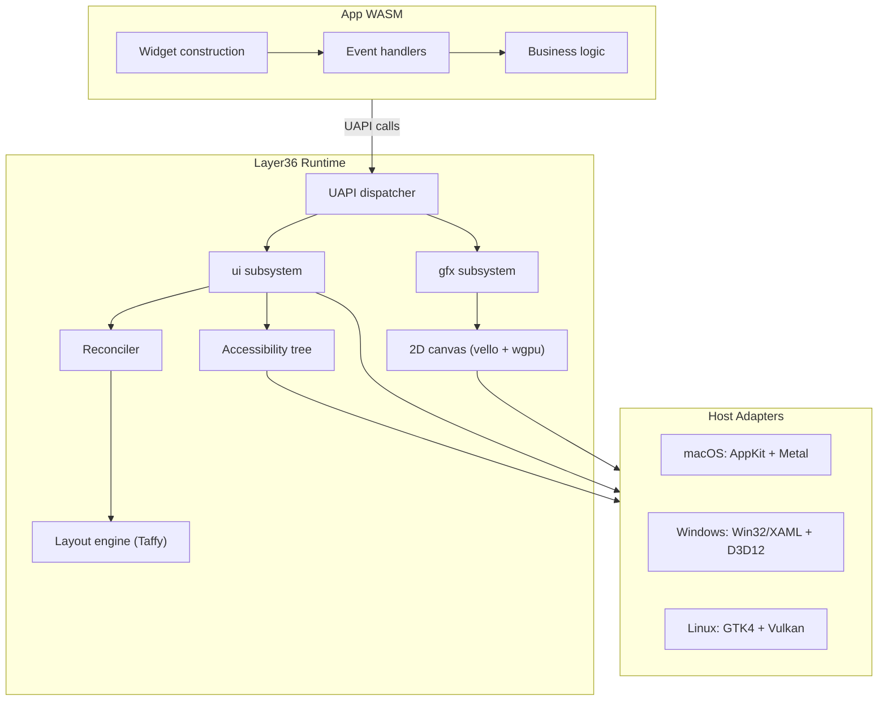
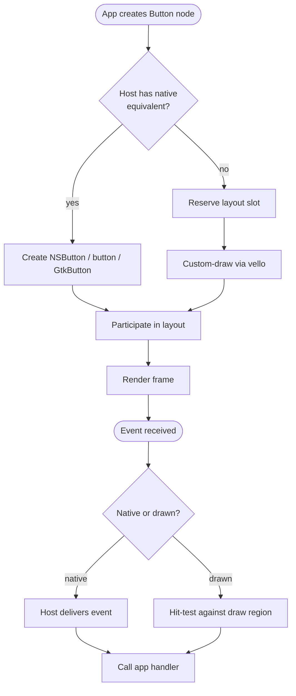
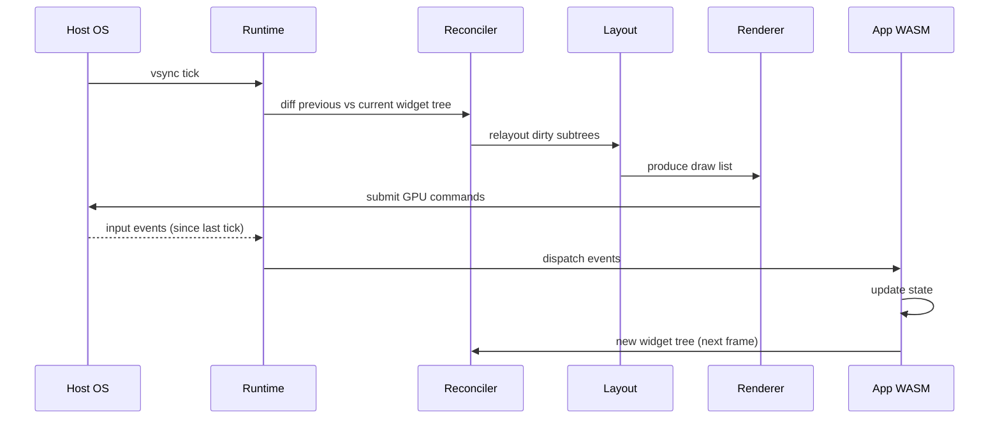
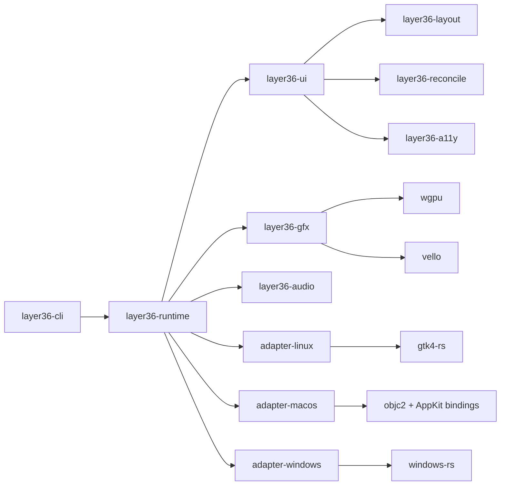
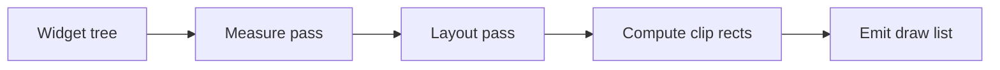
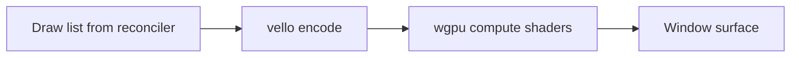
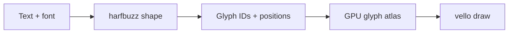
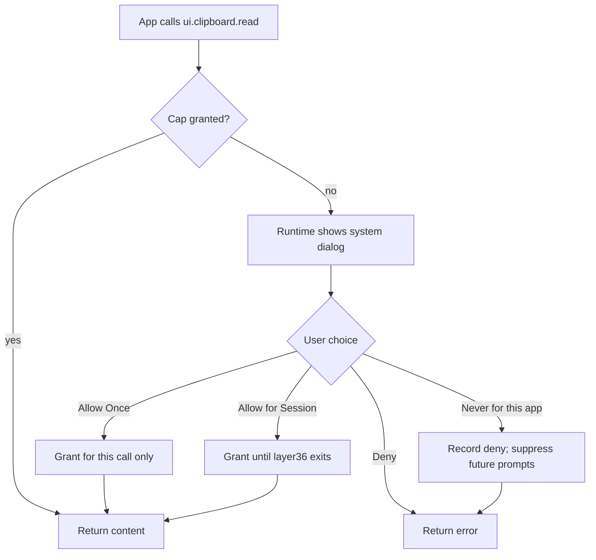

# Layer36 — Phase 3 Detailed Plan: UI + Graphics

> **Phase:** 3 of 8
> **Duration:** est. 6–10 weeks for the first desktop UI proof; later hardening depends on host findings.
> **Phase sentence:** *First GUI app running natively on Windows, macOS, and Linux.*
> **Prerequisite:** Phase 2 engineering proof green; final outside review and formal freeze still tracked separately.
> **Supersedes:** nothing.
> **Superseded by:** nothing.

---

## Table of Contents

0. [How to Use This Document](#0-how-to-use-this-document)
1. [Phase Objective](#1-phase-objective)
2. [Prerequisites from Phase 2](#2-prerequisites-from-phase-2)
3. [Success Criteria](#3-success-criteria)
4. [What Phase 3 Is and Is Not](#4-what-phase-3-is-and-is-not)
5. [The Core Design Question](#5-the-core-design-question)
6. [Architecture](#6-architecture)
7. [Technology Decisions](#7-technology-decisions)
8. [UAPI v0.2 Module Specifications](#8-uapi-v02-module-specifications)
9. [Widget Protocol Design](#9-widget-protocol-design)
10. [Layout Engine](#10-layout-engine)
11. [Rendering & 2D Canvas](#11-rendering--2d-canvas)
12. [3D GPU (WebGPU-Compatible Subset)](#12-3d-gpu-webgpu-compatible-subset)
13. [Input, Events, and Text](#13-input-events-and-text)
14. [Accessibility](#14-accessibility)
15. [Per-Host Adapters](#15-per-host-adapters)
16. [UCap v0.2 (System-UI Grants)](#16-ucap-v02-system-ui-grants)
17. [The `layer36-notes` Flagship Sample](#17-the-layer36-notes-flagship-sample)
18. [Week-by-Week Breakdown](#18-week-by-week-breakdown)
19. [Task Details](#19-task-details)
20. [Code Skeletons](#20-code-skeletons)
21. [Testing Strategy](#21-testing-strategy)
22. [Performance Targets](#22-performance-targets)
23. [Security & Threat Model v0.3](#23-security--threat-model-v03)
24. [Documentation Deliverables](#24-documentation-deliverables)
25. [Architecture Decision Records](#25-architecture-decision-records)
26. [Exit Criteria Checklist](#26-exit-criteria-checklist)
27. [Phase 3 Risks](#27-phase-3-risks)
28. [Handoff to Phase 4](#28-handoff-to-phase-4)
29. [Appendices](#29-appendices)

---

## 0. How to Use This Document

Phase 3 is the riskiest and most ambitious phase before v1.0. Every previous phase had clear prior art — Wasmtime for the runtime, WASI for the CLI UAPI. Phase 3 has no single prior art to copy from. The cross-platform native UI problem has been attempted many times; no previous attempt has been fully satisfactory. We are making a specific bet (§5) that is informed by those attempts but not a reprint of any of them.

- Read §5 (The Core Design Question) before any other section. Everything downstream is a consequence of that bet.
- The WIT in §8–§9 is this phase's most important artifact, in the same way Phase 2's WIT was its most important artifact.
- Tasks are listed in §19 with IDs matching Build Plan §7.4.
- If you find yourself asking "why not do it the Flutter way / Electron way / React Native way?" — §7.1 is where we answer that, in full.
- Phase 3 should not be rushed, but the estimate is now written as an estimate,
  not a fixed calendar promise. We will keep the first proof narrow.

---

## 1. Phase Objective

### 1.1 One-sentence objective

**A developer writes a note-taking app in Rust, Go, or TypeScript using UAPI v0.2, compiles to a `.wasm` component, and runs it via `layer36 run` on Windows, macOS, and Linux — where it opens a real window with native-feeling controls, handles keyboard/mouse/text input, persists files, renders 60 fps steady-state, and passes basic accessibility checks.**

### 1.2 Why this matters

Phase 2 proved the UAPI abstraction works for batch-style programs. Phase 3 proves it works for *interactive* programs — which is where the hard cross-platform problems live. Window management, text input (IME), accessibility trees, keyboard shortcuts, menu conventions, scroll physics, DPI scaling, color spaces: every single one differs between Windows, macOS, and Linux, and every single one has to feel correct to the user. Ship Phase 3 and the rest of Layer36 is largely implementation. Ship it wrong and Layer36 inherits "doesn't feel native" as a reputation that will take years to shake.

### 1.3 The six deliverables of Phase 3

1. **Three UI-related UAPI modules** — `ui`, `gfx`, `audio` — as frozen WIT v0.1.
2. **Widget protocol** that supports both native-backed widgets and custom-drawn fallbacks in one tree.
3. **Layout engine** (Taffy-based) with flexbox semantics.
4. **2D canvas** (vello on wgpu) and **3D GPU** (WebGPU-compatible subset via wgpu).
5. **`layer36-notes` flagship** — a small but real note-taking app that demonstrates the entire UI stack.
6. **UCap v0.2** — system-UI grant dialogs replacing terminal prompts for GUI apps.

---

## 2. Prerequisites from Phase 2

Before touching Phase 3 implementation code, verify:

- [ ] All Phase 2 exit criteria met (Phase 2 Plan §20).
- [ ] UAPI v0.1 frozen: `io`, `fs`, `net`, `time`, `locale` modules untouchable.
- [x] Three host adapters (Linux/macOS/Windows) green for the current CLI surface in hosted full CI evidence.
- [x] Three language tracks (Rust/Go/TS) tracked by sample or fixture evidence, with Go runtime parity still marked experimental where needed.
- [x] UCap v0.1 enforcing grants at UAPI boundary for the current Phase 2 surface.
- [x] Cross-host sample and evidence compare harness green in the hosted full CI proof.
- [x] `layer36-curl`, `layer36-cat`, `layer36-clock` covered by sample evidence.
- [ ] ADRs 0001 through 0012 merged.

Phase 3 is starting under a narrow waiver: WIT drafts and prototypes may begin
because the engineering proof is green, but Phase 2 is not formally closed until
the final outside review and freeze packet are recorded. Phase 3 work must not
change the Phase 2 UAPI.

---

## 3. Success Criteria

Phase 3 is **done** when, and only when, every row below is true.

| # | Criterion | Measured How |
|---|-----------|--------------|
| 1 | `ui`, `gfx`, `audio` WIT modules frozen at v0.1.0 | `wit/layer36/*.wit` |
| 2 | Each module implemented in Linux, macOS, Windows adapters | CI green on all hosts |
| 3 | `layer36-notes` runs on all three desktop OSes | Integration test |
| 4 | `layer36-notes` UI feels native on each host (not Electron-style) | Qualitative test, documented rubric |
| 5 | Steady-state frame time ≤ 16.7 ms on 2020+ hardware | Frame-time histogram |
| 6 | Cold start for GUI app < 300 ms to first paint | Timestamp diff |
| 7 | IME (CJK input) works on all three hosts | Manual test + automated event capture |
| 8 | Screen reader reads `layer36-notes` correctly on all three hosts | VoiceOver / Narrator / Orca |
| 9 | UCap v0.2: system-UI grant dialog fires for GUI apps | Manual walkthrough |
| 10 | 60 fps 10,000-node widget tree benchmark passes | Frame-time benchmark |
| 11 | DPI scaling: 100%, 125%, 150%, 200% all render correctly | Snapshot test |
| 12 | Dark mode: follows system preference, switches live | Manual + snapshot |
| 13 | Runtime binary size < 80 MB (up from 50 MB in Phase 2) | Artifact size |
| 14 | Per-app RSS < 120 MB for `layer36-notes` | Process monitor |
| 15 | ADRs 0013 through at least 0020 merged | Git log |

Rows 4, 7, 8 are the **hardest to measure and most likely to be skipped**. They have explicit sub-criteria in §26.

---

## 4. What Phase 3 Is and Is Not

### 4.1 Phase 3 IS

- Desktop GUI. Windows, buttons, text fields, lists, menus.
- Native-backed widgets (real `NSButton`, real `<button>`, real GTK button) wherever possible.
- Custom drawing for widgets the host doesn't have.
- Flexbox-style layout.
- 2D vector rendering via `vello`.
- 3D GPU via `wgpu` / WebGPU subset.
- Keyboard, mouse, text input, IME.
- Clipboard, drag-drop (basic).
- Menus, keyboard shortcuts, tooltips.
- Dark/light mode following system.
- DPI awareness.
- Accessibility tree integration.
- Local audio playback + microphone capture.
- System-UI grant dialogs (superset of Phase 2 terminal prompts).

### 4.2 Phase 3 is NOT

- Not mobile. iOS/Android is Phase 4.
- Not web/browser. A plausible WASM-in-browser host is Phase 5+.
- Not a design system or theme library. We ship unopinionated primitives; product designers paint on top.
- Not a game engine. The 3D API is WebGPU-compatible, not Vulkan/DX12/Metal-direct.
- Not VR/AR/XR. Someday, not this year.
- Not video codecs beyond what the OS provides by default.
- Not streaming media (no WebRTC). Deferred indefinitely.
- Not WASM-in-browser. Browsers ARE a host, but hosting WASM-in-browser is a Phase 5+ concern.
- Not inter-app IPC. Deferred to Phase 5.
- Not notifications, tray icons, or background services (partial: notifications get a minimal interface, deferred in earnest to Phase 4 when mobile forces it).

### 4.3 The discipline

Phase 3 is a tire-fire of temptations. "Can we also add tray icons? Themes? Plugins? A component library?" Every yes adds a week. The answer is "Phase N" — except for the rare case where the primitive in question is genuinely prerequisite to `layer36-notes` working. If you can build `layer36-notes` without it, defer it.

---

## 5. The Core Design Question

### 5.1 The question

When a developer's Layer36 app says "I want a button," what does that button actually become on the user's screen?

### 5.2 Four possible answers

Every cross-platform UI framework has picked one of these:

**Answer A — "Draw everything ourselves."**
*Who does it:* Flutter, Slint, Dear ImGui, most game UIs.
*Upside:* Pixel-identical across OSes. Full control. No host drift.
*Downside:* Nothing is truly native. No matter how good your drawing, the scroll physics, keyboard shortcuts, selection behavior, right-click menus, and animations will drift from what the user expects. Accessibility is reinvented from zero.

**Answer B — "Call the host's native UI directly."**
*Who does it:* Qt (partially), Avalonia (partially), AppKit-on-macOS bridges.
*Upside:* Actually native. Users feel at home.
*Downside:* Huge surface. Every widget-per-platform matrix cell must be implemented. API differences leak into your abstraction. Some widgets have no equivalent on some platforms.

**Answer C — "Embed a browser."**
*Who does it:* Electron, Tauri (webview), CEF.
*Upside:* Web developers feel at home. Vast component ecosystem.
*Downside:* Not native. Large binaries. Battery-hungry. Infinite surface area. "It's a web app" is the common user reaction.

**Answer D — "Native widget tree with custom-drawn fallback for what the host doesn't have."**
*Who does it:* Partial inspirations exist (SwiftUI's platform lowering, React Native's Fabric), but no full production example.
*Upside:* Native feel where native widgets exist; unified experience where they don't.
*Downside:* Two code paths. The hybrid boundary is where bugs live.

### 5.3 Our bet

**We pick D, with explicit rules for when to use which path.**

The widget protocol is abstract: `Stack`, `Button`, `Text`, `Input`, `List`, etc. Each widget has a priority order for its rendering:

1. If the host has a native widget that matches *semantically*, use it (a Button becomes `NSButton` / `<button>` / GtkButton).
2. Otherwise, custom-draw using vello on our 2D canvas.

The abstract layer is the same everywhere. The concrete rendering differs. Our job is to pick the set of abstract widgets carefully enough that native versions exist on most hosts.

### 5.4 Why D despite its cost

- Electron's "doesn't feel native" is a decade-long developer complaint. It is not solvable within Answer C.
- Flutter's drift is subtle but accumulates. On macOS especially, Flutter apps always feel *slightly* off — scrollbar behavior, menu bar semantics, window chrome.
- Answer B is too expensive for a small team and too rigid for the long tail of custom widgets apps will need.
- Answer D accepts complexity at the framework layer to give users nativeness they can feel. This is the right trade for a platform intended to outlive individual app genres.

### 5.5 Consequence: the widget taxonomy rule

Every widget we add to the protocol must pass the **"native three of five"** test: at least three of { Windows, macOS, Linux, iOS, Android } have a native control that can render it. If fewer, we draw it ourselves and document why.

This rule keeps the protocol honest. It is checked in ADR review and in the WIT style guide.

### 5.6 Recorded in

ADR-0013 contains this full reasoning. It is the foundational architectural decision for Phase 3 and must be written in Week 1 before any implementation work.

---

## 6. Architecture

### 6.1 System overview at end of Phase 3



### 6.2 The "abstract widget → native-or-drawn" flow



### 6.3 Frame loop



### 6.4 Crate layout at end of Phase 3



### 6.5 Trust boundaries update

Same as Phase 2 plus:

- Clipboard content crossing WASM boundary is cap-gated.
- Drag-drop from outside the app is a system event that can only land with `ui.dropzone:*` cap.
- GPU shaders compiled from WASM-supplied source (in `gfx`) run in the host's GPU driver — a real attack surface, audited via WGSL validator.

---

## 7. Technology Decisions

### 7.1 The full "Answer D" rationale

See §5. Recorded in ADR-0013. Frozen.

### 7.2 Windowing: **`winit` under the hood on Linux and Windows, native on macOS**

- `winit` is the Rust ecosystem's cross-platform window/event crate.
- Excellent on X11, Wayland, Win32.
- macOS support works but is less idiomatic than talking to AppKit directly, and macOS users notice.
- **Decision:** use `winit` on Linux and Windows; use our own AppKit bridge on macOS. Shared `WindowAdapter` trait unifies.
- **Recorded:** ADR-0014.

### 7.3 Native widget bindings

| Host | Library | Notes |
|---|---|---|
| macOS | `objc2` + `objc2-app-kit` | Modern, maintained Rust Objective-C bridge |
| Windows | `windows-rs` + optional `webview2` for edge cases | First-party Microsoft crate |
| Linux | `gtk4-rs` | De facto Rust GTK binding |

### 7.4 Layout: **Taffy**

- Rust-native flexbox layout engine.
- Used in production by Zed, Bevy, Dioxus.
- Fast (< 1 ms for 1000-node trees).
- **Recorded:** ADR-0015.

### 7.5 2D rendering: **vello on wgpu**

- Linebender's `vello`: compute-shader-based 2D vector renderer.
- Produces GPU-accelerated path rendering with quality matching CPU rasterizers.
- Targets Metal, Vulkan, D3D12 via `wgpu`.
- **Recorded:** ADR-0016.

### 7.6 3D: **wgpu / WebGPU subset**

- Expose a WebGPU-compatible subset in `layer36:gfx/3d`.
- Shader language: **WGSL** (WebGPU Shading Language) only.
- No raw Vulkan / D3D12 / Metal API exposed to apps.
- **Recorded:** ADR-0017.

### 7.7 Text rendering & IME

- Text shaping: **`harfbuzz`** via `harfbuzz_rs`.
- Font selection: **`fontique`** (from Linebender).
- System font enumeration: per-host adapter.
- IME: per-host — `NSTextInputClient` on macOS, TSF on Windows, IBus/fcitx on Linux.
- **Recorded:** ADR-0018.

### 7.8 Accessibility

- Cross-platform tree: **`accesskit`** (Rust a11y protocol).
- Per-host: UIAutomation (Windows), NSAccessibility (macOS), AT-SPI (Linux).
- Screen readers target accesskit output.
- **Recorded:** ADR-0019.

### 7.9 Audio

- Playback / capture: **`cpal`** (cross-platform audio).
- Mixing: simple floating-point mixer in `layer36-audio`.
- Decoder: **`symphonia`** for MP3/AAC/OGG/FLAC.
- No MIDI, no DAW features in v0.1.
- **Recorded:** ADR-0020.

### 7.10 Reactive / reconciliation model

- Retained-mode tree with diffing.
- App rebuilds a tree per frame (if desired) or emits mutations.
- Diff against previous tree → minimal native + drawn updates.
- Inspiration: Xilem, React Fiber, SwiftUI view identity.

### 7.11 What we considered and rejected

| Option | Rejected because |
|---|---|
| Qt | C++; licensing; huge surface to bind; not Rust-native. |
| wxWidgets | Dated API model; native-widget-only (our Answer B). |
| Iced | Pure custom-draw (our Answer A); drift risk too high. |
| egui | Immediate-mode; unsuitable for rich apps; no a11y. |
| Dioxus | JS-like but custom-draw underneath; same issue as Flutter. |
| WebView2 / WKWebView | Answer C; we explicitly rejected. |

### 7.12 What we DEFER

| Feature | Deferred to |
|---|---|
| Mobile-specific UI (touch gestures, sheet presentations, haptics) | Phase 4 |
| Cross-app IPC | Phase 5 |
| System tray icons / menu bar extras | Phase 5 |
| Complex media (video playback, WebRTC) | Phase 5+ |
| Plugin/extension API | Post-v1.0 |
| Theme engine / design tokens | Post-v1.0 |
| Animation timeline beyond CSS-transitions-level | Phase 5 |
| Printing | Phase 5 |
| Tray icons, file pickers backed by system UI | Phase 5 (file picker minimal in Phase 3 if needed) |

---

## 8. UAPI v0.2 Module Specifications

Phase 3 ships three new modules under `layer36:` package. All three are versioned `@0.1.0` at module level (first release). They do not affect Phase 2's `@0.1.0` modules.

### 8.1 `layer36:ui@0.1.0`

The widget protocol and windowing. Presented in full in §9. Here is the top-level structure:

```wit
// wit/layer36/ui.wit
package layer36:ui@0.1.0;

interface types {
    // see §9.1 and §9.2 for widget node enum, event types
}

interface window {
    use types.{window-config, window-id};
    create: func(cfg: window-config) -> result<window-id, ui-error>;
    close: func(id: window-id);
    set-title: func(id: window-id, title: string);
    // ...
}

interface tree {
    use types.{widget-node, widget-id};
    // Submit a full tree or a diff.
    submit: func(root: widget-node);
    mutate: func(ops: list<mutation>);
}

interface events {
    use types.{input-event};
    poll: func() -> option<input-event>;
    wait: func() -> input-event;
}

interface dialog {
    // System-provided dialogs for common needs
    open-file: func(cfg: file-dialog-config) -> result<list<string>, dialog-error>;
    save-file: func(cfg: file-dialog-config) -> result<string, dialog-error>;
    message: func(cfg: message-config);
}

interface clipboard {
    read-text:  func() -> result<string, ui-error>;
    write-text: func(text: string) -> result<_, ui-error>;
}

interface menu {
    set-app-menu: func(root: menu-node);
    set-window-menu: func(id: window-id, root: menu-node);
}

world consumer {
    import window;
    import tree;
    import events;
    import dialog;
    import clipboard;
    import menu;
}
```

### 8.2 `layer36:gfx@0.1.0`

2D canvas + 3D GPU (WebGPU-compatible subset).

```wit
// wit/layer36/gfx.wit
package layer36:gfx@0.1.0;

interface canvas2d {
    use types.{color, rect, path, paint, gfx-error};

    resource canvas {
        fill-rect: func(r: rect, p: paint);
        stroke-rect: func(r: rect, p: paint, width: f32);
        fill-path: func(p: path, pt: paint);
        stroke-path: func(p: path, pt: paint, width: f32);
        draw-text: func(text: string, x: f32, y: f32, p: paint, font: font-spec);
        draw-image: func(img: image-handle, dst: rect);
        save: func();
        restore: func();
        translate: func(dx: f32, dy: f32);
        scale: func(sx: f32, sy: f32);
        rotate: func(radians: f32);
        clip-rect: func(r: rect);
    }
}

interface gpu3d {
    // WebGPU-compatible subset. WGSL shaders only.
    use types.{device, queue, shader-module, pipeline, buffer, texture, gpu-error};

    request-device: func() -> result<device, gpu-error>;
    // ... create-shader-module, create-pipeline, submit, etc.
}

world consumer {
    import canvas2d;
    import gpu3d;
}
```

### 8.3 `layer36:audio@0.1.0`

Local playback + capture. Intentionally minimal; richer audio work is Phase 5+.

```wit
// wit/layer36/audio.wit
package layer36:audio@0.1.0;

interface playback {
    use types.{audio-buffer, playback-error};

    resource player {
        set-source: func(buf: audio-buffer) -> result<_, playback-error>;
        play: func();
        pause: func();
        stop: func();
        set-volume: func(v: f32);   // 0.0..1.0
        position-millis: func() -> u64;
    }

    create-player: func() -> result<player, playback-error>;
}

interface capture {
    use types.{capture-config, sample, capture-error};

    resource recorder {
        start: func() -> result<_, capture-error>;
        stop: func();
        read: func(n: u32) -> result<list<sample>, capture-error>;
    }

    create-recorder: func(cfg: capture-config) -> result<recorder, capture-error>;
}

world consumer {
    import playback;
    import capture;
}
```

### 8.4 Updated consolidated `world`

```wit
// wit/layer36/app.wit
package layer36:app@0.2.0;

world gui {
    // Phase 2 modules
    import layer36:io/stdio@0.1.0;
    import layer36:io/log@0.1.0;
    import layer36:fs/files@0.1.0;
    import layer36:net/http-client@0.1.0;
    import layer36:time/clock@0.1.0;
    import layer36:time/sleep@0.1.0;
    import layer36:locale/info@0.1.0;
    import layer36:locale/format@0.1.0;

    // Phase 3 modules
    import layer36:ui/window@0.1.0;
    import layer36:ui/tree@0.1.0;
    import layer36:ui/events@0.1.0;
    import layer36:ui/dialog@0.1.0;
    import layer36:ui/clipboard@0.1.0;
    import layer36:ui/menu@0.1.0;
    import layer36:gfx/canvas2d@0.1.0;
    import layer36:gfx/gpu3d@0.1.0;
    import layer36:audio/playback@0.1.0;
    import layer36:audio/capture@0.1.0;

    export run: func() -> s32;
}
```

Phase 2's `world cli` remains unchanged — GUI-less CLIs continue to work.

---

## 9. Widget Protocol Design

The core problem of Phase 3: what is the abstract widget tree that both "use native" and "draw ourselves" can render?

### 9.1 The v0.1 widget set

Fifteen widgets pass the "native three of five" test (§5.5). Others are custom-drawn.

**Containers:**
- `Stack` (vertical/horizontal layout box)
- `Grid` (2D grid layout)
- `Scroll` (scrollable viewport)
- `TabPanel`

**Controls:**
- `Button`
- `Checkbox`
- `Radio` (in `RadioGroup`)
- `Switch` (iOS-style toggle)
- `Slider`
- `ProgressBar`

**Text:**
- `Text` (read-only label)
- `TextField` (single-line input)
- `TextArea` (multi-line input)

**Collections:**
- `List` (virtualized vertical list)
- `Tree`

**Media:**
- `Image`

**Fallback (always custom-drawn):**
- `Canvas` — raw drawing surface; apps draw whatever they want via `gfx::canvas2d`.

### 9.2 Widget node WIT

```wit
// within wit/layer36/ui.wit, in interface types

variant widget-node {
    stack(stack-props),
    grid(grid-props),
    scroll(scroll-props),
    tabs(tabs-props),
    button(button-props),
    checkbox(checkbox-props),
    radio(radio-props),
    switch(switch-props),
    slider(slider-props),
    progress(progress-props),
    text(text-props),
    text-field(text-field-props),
    text-area(text-area-props),
    list(list-props),
    tree(tree-props),
    image(image-props),
    canvas(canvas-props),
}

record stack-props {
    id: widget-id,
    direction: direction,
    children: list<widget-node>,
    spacing: f32,
    padding: edge-insets,
    alignment: alignment,
    style: style-props,
}

record button-props {
    id: widget-id,
    label: string,
    disabled: bool,
    style: style-props,
    // click events come through events.wait / events.poll
}

record text-field-props {
    id: widget-id,
    value: string,
    placeholder: string,
    password: bool,
    disabled: bool,
    max-length: option<u32>,
    style: style-props,
}

// ... one record per widget
```

### 9.3 Why submit a full tree, not a retained handle model

Developer experience: building a tree per frame is the mental model React, SwiftUI, Jetpack Compose, and Elm all popularized. It scales from small apps to large.

Implementation: the runtime diffs against the previous tree and emits minimal host/draw mutations. The reconciler is the one piece of code that has to be efficient.

### 9.4 Event plumbing

Events do NOT travel through the tree submission. They come through `events.poll()` / `events.wait()`:

```wit
variant input-event {
    window-closed(window-id),
    window-resized(window-id, u32, u32),
    window-focused(window-id, bool),
    key-down(window-id, key-event),
    key-up(window-id, key-event),
    text-input(window-id, string),
    ime-composition(window-id, ime-event),
    pointer-down(window-id, pointer-event),
    pointer-up(window-id, pointer-event),
    pointer-move(window-id, pointer-event),
    wheel(window-id, wheel-event),
    button-click(widget-id),
    checkbox-toggle(widget-id, bool),
    text-field-change(widget-id, string),
    list-select(widget-id, list<u32>),
    focus-change(widget-id),
    clipboard-paste(window-id),
    drop(window-id, drop-event),
    theme-change(theme),
    scale-change(f32),
}
```

Apps typically run:

```
loop {
    tree = build_tree(state)
    ui::tree::submit(tree)
    ev = ui::events::wait()
    state = handle_event(state, ev)
}
```

### 9.5 Style props v0.1

Minimum surface — resist adding more:

```wit
record style-props {
    background: option<color>,
    foreground: option<color>,
    border: option<border-spec>,
    corner-radius: option<f32>,
    font: option<font-spec>,
    padding: option<edge-insets>,
    // No margin — use Stack spacing.
    // No animation props — v0.1 is static.
}
```

Everything else is left to host defaults. Apps that want heavy styling use `Canvas`.

### 9.6 Widget identity & the reconciler

Each widget carries a `widget-id` that is stable across frames. Identity rules:

1. Apps MUST use stable IDs. The reconciler does not attempt content-based diffing; it uses ID-based match.
2. ID collision is a runtime error, logged as a warning in dev builds.
3. IDs are opaque `u64`; developers use binding helpers (`layer36::ui::id("save-button")`) to derive them.

### 9.7 Hit testing and event routing

- Native widgets: host handles hit-testing.
- Drawn widgets and `Canvas`: runtime hit-tests against the draw region using the layout bounds.
- For `Canvas`, apps set an optional "opaque regions" list — rectangles that capture events they drew into.

---

## 10. Layout Engine

### 10.1 Choice recap

Taffy (ADR-0015). Flexbox-compatible.

### 10.2 Layout model

- Every widget node becomes a Taffy node.
- Styles translate to Taffy's flex properties.
- Layout runs on the reconciler thread, not the WASM thread.
- Result: per-widget computed rect in parent coordinates.

### 10.3 Layout passes



### 10.4 Performance budget

- 10,000-node tree, full relayout: < 4 ms on 2020+ hardware.
- Incremental relayout (dirty subtree): < 500 µs.
- Budget is hard: exceeding blocks Phase 3 exit.

### 10.5 DPI and scale

- Layout units are logical pixels.
- A per-window scale factor is applied at render time.
- 1.0 = 96 DPI equivalent. 2.0 = Retina. 1.5 = Windows 150%.
- Scale changes fire `scale-change` events; apps may choose to re-layout (usually unnecessary — rendering handles it).

---

## 11. Rendering & 2D Canvas

### 11.1 The vello pipeline



### 11.2 Draw list

For each frame the runtime produces a draw list containing:
- Fill/stroke rects
- Paths
- Glyph runs (shaped by harfbuzz)
- Images
- Clip regions

The draw list is encoded into vello's format and dispatched to GPU.

### 11.3 Glyph pipeline



Glyph atlas is cached per font + size + DPI triple.

### 11.4 Color pipeline

- Internal color space: **linear sRGB**.
- Inputs from apps: **sRGB** (`color { r: 0..255, g: 0..255, b: 0..255, a: 0..255 }`).
- Conversion on ingress, rendering in linear, conversion at swapchain.
- Per-platform wide-gamut (Display P3 on macOS) is a v0.2 of `gfx`.

### 11.5 Custom-drawn widgets

For widgets the host doesn't render natively:
1. Layout produces a rect.
2. Runtime draws the widget using vello primitives matching the host's look.
3. Host-themed tokens (button fill, hover, focus ring) come from a per-host "theme pack" baked into the adapter.

This keeps drawn widgets visually closest to native without installing a full theme engine.

### 11.6 Offscreen canvases

Apps using `Canvas` widget get a `canvas` resource they draw to. Drawing is GPU-accelerated. Apps can also render to offscreen canvases for image export (`image-handle` consumable by other widgets).

---

## 12. 3D GPU (WebGPU-Compatible Subset)

### 12.1 Why WebGPU shape

- Cross-platform abstraction exists: wgpu.
- Developers targeting WebGPU in the browser can reuse most knowledge.
- WGSL is portable, validated, shader-safe.

### 12.2 What we expose

| WebGPU Feature | v0.1 Status |
|---|---|
| Device + queue | yes |
| Shader modules (WGSL) | yes |
| Render pipeline (vertex + fragment) | yes |
| Compute pipeline | yes |
| Buffers | yes |
| Textures (2D) | yes |
| Textures (3D, cube, array) | v0.2 |
| Samplers | yes |
| Bind groups | yes |
| Render passes | yes |
| Compute passes | yes |
| Mipmap generation | via compute shader |
| Timestamp queries | v0.2 |
| External surfaces (video frames) | no |
| Ray tracing | no |

### 12.3 Security

- WGSL is validated by wgpu's validator before compilation.
- Buffer bindings are type-checked.
- No raw SPIR-V / DXIL / MSL is exposed — developers can't side-step WGSL.
- GPU driver bugs remain a theoretical concern — the ecosystem-wide problem, not Layer36-specific.

### 12.4 Scope discipline

`layer36-notes` uses 2D only. The 3D surface exists to prove it *can* be done by Phase 3 exit and to unblock game-adjacent experiments. We do not ship 3D samples this phase.

---

## 13. Input, Events, and Text

### 13.1 Keyboard

- Physical key events + text events separate (standard model).
- Modifier state included.
- Per-OS key codes normalized to a common enum.
- Shortcuts (`Ctrl+S`, `Cmd+S`) dispatched as `key-down` events — apps interpret.

### 13.2 Mouse / pointer

- Unified pointer model (mouse / touchpad / pen).
- Pressure and tilt exposed where available (stylus).
- Hover events.
- Right-click / middle-click.
- Drag state tracked by runtime; apps receive start/move/end.

### 13.3 IME (Input Method Editor)

The single hardest input surface. Handling:

- Pre-edit (composition) text flows through `ime-composition` events.
- Apps are expected to render pre-edit text with system-style underline.
- Commit events deliver final text as `text-input`.
- Per-host:
  - macOS: `NSTextInputClient` protocol.
  - Windows: TSF (Text Services Framework).
  - Linux: IBus + fcitx support via virtual protocols.

Manual CJK testing on all three hosts is a hard exit criterion.

### 13.4 Text selection

- For native text fields, host handles selection.
- For drawn text (rare — `Canvas` mostly), app implements selection; runtime provides utilities.
- Copy/paste routed through `ui::clipboard`.

### 13.5 Focus

- Focus ring follows system convention.
- Tab order is widget-tree order unless app overrides via `focus-hint`.

---

## 14. Accessibility

### 14.1 Why first-class

Accessibility added late is accessibility never. We bake it in at Phase 3 or we spend years retrofitting.

### 14.2 Architecture

- `accesskit` builds a cross-platform accessibility tree.
- Each widget registers its a11y role, label, and state.
- Per-host adapters translate accesskit nodes to UIAutomation / NSAccessibility / AT-SPI.

### 14.3 v0.1 coverage

For each widget in §9.1, define:
- Role (button, text field, list item, etc.)
- Accessible label
- Value (if applicable)
- State (disabled, focused, checked)
- Relationship (label-for, described-by)

### 14.4 Reduced-motion, high-contrast, large-text

- System preferences queried via `layer36:ui/preferences` (sub-interface to add in Phase 3 or 4; Phase 3 adds minimum).
- Runtime honours `prefers-reduced-motion` by suppressing animation.
- Apps query user preferences directly; runtime does not force.

### 14.5 Screen reader testing is mandatory

Every exit criterion run on:
- VoiceOver (macOS)
- Narrator (Windows)
- Orca (Linux)

Pass = screen reader announces all widgets correctly and can navigate the tree.

---

## 15. Per-Host Adapters

### 15.1 Linux

- Windowing: `winit`.
- Native widgets: `gtk4-rs`.
- Canvas backend: `wgpu` on Vulkan.
- Audio: `cpal` on PipeWire or PulseAudio.
- Text: harfbuzz.
- A11y: AT-SPI via accesskit-atspi.
- IME: IBus protocol via `winit` callbacks + custom bridge.

Known pain:
- Wayland vs X11 behavior differences.
- Font configuration varies by distro.
- GTK theme mismatch if distro doesn't match.

### 15.2 macOS

- Windowing: custom AppKit bridge via `objc2`.
- Native widgets: `NSButton`, `NSTextField`, `NSTableView`, etc.
- Canvas backend: `wgpu` on Metal.
- Audio: `cpal` on CoreAudio.
- Text: Core Text for shaping OR harfbuzz (we use harfbuzz for cross-host consistency).
- A11y: NSAccessibility via accesskit-mac.
- IME: NSTextInputClient.

Known pain:
- Menu bar semantics (macOS uses app-wide menu bar; other OSes use per-window).
- Window chrome conventions (traffic lights, full-screen behavior).
- Retina / non-Retina DPI handling.

### 15.3 Windows

- Windowing: `winit` with optional Win32 native for menus.
- Native widgets: Win32 common controls + XAML Islands where available.
- Canvas backend: `wgpu` on D3D12.
- Audio: `cpal` on WASAPI.
- Text: harfbuzz.
- A11y: UIAutomation via accesskit-windows.
- IME: TSF.

Known pain:
- HiDPI multi-monitor scale transitions.
- Touch vs precision pointer discrimination.
- XAML Islands support varies by Windows version.

### 15.4 Shared adapter trait

```rust
pub trait UiAdapter: Send + Sync {
    fn create_window(&self, cfg: WindowConfig) -> Result<WindowId, UiError>;
    fn close_window(&self, id: WindowId);
    fn create_widget(&self, id: WidgetId, node: &WidgetNode) -> WidgetHandle;
    fn update_widget(&self, handle: &WidgetHandle, node: &WidgetNode);
    fn destroy_widget(&self, handle: WidgetHandle);
    fn draw_custom(&self, handle: &WidgetHandle, draw_list: &DrawList);
    fn poll_event(&self) -> Option<InputEvent>;
    // ...
}
```

Identical trait across hosts; implementations differ entirely.

---

## 16. UCap v0.2 (System-UI Grants)

### 16.1 What changes

- Grant prompts now use system dialogs (not terminal).
- For sensitive caps (camera, microphone, screen recording, location), use OS-native prompts (macOS TCC, Windows privacy prompts) in addition to our own.
- Session grants persist to **in-memory** store — not disk (disk is Phase 6).

### 16.2 New capability strings added in Phase 3

```
ui.window:create
ui.clipboard:read
ui.clipboard:write
ui.menu:system
ui.dropzone:<mime-type>
ui.dialog:file-open
ui.dialog:file-save
gfx.gpu:basic         # 2D canvas + basic 3D
gfx.gpu:compute       # compute shaders
audio.playback
audio.capture
```

### 16.3 Default grants for Phase 3

Expanded auto-grant list:
- `ui.window:create`
- `ui.dialog:*`
- `gfx.gpu:basic`

Not auto-granted (prompt required):
- `ui.clipboard:*`
- `ui.dropzone:*`
- `gfx.gpu:compute`
- `audio.playback` (auto-grant on GUI apps; reconsider if abused)
- `audio.capture` (always prompt; double-confirm at OS level)

### 16.4 System prompt UX



### 16.5 App-triggered prompts

Apps cannot summon grant dialogs at will. They can only trigger them by calling the UAPI that needs the cap. This prevents nagware patterns.

---

## 17. The `layer36-notes` Flagship Sample

### 17.1 Why build a flagship

A flagship app is the project's best argument. If `layer36-notes` feels good, developers believe the platform. If it feels weird, no amount of documentation convinces them.

### 17.2 Scope

A minimal note-taking app:
- Sidebar: list of notes with titles and preview text.
- Main area: editor for the selected note.
- Top bar: app menu (File/Edit/View).
- Saves to `~/Documents/Layer36Notes/` (requires `fs.write` cap).
- Searchable by title.
- Keyboard shortcuts (`Cmd/Ctrl+N` new, `Cmd/Ctrl+S` save, `Cmd/Ctrl+F` find).
- Dark mode follows system.
- DPI-aware.
- Screen-reader-navigable.

Out of scope: rich-text, attachments, sync, encryption, export — all Phase N.

### 17.3 Language

Rust. First-class for the flagship; we eat our own canonical bindings.

### 17.4 LOC target

< 2,000 lines including all files. If the flagship balloons past this, the UAPI is too granular — fix the UAPI, not the app.

### 17.5 What the flagship proves

- Widget tree submission / reconciliation works.
- Native widgets render natively on all three hosts.
- Layout is correct across DPI scales.
- IME works in the note editor.
- Keyboard shortcuts route correctly.
- Dark mode switches live.
- Screen readers navigate correctly.
- UCap grant flow fires on first launch.
- Save/load works via `layer36:fs`.
- 60 fps in typical editing sessions.

If all ten boxes check, Phase 3 shipped.

---

## 18. Week-by-Week Breakdown

Sized for 16 weeks calendar, ~60–80 engineering days of active work. A full-time engineer compresses to 10–12 weeks; a founder splitting time with ParkSure uses the full 16.

### Weeks 1–2: Foundational decisions + WIT draft

- Write ADR-0013 (Answer D), ADR-0014 (winit + AppKit split), ADR-0015 (Taffy), ADR-0016 (vello), ADR-0017 (WebGPU subset), ADR-0018 (harfbuzz + IME), ADR-0019 (accesskit), ADR-0020 (cpal).
- Draft `ui.wit`, `gfx.wit`, `audio.wit`.
- Internal review; iterate.

### Weeks 3–4: Window + event loop

- Windowing trait + per-host implementations.
- Basic event loop: open window, receive close event, close.
- Smoke test: `layer36 run blank-window.wasm` opens a blank window on all three hosts.

### Weeks 5–6: Widget tree + reconciler

- Widget node WIT finalized.
- Reconciler: diff tree, emit mutations.
- Native widget creation for Button, Text, Stack (macOS first, for momentum).

### Weeks 7–8: Layout + more widgets

- Taffy integration.
- Remaining widgets: Checkbox, Radio, Switch, Slider, TextField, TextArea, List, Grid, Scroll, Image, Canvas.
- Windows + Linux widget parity with macOS.

### Weeks 9–10: 2D canvas + rendering

- vello integration.
- wgpu surface setup per host.
- Custom-drawn widget fallback path.
- Glyph pipeline + font enumeration.

### Week 11: Input + text

- Keyboard, mouse, pointer normalization.
- Text input + IME per host.
- CJK manual testing.

### Week 12: Accessibility

- accesskit integration.
- Per-host a11y tree.
- Screen reader validation on each host.

### Week 13: 3D GPU (minimal)

- `gpu3d` interface implementation.
- Small test: clear a texture to red from a WASM app.
- Enough to unblock future games/visualizations, not a full demo.

### Week 14: Audio + dialog + clipboard + menus

- `cpal` playback + capture.
- System dialogs (file open/save, message).
- Clipboard read/write.
- App + window menus.

### Week 15: `layer36-notes`

- Build the flagship.
- This is where the UAPI gets stress-tested. Expect gaps — each gap is a lesson, not a failure.

### Week 16: Hardening + exit

- DPI scaling testing (100/125/150/200%).
- Dark/light mode switching.
- Performance tuning to hit §22 targets.
- Exit criteria walkthrough (§26).
- Retrospective.
- Phase 4 kickoff plan.

---

## 19. Task Details

Matches Build Plan §7.4 task IDs.

### P3-UI-01 — Widget protocol design RFC

**Estimate:** 3 days.
**Branch:** `p3-ui-01-widget-rfc`.
**Acceptance:**
- RFC in `docs/rfc/0003-widget-protocol.md`.
- Reviewed by at least one external engineer with UI background.
- §9 of this doc as starting point.
- Merged into `docs/adr/` as ADR-0013 + ADR-0014 where decisions are final.

### P3-UI-02 — `wit/layer36/ui.wit`

**Estimate:** 2 days.
**Branch:** `p3-ui-02-ui-wit`.
**Acceptance:**
- File complete, matching §8.1 + §9.2.
- Parses via `wasm-tools component wit`.
- Style guide updated if patterns diverge from Phase 2.

### P3-UI-03 — Layout engine (Taffy integration)

**Estimate:** 3 days.
**Branch:** `p3-ui-03-layout`.
**Acceptance:**
- `crates/layout/` wraps Taffy with WIT types.
- Unit tests: 100 layouts of varying tree shapes.
- Benchmark: 10k-node layout < 4 ms.

### P3-UI-04 — Window + event loop abstractions

**Estimate:** 3 days.
**Branch:** `p3-ui-04-window`.
**Acceptance:**
- `WindowAdapter` trait in `crates/adapter-common/`.
- Implementations started on all three hosts.
- Blank-window smoke test green.

### P3-UI-05 — macOS widget bridge

**Estimate:** 5 days.
**Branch:** `p3-ui-05-macos-widgets`.
**Acceptance:**
- `NSButton`, `NSTextField`, `NSTableView`, `NSStackView`, etc. for each Phase 3 widget.
- Drawn-fallback path working.
- Manual test: build a 3-widget screen, interact, observe native behavior.

### P3-UI-06 — Windows widget bridge

**Estimate:** 5 days.
**Branch:** `p3-ui-06-windows-widgets`.
**Acceptance:**
- Same widget set rendered via Win32 common controls / XAML Islands.
- Drawn-fallback path working.
- Manual test on Windows 11.

### P3-UI-07 — Linux widget bridge

**Estimate:** 5 days.
**Branch:** `p3-ui-07-linux-widgets`.
**Acceptance:**
- Same widget set rendered via `gtk4-rs`.
- Drawn-fallback path working.
- Manual test on Ubuntu 22.04 + Fedora.

### P3-GFX-01 — `wit/layer36/gfx.wit`

**Estimate:** 2 days.
**Branch:** `p3-gfx-01-wit`.
**Acceptance:**
- File matches §8.2.
- Paths for 2D + 3D documented.

### P3-GFX-02 — wgpu integration

**Estimate:** 3 days.
**Branch:** `p3-gfx-02-wgpu`.
**Acceptance:**
- Device creation across Metal / D3D12 / Vulkan.
- Surface acquisition per window.
- Smoke test: clear surface to red.

### P3-GFX-03 — 2D canvas via vello

**Estimate:** 5 days.
**Branch:** `p3-gfx-03-vello`.
**Acceptance:**
- `canvas2d` interface implemented.
- Draws rects, paths, text, images.
- Smoke test: paint a gradient + text + circle, compare across hosts.

### P3-GFX-04 — 3D API subset

**Estimate:** 5 days.
**Branch:** `p3-gfx-04-gpu3d`.
**Acceptance:**
- Device, queue, shader module, pipeline, buffer, texture resources.
- WGSL validation.
- Smoke test: triangle rendered from WASM app.

### P3-INPUT-01 — Keyboard + mouse input

**Estimate:** 2 days.
**Branch:** `p3-input-01-kbmouse`.
**Acceptance:**
- Normalized keyboard events per host.
- Pointer events with pressure/tilt where available.
- Unit tests for key code mapping tables.

### P3-INPUT-02 — Text input + IME

**Estimate:** 3 days.
**Branch:** `p3-input-02-ime`.
**Acceptance:**
- Pre-edit + commit events routed per host.
- CJK manual test pass on all three hosts.
- Test plan in `docs/book/src/phase3/ime-testing.md`.

### P3-APP-01 — `layer36-notes`

**Estimate:** 5 days.
**Branch:** `p3-app-01-notes`.
**Acceptance:**
- App in `apps/layer36-notes/` (Rust).
- Implements scope per §17.2.
- Runs on all three hosts in CI.

### P3-A11Y-01 — Screen reader integration

**Estimate:** 5 days.
**Branch:** `p3-a11y-01-accesskit`.
**Acceptance:**
- accesskit tree built from widget tree.
- Per-host bridges into UIAutomation / NSAccessibility / AT-SPI.
- `layer36-notes` reads correctly on all three screen readers.

### P3-TEST-01 — UI snapshot testing

**Estimate:** 3 days.
**Branch:** `p3-test-01-snapshots`.
**Acceptance:**
- Snapshot harness that renders a widget tree and compares against a reference image.
- Threshold-based diff (1% pixel variance tolerated).
- Snapshots per host stored under `test/snapshots/{linux,macos,windows}/`.

### P3-PERF-01 — Frame budget dashboard

**Estimate:** 2 days.
**Branch:** `p3-perf-01-dashboard`.
**Acceptance:**
- Frame-time histogram per sample app.
- CI publishes to `docs/book/src/phase3/perf/`.
- Regression check: > 10% frame-time increase fails PR.

### P3-DOC-01 — "Build a GUI app" tutorial

**Estimate:** 3 days.
**Branch:** `p3-doc-01-tutorial`.
**Acceptance:**
- Step-by-step in `docs/book/src/tutorial/build-gui.md`.
- Ends with a working mini-app (smaller than `layer36-notes`).
- External reader test: < 45 min to working app.

---

## 20. Code Skeletons

### 20.1 Widget node in Rust bindings

```rust
// crates/bindings-rust/src/ui.rs

pub enum Widget {
    Stack {
        id: WidgetId,
        direction: Direction,
        children: Vec<Widget>,
        spacing: f32,
        padding: EdgeInsets,
        alignment: Alignment,
        style: Style,
    },
    Button {
        id: WidgetId,
        label: String,
        disabled: bool,
        style: Style,
    },
    Text {
        id: WidgetId,
        content: String,
        style: Style,
    },
    TextField {
        id: WidgetId,
        value: String,
        placeholder: String,
        password: bool,
        disabled: bool,
        max_length: Option<u32>,
        style: Style,
    },
    // ...
    Canvas {
        id: WidgetId,
        draw_fn: Box<dyn Fn(&mut CanvasContext)>,
        style: Style,
    },
}
```

### 20.2 The main app loop pattern

```rust
// in an app
use layer36::ui::{Widget, Event, window, tree, events};

fn main() -> i32 {
    let win = window::create(WindowConfig {
        title: "My App".into(),
        width: 960,
        height: 640,
        ..Default::default()
    }).unwrap();

    let mut state = AppState::new();

    loop {
        let ui = build_ui(&state);
        tree::submit(ui);

        match events::wait() {
            Event::WindowClosed(_) => break,
            Event::ButtonClick(id) if id == layer36::ui::id("save-btn") => {
                state.save();
            }
            Event::TextFieldChange(id, value) if id == layer36::ui::id("editor") => {
                state.editor_value = value;
            }
            _ => {}
        }
    }
    0
}

fn build_ui(state: &AppState) -> Widget {
    Widget::Stack {
        id: layer36::ui::id("root"),
        direction: Direction::Vertical,
        spacing: 8.0,
        padding: EdgeInsets::all(16.0),
        children: vec![
            Widget::TextField {
                id: layer36::ui::id("editor"),
                value: state.editor_value.clone(),
                placeholder: "Type here".into(),
                ..Default::default()
            },
            Widget::Button {
                id: layer36::ui::id("save-btn"),
                label: "Save".into(),
                disabled: false,
                style: Style::default(),
            },
        ],
        alignment: Alignment::Start,
        style: Style::default(),
    }
}
```

### 20.3 Reconciler skeleton

```rust
// crates/reconcile/src/lib.rs

pub enum Mutation {
    Create { parent: WidgetId, index: usize, node: Widget },
    Update { id: WidgetId, diff: WidgetDiff },
    Remove { id: WidgetId },
    Reorder { parent: WidgetId, new_order: Vec<WidgetId> },
}

pub fn diff(prev: &Widget, next: &Widget) -> Vec<Mutation> {
    let mut ops = Vec::new();
    diff_into(prev, next, &mut ops);
    ops
}

fn diff_into(prev: &Widget, next: &Widget, ops: &mut Vec<Mutation>) {
    // If IDs differ, remove + create.
    // If same ID but different variant, remove + create.
    // If same ID and variant, diff fields; recurse into children.
    // ...
}
```

### 20.4 macOS Button bridge excerpt

```rust
// crates/adapter-macos/src/widgets/button.rs

use objc2_app_kit::{NSButton, NSButtonTypeMomentaryPushIn};
use objc2_foundation::NSString;

pub struct MacButton {
    view: Retained<NSButton>,
    id: WidgetId,
}

impl MacButton {
    pub fn create(id: WidgetId, props: &ButtonProps) -> Self {
        unsafe {
            let title = NSString::from_str(&props.label);
            let btn = NSButton::buttonWithTitle_target_action(
                &title,
                None,
                None,
            );
            btn.setButtonType(NSButtonTypeMomentaryPushIn);
            btn.setEnabled(!props.disabled);
            Self { view: btn, id }
        }
    }

    pub fn update(&mut self, props: &ButtonProps) {
        unsafe {
            if &**self.view.title() != &*NSString::from_str(&props.label) {
                self.view.setTitle(&NSString::from_str(&props.label));
            }
            self.view.setEnabled(!props.disabled);
        }
    }
}

impl WidgetHandle for MacButton {
    fn id(&self) -> WidgetId { self.id }
    // ...
}
```

### 20.5 vello draw skeleton

```rust
// crates/gfx/src/canvas.rs
use vello::{Scene, SceneBuilder, kurbo::{Rect, Affine}, peniko::{Color, Fill}};

pub struct Canvas {
    scene: Scene,
}

impl Canvas {
    pub fn fill_rect(&mut self, rect: Rect, color: Color) {
        let mut sb = SceneBuilder::for_scene(&mut self.scene);
        sb.fill(Fill::NonZero, Affine::IDENTITY, color, None, &rect);
    }

    pub fn draw_text(&mut self, text: &str, x: f32, y: f32, font: &FontSpec, color: Color) {
        // shape via harfbuzz, produce glyph run, append to scene
        // ...
    }
}
```

### 20.6 accesskit bridge skeleton

```rust
// crates/a11y/src/lib.rs
use accesskit::{Node, NodeId, Role, Tree, TreeUpdate};

pub fn widget_to_a11y(widget: &Widget) -> Node {
    match widget {
        Widget::Button { id, label, disabled, .. } => {
            let mut node = Node::new(Role::Button);
            node.set_name(label.as_str());
            if *disabled { node.set_disabled(); }
            node
        }
        Widget::TextField { id, value, placeholder, .. } => {
            let mut node = Node::new(Role::TextInput);
            node.set_value(value.as_str());
            if value.is_empty() {
                node.set_placeholder(placeholder.as_str());
            }
            node
        }
        // ...
        _ => Node::new(Role::Unknown),
    }
}
```

---

## 21. Testing Strategy

### 21.1 What Phase 3 adds

| Level | Addition |
|---|---|
| Snapshot | Per-host widget renders compared against reference PNGs |
| E2E | Drive `layer36-notes` via scripted input; assert UI state |
| Accessibility | Automated screen-reader simulation via accesskit trees |
| Performance | Frame-time histogram, layout time, reconcile time |
| IME | Manual test matrix per host with CJK inputs |

### 21.2 Snapshot strategy

- Rendered snapshots stored per-host (because native widgets differ).
- Each snapshot: 1% pixel variance tolerance (font AA differences).
- Separate "strict" snapshots for `Canvas`-only widgets that should be pixel-identical.

### 21.3 Screen reader testing

Manual on first release, scripted where possible:
- macOS: AppleScript driving VoiceOver announcements.
- Windows: UIA test automation.
- Linux: AT-SPI introspection script.

Test plan documented in `docs/book/src/phase3/a11y-testing.md`.

### 21.4 IME testing matrix

| Host | Input Method | Test sequence |
|---|---|---|
| macOS | Japanese (Hiragana) | Type "konnichiwa" → expect こんにちは after space |
| macOS | Chinese (Pinyin) | Type "nihao" → expect 你好 after selection |
| macOS | Korean (2-Set) | Type sequence → expect 한글 |
| Windows | MS Japanese IME | Same |
| Windows | MS Pinyin | Same |
| Windows | MS Korean | Same |
| Linux | IBus / fcitx Japanese | Same |
| Linux | IBus / fcitx Pinyin | Same |
| Linux | IBus / fcitx Korean | Same |

Ten-minute manual test per host per input method. Documented in `docs/book/src/phase3/ime-testing.md`. Result: green/yellow/red table with notes.

### 21.5 Performance tests

- 1k-node layout: < 2 ms.
- 10k-node layout: < 4 ms.
- Reconcile a 1k-node tree with 10% changed: < 1 ms.
- First paint after window creation: < 200 ms.
- `layer36-notes` typing: 60 fps sustained.

---

## 22. Performance Targets

| Metric | Target | Measured how |
|---|---|---|
| Cold start GUI app to first paint | < 300 ms | Timestamped launch → first frame |
| Warm start | < 80 ms | Same |
| Steady-state frame time | ≤ 16.7 ms | Frame histogram |
| 1k-node layout | < 2 ms | Criterion bench |
| 10k-node layout | < 4 ms | Criterion bench |
| Reconcile 1k nodes, 10% changed | < 1 ms | Criterion bench |
| UAPI dispatch (UI) | < 1 µs | Microbench |
| `layer36-notes` typing 60 fps sustained | 60 fps | Frame histogram |
| Runtime binary size | < 80 MB | Artifact size |
| `layer36-notes` RSS | < 120 MB | Process monitor |
| First-open file dialog | < 150 ms | Manual timing |

Miss > 10% = issue blocking exit criteria.

---

## 23. Security & Threat Model v0.3

### 23.1 What v0.3 adds over v0.2

| v0.2 (Phase 2) | v0.3 (Phase 3) |
|---|---|
| Terminal grant prompts | System-UI grant prompts |
| No clipboard | Clipboard read/write cap-gated |
| No GPU | GPU access via WebGPU subset |
| No audio | Microphone capture cap-gated |
| Only CLI UI | Windows, input events, accessibility tree |

### 23.2 New attack surfaces

- **GPU shaders.** WGSL validator catches most; driver bugs are residual risk.
- **Clipboard snooping.** Capped; apps cannot read clipboard without permission.
- **Microphone / camera eventually.** Phase 3 only ships microphone; camera is Phase 4.
- **Screen recording.** Not exposed in Phase 3; deferred indefinitely pending strong need.
- **Accessibility tree as attack vector.** Untrusted app can publish a11y tree that claims to be system UI — mitigated by tree belonging to a specific window owned by app.
- **IME spoofing.** IME is trusted; apps cannot inject IME events into other apps.

### 23.3 STRIDE delta

Only changes from v0.2:

| Category | New threat | Mitigation |
|---|---|---|
| S | App spoofs system grant dialog | Grant dialogs owned by runtime, marked at OS level where possible |
| T | App tampers with GPU shader at runtime | Re-validation on submission |
| I | App reads clipboard without prompt | Cap-gated |
| I | App captures microphone secretly | Cap-gated + OS-level prompt (TCC on macOS, privacy prompt on Windows) |
| E | Shader triggers GPU DoS or driver crash | Bounded resource limits; wgpu's validator |

### 23.4 Explicitly deferred

- Screen recording / screenshotting — not exposed.
- Global keyboard shortcuts — not exposed.
- Camera access — Phase 4.
- Process monitoring — not exposed.
- Background execution — Phase 4+.

---

## 24. Documentation Deliverables

### 24.1 Updated UAPI reference

Auto-generated from WIT. Now includes `ui`, `gfx`, `audio`.

### 24.2 "Build a GUI app" tutorial

Step-by-step construction of a mini-app (counter + text field) — smaller than `layer36-notes`. Language: Rust. Reader should finish in < 45 min.

### 24.3 Widget catalog

`docs/book/src/reference/widgets.md` — each widget with screenshot per host + prop reference.

### 24.4 Host-specific adapter notes

`docs/book/src/phase3/adapter-notes-{linux,macos,windows}.md` — the tribal knowledge that Phase 4 iOS/Android developers will need.

### 24.5 A11y + IME test plans

`docs/book/src/phase3/a11y-testing.md` and `ime-testing.md`. Running these plans is a Phase 3 exit criterion and a Phase 4 prerequisite.

### 24.6 Threat model v0.3

Update `docs/book/src/security/threat-model.md`.

### 24.7 Migration note

`docs/book/src/phase3/migrating-from-phase2.md` — minimal; Phase 2's WIT is unchanged so migration is additive.

---

## 25. Architecture Decision Records

Expected ADRs in Phase 3 (8 at minimum):

| ID | Title | Week |
|---|---|---|
| 0013 | Widget lowering model: native-with-drawn-fallback | W1 |
| 0014 | Windowing: winit (Linux/Windows) + AppKit bridge (macOS) | W1 |
| 0015 | Layout engine: Taffy | W1 |
| 0016 | 2D renderer: vello on wgpu | W2 |
| 0017 | 3D API: WebGPU-compatible subset, WGSL only | W2 |
| 0018 | Text: harfbuzz + per-host IME | W2 |
| 0019 | Accessibility: accesskit | W2 |
| 0020 | Audio: cpal + symphonia | W2 |

Further ADRs as specific decisions surface (grant dialog design, theme token layering, reconciler model).

---

## 26. Exit Criteria Checklist

### WIT & UAPI
- [ ] `ui.wit`, `gfx.wit`, `audio.wit` merged and frozen at v0.1.0.
- [ ] UAPI reference regenerated.
- [ ] Consolidated `gui` world published.

### Widgets
- [ ] All 15 widgets render natively on all three hosts where a native equivalent exists.
- [ ] All 15 widgets render correctly as drawn fallback on all three hosts.
- [ ] Layout correct at 100%, 125%, 150%, 200% DPI on each host.
- [ ] Dark mode follows system and switches live.

### Input
- [ ] Keyboard events normalized across hosts.
- [ ] Mouse / pointer events correct including hover, right-click, wheel.
- [ ] IME test matrix green on all 9 cells (3 hosts × 3 languages).

### Rendering
- [ ] vello draws correctly on all three hosts.
- [ ] Font rendering passes side-by-side review with native controls.
- [ ] 3D "clear-to-red" smoke test green on all three hosts.
- [ ] 10,000-node layout bench: < 4 ms.

### Accessibility
- [ ] accesskit tree built for `layer36-notes`.
- [ ] VoiceOver (macOS) announces all widgets correctly.
- [ ] Narrator (Windows) announces all widgets correctly.
- [ ] Orca (Linux) announces all widgets correctly.
- [ ] Keyboard-only navigation works end-to-end in `layer36-notes`.

### Audio
- [ ] `layer36-audio` playback of 44.1 kHz WAV, MP3, AAC works on all three hosts.
- [ ] Microphone capture fires UCap prompt; works when granted.

### UCap v0.2
- [ ] System-UI grant dialog replaces terminal prompt for GUI apps.
- [ ] Dialog offers Once / Session / Deny options.
- [ ] Denial propagates as error to app.
- [ ] OS-native privacy prompts integrate (macOS TCC, Windows privacy).

### Flagship
- [ ] `layer36-notes` runs on Windows, macOS, Linux.
- [ ] Passes native-feel rubric (see §29 Appendix C).
- [ ] 60 fps sustained while typing.
- [ ] Screen readers pass on all three hosts.

### Performance
- [ ] All §22 targets met within 10%.
- [ ] Frame-time dashboard published.
- [ ] Benchmarks regressed ≤ 10% vs Phase 2 baseline.

### CI & Quality
- [ ] Cross-host CI green for ≥ 10 consecutive days.
- [ ] Snapshot tests green (with documented per-host variance allowance).
- [ ] Fuzz targets extended for `ui.wit` parsers and shader validator.

### Documentation
- [ ] UAPI reference for `ui`, `gfx`, `audio` published.
- [ ] Widget catalog with per-host screenshots.
- [ ] "Build a GUI app" tutorial.
- [ ] Host-specific adapter notes.
- [ ] A11y and IME test plans.
- [ ] Threat Model v0.3.

### ADRs
- [ ] ADR-0013 through ADR-0020 merged.

### External validation
- [ ] One external developer builds and runs a GUI app via tutorial in < 45 min.
- [ ] One external user runs `layer36-notes` and describes it as "feels native."
- [ ] Retrospective written.
- [ ] Phase 4 kickoff issue opened with link to Phase 4 plan doc.

---

## 27. Phase 3 Risks

### 27.1 Technical risks

| Risk | Likelihood | Impact | Mitigation |
|---|---|---|---|
| Widget lowering produces subtle per-host inconsistencies | Very high | High | Snapshot tests per host; native-feel rubric; dogfood `layer36-notes` on each host weekly |
| IME edge cases (surrogate pairs, pre-edit in list widgets) | High | High | Manual test matrix early; catch in Week 11, not Week 16 |
| Accessibility retrofits found to be incomplete | Medium | High | Bake a11y at Week 6, not Week 12; screen-reader review per widget, not end of phase |
| vello maturity not yet production-ready | Medium | Medium | Pinned version; fallback to simpler CPU rasterizer for edge cases; monitor upstream |
| wgpu driver bugs on niche hardware | Medium | Medium | Test on broadest possible GPU matrix; document known bad drivers |
| DPI scaling edge cases (multi-monitor, mid-session change) | High | Medium | Dedicated DPI test plan; Week 16 hardening time |
| Reconciler bugs cause flicker or stale widgets | High | High | Heavy randomized property tests; Week 5–8 is reconciler forever-under-test |
| Native menu semantics mismatch (macOS app-menu vs window-menu) | Medium | Medium | Host-specific menu logic in adapter; document expected per-host behavior |
| "Answer D" complexity exceeds team capacity | Low-Medium | Critical | Phase has 4 months and is explicit about this bet; if failing by Week 10, reassess to either pure-draw or pure-native |
| Font fallback chains break for non-Latin scripts | High | Medium | Font enumeration per host; document fallback strategy |

### 27.2 Process risks

| Risk | Likelihood | Impact | Mitigation |
|---|---|---|---|
| Scope creep: "let's add tray icons / notifications / themes" | Very high | High | Deferred list is a live doc; every new ask lands there first |
| WIT churn as widgets are implemented | High | Medium | Week 1–2 is WIT-locked after review; changes post-Week-4 need ADR |
| `layer36-notes` ambition scope | High | Medium | LOC cap (2000); features frozen Week 14 |
| Perf tuning eats all buffer | Medium | Medium | Performance targets set Week 1; accept trailing regressions within 10% |
| Founder time pressure | Very high | Critical | Phase 3 is the longest so far. Phase 3 cannot be compressed without sacrificing quality. Extend calendar, do not drop scope. |

### 27.3 Tripwires

Stop and reassess if:
- Week 8 and any one host doesn't have widgets rendering.
- Week 12 and screen reader test fails on any host.
- Week 14 and frame time is > 25 ms for `layer36-notes`.
- Any critical widget (Button, TextField, List) lacks native rendering on any host by Week 10.
- IME matrix has > 3 red cells at Week 13.

---

## 28. Handoff to Phase 4

### 28.1 What Phase 4 inherits

- Three frozen v0.1 UI/GFX/Audio modules.
- Widget protocol that worked on three desktops.
- Layout engine that works everywhere Taffy works.
- Renderer that targets wgpu (which also targets Metal, Vulkan — mobile-friendly).
- UCap v0.2 with system-UI grants (adapted for mobile in Phase 4).
- Flagship app that proves the abstraction holds.

### 28.2 What Phase 4 extends

- Add `layer36:ui/touch`, `layer36:ui/gesture`, `layer36:ui/haptics`.
- Mobile lifecycle events: background, foreground, memory pressure.
- Mobile-appropriate default layouts (bottom sheets, tab bars).
- iOS-specific adapter using UIKit.
- Android-specific adapter using View system.
- Sensor UAPI module (`layer36:sensors`).

### 28.3 What Phase 4 must NOT touch

- `ui.wit`, `gfx.wit`, `audio.wit` — frozen. Additions are new modules or `@0.2.0` side-by-side.
- Widget identity model.
- Layout semantics.
- Reconciler behavior.

### 28.4 Lessons-learned capture

Before Phase 4 kickoff, update the main Build Plan and Phase 4 Plan with:
- Which widgets proved hard to lower; may need mobile re-thinking.
- Adapter patterns that worked / didn't.
- Reconciler perf wins and losses.
- Specific regressions to watch for when mobile lifecycle enters.

---

## 29. Appendices

### Appendix A — Widget-to-native mapping table

| Widget | macOS | Windows | Linux (GTK4) | Fallback |
|---|---|---|---|---|
| Stack | `NSStackView` | Stack panel (Win32 layout) | `GtkBox` | Drawn |
| Grid | custom | custom | `GtkGrid` | Drawn |
| Scroll | `NSScrollView` | Scroll host | `GtkScrolledWindow` | Drawn |
| Tabs | `NSTabView` | Tab control | `GtkNotebook` | Drawn |
| Button | `NSButton` | Win32 button | `GtkButton` | Drawn |
| Checkbox | `NSButton` (checkbox) | Win32 checkbox | `GtkCheckButton` | Drawn |
| Radio | `NSButton` (radio) | Win32 radio | `GtkCheckButton` (radio) | Drawn |
| Switch | `NSSwitch` | (custom) | `GtkSwitch` | Drawn |
| Slider | `NSSlider` | Trackbar | `GtkScale` | Drawn |
| Progress | `NSProgressIndicator` | Progress bar | `GtkProgressBar` | Drawn |
| Text | `NSTextField` (non-editable) | Static text | `GtkLabel` | Drawn |
| TextField | `NSTextField` | Edit control | `GtkEntry` | Drawn (no IME) |
| TextArea | `NSTextView` in `NSScrollView` | Rich edit | `GtkTextView` | Drawn |
| List | `NSTableView` | ListView | `GtkListView` | Drawn |
| Tree | `NSOutlineView` | TreeView | `GtkColumnView` | Drawn |
| Image | `NSImageView` | Picture box | `GtkPicture` | Drawn |
| Canvas | drawn | drawn | drawn | Drawn |

### Appendix B — Key code normalization excerpt

| Logical | macOS virtual | Windows VK | Linux evdev | Web KeyboardEvent.code |
|---|---|---|---|---|
| `Enter` | `kVK_Return` | `VK_RETURN` | `KEY_ENTER` | `Enter` |
| `Escape` | `kVK_Escape` | `VK_ESCAPE` | `KEY_ESC` | `Escape` |
| `A` | `kVK_ANSI_A` | `VK_A` | `KEY_A` | `KeyA` |
| `1` | `kVK_ANSI_1` | `VK_1` | `KEY_1` | `Digit1` |
| `Left` | `kVK_LeftArrow` | `VK_LEFT` | `KEY_LEFT` | `ArrowLeft` |
| `Cmd/Meta` | `kVK_Command` | `VK_LWIN` | `KEY_LEFTMETA` | `MetaLeft` |

Full table checked in as `crates/adapter-common/src/input/keymap.rs`.

### Appendix C — "Feels native" rubric

Passing rubric for `layer36-notes` on each host. 10 checks per host, need ≥ 9/10:

1. Window chrome matches host convention (traffic lights / min-max-close / Wayland client-side).
2. Menu bar semantics correct (macOS app menu; Windows/Linux per-window).
3. Scrollbar style matches host.
4. Selection color matches host accent.
5. Focus ring matches host.
6. Default button visually distinct per host convention.
7. Keyboard shortcuts use host modifier (⌘ vs Ctrl).
8. Drag behavior feels native (press threshold, snap-back).
9. Right-click menus appear where expected.
10. Dark mode transition is smooth and follows system.

Documented in `docs/book/src/phase3/native-feel-rubric.md`.

### Appendix D — Commands cheat sheet (Phase 3 additions)

```bash
# Run GUI app with auto-grant
layer36 run --auto-grant --gui apps/layer36-notes/notes.wasm

# Force software rendering (for low-spec debug)
LAYER36_GPU_BACKEND=cpu layer36 run app.wasm

# Enable frame-time tracing
LAYER36_LOG=layer36_runtime::ui::frame=trace layer36 run app.wasm

# Dump a11y tree
layer36 run --dump-a11y-tree app.wasm

# Run IME test manually
layer36 run --ime-debug apps/layer36-notes/notes.wasm
```

### Appendix E — Debugging a stuck frame

1. Enable frame trace:
   ```
   LAYER36_LOG=layer36_runtime::ui::frame=trace,layer36_gfx=debug layer36 run app.wasm
   ```
2. Check reconciler time in trace output.
3. Check layout time.
4. If GPU-bound: `LAYER36_GPU_CAPTURE=1` produces a RenderDoc-compatible capture.
5. If WASM-bound: `--profile wall` produces a flame graph.

### Appendix F — Retrospective template

Save as `docs/book/src/phase3/retro.md` at the end of Phase 3.

```markdown
# Phase 3 Retrospective

**Planned:** 16 weeks / **Actual:** <X> weeks
**Written:** YYYY-MM-DD
**Author:** @handle

## What shipped
- …

## What didn't ship and why
- …

## Widget protocol lessons
- …

## Per-host adapter lessons
- macOS: …
- Windows: …
- Linux: …

## Renderer + layout lessons
- …

## A11y + IME lessons
- …

## The "Answer D" bet: did it hold?
- …

## Performance surprises
- …

## Concrete changes to the main Build Plan
- …

## Concrete changes to the Phase 4 plan before we start it
- …
```

---

---

## Development Log

> **Phase Status:** Started at contract layer
> **Started:** 2026-05-19
> **Completed:** —
> **Last Updated:** 2026-05-21

### Progress Summary

Phase 3 has started with the first WIT draft, checker, GUI manifest path,
capability names, shared in-memory UI adapter scaffold, a shared `UiAdapter`
trait, and a runtime-facing UI dispatcher. This is not a frozen API and not a
working desktop GUI yet. It is the contract and runtime boundary foundation for
the next host adapter work.

### Current Slice Checklist

| Task ID | Task | Completed | Notes |
|---|---|---|---|
| P3-UAPI-00 | Draft `gui` world for Phase 3 | 2026-05-19 | `layer36:app@0.2.0` parses with `ui`, `gfx`, and `audio` imports. |
| P3-TOOL-00 | Add Phase 3 UAPI checker | 2026-05-19 | `scripts/check-phase3-uapi.sh` keeps the draft WIT parseable and shaped. |
| P3-MANIFEST-00 | Recognize GUI manifests | 2026-05-19 | `manifest check` accepts `layer36:app/gui@0.2.0`; `run` exits clearly until GUI runtime exists. |
| P3-UCAP-00 | Add first Phase 3 capability names | 2026-05-19 | `ui`, `gfx`, and `audio` capability strings now parse through the manifest and policy layer. |
| P3-UI-00 | Add shared draft UI adapter model | 2026-05-19 | `adapter-common::ui` tracks draft window IDs, lifecycle, title, size, visibility, redraw events, and validation. |
| P3-RUNTIME-00 | Add runtime UI dispatcher scaffold | 2026-05-21 | `runtime::phase3_ui` checks UCap before draft window operations and proves clipboard grants fail before unsupported host code. |
| P3-UI-04A | Add shared `UiAdapter` trait | 2026-05-21 | `adapter-common::ui::UiAdapter` is now the runtime boundary for window lifecycle, redraw, event drain, and draft clipboard behavior. |

---

### Exit Criteria Status

Full criteria in [§3 Success Criteria](#3-success-criteria). Check off as each criterion is met.

| # | Criterion | Status |
|---|-----------|--------|
| 1 | `ui`, `gfx`, `audio` WIT modules frozen at v0.1.0 | Draft started; not frozen |
| 2 | All three modules implemented in Linux, macOS, Windows adapters; CI green | Not done |
| 3 | `layer36-notes` runs on all three desktop OSes | Not done |
| 4 | `layer36-notes` UI feels native on each host (documented rubric passed) | Not done |
| 5 | Steady-state frame time ≤ 16.7 ms on 2020+ hardware | Not done |
| 6 | Cold start for GUI app < 300 ms to first paint | Not done |
| 7 | IME (CJK input) works correctly on all three hosts | Not done |
| 8 | Screen reader reads `layer36-notes` on Win/macOS/Linux (Narrator/VoiceOver/Orca) | Not done |
| 9 | UCap v0.2: system-UI grant dialog fires for GUI apps | Not done |
| 10 | 60 fps sustained with a 10,000-node widget tree benchmark | Not done |
| 11 | DPI scaling at 100%, 125%, 150%, 200% renders correctly (snapshot tests) | Not done |
| 12 | Dark mode follows system preference and switches live | Not done |
| 13 | Runtime binary size < 80 MB | Not done |
| 14 | Per-app RSS < 120 MB for `layer36-notes` | Not done |
| 15 | ADRs 0013 through at least 0020 merged | Not done |

---

### Completed Tasks

| Task ID | Task | Completed | Notes |
|---------|------|-----------|-------|
| P3-UI-02 | First `layer36:ui@0.1.0` WIT draft | 2026-05-19 | Covers window, tree, events, dialog, clipboard, and menu shape. |
| P3-GFX-01 | First `layer36:gfx@0.1.0` WIT draft | 2026-05-19 | Covers simple 2D canvas commands and a minimal future 3D surface. |
| P3-AUDIO-01 | First `layer36:audio@0.1.0` WIT draft | 2026-05-19 | Covers playback and capture stream shape. |
| P3-TEST-00 | Phase 3 WIT checker | 2026-05-19 | `scripts/check-phase3-uapi.sh` parses contracts and checks package, world, naming, docs, and permission error shape. |
| P3-RUN-00 | CLI recognizes Phase 3 GUI manifests | 2026-05-19 | `manifest check` accepts `layer36:app/gui@0.2.0`; `run` exits early with a clear not-implemented message. |
| P3-UCAP-00 | Phase 3 capability names | 2026-05-19 | Manifest and policy now understand the first `ui`, `gfx`, and `audio` capability strings. |
| P3-UI-00 | Shared draft UI adapter model | 2026-05-19 | `adapter-common::ui` tracks draft windows and events without native OS windows yet. |
| P3-RUNTIME-00 | Runtime UI dispatcher scaffold | 2026-05-21 | `runtime::phase3_ui` gates draft window work through UCap and keeps unsupported clipboard paths permission-checked. |
| P3-UI-04A | Shared UI adapter trait | 2026-05-21 | `runtime::phase3_ui` now talks to `UiAdapter`, with `DraftUiAdapter` as the current in-memory implementation. |

---

### In Progress

| Task ID | Task | Started | Blockers |
|---------|------|---------|----------|
| P3-UI-01 | Widget protocol design RFC | 2026-05-19 | Needs ADR-0013 written and reviewed. |
| P3-UI-04 | Window + event loop abstractions | 2026-05-19 | Needs small runtime prototype after WIT draft. |

---

### ADRs Filed This Phase

| ADR | Title | Status | Merged |
|-----|-------|--------|--------|
| ADR-0013 | Widget lowering strategy — “native three of five” rule (Answer D) | Pending | — |
| ADR-0014 | Layout engine: Taffy (flexbox subset) | Pending | — |
| ADR-0015 | 2D canvas: vello on wgpu | Pending | — |
| ADR-0016 | GPU API: WebGPU-compatible subset via wgpu | Pending | — |

_ADRs 0017–0020 to be determined during Phase 3 work._

---

### Blockers & Open Questions

- Phase 2 outside developer review and final freeze packet are still pending.
- ADR-0013 must be written before the widget lowering strategy is treated as stable.

---

### Notes & Learnings

- 2026-05-19: Started Phase 3 with contracts first. The `gui` world imports the
  Phase 2 CLI surface plus draft `ui`, `gfx`, and `audio` modules. The checker
  keeps this draft parseable and documented while the host work begins.
- 2026-05-19: Added the first runtime-facing guardrail. Phase 3 GUI manifests
  are valid metadata now, but `layer36 run` stops before execution until the
  window runtime exists.

---

## Closing

Phase 3 is the phase where Layer36 either becomes a real platform or becomes another also-ran cross-platform framework. Every prior phase was infrastructure; this one is the first user-visible surface, and users judge platforms in the first thirty seconds. A button that feels slightly wrong, a scroll that lags, a menu that doesn't open where expected — these are not papercuts, they are the reasons platforms die.

Take the sixteen weeks. Build the widget protocol twice if the first draft feels off. Run the screen reader on `layer36-notes` every Friday. Test IME on real hardware with real users. Measure frame times. Fix what's slow. When a native widget fights the abstract widget, side with the native widget — our abstract layer exists to serve users, not developers.

When Phase 3 ships, someone who has never heard of Layer36 will open `layer36-notes` on their MacBook and then on their Windows work machine and think "oh, nice, is this made by Apple? Microsoft?" That confusion is the highest compliment this phase can earn. Earn it.

— end of document —
