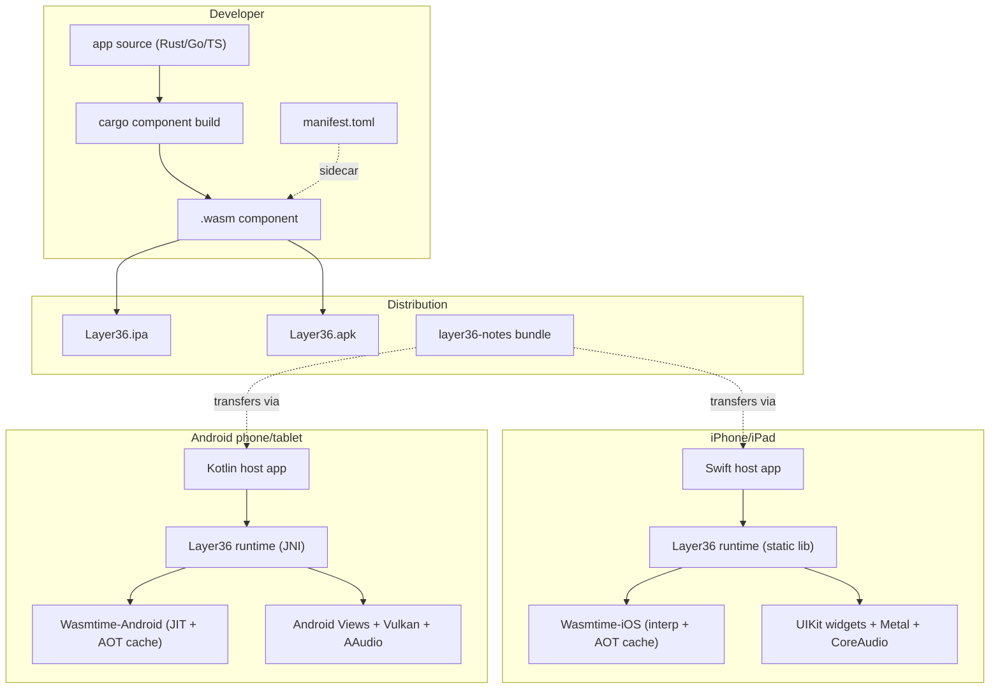
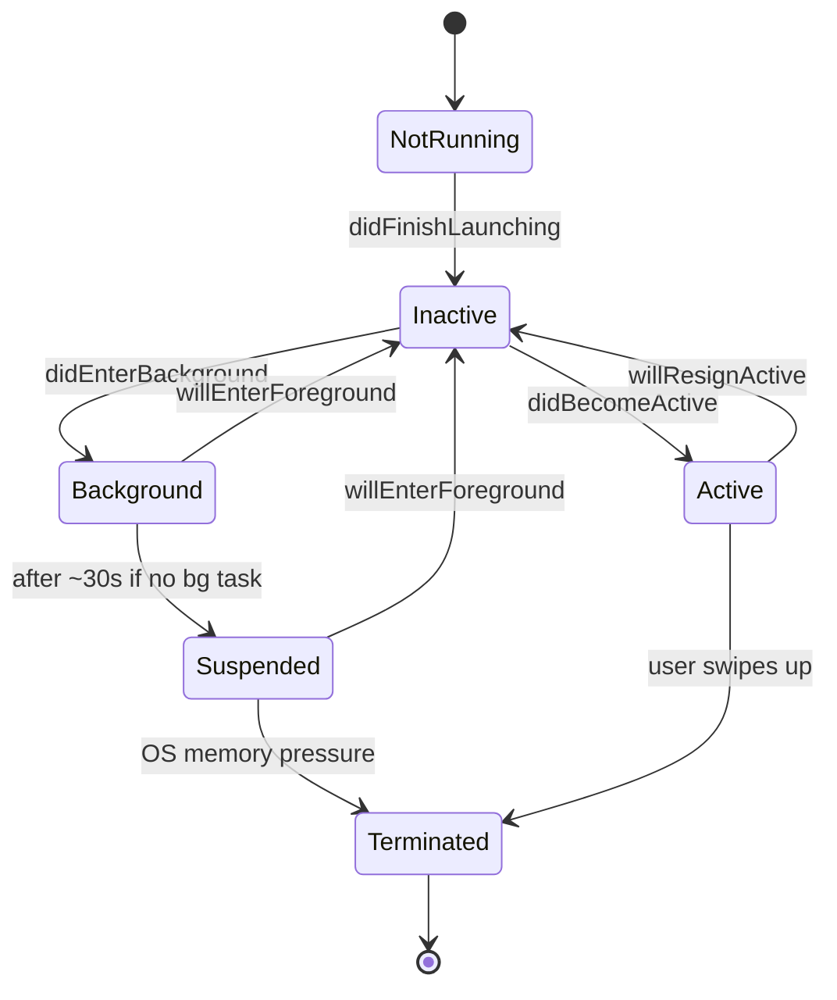
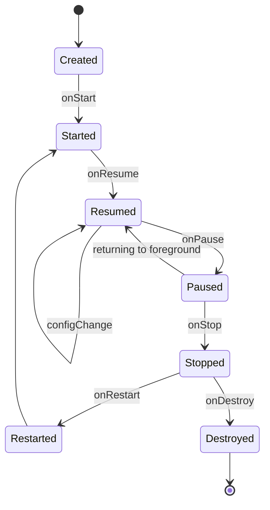
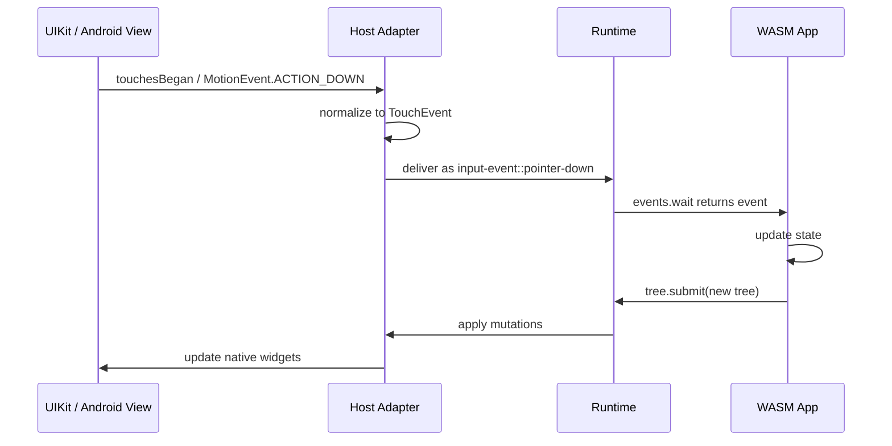
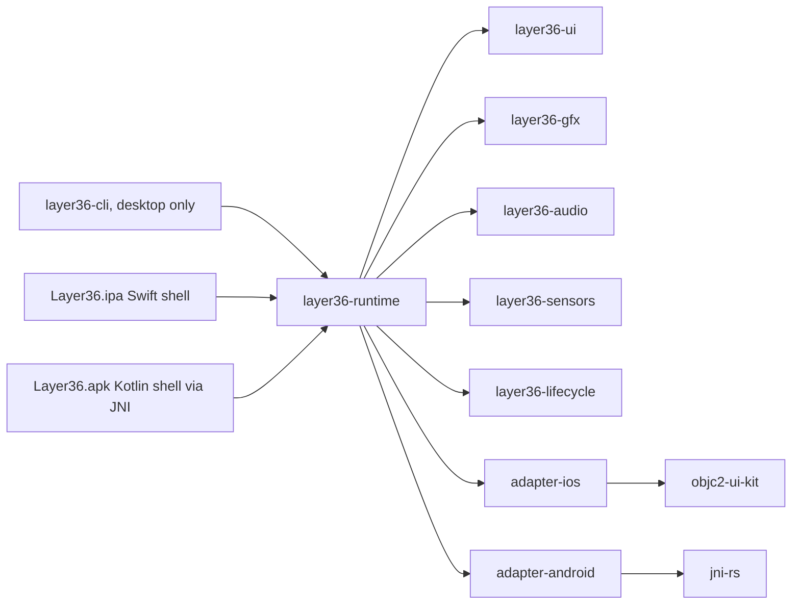
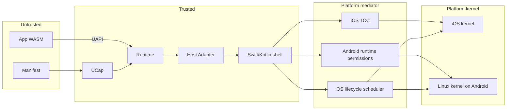
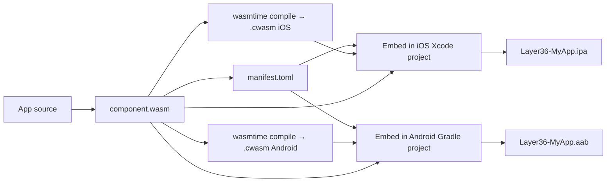
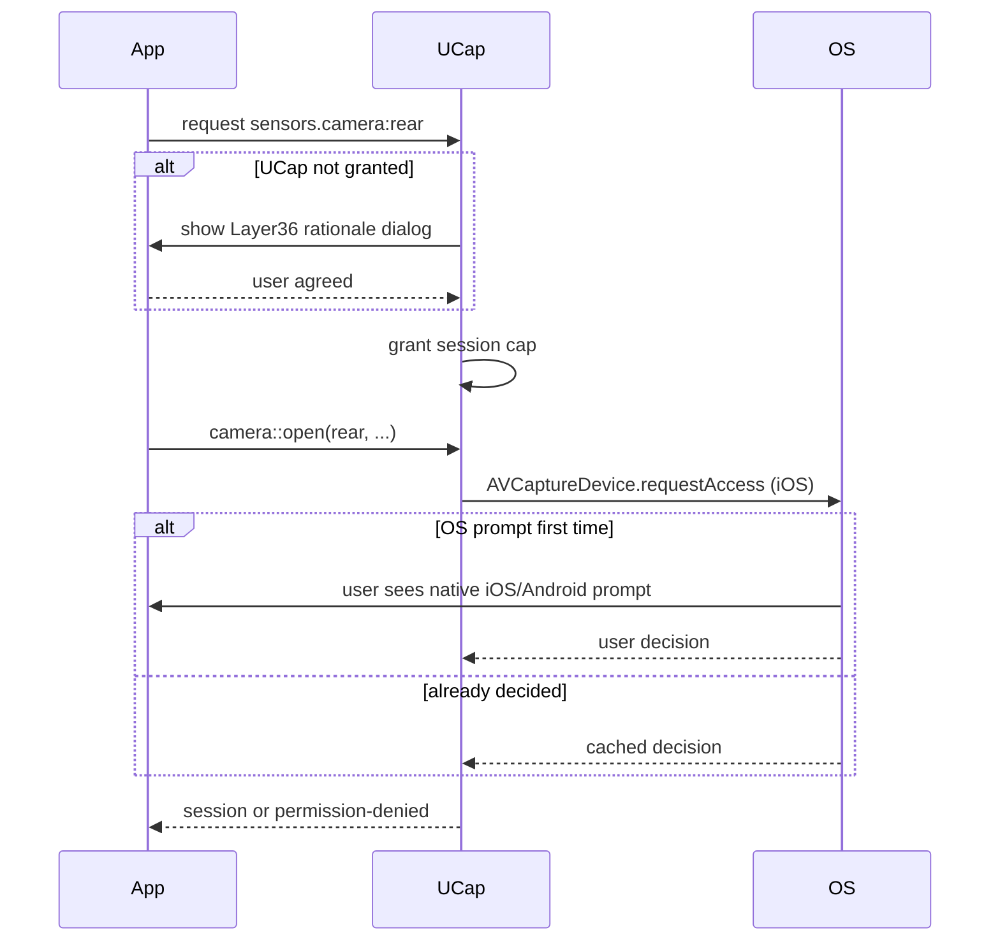

# Layer36 — Phase 4 Detailed Plan: Mobile Hosts

> **Phase:** 4 of 8
> **Duration:** Months 11–14 (120 calendar days, ~70–90 engineering days of work)
> **Phase sentence:** *The same `.l36app` that runs on desktop runs on iOS and Android without source changes — only with mobile-appropriate layout.*
> **Prerequisite:** Phase 3 complete — desktop GUI stable on Windows, macOS, Linux.
> **Supersedes:** nothing.
> **Superseded by:** nothing.

---

## Table of Contents

0. [How to Use This Document](#0-how-to-use-this-document)
1. [Phase Objective](#1-phase-objective)
2. [Prerequisites from Phase 3](#2-prerequisites-from-phase-3)
3. [Success Criteria](#3-success-criteria)
4. [What Phase 4 Is and Is Not](#4-what-phase-4-is-and-is-not)
5. [The Core Mobile Tension](#5-the-core-mobile-tension)
6. [Architecture](#6-architecture)
7. [Technology Decisions](#7-technology-decisions)
8. [UAPI v0.3 Additions](#8-uapi-v03-additions)
9. [iOS Host Adapter](#9-ios-host-adapter)
10. [Android Host Adapter](#10-android-host-adapter)
11. [Touch, Gestures, and Input](#11-touch-gestures-and-input)
12. [Mobile Lifecycle](#12-mobile-lifecycle)
13. [Sensors](#13-sensors)
14. [Responsive Layout](#14-responsive-layout)
15. [Packaging: IPA and APK/AAB](#15-packaging-ipa-and-apkaab)
16. [UCap v0.3 (Mobile Permissions)](#16-ucap-v03-mobile-permissions)
17. [App Store Posture](#17-app-store-posture)
18. [Porting `layer36-notes`](#18-porting-layer36-notes)
19. [Week-by-Week Breakdown](#19-week-by-week-breakdown)
20. [Task Details](#20-task-details)
21. [Code Skeletons](#21-code-skeletons)
22. [Testing Strategy](#22-testing-strategy)
23. [Performance & Battery Targets](#23-performance--battery-targets)
24. [Security & Threat Model v0.4](#24-security--threat-model-v04)
25. [Documentation Deliverables](#25-documentation-deliverables)
26. [Architecture Decision Records](#26-architecture-decision-records)
27. [Exit Criteria Checklist](#27-exit-criteria-checklist)
28. [Phase 4 Risks](#28-phase-4-risks)
29. [Handoff to Phase 5](#29-handoff-to-phase-5)
30. [Appendices](#30-appendices)

---

## 0. How to Use This Document

Phase 4 is the phase where the entire Layer36 thesis finally comes home. Phases 1–3 all ran on one class of device (desktops). Phase 4 is the first time the platform literally does what it was supposed to do: a single binary that runs on a laptop *and* a phone.

- Mobile operating systems are not just "smaller desktops." Lifecycle, permissions, input, battery, and store policy all behave differently enough that copying Phase 3 patterns into Phase 4 would fail. §5 names the tension.
- iOS and Android are different enough from each other that they need separate host adapters, separate packaging pipelines, and separate CI stories. Do not try to unify them above the `HostAdapter` trait.
- Apple and Google enforce store policies that affect technical decisions (WASM-as-interpreter is not allowed on iOS in most interpretations — see §17). Phase 4 plans *for developer mode and TestFlight* as the primary distribution channel during development; App Store strategy is Phase 6/7.
- Task IDs in §20 match Build Plan §7.5.

---

## 1. Phase Objective

### 1.1 One-sentence objective

**A developer takes the `layer36-notes` binary from Phase 3, unchanged, and runs it on an iPhone and a Pixel via the Layer36 host apps. It feels like a mobile app, handles touch naturally, survives being backgrounded, and uses sensors appropriately.**

### 1.2 Why this matters

Every previous phase has been an incremental extension of the same form factor. Phase 4 is the first phase that proves the META-OS thesis works *across form factors*. Without Phase 4, Layer36 is just another Linux/macOS/Windows cross-platform runtime — which already exist. With Phase 4, it is the only platform where a note-taking app you write on Monday runs on a MacBook, a Dell, a Linux workstation, an iPhone, and a Pixel by Friday, with real native feel on every one of them.

### 1.3 The six deliverables of Phase 4

1. **iOS host app** — a Swift-thin-shell that embeds the Layer36 runtime and lets a user run `.l36app` bundles on iPhone/iPad.
2. **Android host app** — a Kotlin-thin-shell that embeds the Layer36 runtime and lets a user run `.l36app` bundles on Android phones/tablets.
3. **Three new UAPI modules** — `layer36:sensors`, `layer36:ui/touch`, `layer36:lifecycle`.
4. **Porting work for Phase 3 UAPIs** — `ui` widget lowering to UIKit and Android Views, `gfx` on Metal/Vulkan (already wgpu-covered, needs surface integration), `audio` on CoreAudio/AAudio.
5. **Mobile-aware packaging** — `.ipa` for iOS developer distribution, `.apk`/`.aab` for Android sideload and Play Store.
6. **`layer36-notes` ported** — same source, runs on iOS and Android with touch-appropriate defaults.

---

## 2. Prerequisites from Phase 3

Before touching a single line of Phase 4 code, verify:

- [ ] All Phase 3 exit criteria met (Phase 3 Plan §26).
- [ ] `ui.wit`, `gfx.wit`, `audio.wit` frozen at v0.1.0.
- [ ] `layer36-notes` runs natively on Windows, macOS, Linux.
- [ ] 60 fps sustained on typical hardware.
- [ ] IME + screen reader passing on all three desktop hosts.
- [ ] UCap v0.2 with system-UI grant dialogs working.
- [ ] accesskit tree correctly built for widgets.
- [ ] ADRs 0001 through 0020 merged.

If any box is unchecked, finish Phase 3 first. Mobile amplifies every desktop problem; a shaky Phase 3 makes Phase 4 impossible.

---

## 3. Success Criteria

Phase 4 is **done** when, and only when, every row below is true.

| # | Criterion | Measured How |
|---|-----------|--------------|
| 1 | iOS host app builds for arm64 device + simulator, runs `.l36app` | TestFlight + sim |
| 2 | Android host app builds for arm64 + x86_64, runs `.l36app` | Play Internal Testing + emulator |
| 3 | `layer36-notes` runs on iPhone and Pixel with no source changes | Side-by-side manual test |
| 4 | Touch, tap, long-press, scroll, pinch all work correctly | Automated + manual |
| 5 | App survives background → foreground round-trip | Scripted test |
| 6 | App persists state across OS-initiated kill-and-resume | Scripted test |
| 7 | `layer36:sensors` module fires correct events (accel, gyro, GPS, camera read) | Manual on device |
| 8 | UCap v0.3: native OS permission prompts integrate (camera, mic, location) | Manual on device |
| 9 | Battery drain comparable to native equivalent | Battery consumption ≤ 1.5× native Swift/Kotlin baseline |
| 10 | Cold start on mid-range phone (iPhone 13 / Pixel 6) < 800 ms | Timer measurement |
| 11 | Steady-state 60 fps on typical mobile workload | Frame-time histogram |
| 12 | `.ipa` distributable via TestFlight | Confirmed with Apple Dev account |
| 13 | `.apk` + `.aab` produced; Play Store Internal Testing distribution works | Confirmed with Play Console |
| 14 | ADRs 0021 through at least 0028 merged | Git log |

---

## 4. What Phase 4 Is and Is Not

### 4.1 Phase 4 IS

- iOS arm64 device + iOS simulator support.
- Android arm64 device + Android emulator x86_64 support.
- Touch-first input: tap, long-press, pan, pinch, rotate, swipe.
- Mobile lifecycle events: resume, pause, background, memory warning, terminate.
- Sensors: accelerometer, gyroscope, magnetometer, GPS, camera (read-only frames).
- Mobile-aware responsive layout (bottom sheets, tab bars, navigation controllers).
- Developer-mode distribution: TestFlight (iOS), Play Internal Testing (Android), APK sideload.
- Mobile CI via GitHub Actions macOS runners (iOS) and Linux emulators (Android).

### 4.2 Phase 4 is NOT

- Not a public App Store / Play Store launch. That is Phase 7 readiness, Phase 8+ reality.
- Not smartwatch, TV, or car support.
- Not AR/VR.
- Not mobile-specific frameworks (no SwiftUI/Jetpack Compose wrapping). Host adapters use UIKit and Android Views directly.
- Not React-Native-style bridge optimization. We ship what the Phase 3 architecture gives us; deep optimization is Phase 7.
- Not fully offline install-from-file. Mobile "distribution" in Phase 4 means: developer's laptop → developer's test device.
- Not push notifications at a protocol level (the UAPI for notifications is minimal; actual APNs/FCM integration is Phase 6).
- Not in-app purchases. Phase 6 marketplace may address; App Store IAP is specifically deferred.
- Not background execution or background tasks (both platforms treat these as privileged APIs; Phase 5+).
- Not inter-app URL schemes or share sheets beyond the most basic.
- Not biometric auth UAPI. Phase 5 or 6 as part of identity work.

### 4.3 Discipline

The mobile surface is effectively infinite. Phase 4 commits to *just enough* to prove the META-OS thesis: write once, runs natively on mobile. Every feature beyond that goes on `docs/book/src/phase4/deferred.md`. The list will be long. That is correct.

---

## 5. The Core Mobile Tension

### 5.1 The tension

Mobile apps are governed by **two opposing forces**:

- **The OS owns the lifecycle.** The user swipes up and your app is frozen. The phone runs low on memory and your app is killed. A phone call arrives and your audio session is suspended. Nothing on desktop resembles this — desktop apps run until the user closes them, and "background" basically means "minimized." Mobile apps live at the OS's discretion.
- **The user expects instant response.** Tap a button, something happens in 100 ms or they think it's broken. Launch an app, first frame in 800 ms or they close it. Mobile users don't wait.

A platform layer like Layer36 therefore has to be simultaneously:

- **Obedient** — the runtime must save state immediately when the OS says "you might die soon," and resume without flicker when the OS says "you're back."
- **Fast** — cold start, reconnect to sensors, rehydrate UI all in under a second.

### 5.2 How this shapes Phase 4

Every technical decision downstream is influenced by these two forces. Specifically:

- **Lifecycle is a first-class UAPI.** Apps observe explicit `lifecycle` events (§8.3) and are expected to persist state synchronously during `will-suspend`.
- **AOT compilation is preferred over JIT.** Mobile users tolerate one-time install cost; cold-start-on-every-launch is unacceptable. Phase 4 introduces AOT caching for bundled `.wasm` components on first launch.
- **Sensors are event-driven with explicit subscribe/unsubscribe.** Continuous polling drains battery; the UAPI forbids it.
- **The host app, not the Layer36 binary, is what the OS sees.** Phase 4's deliverables are Swift/Kotlin shells that embed the runtime. The OS schedules these shells; they in turn delegate to the WASM inside.

### 5.3 A name for the bet

In ADR-0021 we call this the **"host-shell model"**: on mobile, Layer36 runs as a Swift/Kotlin app that happens to be mostly written in Rust via a statically-linked runtime, executing WASM bundles supplied by the developer. The user sees a normal mobile app; the developer has a cross-platform codebase; the OS sees a well-behaved citizen.

This is the single most important decision of Phase 4 and the whole document hinges on it.

---

## 6. Architecture

### 6.1 System overview at end of Phase 4



### 6.2 Runtime lifecycle on iOS



Each transition fires a `lifecycle` event observable by the app.

### 6.3 Runtime lifecycle on Android



### 6.4 Input plumbing (touch)



### 6.5 Crate layout at end of Phase 4



### 6.6 Trust boundaries (Phase 4)

The big change: a third trust zone, because the OS itself is an active mediator on mobile.



---

## 7. Technology Decisions

Each item frozen for Phase 4 unless noted. ADR references in §26.

### 7.1 Runtime engine on iOS: **Wasmtime in interpreter + AOT cache mode**

- Apple does not permit JIT compilation in apps distributed via the App Store (restricted mmap write+exec).
- Wasmtime supports pure interpreter mode; slow cold start but legal.
- We mitigate with **AOT compilation at install time** to produce a pre-compiled native blob loaded at launch.
- AOT compilation happens during packaging (cross-compile on CI), NOT on device.
- **Recorded:** ADR-0021.

### 7.2 Runtime engine on Android: **Wasmtime with JIT + AOT cache**

- Android permits JIT.
- Same AOT caching approach but optional fall-through to JIT when the cached native is unavailable.
- Reduces install-size by shipping WASM + generating-at-first-launch on low-storage devices.
- **Recorded:** ADR-0022.

### 7.3 iOS host shell language: **Swift**

- Required by Apple's modern iOS app conventions.
- Swift ↔ Rust bridge via `swift-bridge` crate + custom `@_cdecl` entry points.
- Shell is intentionally thin (~500–1000 lines of Swift).
- **Recorded:** ADR-0023.

### 7.4 Android host shell language: **Kotlin**

- JNI bridge into the Rust runtime via `jni` crate on Rust side.
- Shell handles: Activity lifecycle, Android permission prompts, Intents dispatch, file storage locations.
- ~500–1000 lines of Kotlin.
- **Recorded:** ADR-0024.

### 7.5 iOS widget lowering: **UIKit**

- Not SwiftUI. SwiftUI is newer, nicer, and less stable for embedded use cases; we bridge to UIKit for predictability and wider version support.
- Minimum iOS target: **iOS 15** (accommodates devices 6+ years old at v1.0 launch).
- **Recorded:** ADR-0025.

### 7.6 Android widget lowering: **Android View system**

- Not Jetpack Compose. Same reasoning as SwiftUI — bridging to a stable, widely-supported base.
- Minimum Android API: **API 29 (Android 10)**. Accommodates roughly 95%+ of active devices at launch.
- **Recorded:** ADR-0026.

### 7.7 GPU: **wgpu continues**

- Phase 3 already used wgpu.
- Metal on iOS, Vulkan on Android, both supported by wgpu.
- Surface integration per host: `CAMetalLayer` on iOS, `ANativeWindow` on Android.
- No ADR needed; follows Phase 3 ADR-0016.

### 7.8 Audio: **CoreAudio (iOS) + AAudio (Android)**

- `cpal` (Phase 3 choice) supports CoreAudio but not AAudio natively.
- We write a thin AAudio backend or use `oboe` via FFI for Android.
- AVAudioSession / focus handling added per-host.
- **Recorded:** ADR-0027.

### 7.9 Sensors: **platform-native APIs**

- iOS: Core Motion (accel/gyro/magneto), Core Location (GPS), AVFoundation (camera frames).
- Android: SensorManager, FusedLocationProvider, Camera2.
- Abstraction layer in UAPI normalizes units and coordinate systems.
- **Recorded:** ADR-0028.

### 7.10 Binary distribution: **IPA and APK/AAB**

- iOS `.ipa`: built on macOS CI; distributed via TestFlight in Phase 4. App Store release is Phase 7+.
- Android `.apk` for direct install; `.aab` for Play Internal Testing.
- Both signed with developer certs in Phase 4 (production store signing is Phase 6).

### 7.11 App store policy posture (recorded in ADR-0029)

- Phase 4 operates under TestFlight + Play Internal Testing constraints only. These are more permissive than public App Store.
- We explicitly **do not ship arbitrary user-supplied `.l36app` bundles as a feature of a store-distributed Layer36 host app in Phase 4**. That would clearly violate App Store rules about interpreters and downloaded code.
- Instead, the iOS host app in Phase 4 is a **developer tool** — the developer's `.l36app` is bundled at build time into the Swift shell, not downloaded at runtime.
- Public distribution mode comes in Phase 7 with negotiated sideload / marketplace strategies.
- See §17 for the full store posture.

### 7.12 What we considered and rejected

| Option | Rejected because |
|---|---|
| Flutter engine reuse | Phase 3 explicitly rejected the Flutter "all-drawn" model; reusing its engine would undo that. |
| React Native shell | Same — brings JS bridge baggage we do not want. |
| Run WASM in WKWebView on iOS | Severely limited perf; blocked API; opposite of the hybrid native widget approach. |
| Share iOS and Android shell in a single cross-platform abstraction (Kotlin Multiplatform) | Over-abstracts at the wrong layer; shells are small, should be native. |
| Build against iOS 13 / Android API 26 for wider reach | Maintenance cost exceeds benefit; < 1% of active devices impacted by iOS 15+. |

### 7.13 What we DEFER

| Feature | Deferred to |
|---|---|
| Push notifications (APNs, FCM) | Phase 6 (needs identity) |
| Widgets (home-screen widgets / Android widgets) | Phase 7 |
| Watch / wearable extensions | Post-v1.0 |
| CarPlay / Android Auto | Post-v1.0 |
| Background tasks (BGTaskScheduler, WorkManager) | Phase 5 |
| In-app purchases | Phase 6 |
| Universal Links / App Links | Phase 6 |
| Biometric authentication | Phase 6 (with identity) |
| Haptic feedback beyond basic | Phase 5 |
| Dynamic Type / system font scaling | Phase 5 accessibility sweep |
| iPad-specific UIs (Stage Manager, multi-window) | Phase 7 polish |

---

## 8. UAPI v0.3 Additions

Three new modules. All v0.1.0 (first release, independently versioned).

### 8.1 `layer36:sensors@0.1.0`

```wit
// wit/layer36/sensors.wit
package layer36:sensors@0.1.0;

interface types {
    record vec3 { x: f32, y: f32, z: f32 }

    record accel-sample {
        millis: u64,   // timestamp
        accel: vec3,   // m/s^2, right-handed
    }

    record gyro-sample {
        millis: u64,
        rate: vec3,    // rad/s
    }

    record location-sample {
        millis: u64,
        lat: f64,
        lon: f64,
        alt-meters: option<f64>,
        accuracy-meters: f32,
        speed-mps: option<f32>,
        heading-deg: option<f32>,
    }

    enum camera-facing {
        front,
        rear,
    }

    record camera-frame {
        millis: u64,
        width: u32,
        height: u32,
        // NV12 or RGBA depending on negotiated format
        format: frame-format,
        data: list<u8>,
    }

    enum frame-format { nv12, rgba, bgra }

    variant sensor-error {
        not-available,
        permission-denied,
        busy,
        other(string),
    }
}

interface motion {
    use types.{accel-sample, gyro-sample, sensor-error};

    resource accel-subscription {
        next: func() -> option<accel-sample>;  // poll; none = no new samples
        close: func();
    }

    subscribe-accel: func(hz: u16) -> result<accel-subscription, sensor-error>;
    subscribe-gyro:  func(hz: u16) -> result<gyro-subscription, sensor-error>;

    resource gyro-subscription {
        next: func() -> option<gyro-sample>;
        close: func();
    }
}

interface location {
    use types.{location-sample, sensor-error};

    resource location-subscription {
        next: func() -> option<location-sample>;
        close: func();
    }

    subscribe: func(hz: u16, accuracy: accuracy-hint) -> result<location-subscription, sensor-error>;

    enum accuracy-hint {
        coarse,    // city-level; battery-friendly
        fine,      // GPS; higher battery
    }
}

interface camera {
    use types.{camera-facing, camera-frame, frame-format, sensor-error};

    resource camera-session {
        next-frame: func() -> option<camera-frame>;
        close: func();
    }

    open: func(facing: camera-facing, format: frame-format, fps: u16) -> result<camera-session, sensor-error>;
    list: func() -> list<camera-facing>;
}

world consumer {
    import motion;
    import location;
    import camera;
}
```

Design notes:
- Poll-based pattern (`next`) over callbacks. Callbacks across the WASM boundary are awkward; polling lets apps drive their own event loop.
- Explicit subscription resources so apps can't silently drain battery — closing the resource stops the sensor.
- Frame format negotiation at open; runtime handles conversion if the OS gives us a different format.
- `hz` is a *hint*, not a guarantee. Some platforms clamp.

### 8.2 `layer36:ui/touch@0.1.0` (extension to `layer36:ui`)

Added to `ui.wit` as a new interface. Not a breaking change to Phase 3's `ui`.

```wit
// within wit/layer36/ui.wit

interface touch {
    use types.{widget-id, pointer-event};

    record gesture-config {
        tap: bool,
        long-press: option<u32>,   // millis threshold
        pan: bool,
        pinch: bool,
        rotate: bool,
        swipe: option<direction>,
    }

    attach: func(id: widget-id, cfg: gesture-config);
    detach: func(id: widget-id);
}

// New event variants added to input-event:
variant input-event {
    // existing variants from Phase 3 ...

    tap(widget-id, pointer-position),
    long-press(widget-id, pointer-position),
    pan-start(widget-id, pointer-position),
    pan-move(widget-id, pointer-delta),
    pan-end(widget-id),
    pinch-start(widget-id, f32),   // initial scale
    pinch-update(widget-id, f32),  // current scale
    pinch-end(widget-id),
    rotate-update(widget-id, f32), // radians
    swipe(widget-id, direction),
}
```

Design notes:
- Gestures are declared per widget via `attach`, not implicit.
- Desktop also gets these events (tap = click, pan = drag) so cross-platform apps don't branch on OS.
- Pinch/rotate events only fire on hosts that support multi-touch; desktop typically won't.

### 8.3 `layer36:lifecycle@0.1.0`

```wit
// wit/layer36/lifecycle.wit
package layer36:lifecycle@0.1.0;

interface events {
    variant lifecycle-event {
        /// App will become active (about to be shown / resumed).
        will-resume,
        /// App just became active.
        did-resume,
        /// App will become inactive (phone call, pulled-down notification).
        will-pause,
        /// App went to background (home button, app switcher).
        did-enter-background,
        /// App coming back from background.
        will-enter-foreground,
        /// Memory pressure warning — free caches NOW.
        memory-warning(memory-level),
        /// App will be killed imminently. Last chance to save.
        will-terminate,
        /// Low battery warning.
        low-battery(f32),   // fraction 0..1
    }

    enum memory-level { moderate, critical }

    /// Block until a lifecycle event arrives or an optional timeout elapses.
    wait: func(timeout-millis: option<u32>) -> option<lifecycle-event>;

    /// Poll; returns none if no new event.
    poll: func() -> option<lifecycle-event>;
}

interface state {
    /// Persistent per-app state blob managed by runtime.
    /// Saved at will-pause, restored at will-resume.
    save: func(blob: list<u8>);
    load: func() -> list<u8>;
}

world consumer {
    import events;
    import state;
}
```

Design notes:
- Explicit events, not implicit observer registration; mirrors Phase 3's `ui/events` model.
- `state.save` / `state.load` provide a small persistent store for "where I was" — not a database. Apps use `layer36:fs` for real data.
- `will-terminate` is a best-effort — apps get a brief sync window to persist.

### 8.4 Updated consolidated `world`

```wit
// wit/layer36/app.wit
package layer36:app@0.3.0;

world mobile {
    // Phase 2: CLI modules
    import layer36:io/stdio@0.1.0;
    import layer36:io/log@0.1.0;
    import layer36:fs/files@0.1.0;
    import layer36:net/http-client@0.1.0;
    import layer36:time/clock@0.1.0;
    import layer36:time/sleep@0.1.0;
    import layer36:locale/info@0.1.0;
    import layer36:locale/format@0.1.0;

    // Phase 3: GUI modules
    import layer36:ui/window@0.1.0;
    import layer36:ui/tree@0.1.0;
    import layer36:ui/events@0.1.0;
    import layer36:ui/dialog@0.1.0;
    import layer36:ui/clipboard@0.1.0;
    import layer36:ui/menu@0.1.0;
    import layer36:gfx/canvas2d@0.1.0;
    import layer36:gfx/gpu3d@0.1.0;
    import layer36:audio/playback@0.1.0;
    import layer36:audio/capture@0.1.0;

    // Phase 4: mobile additions
    import layer36:ui/touch@0.1.0;
    import layer36:sensors/motion@0.1.0;
    import layer36:sensors/location@0.1.0;
    import layer36:sensors/camera@0.1.0;
    import layer36:lifecycle/events@0.1.0;
    import layer36:lifecycle/state@0.1.0;

    export run: func() -> s32;
}
```

Phase 2's `cli` and Phase 3's `gui` worlds remain valid for apps that don't need mobile.

---

## 9. iOS Host Adapter

### 9.1 Structure

```
adapter-ios/
├── Cargo.toml
├── build.rs              # wires up objc2 bindings
├── src/
│   ├── lib.rs
│   ├── window.rs         # UIWindow + UIViewController
│   ├── widgets/          # one file per UIKit widget type
│   │   ├── button.rs     # UIButton bridge
│   │   ├── textfield.rs  # UITextField
│   │   ├── tableview.rs  # UITableView
│   │   └── ...
│   ├── input/
│   │   ├── touch.rs
│   │   └── keyboard.rs   # iPad hardware keyboards
│   ├── gfx.rs            # CAMetalLayer
│   ├── audio.rs          # AVAudioSession + AVAudioEngine
│   ├── sensors/
│   │   ├── motion.rs     # Core Motion
│   │   ├── location.rs   # Core Location
│   │   └── camera.rs     # AVCaptureSession
│   ├── lifecycle.rs      # UIApplicationDelegate proxying
│   └── bridge.rs         # Swift ↔ Rust boundary
```

### 9.2 Swift host shell responsibilities

The Swift shell is a thin standard iOS app:

- `AppDelegate` / `SceneDelegate` for launch + URL handling.
- Root `UIViewController` that hosts the WASM app's primary window view.
- iOS permission requests (via Info.plist usage descriptions + runtime prompts).
- Background task handling (minimal in Phase 4).
- Push notification registration (stubbed in Phase 4).

```swift
// Shell excerpt — pseudo-Swift
import UIKit
import Layer36Runtime  // statically linked Rust lib

@main
class AppDelegate: UIResponder, UIApplicationDelegate {
    var runtime: Layer36Runtime!

    func application(_ app: UIApplication,
                     didFinishLaunchingWithOptions opts: [...]) -> Bool {
        runtime = Layer36Runtime(bundleURL: Bundle.main.url(forResource: "app",
                                                          withExtension: "l36app")!)
        runtime.start()
        return true
    }

    func applicationWillResignActive(_ app: UIApplication) {
        runtime.lifecycle(.willPause)
    }

    func applicationDidEnterBackground(_ app: UIApplication) {
        runtime.lifecycle(.didEnterBackground)
    }

    // ... other lifecycle hooks
}
```

### 9.3 JIT limitation handling

- Wasmtime configured for **interpreter mode** (`Config::strategy(Strategy::Winch)` won't work on iOS; pure `cranelift` JIT also blocked).
- AOT compilation happens during build: `wasmtime compile` runs on CI to produce a `.cwasm` pre-compiled artifact bundled alongside the raw `.wasm`.
- At runtime the shell loads the `.cwasm` when available; falls back to interpreter when not.
- Known perf hit for interpreter fallback: ~10–30× slower than JIT. AOT closes that gap to ~1–3×.

### 9.4 Widget lowering specifics

| Phase 3 widget | UIKit control | Notes |
|---|---|---|
| Stack | UIStackView | Axis + spacing direct |
| Grid | UICollectionView (compositional) | Complex; may fallback to drawn in v0.1 |
| Scroll | UIScrollView | |
| Tabs | UITabBar / UIPageViewController | Tab bar is the mobile idiom |
| Button | UIButton | |
| Checkbox | UISwitch (ironic but idiomatic mobile) | |
| Radio | custom drawn (no UIKit native radio) | Use grouped table cells for groups |
| Switch | UISwitch | |
| Slider | UISlider | |
| Progress | UIProgressView / UIActivityIndicator | |
| Text | UILabel | |
| TextField | UITextField | |
| TextArea | UITextView | |
| List | UITableView | |
| Tree | drawn | No idiomatic iOS tree — use navigation |
| Image | UIImageView | |
| Canvas | CAMetalLayer subview | |

### 9.5 iOS-specific navigation

Phase 3 widgets don't include `NavigationController` — the master-detail, push-pop model of iOS. Two options:

- **Add `layer36:ui/navigation`** — a mobile-aware UAPI interface. Chosen. v0.1 supports push, pop, back.
- On desktop, navigation events degrade to modal sheets or tab switches.

```wit
// within wit/layer36/ui.wit (or separate if cleaner)

interface navigation {
    use types.{widget-node, navigation-id};

    record navigation-config {
        show-back: bool,
        title: string,
    }

    push: func(nav: navigation-id, content: widget-node, cfg: navigation-config);
    pop: func(nav: navigation-id);
    pop-to-root: func(nav: navigation-id);
}
```

### 9.6 Safe area, keyboard, and other iOS peculiarities

- Safe area insets exposed as `layer36:ui/preferences::safe-area-insets`.
- Software keyboard height delivered as `input-event::keyboard-shown / -hidden` with height.
- Status bar style settable via manifest.
- Dark mode follows `UITraitCollection`.

---

## 10. Android Host Adapter

### 10.1 Structure

```
adapter-android/
├── Cargo.toml
├── src/
│   ├── lib.rs
│   ├── jni.rs            # JNI entry points
│   ├── activity.rs       # Activity bridging
│   ├── widgets/          # Android View wrappers
│   │   ├── button.rs     # android.widget.Button via JNI
│   │   ├── edittext.rs
│   │   ├── recyclerview.rs
│   │   └── ...
│   ├── input/
│   │   ├── touch.rs
│   │   └── keyboard.rs
│   ├── gfx.rs            # ANativeWindow + wgpu Vulkan
│   ├── audio.rs          # AAudio / Oboe
│   ├── sensors/
│   │   ├── motion.rs     # SensorManager
│   │   ├── location.rs   # FusedLocationProvider
│   │   └── camera.rs     # Camera2 API
│   └── lifecycle.rs
└── host-app/             # Kotlin shell as a sibling directory
    ├── build.gradle
    ├── AndroidManifest.xml
    └── src/main/kotlin/
        └── MainActivity.kt
```

### 10.2 Kotlin host shell responsibilities

```kotlin
// host-app/src/main/kotlin/MainActivity.kt
package dev.layer36.host

import android.app.Activity
import android.os.Bundle

class MainActivity : Activity() {
    companion object {
        init { System.loadLibrary("layer36_runtime") }
    }

    external fun nativeStart(bundlePath: String)
    external fun nativeLifecycle(event: Int)

    override fun onCreate(state: Bundle?) {
        super.onCreate(state)
        val bundlePath = assets.extractBundle("app.l36app")
        nativeStart(bundlePath)
    }

    override fun onPause()   { nativeLifecycle(LIFECYCLE_PAUSE)   }
    override fun onResume()  { nativeLifecycle(LIFECYCLE_RESUME)  }
    override fun onDestroy() { nativeLifecycle(LIFECYCLE_DESTROY) }
}
```

### 10.3 JIT is allowed on Android

- Android permits JIT; Wasmtime runs with `cranelift` JIT enabled.
- AOT cache still used for cold-start performance on second+ launch.
- First launch compiles and caches; subsequent launches use the cache.

### 10.4 Widget lowering specifics

| Phase 3 widget | Android View | Notes |
|---|---|---|
| Stack | LinearLayout | |
| Grid | GridLayout | |
| Scroll | ScrollView / HorizontalScrollView | |
| Tabs | TabLayout + ViewPager2 | |
| Button | Button | Material by default |
| Checkbox | CheckBox | |
| Radio | RadioButton (in RadioGroup) | |
| Switch | SwitchMaterial | |
| Slider | SeekBar / Slider | |
| Progress | ProgressBar | |
| Text | TextView | |
| TextField | EditText | |
| TextArea | EditText (multiline) | |
| List | RecyclerView | |
| Tree | drawn | No native Android tree |
| Image | ImageView | |
| Canvas | SurfaceView + wgpu | |

### 10.5 Navigation on Android

Android's navigation idiom differs (Fragments, NavigationComponent, back stack owned by OS back button). Our `layer36:ui/navigation` interface maps to:

- **Push** → add fragment to fragment manager with back stack entry.
- **Pop** → pop back stack.
- Android's system back button automatically triggers pop. If app has only one view, it quits.

### 10.6 Android-specific idioms

- Snackbar / Toast → via `layer36:ui/toast` extension (small addition, Phase 4 ships).
- Action Bar / Top App Bar → mapped from Phase 3's `ui::menu::set-window-menu`.
- FAB (Floating Action Button) → custom-drawn in v0.1; apps compose with Canvas.
- Bottom sheets → v0.2 of `layer36:ui`; not in Phase 4.

---

## 11. Touch, Gestures, and Input

### 11.1 Touch model

Multi-touch by design. Each touch point has an ID that persists for the touch's lifetime:

```
touch-id: u64            # unique per touch sequence
position: (f32, f32)     # logical pixels within widget
pressure: f32            # 0.0..1.0; 0.5 default if unavailable
```

Runtime normalizes iOS UITouch and Android MotionEvent to the same event model.

### 11.2 Gesture recognition

Two approaches considered:

- **OS-native gesture recognizers** (UIGestureRecognizer, GestureDetector). Reuse what the OS gives us.
- **Custom gesture recognition in runtime.** Uniform behavior across OSes.

**Decision:** use OS-native where possible (ADR-0030). This keeps feel native on each platform. Custom recognition only for gestures that require app-level composition (e.g. pinch inside a pan).

### 11.3 Event dispatch order

For any touch location:

1. OS delivers to the topmost view at that point.
2. If the view is a native widget, it handles (native behavior — e.g. button highlight).
3. If the view is a custom-drawn widget, it hit-tests against app-provided opaque regions.
4. If no widget claims it, event propagates to parent and eventually to `window`.

### 11.4 Keyboard on mobile

- Software keyboard: no UAPI beyond `focus-hint` on TextField. Runtime shows/hides keyboard based on focus.
- Hardware keyboard (iPad with keyboard, Android with Bluetooth): same key events as Phase 3's keyboard UAPI.
- IME on mobile: same UAPI events as Phase 3. Per-host bridging: iOS uses `UITextInput`; Android uses `InputConnection`.

### 11.5 Haptic feedback (minimal in Phase 4)

```wit
// addition to wit/layer36/ui.wit

interface haptic {
    enum impact { light, medium, heavy }

    impact-occurred: func(i: impact);
    selection-changed: func();
    notification: func(kind: notification-kind);

    enum notification-kind { success, warning, error }
}
```

Delegates to UIImpactFeedbackGenerator / UIFIeedbackGenerator on iOS and VibrationEffect on Android. Desktop hosts ignore.

---

## 12. Mobile Lifecycle

### 12.1 Why this is a first-class UAPI (recap)

Apps that don't handle lifecycle lose user data, drain battery, or get killed quickly. A platform-layer that makes this hard to get right produces uniformly bad apps. UAPI design *forces* apps to observe lifecycle events.

### 12.2 State save rules

- Runtime offers a single key-value blob (`layer36:lifecycle/state::save/load`) — intentionally small.
- Size cap: 1 MB. Beyond this, apps use `layer36:fs` with explicit path.
- `save` is synchronous from the WASM perspective — runtime drives to completion before surfacing `will-pause`.

### 12.3 Platform lifecycle mapping

| Abstract event | iOS | Android |
|---|---|---|
| `will-resume` | `applicationWillEnterForeground` | `onResume` (entering) |
| `did-resume` | `applicationDidBecomeActive` | `onResume` (entered) |
| `will-pause` | `applicationWillResignActive` | `onPause` (leaving) |
| `did-enter-background` | `applicationDidEnterBackground` | `onStop` |
| `memory-warning` | `applicationDidReceiveMemoryWarning` | `onTrimMemory` |
| `will-terminate` | `applicationWillTerminate` (rare on modern iOS) | `onDestroy` without configChange |
| `low-battery` | `NSProcessInfo.thermalState` + `UIDevice.batteryLevel` | `Intent.ACTION_BATTERY_LOW` |

### 12.4 App patterns

Canonical patterns apps should follow (documented in tutorial):

- Persist state in response to `will-pause` using `lifecycle::state::save`.
- Release expensive caches on `memory-warning`.
- Stop sensors and close network on `did-enter-background`.
- Resubscribe on `will-resume`.

### 12.5 Background execution boundary

Phase 4 ships *no* background execution. When an app enters `did-enter-background`, the runtime parks the WASM and will only resume on `will-resume`. Background timers, background fetch, and scheduled tasks are Phase 5+.

---

## 13. Sensors

### 13.1 Design principles

- Sensors are expensive. UAPI forbids cheap abuse.
- Subscription is explicit; closing the resource is equivalent to "stop the sensor."
- Battery-sensitive defaults (GPS defaults to coarse).
- All sensor UAPIs require a UCap grant.

### 13.2 Sensor-to-cap mapping

| UAPI | Required cap | OS-level prompt |
|---|---|---|
| `motion/accel`, `motion/gyro` | `sensors.motion:basic` | none on most platforms |
| `location/subscribe(coarse)` | `sensors.location:coarse` | iOS TCC, Android runtime prompt |
| `location/subscribe(fine)` | `sensors.location:fine` | iOS TCC, Android runtime prompt |
| `camera/open(front)` | `sensors.camera:front` | iOS TCC, Android runtime prompt |
| `camera/open(rear)` | `sensors.camera:rear` | iOS TCC, Android runtime prompt |

OS-level prompts fire automatically — our UCap grant implies acceptance of the OS-level prompt (but the OS still decides).

### 13.3 Camera specifics

- Camera in v0.1 is **frame-by-frame reading only**. No video recording, no photo-taking-with-shutter, no metadata extraction.
- Format negotiation: apps request RGBA / BGRA / NV12; runtime translates from what the OS gives.
- Preview rendering: apps draw camera frames themselves via `gfx::canvas2d::draw-image`.
- No zoom, no focus control, no flash in v0.1. Phase 5 additions.

### 13.4 Units and coordinate systems

All units are SI, coordinate systems are **right-handed with Z up** relative to the device's natural orientation. Runtime normalizes the platform-specific conventions (iOS is already right-handed; Android matches on most devices).

### 13.5 Precision & reliability

- Accelerometer: ± 0.5 m/s² typical.
- Gyroscope: ± 0.02 rad/s drift.
- GPS (fine): ± 5 m in good conditions; varies wildly.
- These are documented so app authors don't over-trust.

---

## 14. Responsive Layout

### 14.1 Why layout is different on mobile

Desktops have 1280–4K screens in landscape-dominant modes. Phones have 360–430 dp portrait screens. A single widget tree rendering well on both requires either:

- **Apps hand-branch** on size — creates double code paths.
- **Layout adapts automatically** based on available space, providing good defaults.

Layer36 takes the second path via **size classes** (inherited from iOS and Web's responsive idioms).

### 14.2 Size classes

Two dimensions, each with three values:

- **Width class:** compact (< 600 dp), regular (600–1023 dp), expanded (≥ 1024 dp).
- **Height class:** same thresholds.

Size classes are exposed via `layer36:ui/preferences::size-class()` and change events are fired when the window resizes or the device rotates.

### 14.3 Responsive patterns

Apps express "this in compact mode, that in regular" via a `SizeClassSwitch` widget (logical only, no native rendering):

```rust
Widget::SizeClassSwitch {
    id,
    compact: Box::new(compact_layout()),
    regular: Box::new(regular_layout()),
    expanded: Box::new(expanded_layout()),
}
```

Only the applicable branch is built. This is syntactic sugar but encourages apps to design for multiple sizes up front.

### 14.4 Orientation

- Apps can declare supported orientations in manifest.
- Rotation fires `window-resized` + `size-class-change` events.
- Runtime does not animate the rotation beyond what the host OS provides.

### 14.5 Default behavior without branching

Apps that submit a tree without size-class awareness still get reasonable layout:

- Stacks and Lists adapt to available space via Taffy.
- Tabs on wide screens use a sidebar; on narrow, a bottom bar.
- Navigation pushes replace the view on narrow; slide over on wide (iPad split view).

---

## 15. Packaging: IPA and APK/AAB

### 15.1 The pipeline



### 15.2 iOS packaging steps

1. Prebuild Layer36 runtime as static library (`liblayer36_runtime.a`) for arm64-apple-ios and arm64-apple-ios-sim.
2. Xcode project template includes Swift shell + runtime static lib + embedded app bundle.
3. `layer36 package ios <app>` fills the template with the app's `.wasm` and `.cwasm`.
4. Xcode builds & signs .ipa with developer cert.
5. `layer36 deploy ios <app>` uploads to TestFlight via `altool` or `fastlane`.

### 15.3 Android packaging steps

1. Prebuild runtime as shared libs for arm64, armv7, x86_64 (`liblayer36_runtime.so`).
2. Gradle template includes Kotlin shell + runtime .so files in jniLibs.
3. `layer36 package android <app>` fills the template with assets.
4. Gradle builds APK and/or AAB; signs with developer key (or debug key by default).
5. `layer36 deploy android <app>` uploads to Play Console Internal Testing track.

### 15.4 Developer certs (Phase 4 constraint)

- iOS requires Apple Developer Program membership ($99/year). No way around it.
- Android requires Google Play Console account ($25 one-time) for Play Store; sideload APKs need no account.
- Phase 4 documents the setup; anticipate devs hitting this.

### 15.5 Manifest extensions for mobile

```toml
[app]
id      = "com.parksure.driver"
version = "1.0.0"
entry   = "driver.wasm"
world   = "layer36:app/mobile@0.3.0"

[mobile]
min-ios       = "15.0"
min-android   = "29"
orientations  = ["portrait", "landscape"]

[ios]
info-plist-usage.nsCameraUsageDescription = "Scan QR codes at parking entrance"
info-plist-usage.nsLocationWhenInUseUsageDescription = "Find parking near you"

[android]
uses-permissions = ["android.permission.CAMERA", "android.permission.ACCESS_FINE_LOCATION"]
```

These fields drive Info.plist and AndroidManifest.xml generation automatically. Developers never hand-edit platform manifests.

---

## 16. UCap v0.3 (Mobile Permissions)

### 16.1 What changes on mobile

- **Permissions are a two-layer problem.** Layer36 UCap + OS-level permission (iOS TCC or Android runtime permission). An app must have BOTH.
- **OS-level prompts are uncontrollable.** We can trigger them but not style them; we can't re-prompt after denial without user visiting Settings.
- **Grant persistence is OS-managed for sensitive caps.** We do NOT store "user said yes to camera" in our policy DB; the OS does.

### 16.2 Flow for a camera grant



### 16.3 Mobile-specific capability strings (added in Phase 4)

```
sensors.motion:basic
sensors.location:coarse
sensors.location:fine
sensors.camera:front
sensors.camera:rear
sensors.microphone       # unified with Phase 3 audio.capture on mobile
lifecycle.background     # future-proofing; always denied in Phase 4
notifications.local      # stubbed in Phase 4
ui.haptic
```

### 16.4 First-run UX

- On first launch of an app on mobile, Layer36 shows a single consolidated grant dialog for caps declared in the manifest (above default-granted set).
- Then each specific OS-level prompt fires at first actual use.
- Users never see *only* the OS prompt without context — Layer36 rationale precedes it.

### 16.5 Settings deep-link

When an OS permission is denied and the app needs it, Layer36 provides a UAPI that opens the system Settings page for the app:

```wit
// additional to wit/layer36/ui.wit

interface settings {
    open-app-settings: func();
}
```

---

## 17. App Store Posture

### 17.1 The constraint

Both Apple and Google restrict apps that "download and execute code." Naively distributing the Layer36 host app on App Store and allowing users to install arbitrary `.l36app` bundles at runtime would likely be rejected.

### 17.2 Phase 4 posture

In Phase 4, **we do not distribute a consumer-facing Layer36 host app to public stores.** Instead:

- **Developer mode:** each developer builds their own IPA/APK via `layer36 package` which bakes their specific `.l36app` into a standalone Swift/Kotlin shell.
- **TestFlight and Play Internal Testing:** used to share builds with beta testers.
- **Direct install:** APK sideload works without Play Store.
- **No public consumer marketplace until Phase 6–7.**

This means Phase 4 has no App Store rejection risk — we're not submitting to App Store at all.

### 17.3 What this means for the architecture

The host shell templates support **two modes**:

- **"Baked"** — `.l36app` is bundled at build time. The shell loads only that. This is the default for Phase 4.
- **"Runtime"** — the shell loads user-supplied `.l36app` at runtime. Works in dev mode / TestFlight but is risky for public stores.

Both modes coexist. Developers start with baked; Layer36 team experiments internally with runtime to learn.

### 17.4 What the long-term play looks like (not Phase 4's problem)

- **Marketplace as a website**, not an app. Users download `.l36app`s there. Layer36 host on device loads them.
- **Small pre-reviewed library**, where the Layer36 org vets bundles and includes them inside a host app distributed on stores. Conservative but store-acceptable.
- **Interpreter-only mode** where WASM never JIT-compiles; some prior art (Swift Playgrounds, Pythonista) has shown this gets past review.
- **Developer-tools classification** where Layer36 targets developer audiences explicitly and can avoid consumer-facing store rules.

These are decisions for Phase 6 and 7. Phase 4 defers them and focuses on developer-mode delivery.

### 17.5 Recorded in

ADR-0029: App Store posture for Phase 4.

---

## 18. Porting `layer36-notes`

### 18.1 What should be zero effort

The promise of the platform: `layer36-notes` compiled for Phase 3 runs on iOS and Android after Phase 4 ships. Ideally, source diff is empty.

### 18.2 What actually changes

In practice, two kinds of changes are fine:

- **Manifest additions** — mobile metadata (orientations, Info.plist entries).
- **Size-class branches** — replacing a single wide three-pane layout with a mobile-aware version using `SizeClassSwitch`.

Anything more than this is an API miss on our side.

### 18.3 Mobile-aware `layer36-notes`

- On compact width: single-pane. Note list is the root; tapping a note pushes the editor via `navigation::push`.
- On regular width (iPad landscape, folding phones unfolded): two-pane master-detail.
- Touch targets ≥ 44 dp.
- Save button replaced with auto-save (on `will-pause`).
- Tab bar at bottom on phones with categories (if we add them — v0.1 is single category).

### 18.4 Testing matrix

`layer36-notes` manual test devices:

- iPhone SE (smallest modern screen, 4.7").
- iPhone 13 (reference mid-range).
- iPad (10.2" or newer).
- Pixel 6 (reference Android mid-range).
- Samsung Galaxy A54 (popular budget Android).
- Android tablet (any 10"+, e.g., Lenovo Tab).

Each runs the full test plan from Phase 3 plus Phase 4 additions (touch, rotation, background/foreground cycle).

### 18.5 LOC budget

Phase 3's `layer36-notes` was < 2000 LOC. Phase 4 porting should add < 200 LOC total. If it adds more, the UAPI is leaky.

---

## 19. Week-by-Week Breakdown

Sized for 16 weeks calendar, ~70–90 engineering days of active work.

### Weeks 1–2: Architecture, ADRs, WIT drafts

- Write ADR-0021 (iOS runtime mode), ADR-0022 (Android runtime mode), ADR-0023 (Swift shell), ADR-0024 (Kotlin shell), ADR-0025 (UIKit), ADR-0026 (Android Views), ADR-0027 (audio), ADR-0028 (sensors), ADR-0029 (store posture), ADR-0030 (OS-native gesture recognition).
- Draft `sensors.wit`, `lifecycle.wit`, `ui/touch.wit`.
- Set up iOS and Android dev environments (certificates, provisioning, emulators).

### Weeks 3–5: iOS host shell + runtime bring-up

- Swift shell with AppDelegate / SceneDelegate scaffolding.
- Cross-compile Wasmtime for iOS (interpreter mode).
- AOT compilation step in build pipeline.
- First milestone: blank window on iOS simulator running a hello-world WASM.

### Weeks 6–8: Android host shell + runtime bring-up

- Kotlin shell with MainActivity + JNI.
- Cross-compile Wasmtime for Android (JIT enabled).
- AOT caching on first launch.
- First milestone: blank window on Android emulator running hello-world.

### Week 9: Touch + gestures

- `ui/touch` WIT finalized and implemented on both mobile hosts.
- OS-native gesture recognizers integrated.
- Touch event normalization across iOS and Android.

### Weeks 10–11: Widget lowering on mobile

- UIKit widget bridges for all Phase 3 widgets.
- Android View widget bridges for all Phase 3 widgets.
- Widgets that have no mobile native: custom-drawn fallback via vello (already works thanks to wgpu).

### Week 12: Lifecycle + state persistence

- `lifecycle` WIT implementation.
- Save/restore state blob across background/foreground.
- Tests that force-kill and verify state restoration.

### Week 13: Sensors

- `sensors/motion`, `sensors/location`, `sensors/camera` implementations on iOS and Android.
- UCap v0.3 flows for OS-level permission integration.
- Manual test with real devices.

### Week 14: Navigation, responsive layout, polish

- `ui/navigation` implementation for push/pop.
- `SizeClassSwitch` widget.
- Safe area insets, keyboard height, orientation handling.

### Week 15: `layer36-notes` mobile port

- Port and test on all target devices.
- Any final UAPI additions driven by pain points.

### Week 16: Packaging, CI, exit criteria

- `layer36 package ios` and `layer36 package android` finalized.
- iOS CI on GitHub macOS runners.
- Android CI via emulator on Linux runners.
- Retrospective.
- Phase 5 kickoff plan.

---

## 20. Task Details

Matches Build Plan §7.5 task IDs.

### P4-IOS-01 — Compile Wasmtime for iOS

**Estimate:** 3 days.
**Branch:** `p4-ios-01-wasmtime`.
**Acceptance:**
- Wasmtime static lib builds for `aarch64-apple-ios` and `aarch64-apple-ios-sim`.
- Interpreter mode enabled; cranelift disabled for device target.
- Size: < 25 MB static lib.

### P4-IOS-02 — iOS host app shell

**Estimate:** 5 days.
**Branch:** `p4-ios-02-shell`.
**Acceptance:**
- Xcode project template in `templates/ios-host/`.
- `layer36 package ios hello` produces .ipa that installs + runs in simulator.
- Swift ↔ Rust bridge established.

### P4-IOS-03 — UIKit widget bridge

**Estimate:** 7 days.
**Branch:** `p4-ios-03-widgets`.
**Acceptance:**
- All 15 Phase 3 widgets lowered to UIKit (or drawn fallback).
- Manual test: layout demo app shows each widget correctly.

### P4-IOS-04 — iOS lifecycle adapter

**Estimate:** 3 days.
**Branch:** `p4-ios-04-lifecycle`.
**Acceptance:**
- UIApplicationDelegate hooks → `lifecycle` events.
- State save/load blob via NSUserDefaults persistence on `willPause`.
- Scripted test: launch, background, kill, relaunch — state restored.

### P4-IOS-05 — Metal-backed wgpu

**Estimate:** 2 days.
**Branch:** `p4-ios-05-metal`.
**Acceptance:**
- `CAMetalLayer` wired to wgpu surface.
- Phase 3 vello rendering works on iOS.

### P4-IOS-06 — iOS sensors

**Estimate:** 3 days.
**Branch:** `p4-ios-06-sensors`.
**Acceptance:**
- Core Motion accel/gyro → UAPI events.
- Core Location → UAPI events.
- AVCaptureSession → camera frames delivered.

### P4-IOS-07 — TestFlight-compatible packaging

**Estimate:** 2 days.
**Branch:** `p4-ios-07-testflight`.
**Acceptance:**
- `layer36 deploy ios` uploads a signed build to TestFlight.
- Documented setup for Apple Dev account.

### P4-AND-01 — Compile Wasmtime for Android

**Estimate:** 3 days.
**Branch:** `p4-and-01-wasmtime`.
**Acceptance:**
- Wasmtime shared lib builds for arm64, armv7, x86_64 Android.
- JIT enabled.
- Size: < 25 MB shared lib per arch.

### P4-AND-02 — Android host app shell

**Estimate:** 5 days.
**Branch:** `p4-and-02-shell`.
**Acceptance:**
- Gradle template in `templates/android-host/`.
- `layer36 package android hello` produces APK that installs + runs in emulator.
- JNI bridge established.

### P4-AND-03 — Android Views widget bridge

**Estimate:** 7 days.
**Branch:** `p4-and-03-widgets`.
**Acceptance:**
- All 15 Phase 3 widgets lowered.
- Manual test: layout demo app correct on emulator + physical device.

### P4-AND-04 — Android lifecycle adapter

**Estimate:** 3 days.
**Branch:** `p4-and-04-lifecycle`.
**Acceptance:**
- Activity callbacks → `lifecycle` events.
- State save via `onSaveInstanceState` bundle.
- Scripted test passes.

### P4-AND-05 — Vulkan-backed wgpu

**Estimate:** 2 days.
**Branch:** `p4-and-05-vulkan`.
**Acceptance:**
- ANativeWindow → wgpu surface on Vulkan.
- Phase 3 rendering works on Android.

### P4-AND-06 — Android sensors

**Estimate:** 3 days.
**Branch:** `p4-and-06-sensors`.
**Acceptance:**
- SensorManager → UAPI events.
- FusedLocationProvider → UAPI events.
- Camera2 → camera frames.

### P4-AND-07 — APK/AAB packaging

**Estimate:** 2 days.
**Branch:** `p4-and-07-apk`.
**Acceptance:**
- `layer36 package android` produces both APK (sideload) and AAB (Play).
- `layer36 deploy android` uploads AAB to Play Console Internal Testing.

### P4-UI-01 — Touch + gesture UAPI

**Estimate:** 3 days.
**Branch:** `p4-ui-01-touch`.
**Acceptance:**
- `ui/touch` WIT merged.
- Gesture recognizers attached per-widget.
- Manual test: tap, long-press, pan, pinch all fire correctly.

### P4-UI-02 — Responsive default layouts

**Estimate:** 3 days.
**Branch:** `p4-ui-02-responsive`.
**Acceptance:**
- `SizeClassSwitch` widget.
- `preferences` UAPI for size-class + safe-area.
- Default adaptations for Tabs, Navigation, Scroll on narrow screens.

### P4-APP-01 — `layer36-notes` mobile port

**Estimate:** 3 days.
**Branch:** `p4-app-01-notes-mobile`.
**Acceptance:**
- Same source as Phase 3 version with < 200 LOC additions.
- Runs on iPhone and Pixel.
- Size-class branch provides good UX on both compact and regular.

### P4-CI-01 — iOS CI

**Estimate:** 3 days.
**Branch:** `p4-ci-01-ios`.
**Acceptance:**
- GitHub Actions macOS runner builds iOS lib + sample IPA every PR.
- Simulator launches + runs hello-world.
- Nightly TestFlight upload on `main`.

### P4-CI-02 — Android CI

**Estimate:** 3 days.
**Branch:** `p4-ci-02-android`.
**Acceptance:**
- GitHub Actions Linux runner builds Android libs + APK.
- AVD emulator launches + runs hello-world.
- Nightly Play Internal Testing upload.

---

## 21. Code Skeletons

### 21.1 Swift ↔ Rust bridge entry point

```rust
// crates/adapter-ios/src/bridge.rs

#[repr(C)]
pub struct OneOsHandle {
    runtime: Box<OneOsRuntime>,
}

#[no_mangle]
pub extern "C" fn layer36_start(bundle_path: *const c_char) -> *mut OneOsHandle {
    let path = unsafe { CStr::from_ptr(bundle_path) }
        .to_str()
        .expect("invalid utf-8 bundle path");

    let rt = OneOsRuntime::new_mobile(Path::new(path))
        .expect("runtime init failed");

    Box::into_raw(Box::new(OneOsHandle { runtime: Box::new(rt) }))
}

#[no_mangle]
pub extern "C" fn layer36_lifecycle(handle: *mut OneOsHandle, event: i32) {
    let h = unsafe { &mut *handle };
    let ev = match event {
        0 => LifecycleEvent::WillResume,
        1 => LifecycleEvent::DidResume,
        2 => LifecycleEvent::WillPause,
        3 => LifecycleEvent::DidEnterBackground,
        4 => LifecycleEvent::MemoryWarning(MemoryLevel::Moderate),
        5 => LifecycleEvent::MemoryWarning(MemoryLevel::Critical),
        6 => LifecycleEvent::WillTerminate,
        _ => return,
    };
    h.runtime.deliver_lifecycle(ev);
}

#[no_mangle]
pub extern "C" fn layer36_shutdown(handle: *mut OneOsHandle) {
    if !handle.is_null() {
        unsafe { drop(Box::from_raw(handle)); }
    }
}
```

### 21.2 Kotlin → Rust JNI entry point

```rust
// crates/adapter-android/src/jni.rs

use jni::JNIEnv;
use jni::objects::{JClass, JString};
use jni::sys::{jlong, jint};

#[no_mangle]
pub extern "system" fn Java_dev_layer36_host_MainActivity_nativeStart(
    env: JNIEnv,
    _class: JClass,
    bundle_path: JString,
) -> jlong {
    let path: String = env
        .get_string(&bundle_path)
        .expect("invalid bundle path")
        .into();

    let rt = OneOsRuntime::new_mobile(Path::new(&path))
        .expect("runtime init failed");

    Box::into_raw(Box::new(rt)) as jlong
}

#[no_mangle]
pub extern "system" fn Java_dev_layer36_host_MainActivity_nativeLifecycle(
    _env: JNIEnv,
    _class: JClass,
    handle: jlong,
    event: jint,
) {
    let rt = unsafe { &mut *(handle as *mut OneOsRuntime) };
    rt.deliver_lifecycle(int_to_lifecycle(event));
}
```

### 21.3 Touch event normalization

```rust
// crates/adapter-common/src/input/touch.rs

pub struct TouchEvent {
    pub touch_id: u64,
    pub phase: TouchPhase,
    pub position: (f32, f32),
    pub pressure: f32,
    pub timestamp_millis: u64,
}

pub enum TouchPhase {
    Began,
    Moved,
    Ended,
    Cancelled,
}

// iOS conversion (in adapter-ios)
fn ios_touch_to_event(touch: &UITouch) -> TouchEvent {
    let p = touch.locationInView(None);
    TouchEvent {
        touch_id: touch.hash() as u64, // UITouch pointer hash — stable per sequence
        phase: match touch.phase() {
            0 => TouchPhase::Began,
            1 => TouchPhase::Moved,
            2 => TouchPhase::Ended,      // UITouchPhaseStationary rare; map as Moved
            3 => TouchPhase::Cancelled,
            _ => TouchPhase::Cancelled,
        },
        position: (p.x as f32, p.y as f32),
        pressure: touch.force() as f32 / touch.maximumPossibleForce() as f32,
        timestamp_millis: (touch.timestamp() * 1000.0) as u64,
    }
}

// Android conversion (in adapter-android)
fn android_motion_to_event(ev: &MotionEvent, idx: usize) -> TouchEvent {
    TouchEvent {
        touch_id: ev.get_pointer_id(idx) as u64,
        phase: match ev.get_action_masked() {
            ACTION_DOWN | ACTION_POINTER_DOWN => TouchPhase::Began,
            ACTION_MOVE                       => TouchPhase::Moved,
            ACTION_UP | ACTION_POINTER_UP     => TouchPhase::Ended,
            ACTION_CANCEL                     => TouchPhase::Cancelled,
            _                                  => TouchPhase::Cancelled,
        },
        position: (ev.get_x(idx), ev.get_y(idx)),
        pressure: ev.get_pressure(idx),
        timestamp_millis: ev.get_event_time() as u64,
    }
}
```

### 21.4 Lifecycle save/restore in an app

```rust
// example app code
use layer36::lifecycle::{self, LifecycleEvent, state};

fn main() -> i32 {
    let mut app_state: AppState = match state::load() {
        bytes if !bytes.is_empty() => deserialize_state(&bytes),
        _ => AppState::default(),
    };

    let window = /* ... */;
    loop {
        let ui = build_ui(&app_state);
        tree::submit(ui);

        if let Some(ev) = lifecycle::events::poll() {
            match ev {
                LifecycleEvent::WillPause => {
                    state::save(&serialize_state(&app_state));
                }
                LifecycleEvent::MemoryWarning(_) => {
                    app_state.drop_caches();
                }
                LifecycleEvent::WillTerminate => {
                    state::save(&serialize_state(&app_state));
                    return 0;
                }
                _ => {}
            }
        }

        let ui_ev = events::wait();
        app_state = handle_event(app_state, ui_ev);
    }
}
```

### 21.5 Android camera session

```rust
// adapter-android/src/sensors/camera.rs

pub struct AndroidCameraSession {
    /* Camera2 handles via JNI-wrapped Kotlin side object */
}

impl CameraSession for AndroidCameraSession {
    fn open(facing: CameraFacing, format: FrameFormat, fps: u16)
        -> Result<Self, SensorError>
    {
        let env = jni_env();
        // call into Kotlin helper that sets up ImageReader + CaptureSession
        let handle = env.call_static_method(
            "dev/layer36/host/CameraHelper", "open",
            "(IIII)J",
            &[
                (facing as i32).into(),
                (format as i32).into(),
                (fps as i32).into(),
                0.into(),
            ]
        ).map_err(|_| SensorError::NotAvailable)?
         .j().unwrap();

        if handle == 0 {
            Err(SensorError::PermissionDenied)
        } else {
            Ok(Self { /* store handle */ })
        }
    }

    fn next_frame(&self) -> Option<CameraFrame> {
        // Poll ImageReader via JNI; convert YUV → RGBA if requested
        /* ... */
    }
}
```

---

## 22. Testing Strategy

### 22.1 New levels added in Phase 4

| Level | Tool | What's new |
|---|---|---|
| Unit | cargo test | Per-platform adapter modules |
| Device integration | XCUITest (iOS), Espresso (Android) | Drive real widgets through OS test frameworks |
| Lifecycle simulation | Custom harness | Scripted background/foreground/kill cycles |
| Sensor replay | Fixture-driven | Record real sensor streams, replay in tests |
| Battery test | External instruments | Manual on devices with Battery Historian (Android) + Instruments (iOS) |
| Manual device matrix | Manual | Full test plan on physical devices |

### 22.2 CI matrix

```
ios-simulator-aarch64:    macOS runner, Xcode, sim build, XCUITest
android-emulator-x86_64:  Linux runner, gradle, avd, Espresso tests
```

Plus Phase 3 desktops continue.

### 22.3 Device lab

Phase 4 needs physical devices. Minimum:

- iPhone 13 (mid-range reference).
- iPhone SE 2nd gen (smaller screen, budget class).
- iPad 10.2" (tablet form factor).
- Pixel 6 (Google reference).
- Samsung Galaxy A-series (budget Android dominance in markets like India).

Either owned by founder or via remote device cloud (BrowserStack, AWS Device Farm). Phase 4 budgets for this.

### 22.4 Scripted lifecycle tests

```
# xcuitest example
given: app at HomeScreen
when: press Home button
then: app enters background
and: layer36-notes saves state within 2 seconds
when: swipe to kill from app switcher
then: app fully terminates
when: relaunch
then: layer36-notes restores last open note
```

Same scenarios for Android via Espresso.

### 22.5 IME testing on mobile

Mobile IME is easier in some ways (simpler software keyboards) but has quirks (autocorrect, predictive text). Add to Phase 3's IME matrix:

- iOS emoji keyboard
- iOS voice dictation → text-input event
- Android swipe typing
- Android Gboard with GIF insertion (should degrade to plain text in v0.1)

### 22.6 Accessibility testing

VoiceOver on iOS and TalkBack on Android are part of exit criteria. Manual on one device each per screen reader. Smaller scope than Phase 3 desktop because mobile a11y is more constrained — still mandatory.

---

## 23. Performance & Battery Targets

### 23.1 Performance targets

| Metric | Target | Measured how |
|---|---|---|
| iOS cold start (with AOT cache) | < 800 ms to first frame | Timer |
| iOS warm start | < 200 ms | Timer |
| iOS interpreter fallback cold start | < 2500 ms | Timer |
| Android cold start (first launch, compiles on-device) | < 2000 ms | Timer |
| Android warm start (cached) | < 400 ms | Timer |
| Android JIT cold after cache | < 800 ms | Timer |
| Steady-state frame time | ≤ 16.7 ms | Frame histogram |
| Touch latency (tap → button highlight) | < 50 ms | High-speed camera |
| Lifecycle save time on will-pause | < 500 ms | Timer |
| IPA size (hello-world) | < 30 MB | File size |
| APK size (hello-world, arm64 only) | < 25 MB | File size |
| Memory, baseline app | < 150 MB RSS | Xcode Instruments / Android Studio |

### 23.2 Battery targets

- `layer36-notes` idle (open, not interacting): ≤ 2% battery/hr.
- `layer36-notes` typing continuously: ≤ 8% battery/hr.
- Sensor subscriptions don't remain active across backgrounding.

Measured via Instruments / Battery Historian over 30-minute sessions.

### 23.3 Acceptable regression

Any target missed by > 10% blocks Phase 4 exit criteria. Misses > 20% block the entire Phase until addressed.

---

## 24. Security & Threat Model v0.4

### 24.1 New surfaces

- Mobile runtime executes in OS sandbox — stronger than desktop.
- Swift / Kotlin shell is a trust-boundary ingress point.
- JNI and FFI calls across language boundaries are new attack surfaces.
- AOT compilation at build time is a supply-chain concern.
- Sensors are capability-gated twice (UCap + OS).

### 24.2 STRIDE delta vs v0.3

Only changes from Phase 3:

| Category | Threat | Mitigation |
|---|---|---|
| S | Hostile `.l36app` spoofs another app ID | Bundle signing required before Phase 7 store distribution; Phase 4 TestFlight assumes signed dev builds only |
| T | Tampered AOT cache loaded on device | AOT files are validated against signed manifest hash before load |
| R | OS-level permission decision not reflected in app logic | Always re-query OS permission at point of use, not just at grant time |
| I | Camera frames leak to disk via logs | No frame data in logs at any verbosity level; enforced by lint rule |
| D | Sensor subscription left open drains battery | Runtime kills all sensor subscriptions on `did-enter-background`; app must resubscribe |
| E | JNI bug allows arbitrary Java invocation | Narrow FFI surface; all JNI calls reviewed with a checklist |

### 24.3 Supply chain

- iOS AOT compiles on macOS CI runners. The CI runner becomes a trust point.
- Android AOT happens on-device at first launch — no CI concern.
- iOS bundle format includes AOT hash in manifest; tampered AOT refuses to load.

### 24.4 Out-of-scope for v0.4

- User-to-user bundle trust — Phase 6.
- Anti-tamper / anti-debug — Phase 7.
- DRM — never.

---

## 25. Documentation Deliverables

### 25.1 UAPI reference updates

- `layer36:sensors@0.1.0` documentation.
- `layer36:lifecycle@0.1.0` documentation.
- `layer36:ui/touch@0.1.0`, `layer36:ui/navigation@0.1.0`, `layer36:ui/haptic@0.1.0`, `layer36:ui/settings@0.1.0` documentation.

### 25.2 "Your first mobile app" tutorial

Step-by-step Rust tutorial: mobile-specific hello-world with a button, a text field, sensors, and lifecycle. Target: working app on both iOS simulator + Android emulator in < 60 min.

### 25.3 "Porting from desktop to mobile" guide

Walk-through using `layer36-notes` as case study: minimum manifest changes, size-class branching, touch target adjustments, lifecycle handling.

### 25.4 Per-host setup docs

- `docs/book/src/setup/ios.md` — Apple Dev account, Xcode, certificates, provisioning profiles, TestFlight.
- `docs/book/src/setup/android.md` — Play Console, keystore, AAB, Internal Testing.

### 25.5 Capability reference

Full UCap table, with notes on which caps trigger OS-level prompts and which are soft-grant only.

### 25.6 Threat model v0.4

Update `docs/book/src/security/threat-model.md`.

### 25.7 Retrospective template

As with prior phases, save as `docs/book/src/phase4/retro.md` at phase end.

---

## 26. Architecture Decision Records

Expected ADRs in Phase 4 (minimum 10):

| ID | Title | Week |
|---|---|---|
| 0021 | iOS runtime: interpreter + AOT cache | W1 |
| 0022 | Android runtime: JIT + AOT cache | W1 |
| 0023 | iOS host shell language: Swift | W1 |
| 0024 | Android host shell language: Kotlin | W1 |
| 0025 | iOS widget lowering: UIKit (not SwiftUI) | W1 |
| 0026 | Android widget lowering: Android Views (not Compose) | W1 |
| 0027 | Mobile audio: CoreAudio + AAudio | W2 |
| 0028 | Sensors: platform-native | W2 |
| 0029 | App Store posture for Phase 4 | W2 |
| 0030 | Gesture recognition: OS-native | W9 |

Further ADRs as decisions surface.

---

## 27. Exit Criteria Checklist

### WIT & UAPI
- [ ] `sensors.wit`, `lifecycle.wit` merged at v0.1.0.
- [ ] `ui/touch`, `ui/navigation`, `ui/haptic`, `ui/settings` added to `ui.wit`.
- [ ] UAPI reference regenerated for all new modules.
- [ ] Consolidated `mobile` world published.

### iOS
- [ ] Host shell builds for device + simulator.
- [ ] Hello-world WASM runs on simulator.
- [ ] All 15 widgets render via UIKit or fallback.
- [ ] Touch, gestures, keyboard work.
- [ ] Lifecycle events fire correctly, state persists.
- [ ] Sensors (motion, location, camera) functional on real device.
- [ ] UCap + TCC integration works.
- [ ] `layer36 package ios` produces installable IPA.
- [ ] TestFlight distribution verified.
- [ ] VoiceOver reads `layer36-notes` correctly.

### Android
- [ ] Host shell builds for arm64, armv7, x86_64.
- [ ] Hello-world WASM runs on emulator + real device.
- [ ] All 15 widgets render via Android Views or fallback.
- [ ] Touch, gestures, soft keyboard work.
- [ ] Lifecycle events fire correctly, state persists.
- [ ] Sensors functional on real device.
- [ ] UCap + runtime permissions integration works.
- [ ] `layer36 package android` produces APK + AAB.
- [ ] Play Internal Testing distribution verified.
- [ ] TalkBack reads `layer36-notes` correctly.

### `layer36-notes`
- [ ] Runs on iPhone SE, iPhone 13, iPad, Pixel 6, Samsung mid-range.
- [ ] Size-class branches render appropriately.
- [ ] Touch targets ≥ 44 dp.
- [ ] Auto-saves on background.
- [ ] Full state restoration from kill → relaunch.
- [ ] < 200 LOC diff from Phase 3 version.

### Performance
- [ ] All §23 targets met within 10%.
- [ ] Battery targets verified via instrumentation.
- [ ] Frame-time dashboards include mobile metrics.

### CI & Quality
- [ ] iOS and Android CI green for ≥ 7 consecutive days.
- [ ] Simulator/emulator tests running per PR.
- [ ] Manual device matrix completed once before exit.

### Documentation
- [ ] Mobile UAPI reference.
- [ ] Mobile tutorial.
- [ ] Porting guide.
- [ ] iOS + Android setup docs.
- [ ] Threat Model v0.4.

### ADRs
- [ ] ADR-0021 through ADR-0030 merged.

### External validation
- [ ] One external developer builds a mobile Layer36 app via tutorial.
- [ ] Retrospective written.
- [ ] Phase 5 kickoff issue opened.

---

## 28. Phase 4 Risks

### 28.1 Technical risks

| Risk | Likelihood | Impact | Mitigation |
|---|---|---|---|
| iOS interpreter too slow for GUI apps | High | Critical | AOT cache mandatory; if interpreter fallback needed, accept 10x perf hit and document |
| App Store review rejects host app | High | Medium | Phase 4 explicitly avoids public App Store; TestFlight is dev-only |
| AOT compilation pipeline fragile across iOS versions | Medium | High | Pin Wasmtime major version; test AOT on every new iOS beta |
| JNI overhead too high for hot paths on Android | Medium | Medium | Batch JNI calls; measure dispatch overhead; optimize hot paths with JNI caching |
| Touch latency unacceptable through WASM | Medium | High | Event delivery on high-priority thread; avoid WASM roundtrip for native-widget direct events |
| Sensor permissions revoked silently mid-session | High | Medium | Re-check permissions at every sensor UAPI call; fail cleanly |
| Lifecycle state loss under OOM kill | High | High | Aggressive save on will-pause; test with Android memory pressure simulation |
| wgpu surface integration breaks on older Android devices | Medium | Medium | Support Vulkan as primary; document known-bad devices |
| Kotlin / Swift shell drift between iOS and Android UX | High | Medium | Explicit UX review after port; document per-platform conventions |
| DPI scaling on Android with unusual aspect ratios (foldables) | Medium | Low | Defer foldable-specific to post-v1.0; test basic size-class fallback |

### 28.2 Process risks

| Risk | Likelihood | Impact | Mitigation |
|---|---|---|---|
| Apple Dev account approval delay | Medium | Medium | Start Dev Program enrollment in Week 1; not the critical path as TestFlight sufficient |
| Physical device access constraints | High | Medium | Budget for minimum 3 iOS + 3 Android devices early |
| Scope creep (push notifications, IAP, widgets) | Very High | High | Deferred list is a live doc; every request deferred by default |
| Testing time on real devices insufficient | High | High | Manual test plan allocates explicit days in Week 15–16 |
| Founder time split between ParkSure, Bouclier, Layer36 | Very High | Critical | Phase 4 is 16 weeks; compressing destroys quality — extend if needed, don't cut |

### 28.3 Tripwires

Stop and reassess if:
- Week 5 and iOS simulator cannot run hello-world.
- Week 8 and Android emulator cannot run hello-world.
- Week 11 and widget lowering incomplete on either platform.
- Week 13 and lifecycle save/restore doesn't pass kill-relaunch test.
- Week 15 and `layer36-notes` doesn't run on both platforms.
- Frame time > 25 ms on mid-range device at Week 14.

---

## 29. Handoff to Phase 5

### 29.1 What Phase 5 inherits

- Frozen v0.1 mobile UAPI modules.
- iOS + Android host adapters in production.
- Packaging pipelines for all five target platforms.
- Lifecycle and sensor abstractions.
- `layer36-notes` proving the thesis end to end.

### 29.2 What Phase 5 extends

- Developer SDK productization (`layer36 new`, hot reload, debugger).
- Language support beyond Rust/Go/TypeScript (C/C++, Python).
- Performance and developer experience polish.
- Additional UAPIs: IPC, storage (SQLite), crypto, notifications (interface only), push (architecture only).
- Expanded language bindings.

### 29.3 What Phase 5 must NOT touch

- v0.1 mobile UAPIs — frozen; additions are new versions or new modules.
- Host shell architecture — stable.
- Widget lowering model — frozen.
- AOT caching pipeline — stable.

### 29.4 Lessons-learned capture

Before Phase 5 kickoff, update the main Build Plan and Phase 5 Plan with:
- iOS-specific pitfalls (AOT pipeline gotchas, TCC interactions).
- Android-specific pitfalls (OEM skin differences, API-level quirks).
- Which mobile patterns need to be formalized (size-class switching, gesture conventions).
- Performance data for mobile targets to inform Phase 5 budgets.

---

## 30. Appendices

### Appendix A — Mobile UAPI quick reference

| Interface | Purpose | Phase added |
|---|---|---|
| `sensors/motion` | Accelerometer, gyroscope | 4 |
| `sensors/location` | GPS, coarse + fine | 4 |
| `sensors/camera` | Front/rear camera frame reading | 4 |
| `lifecycle/events` | Resume, pause, background, memory, terminate | 4 |
| `lifecycle/state` | Small persistent key-value blob | 4 |
| `ui/touch` | Tap, long-press, pan, pinch, rotate gestures | 4 |
| `ui/navigation` | Push / pop navigation stack | 4 |
| `ui/haptic` | Impact / selection / notification haptics | 4 |
| `ui/settings` | Open system settings for the app | 4 |
| `ui/toast` | Snackbar / toast ephemeral message | 4 |

### Appendix B — Platform API mapping cheat sheet

| UAPI | iOS | Android |
|---|---|---|
| `lifecycle.will-resume` | `applicationWillEnterForeground` | `onResume` pre-resume |
| `lifecycle.did-resume` | `applicationDidBecomeActive` | `onResume` post-resume |
| `lifecycle.will-pause` | `applicationWillResignActive` | `onPause` |
| `lifecycle.memory-warning` | `applicationDidReceiveMemoryWarning` | `onTrimMemory` |
| `sensors.motion.accel` | `CMMotionManager.startAccelerometerUpdates` | `SensorManager.TYPE_ACCELEROMETER` |
| `sensors.location.coarse` | `CLLocationManager` w/ `kCLLocationAccuracyHundredMeters` | `FusedLocationProviderClient` w/ `PRIORITY_BALANCED_POWER_ACCURACY` |
| `sensors.camera.open` | `AVCaptureSession` + `AVCaptureVideoDataOutput` | `CameraManager.openCamera` + `ImageReader` |
| `ui.haptic.impact` | `UIImpactFeedbackGenerator` | `VibrationEffect.createPredefined` |
| `ui.settings.open-app-settings` | `UIApplication.openURL(UIApplicationOpenSettingsURLString)` | `Settings.ACTION_APPLICATION_DETAILS_SETTINGS` Intent |

### Appendix C — Commands cheat sheet (Phase 4 additions)

```bash
# Package iOS app
layer36 package ios apps/layer36-notes

# Run on iOS simulator
layer36 run ios --sim "iPhone 15" apps/layer36-notes

# Upload to TestFlight
layer36 deploy ios --testflight apps/layer36-notes

# Package Android app
layer36 package android apps/layer36-notes

# Run on Android emulator
layer36 run android --avd "Pixel_6_API_34" apps/layer36-notes

# Upload to Play Internal Testing
layer36 deploy android --internal apps/layer36-notes

# Start a device log tail
layer36 logs ios --device "MyiPhone"
layer36 logs android --device "pixel-6"

# Dump lifecycle state for debugging
layer36 debug state dump apps/layer36-notes
```

### Appendix D — Debugging a backgrounded app that won't resume

1. Confirm `lifecycle` events fired: `layer36 logs --filter lifecycle`.
2. Check state blob size — cap is 1 MB, oversized writes silently fail.
3. Check if app was killed vs paused: `layer36 debug lifecycle-history`.
4. If killed: was state saved before `will-terminate`? Check timing.
5. If paused: why no `will-resume`? Check permissions, memory pressure, crashes.

### Appendix E — Retrospective template

Save as `docs/book/src/phase4/retro.md` at end of Phase 4.

```markdown
# Phase 4 Retrospective

**Planned:** 16 weeks / **Actual:** <X> weeks
**Written:** YYYY-MM-DD
**Author:** @handle

## What shipped
- …

## What didn't ship and why
- …

## iOS-specific lessons
- AOT pipeline: …
- UIKit bridging: …
- TestFlight/TCC: …

## Android-specific lessons
- JNI bridging: …
- OEM skin fragmentation: …
- Play Console: …

## Lifecycle lessons
- …

## Sensor UAPI lessons
- …

## Performance/battery surprises
- …

## The "host-shell" bet: did it hold?
- …

## Store posture lessons ahead of Phase 6
- …

## Concrete changes to the main Build Plan
- …

## Concrete changes to the Phase 5 plan before we start it
- …
```

---

---

## Development Log

> **Phase Status:** Not started  
> **Started:** —  
> **Completed:** —  
> **Last Updated:** 2026-05-01

### Progress Summary

_Not started. Awaiting completion of all [Phase 3 exit criteria](#3-success-criteria)._

---

### Exit Criteria Status

Full criteria in [§3 Success Criteria](#3-success-criteria). Check off as each criterion is met.

| # | Criterion | Status |
|---|-----------|--------|
| 1 | iOS host app builds for arm64 device + simulator; runs `.l36app` | Not done |
| 2 | Android host app builds for arm64 + x86_64; runs `.l36app` | Not done |
| 3 | `layer36-notes` runs on iPhone and Pixel without source changes | Not done |
| 4 | Touch, tap, long-press, scroll, pinch all work correctly | Not done |
| 5 | App survives background → foreground round-trip | Not done |
| 6 | App persists state across OS-initiated kill-and-resume | Not done |
| 7 | `layer36:sensors` fires correct events (accel, gyro, GPS, camera read-only) | Not done |
| 8 | UCap v0.3: native OS permission prompts integrate (camera, mic, location) | Not done |
| 9 | Battery drain ≤ 1.5× native Swift/Kotlin equivalent | Not done |
| 10 | Cold start on mid-range phone (iPhone 13 / Pixel 6) < 800 ms | Not done |
| 11 | Steady-state 60 fps on typical mobile workload | Not done |
| 12 | `.ipa` distributable via TestFlight | Not done |
| 13 | `.apk` + `.aab` produced; Play Store Internal Testing distribution works | Not done |
| 14 | ADRs 0021 through at least 0028 merged | Not done |

---

### Completed Tasks

| Task ID | Task | Completed | Notes |
|---------|------|-----------|-------|
| — | — | — | — |

---

### In Progress

| Task ID | Task | Started | Blockers |
|---------|------|---------|----------|
| — | — | — | — |

---

### ADRs Filed This Phase

| ADR | Title | Status | Merged |
|-----|-------|--------|--------|
| ADR-0021 | Host-shell model for mobile (Swift/Kotlin thin shell + embedded runtime) | Pending | — |
| ADR-0022 | Wasmtime on iOS: interpreter + AOT cache to avoid JIT ban | Pending | — |
| ADR-0023 | Lifecycle UAPI design (mirrors iOS + Android state machines) | Pending | — |

_ADRs 0024–0028 to be determined during Phase 4 work._

---

### Blockers & Open Questions

_None currently._

---

### Notes & Learnings

_Nothing yet. Add time-stamped notes as work progresses: App Store JIT policy interactions, UIKit/Android View bridge difficulties, sensor API edge cases, battery measurement methodology, unexpected platform walls encountered, things to carry into Phase 5._

---

## Closing

Phase 4 is the phase that turns Layer36 from a cross-platform *desktop* runtime — already a useful thing, but not a unique thing — into a genuinely cross-*device* platform. By the end of Phase 4, a developer can write an app on Tuesday that runs on their MacBook, their Windows laptop, their Linux workstation, their iPhone, their iPad, and their friend's Pixel by Friday, without once rewriting for a new host. That has never existed before. Many have tried; all have traded something — nativeness, performance, or platform breadth — to get there. Layer36's bet is that the layered architecture set up in Phases 1–3 lets us add mobile without surrendering any of those three.

Four months is right. Mobile platforms are full of invisible walls — the background-execution limit, the JIT ban, the permission model, the fragmentation of OEMs — and each one is learned by hitting it. Expect at least three weeks of Phase 4 to be consumed by problems none of this plan anticipates. That's the work. When Phase 4 exits with `layer36-notes` on an iPhone, opened by someone who has never heard of Layer36, and they think "oh, it's just an app" — that is the platform's graduation.

— end of document —
