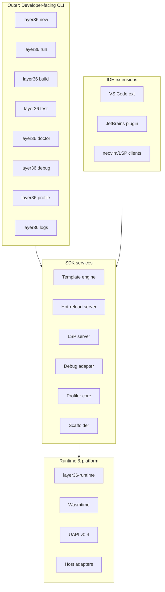
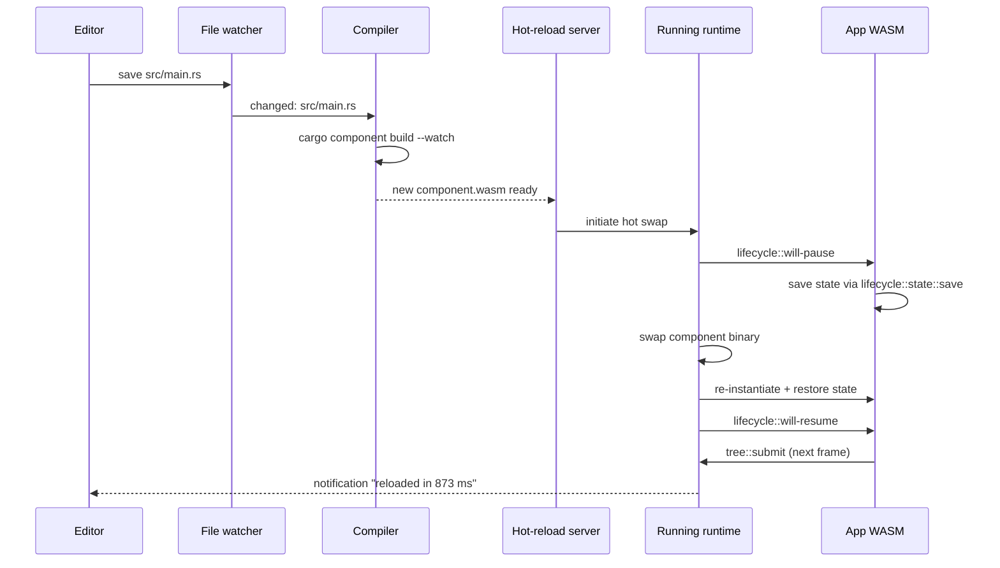
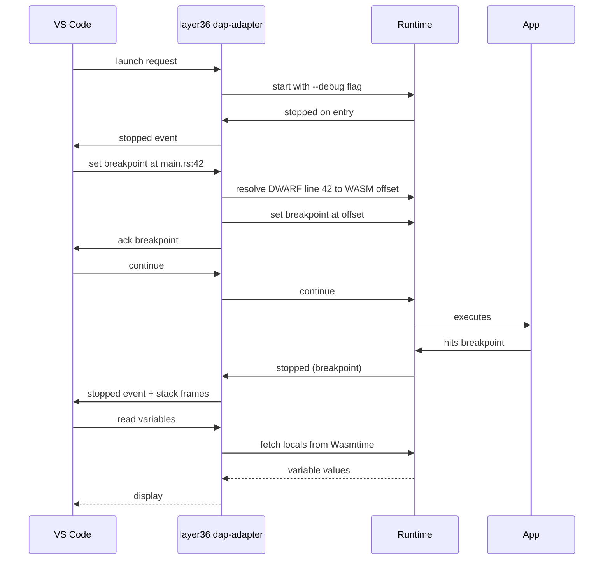
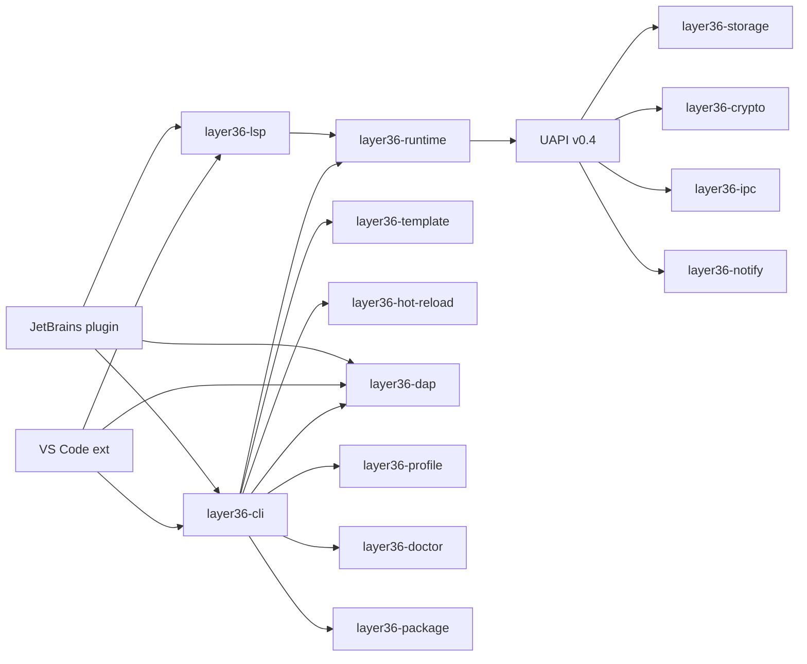
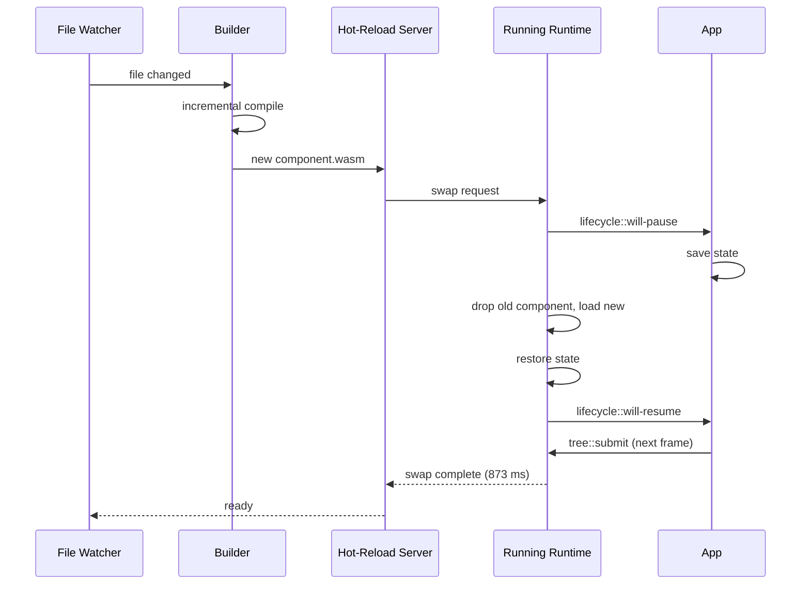

# Layer36 — Phase 5 Detailed Plan: Developer SDK

> **Phase:** 5 of 8
> **Duration:** Months 15–18 (120 calendar days, ~60–80 engineering days of work)
> **Phase sentence:** *A developer runs `layer36 new hello && layer36 run` and has a working GUI app on their machine in under 60 seconds.*
> **Prerequisite:** Phase 4 complete — mobile hosts stable, `layer36-notes` running on all five platforms.
> **Supersedes:** nothing.
> **Superseded by:** nothing.

---

## Table of Contents

0. [How to Use This Document](#0-how-to-use-this-document)
1. [Phase Objective](#1-phase-objective)
2. [Prerequisites from Phase 4](#2-prerequisites-from-phase-4)
3. [Success Criteria](#3-success-criteria)
4. [What Phase 5 Is and Is Not](#4-what-phase-5-is-and-is-not)
5. [The Developer Experience Thesis](#5-the-developer-experience-thesis)
6. [Architecture](#6-architecture)
7. [Technology Decisions](#7-technology-decisions)
8. [CLI Redesign](#8-cli-redesign)
9. [Project Templates](#9-project-templates)
10. [Hot Reload](#10-hot-reload)
11. [Debugger](#11-debugger)
12. [Profiler](#12-profiler)
13. [Language Server & IntelliSense](#13-language-server--intellisense)
14. [Additional Language Bindings (C/C++, Python)](#14-additional-language-bindings-cc-python)
15. [UAPI v0.4 Additions](#15-uapi-v04-additions)
16. [IDE Integration](#16-ide-integration)
17. [The 60-Second Promise](#17-the-60-second-promise)
18. [Week-by-Week Breakdown](#18-week-by-week-breakdown)
19. [Task Details](#19-task-details)
20. [Code Skeletons](#20-code-skeletons)
21. [Testing Strategy](#21-testing-strategy)
22. [Performance Targets](#22-performance-targets)
23. [Security & Threat Model v0.5](#23-security--threat-model-v05)
24. [Documentation Deliverables](#24-documentation-deliverables)
25. [Architecture Decision Records](#25-architecture-decision-records)
26. [Exit Criteria Checklist](#26-exit-criteria-checklist)
27. [Phase 5 Risks](#27-phase-5-risks)
28. [Handoff to Phase 6](#28-handoff-to-phase-6)
29. [Appendices](#29-appendices)

---

## 0. How to Use This Document

Phase 5 is different from the phases before it. Phases 1–4 were about making Layer36 *exist*. Phase 5 is about making Layer36 *pleasant to use*. Good DX does not appear automatically from a good platform — it is a separate engineering discipline, with its own metrics, its own risks, and its own kind of done.

- Read §5 (Developer Experience Thesis) first. Everything downstream flows from it.
- Phase 5 adds very little to the platform's *capabilities* and a lot to its *ergonomics*. If a task doesn't measurably reduce developer friction, it doesn't belong.
- The "60-second promise" in §17 is the single most important exit criterion. Hit it and Phase 5 has succeeded.
- Task IDs in §19 match Build Plan §7.6.
- Phase 5 is the last phase before user-facing distribution. Mistakes in DX surface immediately when Phase 6 tries to onboard external developers to the marketplace.

---

## 1. Phase Objective

### 1.1 One-sentence objective

**A developer who has never seen Layer36 installs the toolchain in five minutes, creates a new project in one command, modifies a template in their editor with full IntelliSense, hits save, and sees the change live on-screen within a second — all with clear error messages when anything goes wrong.**

### 1.2 Why this matters

Every platform shipped so far has lived or died at this exact boundary. Flutter's explosive growth came from `flutter create` + hot reload. React's dominance came from JSX + the browser dev tools. Rust's ecosystem exists because `cargo new` works. Phase 4 earned Layer36 the right to ask developers to try it; Phase 5 gives them a reason to stay. If the first 60 seconds feels like work, developers leave. If it feels like magic, they tell friends.

### 1.3 The six deliverables of Phase 5

1. **Unified `layer36` CLI** with `new`, `build`, `run`, `test`, `deploy`, `doctor`, `logs`, `debug`, `profile` subcommands, each polished.
2. **Project templates** for Rust, Go, and TypeScript covering CLI + GUI + mobile starting points.
3. **Hot reload** — source change to running-app-updated in ≤ 1 second on desktop, ≤ 2 seconds on mobile.
4. **Debugger integration** — breakpoints, stepping, variable inspection, works via VS Code and JetBrains IDEs.
5. **Profiler** — wall-clock + UAPI + memory, with a flamegraph view and a CLI summary.
6. **UAPI v0.4 additions** — `storage` (SQLite), `crypto`, `ipc`, `notifications` interface, `background` architecture stub.

---

## 2. Prerequisites from Phase 4

Before touching a single line of Phase 5 code, verify:

- [ ] All Phase 4 exit criteria met (Phase 4 Plan §27).
- [ ] `layer36-notes` runs on all five platforms (Windows, macOS, Linux, iOS, Android).
- [ ] UAPI v0.3 frozen: sensors, lifecycle, ui/touch, ui/navigation, ui/haptic.
- [ ] CI green on all five platform matrices for ≥ 7 consecutive days.
- [ ] ADRs 0001 through 0030 merged.
- [ ] Host packaging pipelines (`layer36 package ios/android`) functional.
- [ ] Battery + perf targets met on mobile.

If any box is unchecked, finish Phase 4 first. A SDK built on a shaky platform means every dev-friction issue is ambiguous — is the problem the SDK or the platform underneath?

---

## 3. Success Criteria

Phase 5 is **done** when, and only when, every row below is true.

| # | Criterion | Measured How |
|---|-----------|--------------|
| 1 | `layer36 new hello --lang rust && cd hello && layer36 run` produces a running GUI in < 60 seconds | Timed walkthrough, fresh machine |
| 2 | Same works with `--lang go` and `--lang ts` | Timed walkthrough |
| 3 | Edit a template, save, hot reload shows change in ≤ 1 s on desktop | Timer |
| 4 | Hot reload works on iOS simulator and Android emulator | Manual test |
| 5 | VS Code extension installs, provides syntax highlighting + IntelliSense for WIT-generated bindings | Fresh extension install test |
| 6 | JetBrains plugin equivalent functionality | Same test in CLion/RustRover/GoLand |
| 7 | Breakpoints work in all three first-class languages via Debug Adapter Protocol | Manual debug session |
| 8 | Profiler produces flamegraph + UAPI call timing report | Run `layer36 profile` on `layer36-notes` |
| 9 | `layer36 doctor` detects missing toolchain pieces and explains fix | Break environment, run doctor, verify message |
| 10 | Clear error messages: every error surfaced in 5 common failure modes is human-readable with remediation | Test plan in §24 |
| 11 | C/C++ bindings via `wasi-sdk` usable for at least one sample | `layer36-native-sample` builds |
| 12 | Python bindings via `componentize-py` usable for at least one sample | Sample runs |
| 13 | UAPI v0.4 modules merged and frozen at v0.1.0 | `wit/layer36/*.wit` |
| 14 | Storage, crypto, IPC, notifications implementations on desktop + mobile | CI green |
| 15 | ADRs 0031 through at least 0040 merged | Git log |

---

## 4. What Phase 5 Is and Is Not

### 4.1 Phase 5 IS

- A professional CLI with fast commands, good defaults, great help text, and meaningful exit codes.
- Project templates that produce working apps, not empty skeletons.
- Hot reload that *feels* instant.
- A debugger that lets you set breakpoints in your source language and have them actually hit.
- A profiler that tells you *why* your app is slow in one command.
- Language server protocol support so IntelliSense works in any modern editor.
- VS Code extension as the first-class IDE.
- Jetbrains plugin as the second-class IDE.
- C/C++ and Python bindings shipped in production form.
- Four additional UAPIs (storage, crypto, ipc, notifications stub).
- Polished error messages.
- `layer36 doctor` for environment triage.

### 4.2 Phase 5 is NOT

- Not a visual designer / WYSIWYG tool. The widget tree is text; designer tools are post-v1.0.
- Not a browser host target. WASM-in-browser for Layer36 apps is deferred to post-v1.0 — the browser is a strange host because it lacks native widgets by our definition.
- Not a plugin system for Layer36 apps (inter-component extensibility). Deferred indefinitely.
- Not a component registry for third-party libraries. Phase 6 marketplace covers apps; library registry is a separate concern for later.
- Not identity or auth. That's Phase 6.
- Not bundle signing / notarization. Phase 6.
- Not deployment to production stores. Phase 6.
- Not performance tuning of the platform itself — Phase 5 builds tools that *reveal* perf, Phase 7 tunes.
- Not a test framework beyond what each language already provides. We integrate; we don't invent.

### 4.3 Scope discipline

Tooling projects absorb unbounded scope. The single rule: if you can't explain why a new tool reduces time-to-first-successful-build or time-to-fix-a-bug, defer it.

---

## 5. The Developer Experience Thesis

### 5.1 What we believe

Developer experience is not soft. It is the single strongest predictor of adoption for a new platform. Every platform that has achieved scale in the last 30 years has had one non-negotiable property: **the first hour is delightful**. Platforms that skip this — no matter how technically superior — die in the market.

### 5.2 What we specifically target

Three metrics, measured ruthlessly:

- **Time to first successful build (TTFSB):** from clean install to a running app. Target: 60 seconds.
- **Time to fix a bug (TTFB):** from "it doesn't work" to "I know why." Target: 30 seconds for the top-10 common bugs.
- **Time to understand (TTU):** from "what does this code do?" to "now I know." Target: zero bytes of source reading when an LSP can answer instead.

Every Phase 5 decision is measured against one of these.

### 5.3 The three DX archetypes we explicitly emulate

- **Rust's `cargo`.** Single CLI, composable subcommands, fast, consistent, excellent error messages.
- **Flutter's hot reload.** Stateful hot reload. Edit code, save, see it run without losing app state. This is the gold standard.
- **TypeScript's language server.** IDE experience rivals compiled languages while keeping iteration fast.

If a Phase 5 decision is inconsistent with how `cargo`, Flutter, or TypeScript do it, we need a very good reason.

### 5.4 The anti-patterns we avoid

- **Cryptic error messages.** Every runtime error shown to a developer must include: what happened, where it happened, why, and what to try.
- **Mandatory configuration.** Defaults must produce a working app. If a developer must configure something on first use, we've failed.
- **Slow tools.** `layer36 build` on a small project is < 2 seconds. `layer36 run` from a built state is < 100 ms overhead.
- **Divergent DX per language.** The same commands work the same way regardless of whether you're writing Rust, Go, or TypeScript.

### 5.5 Recorded in

ADR-0031 contains this full reasoning. It is the foundational DX decision for Phase 5 and must be written in Week 1 before any tooling work.

---

## 6. Architecture

### 6.1 SDK-as-onion diagram



### 6.2 Hot reload flow



### 6.3 Debugger flow



### 6.4 Crate layout at end of Phase 5



### 6.5 Trust boundaries (Phase 5)

Largely unchanged from Phase 4. Developer tooling (CLI, debugger, hot-reload) runs outside the runtime trust boundary and has full access to the local file system. This is standard for dev tools — we document it clearly so users know dev mode is not a security surface.

New concern: hot-reload communicates between compiler output and running runtime via a local socket. Documented in §23.

---

## 7. Technology Decisions

Each item frozen for Phase 5 unless noted. ADR references in §25.

### 7.1 CLI framework — **`clap` v4 with derive** (continues from Phase 1)

- Already in use.
- No changes; just more subcommands.

### 7.2 Templates — **`handlebars-rs` + file-system scaffolding**

- Template files live in `templates/` with `.hbs` suffix for files needing substitution.
- Simple placeholder syntax: `{{app_name}}`, `{{app_id}}`, `{{author}}`.
- No custom template DSL. Every template must be readable by someone who knows only Rust/Go/TS + Handlebars.
- **Recorded:** ADR-0032.

### 7.3 File watcher for hot reload — **`notify` crate**

- Cross-platform file system events.
- Debounced to avoid rebuild storms during fast typing.
- **Recorded:** ADR-0033.

### 7.4 Hot reload communication — **Unix domain sockets (Linux/macOS) + named pipes (Windows)**

- Local-only IPC between `layer36` CLI and running runtime.
- Messages are length-prefixed JSON.
- Simple framing so the protocol is trivial to implement from other tools.
- **Recorded:** ADR-0034.

### 7.5 Debugger protocol — **Debug Adapter Protocol (DAP)**

- The standard for cross-editor debugging.
- Implemented by VS Code, Vim, Emacs, JetBrains.
- We implement the server side; editors speak DAP natively.
- **Recorded:** ADR-0035.

### 7.6 Debug symbols — **DWARF in Wasmtime via the `debug-info` feature**

- Wasmtime already supports DWARF passthrough.
- Requires compiler producing WASM with DWARF retained (`cargo component build --debug-info`).
- Source mapping from WASM offsets to language source is DWARF's job.
- **Recorded:** ADR-0036.

### 7.7 Language Server Protocol (LSP)

- We implement `layer36-lsp` that provides WIT-aware IntelliSense.
- For application source code (Rust/Go/TS), existing language LSPs handle the base.
- `layer36-lsp` augments with: WIT-generated type knowledge, UAPI capability hints, manifest schema validation.
- **Recorded:** ADR-0037.

### 7.8 Profiler backend — **sample-based + UAPI instrumentation**

- Sample-based wall-clock profiling via periodic stack walking (every 1 ms).
- UAPI call instrumentation is always-on in profile builds.
- Memory profiling via Wasmtime's allocation tracker.
- Output: `pprof` format (widely tooled — `go tool pprof`, speedscope.app, Chrome DevTools).
- **Recorded:** ADR-0038.

### 7.9 C/C++ bindings — **`wasi-sdk` + custom WIT headers**

- `wasi-sdk` produces WASM components from Clang today.
- We generate C headers from WIT via an extension to `wit-bindgen`.
- Target use cases: porting existing C/C++ code, game engines, numerical libraries.
- **Recorded:** ADR-0039.

### 7.10 Python bindings — **`componentize-py`**

- Upstream tool from Bytecode Alliance.
- Embeds CPython in a WASM component; apps get full Python stdlib.
- Binary size cost: 10–20 MB overhead. Acceptable for Python's audience.
- **Recorded:** ADR-0040.

### 7.11 Storage backend — **SQLite + key-value layer**

- SQLite 3 statically linked into the runtime (already a Phase 2 dep).
- Higher-level key-value API for apps that don't need SQL.
- Schema migrations declared in manifest.
- No sync / replication layer — apps own their sync via `net`.
- **Recorded:** ADR-0041.

### 7.12 Crypto provider — **`ring` + `rustls` for TLS**

- `ring` was a Phase 2 dependency; now exposed via `crypto` UAPI.
- Symmetric: AES-GCM, ChaCha20-Poly1305.
- Asymmetric: Ed25519, X25519, ECDSA P-256.
- Hashes: SHA-256, SHA-512, BLAKE3.
- PQ crypto deferred.
- **Recorded:** ADR-0042.

### 7.13 IPC — **channel-based, named rendezvous**

- No shared memory in v0.1 (too much platform variance).
- Apps create or open named channels; send/recv messages.
- Scope: same device, different apps, mediated by runtime.
- **Recorded:** ADR-0043.

### 7.14 Notifications — **interface only, per-host minimal impl**

- UAPI defined.
- Desktop: system notifications (Growl-style).
- iOS: UNUserNotificationCenter local.
- Android: NotificationCompat local.
- Push notifications (APNs, FCM) explicitly deferred to Phase 6 — needs identity.
- **Recorded:** ADR-0044.

### 7.15 What we DEFER

| Feature | Deferred to |
|---|---|
| Designer / WYSIWYG / GUI builder | Post-v1.0 |
| Visual debugger for widget tree | Post-v1.0 |
| Remote debugging (debug app running on another machine) | Phase 7 |
| Package registry for Layer36 crates | Phase 6+ |
| Background tasks, scheduled tasks | Post-v1.0 |
| Push notifications | Phase 6 |
| In-app purchases | Post-v1.0 (App Store specific) |
| Analytics / telemetry for apps | Phase 6 (opt-in) |
| Native plugin API (app loads a C library) | Post-v1.0 |
| Multi-window support in hot-reload sessions | Phase 7 |

---

## 8. CLI Redesign

### 8.1 Design principles

- Every subcommand does one thing well.
- `--help` is thorough, with examples.
- Exit codes are meaningful and documented.
- Colored output that respects `NO_COLOR` and `--no-color`.
- Machine-readable output via `--format json` on every subcommand.
- Progress bars for slow operations; quiet by default in scripts.

### 8.2 Complete subcommand inventory

| Subcommand | Purpose | Notes |
|---|---|---|
| `layer36 new <n> --lang <lang>` | Create new project from template | §9 |
| `layer36 build` | Build current project | Delegates to per-language tool |
| `layer36 run [path]` | Run a component (dev mode) | Supports hot reload |
| `layer36 test` | Run tests | Per-language test harness |
| `layer36 deploy <target>` | Build + deploy to a target | ios/android/desktop |
| `layer36 package <target>` | Build installable artifact | Wraps Phase 4 packaging |
| `layer36 debug` | Start DAP server | §11 |
| `layer36 profile [subcmd]` | Run with profiling | §12 |
| `layer36 logs` | Tail device logs | Desktop + mobile |
| `layer36 doctor` | Diagnose environment | §8.3 |
| `layer36 install` | Install Layer36 host tools | Used by install script |
| `layer36 uninstall` | Remove Layer36 installation | |
| `layer36 update` | Update Layer36 toolchain | Self-update via release API |
| `layer36 config` | Read/write user config | Global settings |
| `layer36 version` | Print versions | Already exists from Phase 1 |
| `layer36 wit` | WIT utilities | Format, validate, diff |
| `layer36 bundle` | Bundle utilities | Inspect, repack |
| `layer36 lsp` | Start language server | For editor integration |
| `layer36 init` | Init config for existing directory | |

### 8.3 `layer36 doctor` — the flagship helper

`layer36 doctor` is the CLI's face when things go wrong. A fresh user who runs it should see a checklist that makes their problem obvious.

```
$ layer36 doctor

Layer36 Environment Diagnostic
============================

Required:
  ✓ Rust toolchain           1.83.0 (stable)
  ✓ cargo-component          0.15.0
  ✓ wasm32-wasip2 target     installed
  ✓ layer36 runtime            0.5.0
  ✓ Layer36 cache directory    ~/.layer36  (456 MB used, 8.3 GB free)

Mobile (optional):
  ✓ Xcode                    15.3
  ✗ Android SDK              NOT FOUND
    Fix: install via Android Studio or sdkmanager
    Docs: https://layer36.dev/docs/setup/android
  ✓ Apple Developer account  configured

Languages (optional):
  ✓ Go (via TinyGo)          0.31.0
  ✗ Node.js (for TS support) NOT FOUND
    Fix: install Node.js 20+ (https://nodejs.org)
  ✗ Python (for py support)  NOT FOUND
    Fix: install Python 3.11+ and componentize-py

Network:
  ✓ docs.layer36.dev           reachable
  ✓ crates.io                reachable

Summary: 2 recommended issues, 0 blockers.
Run 'layer36 doctor --fix' to attempt automatic remediation where possible.
```

Every failure row has a fix line. No cryptic output.

### 8.4 Error message standards

Every error surfaced to the user follows the template:

```
error[E001]: cannot find manifest.toml
    at: ./apps/layer36-notes/
    why: layer36 build needs a manifest.toml next to your main source
    try: run 'layer36 init' here, or cd into a directory that has one
    docs: https://layer36.dev/docs/manifest
```

Code `E001` is stable. Docs URLs stable. Message text may improve over time.

### 8.5 Completion scripts

Generated for bash, zsh, fish, PowerShell. Installed automatically when a user runs `layer36 install`.

---

## 9. Project Templates

### 9.1 Template catalog (v0.1)

Nine templates. Three languages × three starting points.

| Template | Language | Starting point |
|---|---|---|
| `rust-cli` | Rust | CLI tool using Phase 2 UAPIs |
| `rust-gui` | Rust | Desktop GUI using Phase 3 UAPIs |
| `rust-mobile` | Rust | Mobile-aware GUI using Phase 4 UAPIs |
| `go-cli` | Go | CLI tool (TinyGo) |
| `go-gui` | Go | Desktop GUI (TinyGo) |
| `go-mobile` | Go | Mobile-aware GUI (TinyGo) |
| `ts-cli` | TypeScript | CLI tool (jco) |
| `ts-gui` | TypeScript | Desktop GUI (jco) |
| `ts-mobile` | TypeScript | Mobile-aware GUI (jco) |

Default if `--kind` not specified: `gui` (not `cli`). Reason: most developers evaluating Layer36 want to see the GUI, which is the differentiator.

### 9.2 Template contents (example: `rust-gui`)

```
templates/rust-gui/
├── Cargo.toml.hbs
├── manifest.toml.hbs
├── README.md.hbs
├── .gitignore
├── src/
│   └── main.rs.hbs
├── assets/
│   ├── icon.png
│   └── splash.png
└── wit/
    └── world.wit.hbs
```

Generated project is immediately buildable — no extra steps, no "now install X."

### 9.3 Template UX

```
$ layer36 new hello

? What kind of app? [GUI (default) / CLI / Mobile]
GUI

? What language?  [Rust (default) / Go / TypeScript]
Rust

? Package name?  (default: hello)
hello

? App title?  (default: Hello)
Hello

Creating project in ./hello ...
  ✓ Cargo.toml
  ✓ manifest.toml
  ✓ src/main.rs
  ✓ assets/icon.png
  ✓ README.md

Done. Next steps:
  cd hello
  layer36 run

First build will take ~30 seconds. Subsequent rebuilds are instant.
```

If `--lang rust --kind gui hello` provided inline, no prompts — fully non-interactive.

### 9.4 Template quality gate

Every template must:

1. Build successfully on CI across all target platforms relevant to it.
2. Run successfully via `layer36 run`.
3. Be < 200 lines total.
4. Have a one-paragraph README explaining what it does.
5. Have zero TODO comments.
6. Use UCap capabilities conservatively (request only what the template demonstrates).

### 9.5 Template versioning

- Templates ship with the `layer36` CLI.
- Each template includes a `template.toml` with version.
- On `layer36 new`, the CLI warns if a newer template is available via `layer36 update`.
- Templates are public domain or CC0 — no license friction for generated apps.

---

## 10. Hot Reload

### 10.1 The target experience

- Developer edits `src/main.rs`.
- Saves.
- App on screen updates within 1 second, preserving state where possible.
- If preservation fails, app restarts with clear message.

### 10.2 Architecture

Three components collaborate:

- **File watcher** — notices the save event, debounces, invokes the builder.
- **Builder** — runs the language's compile step (incremental where possible).
- **Hot-reload server** — attached to the running app's runtime; receives new binary; drives swap.

### 10.3 Swap protocol



### 10.4 State preservation

- Runtime calls `lifecycle::state::save` before swap.
- New component starts; runtime calls `lifecycle::state::load`.
- If the new component's state schema is incompatible, `load` returns empty and the app reinitializes.
- Apps that want perfect hot reload opt in to versioned state blobs.

### 10.5 What hot reload does NOT preserve

- Open file handles — closed on swap; reopened by app if needed.
- Network connections — closed.
- GPU resources — recreated (wgpu device typically persists; textures may reload).
- Running animations — reset.

This is documented prominently; developers know to expect a small perceptible blink on swap, not a fully seamless transition.

### 10.6 Fallback: full restart

If swap fails (incompatible ABI, WASM validation error, crash during swap), the runtime cleanly kills the app and restarts it, showing the developer the error with context.

### 10.7 Mobile hot reload

Same architecture, with adjustments:
- File watcher runs on dev machine.
- New `.wasm` sent over network (Wi-Fi or USB) to device.
- Device runtime performs swap locally.
- Latency: 1–2 s on Wi-Fi; 500 ms on USB with ADB/idevice tools.

### 10.8 Disabling hot reload

`layer36 run --no-reload` for production-style runs. Default is hot reload on when run from a project directory.

---

## 11. Debugger

### 11.1 What we implement

A DAP (Debug Adapter Protocol) server that sits between IDEs and the Layer36 runtime. Apps debugged through this server get:

- Breakpoints (line + conditional + logpoint).
- Step over / into / out.
- Call stack.
- Local variables + expressions.
- Watch expressions.
- Exception breakpoints.
- Hot restart (faster than full restart when structure changes).

### 11.2 Language coverage

| Language | Support | Notes |
|---|---|---|
| Rust | Full | DWARF from `cargo component build --debug-info` |
| Go | Partial | TinyGo's DWARF output is limited; best-effort |
| TypeScript | Full | jco ships source maps; we map WASM offsets via sourcemap |
| C/C++ | Full | DWARF native |
| Python | Partial | pyruntime stack frames exposed differently; best-effort |

### 11.3 The DAP layer

Our DAP server implements the standard protocol. It exposes:

- `launch` / `attach` — start a debugged process or attach to running.
- `setBreakpoints` / `setExceptionBreakpoints`.
- `continue` / `next` / `stepIn` / `stepOut`.
- `stackTrace` / `scopes` / `variables`.
- `evaluate` — expression evaluation in target scope.

### 11.4 VS Code integration

```json
// .vscode/launch.json produced by the template
{
  "version": "0.2.0",
  "configurations": [
    {
      "type": "layer36",
      "request": "launch",
      "name": "Run with debugger",
      "program": "${workspaceFolder}",
      "args": [],
      "stopOnEntry": false
    }
  ]
}
```

The `layer36` debug type is registered by the VS Code extension (§16).

### 11.5 JetBrains integration

Same DAP server. JetBrains IDEs have native DAP support in recent versions — the plugin registers the debug type and provides a run configuration.

### 11.6 Performance target

- Starting a debug session: < 3 s from F5 to stopped on entry.
- Breakpoint hit latency: < 50 ms from instruction at breakpoint to IDE update.
- Variable fetch: < 100 ms for a typical stack frame.

### 11.7 Things debuggers traditionally struggle with

| Challenge | Our approach |
|---|---|
| Async code (Rust `async`, JS `Promise`) | Show logical call frames using language-specific decoders |
| Generics / monomorphization | DWARF reports concrete types per instantiation |
| Inlined functions | DWARF `DW_TAG_inlined_subroutine` |
| Macro-expanded code | Source mapping to macro source where possible |
| Hot reload mid-debug | Disallowed in debug sessions; force restart |

---

## 12. Profiler

### 12.1 Three profile types

- **CPU / wall-clock** — where is the app spending time?
- **UAPI** — how often is each UAPI function called, for how long?
- **Memory** — current heap, allocations/deallocations, peaks.

### 12.2 CLI UX

```
$ layer36 profile run apps/layer36-notes

Starting app with profiling...
(run your normal workflow; press Ctrl+C to stop)

^C
Profile captured: 127 samples, 12.3 s elapsed

Top 10 functions by wall time:
  33.2%  vello::render_scene
  15.8%  harfbuzz_rs::shape
  12.1%  layer36_reconcile::diff
   8.7%  layer36_ui_macos::update_widget
   ...

UAPI call hotspots:
  14,201  ui::tree::submit       avg 1.8 ms
   3,987  fs::open               avg 52 µs
   1,544  net::fetch             avg 120 ms
   ...

Memory: peak 108 MB, current 92 MB
Writing profile data to ./profile-20260812-152303.pprof
Open in speedscope? [Y/n]
```

### 12.3 Profile output format

- `pprof` format for industry-standard tooling.
- HTML flamegraph for quick browsing.
- Raw JSON export for custom analysis.

### 12.4 Always-on lightweight metrics

Even outside `layer36 profile`, the runtime collects:
- Frame time distribution.
- UAPI call counts (no timing).
- Memory high-water mark.

Exposed via `layer36 stats <pid>` or the `uapi::platform::telemetry` interface.

### 12.5 GPU profiling

For wgpu-heavy apps:
- `layer36 profile gpu` produces a RenderDoc-compatible capture.
- Integrates with wgpu's existing `--capture` flag.

---

## 13. Language Server & IntelliSense

### 13.1 What `layer36-lsp` adds

Base language LSPs (`rust-analyzer`, `gopls`, `tsserver`) handle most of the work. `layer36-lsp` augments with:

- **WIT-aware completion:** when a developer writes `layer36::`, completions come from the imported world's interfaces.
- **UAPI capability hints:** hover over a UAPI call, see which caps are required.
- **Manifest validation:** `manifest.toml` gets live validation against the schema.
- **WIT file editing:** full syntax + semantic support for `.wit` files.
- **Diagnostic cross-linking:** clicking an error about a missing cap jumps to the manifest.

### 13.2 How it coexists with base LSPs

VS Code supports multiple LSP servers per file via extensions. `layer36-lsp` registers for:
- `*.wit` files (primary)
- `manifest.toml` (primary)
- `*.rs`, `*.go`, `*.ts` in a Layer36 project (secondary; supplements existing servers)

### 13.3 Fast or useless

LSP responses > 200 ms degrade the IDE experience. Budget:
- Document open: < 500 ms to full diagnostics.
- Completion: < 100 ms.
- Hover: < 100 ms.
- Go-to-definition: < 150 ms.

If our LSP exceeds these, it's not shipping.

### 13.4 Implementation

- Rust using `tower-lsp` crate (mature LSP framework).
- Background index of WIT files using `wasm-tools`.
- Incremental updates — don't re-parse on every keystroke.

---

## 14. Additional Language Bindings (C/C++, Python)

### 14.1 Why now

Three first-class languages (Rust, Go, TS) cover ~70% of developers. C/C++ adds another 15% (game devs, native porters) and Python adds another 10% (data/AI). Phase 5 includes them because:

- Marketplace apps in Phase 6 benefit from language diversity.
- The SDK story is stronger when "bring your existing code" works for more code.
- C/C++ in particular unblocks major potential contributors (game engines, existing native libraries).

### 14.2 C/C++ via `wasi-sdk`

- Clang targeting `wasm32-wasip2`.
- `wit-bindgen` emits C headers from WIT.
- Sample: `layer36-sample-c` — a minimal CLI in C that calls `io`, `fs`, `net`.
- Build driver: `layer36 build` auto-detects `CMakeLists.txt` or `Makefile`.

### 14.3 Python via `componentize-py`

- Embeds CPython + app `.py` files into a component.
- `wit-bindgen-py` generates Python bindings from WIT.
- Sample: `layer36-sample-py` — reads a CSV, POSTs to HTTP, logs.
- Binary size: 10–20 MB overhead acceptable for Python's target use case.

### 14.4 Swift (embedded) — experimental

- "Embedded Swift" is emerging — Apple's subset of Swift suitable for WASM.
- We track it; Phase 5 includes a proof-of-concept sample but not production support.
- Full Swift support likely Phase 7+ or post-v1.0.

### 14.5 Kotlin — not yet

- Kotlin/Native → WASM is not production-ready.
- Deferred indefinitely.
- Kotlin remains the Android *host shell* language, not an app language.

---

## 15. UAPI v0.4 Additions

Four additions, each versioned @0.1.0. Total new interfaces: 4. Total LOC of WIT: ~300.

### 15.1 `layer36:storage@0.1.0`

Key-value + SQL, SQLite-backed.

```wit
// wit/layer36/storage.wit
package layer36:storage@0.1.0;

interface types {
    variant storage-error {
        not-found,
        invalid-key,
        too-large,
        schema-mismatch(string),
        io(string),
    }
}

interface kv {
    use types.{storage-error};

    /// Get a value by key. Key is any UTF-8 string.
    get: func(key: string) -> result<option<list<u8>>, storage-error>;
    /// Set a value; overwrites.
    set: func(key: string, value: list<u8>) -> result<_, storage-error>;
    /// Delete a key.
    remove: func(key: string) -> result<_, storage-error>;
    /// List keys matching a prefix.
    list: func(prefix: string) -> result<list<string>, storage-error>;
}

interface sql {
    use types.{storage-error};

    record row { values: list<sql-value> }
    variant sql-value {
        null-value,
        integer(s64),
        real(f64),
        text(string),
        blob(list<u8>),
    }

    resource statement {
        bind: func(idx: u32, val: sql-value) -> result<_, storage-error>;
        step: func() -> result<option<row>, storage-error>;
        reset: func() -> result<_, storage-error>;
    }

    prepare: func(query: string) -> result<statement, storage-error>;
    execute: func(query: string, params: list<sql-value>) -> result<u64, storage-error>;
}

world consumer {
    import kv;
    import sql;
}
```

Design notes:
- Per-app database in sandbox; no cross-app access.
- KV keys scoped to app; no collision across apps.
- Schema migrations declared in manifest, applied at launch.

### 15.2 `layer36:crypto@0.1.0`

```wit
// wit/layer36/crypto.wit
package layer36:crypto@0.1.0;

interface hash {
    enum algo { sha256, sha512, blake3 }

    compute: func(algo: algo, data: list<u8>) -> list<u8>;

    resource hasher {
        update: func(data: list<u8>);
        finalize: func() -> list<u8>;
    }

    create-hasher: func(algo: algo) -> hasher;
}

interface symmetric {
    variant cipher { aes-256-gcm, chacha20-poly1305 }

    variant crypto-error {
        invalid-key,
        invalid-nonce,
        decryption-failed,
        other(string),
    }

    encrypt: func(
        cipher: cipher,
        key: list<u8>,
        nonce: list<u8>,
        plaintext: list<u8>,
        aad: list<u8>,
    ) -> result<list<u8>, crypto-error>;

    decrypt: func(
        cipher: cipher,
        key: list<u8>,
        nonce: list<u8>,
        ciphertext: list<u8>,
        aad: list<u8>,
    ) -> result<list<u8>, crypto-error>;
}

interface asymmetric {
    variant scheme { ed25519, x25519, ecdsa-p256 }
    variant crypto-error { /* same as above */ }

    record keypair {
        public: list<u8>,
        private: list<u8>,
    }

    generate: func(scheme: scheme) -> result<keypair, crypto-error>;
    sign: func(scheme: scheme, private-key: list<u8>, message: list<u8>) -> result<list<u8>, crypto-error>;
    verify: func(scheme: scheme, public-key: list<u8>, message: list<u8>, signature: list<u8>) -> result<bool, crypto-error>;
}

interface random {
    bytes: func(n: u32) -> list<u8>;
}

world consumer {
    import hash;
    import symmetric;
    import asymmetric;
    import random;
}
```

### 15.3 `layer36:ipc@0.1.0`

```wit
// wit/layer36/ipc.wit
package layer36:ipc@0.1.0;

interface channel {
    variant ipc-error {
        not-found,
        already-open,
        permission-denied,
        closed,
        too-large,
        other(string),
    }

    resource endpoint {
        send: func(message: list<u8>) -> result<_, ipc-error>;
        recv: func() -> result<option<list<u8>>, ipc-error>;
        close: func();
    }

    /// Create a new channel with a name. Caller waits for peer connect.
    listen: func(name: string) -> result<endpoint, ipc-error>;

    /// Connect to a channel by name.
    connect: func(name: string) -> result<endpoint, ipc-error>;
}

world consumer {
    import channel;
}
```

Names are scoped: `<app-id>/<channel-name>`. Cross-app requires the target app's `ipc.allow:<their-app>` cap.

### 15.4 `layer36:notifications@0.1.0`

```wit
// wit/layer36/notifications.wit
package layer36:notifications@0.1.0;

interface local {
    variant notify-error {
        permission-denied,
        not-supported,
        other(string),
    }

    record notification {
        title: string,
        body: string,
        icon: option<string>,     // asset path
        tag: option<string>,      // for grouping/updating
        sound: option<string>,    // asset path, platform support varies
    }

    post: func(n: notification) -> result<string, notify-error>;  // returns id
    update: func(id: string, n: notification) -> result<_, notify-error>;
    remove: func(id: string) -> result<_, notify-error>;
    clear-all: func();
}

world consumer {
    import local;
}
```

Push notifications (server-driven) deliberately absent — needs identity + infrastructure; Phase 6.

### 15.5 Updated consolidated `world`

```wit
// wit/layer36/app.wit
package layer36:app@0.4.0;

world full {
    // Phase 2
    import layer36:io/stdio@0.1.0;
    import layer36:io/log@0.1.0;
    import layer36:fs/files@0.1.0;
    import layer36:net/http-client@0.1.0;
    import layer36:time/clock@0.1.0;
    import layer36:time/sleep@0.1.0;
    import layer36:locale/info@0.1.0;
    import layer36:locale/format@0.1.0;

    // Phase 3
    import layer36:ui/window@0.1.0;
    import layer36:ui/tree@0.1.0;
    import layer36:ui/events@0.1.0;
    import layer36:ui/dialog@0.1.0;
    import layer36:ui/clipboard@0.1.0;
    import layer36:ui/menu@0.1.0;
    import layer36:gfx/canvas2d@0.1.0;
    import layer36:gfx/gpu3d@0.1.0;
    import layer36:audio/playback@0.1.0;
    import layer36:audio/capture@0.1.0;

    // Phase 4
    import layer36:ui/touch@0.1.0;
    import layer36:ui/navigation@0.1.0;
    import layer36:sensors/motion@0.1.0;
    import layer36:sensors/location@0.1.0;
    import layer36:sensors/camera@0.1.0;
    import layer36:lifecycle/events@0.1.0;
    import layer36:lifecycle/state@0.1.0;

    // Phase 5
    import layer36:storage/kv@0.1.0;
    import layer36:storage/sql@0.1.0;
    import layer36:crypto/hash@0.1.0;
    import layer36:crypto/symmetric@0.1.0;
    import layer36:crypto/asymmetric@0.1.0;
    import layer36:crypto/random@0.1.0;
    import layer36:ipc/channel@0.1.0;
    import layer36:notifications/local@0.1.0;

    export run: func() -> s32;
}
```

Earlier worlds (`cli`, `gui`, `mobile`) remain valid.

---

## 16. IDE Integration

### 16.1 VS Code extension

Lives at `extensions/vscode/`.

**Features:**
- Syntax highlighting for `.wit`.
- Integrates `layer36-lsp` via LSP client.
- Registers `layer36` debug type.
- Commands: `Layer36: New Project`, `Layer36: Run`, `Layer36: Package`.
- Status bar item showing current Layer36 project + runtime version.
- Manifest schema contribution for `manifest.toml`.

**Publish target:** VS Code Marketplace.

### 16.2 JetBrains plugin

Lives at `extensions/jetbrains/`.

**Features:**
- Plugin for CLion, RustRover, GoLand, WebStorm, IntelliJ.
- DAP integration (JetBrains native DAP support).
- `layer36-lsp` integration (JetBrains LSP support since 2023.3).
- File templates for WIT and manifest.
- Run configurations for Layer36 apps.

**Publish target:** JetBrains Marketplace.

### 16.3 Other editors

- **Neovim / Emacs / Helix:** work out of the box via LSP once `layer36-lsp` is installed. Example configs in docs.
- **Zed:** LSP integration docs.

No custom plugins for these editors in Phase 5 — the LSP-based story is enough.

### 16.4 Extension release cadence

- Extensions ship with the same version as the CLI.
- Auto-update via Marketplace.
- Bundled LSP binary matches CLI version.

---

## 17. The 60-Second Promise

### 17.1 The claim

From a fresh machine with no Layer36 installed, a developer can:

```
1. Install Layer36                                        (20 s)
2. Run `layer36 new hello && cd hello`                    (10 s)
3. Run `layer36 run`                                      (25 s on first build)
4. See the app window with a "Hello" button             (5 s)
```

Total: 60 seconds.

### 17.2 How we earn it

| Step | Time budget | How |
|---|---|---|
| Install | < 20 s | Single-script installer; prebuilt binary; fast CDN |
| `layer36 new` | < 10 s | Template is small; no network fetch needed |
| First `layer36 run` | < 25 s | First build is slow (dependencies compile); all subsequent builds are < 2 s |
| First paint | < 5 s | Runtime cold start + window open |

### 17.3 The test

- Every Phase 5 release, time the 60-second walkthrough on a fresh VM for each platform.
- Publish the numbers in `docs/book/src/phase5/60-second-benchmark.md`.
- If it creeps above 90 seconds, file P1 issue.

### 17.4 The second-time promise

After first install, subsequent `layer36 new + run` cycles should complete in < 15 s. This comes free once dependencies are cached.

### 17.5 Why 60 and not 30

- Honest target that's reachable without compromising quality.
- 30 s requires skipping real work (first build is unavoidable).
- 60 s is measurably better than Flutter (~90 s) and React Native (~120 s) for equivalent output.

---

## 18. Week-by-Week Breakdown

Sized for 16 weeks calendar, ~60–80 engineering days.

### Weeks 1–2: Architecture, ADRs, CLI redesign

- Write ADR-0031 (DX thesis), ADR-0032 (templates), ADR-0033 (file watcher), ADR-0034 (hot reload IPC), ADR-0035 (DAP), ADR-0036 (DWARF), ADR-0037 (LSP), ADR-0038 (profiler), ADR-0039 (C/C++), ADR-0040 (Python), ADR-0041 (storage), ADR-0042 (crypto), ADR-0043 (IPC), ADR-0044 (notifications).
- CLI command inventory finalized.
- `layer36 doctor` implementation started.

### Weeks 3–4: Templates + `layer36 new`

- Nine templates authored.
- Template engine (handlebars-based).
- Interactive + non-interactive modes of `layer36 new`.
- CI validates every template builds and runs.

### Weeks 5–6: Hot reload

- File watcher.
- Build pipeline orchestration.
- IPC protocol.
- Runtime swap logic.
- State preservation tests.
- Mobile hot reload over ADB / idevice tools.

### Weeks 7–8: Debugger

- DAP server implementation.
- DWARF → WASM offset mapping.
- Variable inspection across languages.
- VS Code extension debug type registration.
- JetBrains plugin debug type registration.

### Week 9: Profiler

- Sample-based CPU profiler.
- UAPI call instrumentation.
- Memory profiling via Wasmtime allocator.
- pprof output.
- HTML flamegraph generator.

### Weeks 10–11: LSP + editor extensions

- `layer36-lsp` implementation.
- WIT syntax + semantics.
- Manifest validation.
- VS Code extension: publish to Marketplace.
- JetBrains plugin: publish to Marketplace.

### Week 12: C/C++ + Python bindings

- `wasi-sdk` integration.
- WIT → C header generator.
- `componentize-py` integration.
- `layer36-sample-c` and `layer36-sample-py`.

### Week 13: UAPI v0.4 — storage + crypto

- WIT files.
- Desktop + mobile adapter implementations.
- `ring`-backed crypto.
- SQLite-backed storage + KV.

### Week 14: UAPI v0.4 — IPC + notifications

- WIT files.
- Channel-based IPC implementation.
- System notification impl per host.

### Week 15: Error message pass + 60-second benchmarks

- Audit every user-facing error message.
- Time the 60-second walkthrough on all target platforms.
- Fix anything > 90 s.

### Week 16: Polish + exit criteria + retro

- Walk exit criteria checklist.
- External developer walkthrough.
- Retrospective.
- Phase 6 kickoff plan.

---

## 19. Task Details

Matches Build Plan §7.6 task IDs.

### P5-CLI-01 — `layer36 new`

**Estimate:** 3 days.
**Branch:** `p5-cli-01-new`.
**Acceptance:**
- Interactive + non-interactive modes.
- All nine templates work.
- Generated project builds on first try.

### P5-CLI-02 — `layer36 build`

**Estimate:** 2 days.
**Branch:** `p5-cli-02-build`.
**Acceptance:**
- Auto-detects language from manifest.
- Delegates to `cargo component build` / `tinygo build` / `jco componentize` as appropriate.
- Caches compiled output in `~/.layer36/cache/`.

### P5-CLI-03 — `layer36 test`

**Estimate:** 2 days.
**Branch:** `p5-cli-03-test`.
**Acceptance:**
- Wraps `cargo test`, `go test`, `jest` with consistent output.
- Prints summary with exit code 0 or 1.
- Supports `--json` for CI.

### P5-CLI-04 — `layer36 doctor`

**Estimate:** 2 days.
**Branch:** `p5-cli-04-doctor`.
**Acceptance:**
- Checks all required + optional tools.
- Every failure includes fix line.
- `--fix` attempts automatic remediation for safe fixes (e.g., installing `cargo-component`).

### P5-HOT-01 — Hot reload architecture RFC

**Estimate:** 2 days.
**Branch:** `p5-hot-01-rfc`.
**Acceptance:**
- RFC merged with the design from §10.
- Reviewed by at least one engineer familiar with Flutter/React hot reload.

### P5-HOT-02 — Hot reload implementation

**Estimate:** 7 days.
**Branch:** `p5-hot-02-impl`.
**Acceptance:**
- File watcher + builder + runtime swap working on desktop.
- State preservation via lifecycle UAPI.
- Mobile hot reload via ADB / idevice_id.
- Swap latency < 1 s on desktop for small changes.

### P5-DBG-01 — DWARF in component format

**Estimate:** 5 days.
**Branch:** `p5-dbg-01-dwarf`.
**Acceptance:**
- Components produced by `cargo component build --debug-info` contain DWARF.
- DAP adapter maps source lines to WASM offsets correctly.
- Tested for Rust, TypeScript, C.

### P5-DBG-02 — VS Code extension skeleton

**Estimate:** 3 days.
**Branch:** `p5-dbg-02-vscode`.
**Acceptance:**
- Extension installs from .vsix.
- Registers `layer36` debug type.
- Launches debug adapter, connects to app.

### P5-DBG-03 — Breakpoints + step-through

**Estimate:** 7 days.
**Branch:** `p5-dbg-03-breakpoints`.
**Acceptance:**
- Line breakpoints hit in Rust, TS, C samples.
- Step over / into / out work.
- Variable inspection displays values correctly.

### P5-PROF-01 — Flamegraph for UAPI calls

**Estimate:** 3 days.
**Branch:** `p5-prof-01-flamegraph`.
**Acceptance:**
- `layer36 profile run <app>` produces flamegraph HTML.
- UAPI calls show as aggregated leaf nodes.
- Accurate to within 5% vs external measurement.

### P5-PROF-02 — Heap snapshots

**Estimate:** 3 days.
**Branch:** `p5-prof-02-heap`.
**Acceptance:**
- `layer36 profile heap <app>` captures snapshots.
- pprof output with allocation sites.

### P5-LSP-01 — WIT language server

**Estimate:** 3 days.
**Branch:** `p5-lsp-01-wit`.
**Acceptance:**
- `layer36-lsp` serves WIT files.
- Syntax + semantic errors, goto-definition, hover.

### P5-LSP-02 — LSP integration in editors

**Estimate:** 3 days.
**Branch:** `p5-lsp-02-editors`.
**Acceptance:**
- VS Code extension forwards WIT/manifest files to `layer36-lsp`.
- JetBrains plugin equivalent.
- Documented setup for neovim / Emacs / Helix.

### P5-TMPL-01 — Rust templates

**Estimate:** 1 day.
**Branch:** `p5-tmpl-01-rust`.
**Acceptance:**
- `rust-cli`, `rust-gui`, `rust-mobile` templates build on first run.
- CI validates on every PR.

### P5-TMPL-02 — Go templates

**Estimate:** 1 day.
**Branch:** `p5-tmpl-02-go`.
**Acceptance:**
- Same for TinyGo.

### P5-TMPL-03 — TypeScript templates

**Estimate:** 1 day.
**Branch:** `p5-tmpl-03-ts`.
**Acceptance:**
- Same for jco.

### P5-DOC-01 — "Your first 60 seconds" tutorial

**Estimate:** 2 days.
**Branch:** `p5-doc-01-60s`.
**Acceptance:**
- Walkthrough lives at `docs/book/src/tutorial/first-60-seconds.md`.
- Includes asciinema recording.
- Tested on fresh VM in each platform.

---

## 20. Code Skeletons

### 20.1 `layer36 new` entry point

```rust
// crates/cli/src/commands/new.rs
use clap::Args;
use anyhow::Result;

#[derive(Args)]
pub struct NewArgs {
    /// Name of the project
    name: String,

    /// Language: rust, go, ts
    #[arg(long)]
    lang: Option<String>,

    /// Kind: cli, gui, mobile
    #[arg(long)]
    kind: Option<String>,

    /// App ID (reverse-DNS)
    #[arg(long)]
    id: Option<String>,

    /// Don't prompt; use defaults
    #[arg(long)]
    no_interactive: bool,
}

pub fn run(args: NewArgs) -> Result<()> {
    let lang = resolve_lang(&args)?;
    let kind = resolve_kind(&args)?;
    let id = resolve_id(&args)?;

    let template = Template::load(&format!("{}-{}", lang, kind))?;
    let ctx = TemplateContext {
        app_name: args.name.clone(),
        app_id: id,
        author: current_author(),
        ..Default::default()
    };

    let target = std::path::PathBuf::from(&args.name);
    template.render(&target, &ctx)?;

    print_next_steps(&target);
    Ok(())
}

fn print_next_steps(target: &std::path::Path) {
    println!();
    println!("Done. Next steps:");
    println!("  cd {}", target.display());
    println!("  layer36 run");
    println!();
    println!("First build will take ~30 seconds. Subsequent rebuilds are instant.");
}
```

### 20.2 File watcher skeleton

```rust
// crates/hot-reload/src/watcher.rs
use notify::{Event, EventKind, RecursiveMode, Watcher};
use tokio::sync::mpsc;
use std::path::Path;

pub fn watch(
    paths: &[&Path],
    debounce_ms: u64,
) -> Result<mpsc::Receiver<Vec<std::path::PathBuf>>, anyhow::Error> {
    let (tx, rx) = mpsc::channel::<Vec<std::path::PathBuf>>(16);
    let (raw_tx, mut raw_rx) = mpsc::channel::<Event>(256);

    let mut watcher = notify::recommended_watcher(move |res| {
        if let Ok(ev) = res {
            let _ = raw_tx.blocking_send(ev);
        }
    })?;

    for p in paths {
        watcher.watch(p, RecursiveMode::Recursive)?;
    }

    // Debounce loop
    tokio::spawn(async move {
        let mut pending: Vec<std::path::PathBuf> = Vec::new();
        let debounce = std::time::Duration::from_millis(debounce_ms);

        loop {
            tokio::select! {
                Some(ev) = raw_rx.recv() => {
                    if let EventKind::Modify(_) | EventKind::Create(_) = ev.kind {
                        pending.extend(ev.paths);
                    }
                }
                _ = tokio::time::sleep(debounce), if !pending.is_empty() => {
                    let batch = std::mem::take(&mut pending);
                    let _ = tx.send(batch).await;
                }
            }
        }
    });

    Ok(rx)
}
```

### 20.3 Hot reload server protocol

```rust
// crates/hot-reload/src/protocol.rs
use serde::{Serialize, Deserialize};

#[derive(Serialize, Deserialize)]
#[serde(tag = "type")]
pub enum Message {
    Hello { version: String },
    NewBinary { path: String, hash: String, size: u64 },
    SwapRequest { path: String },
    SwapComplete { elapsed_ms: u32 },
    SwapFailed { reason: String },
    Log { level: String, message: String },
}

pub fn encode(msg: &Message) -> Vec<u8> {
    let json = serde_json::to_vec(msg).unwrap();
    let len = json.len() as u32;
    let mut out = Vec::with_capacity(4 + json.len());
    out.extend_from_slice(&len.to_le_bytes());
    out.extend_from_slice(&json);
    out
}

pub async fn decode<R: tokio::io::AsyncReadExt + Unpin>(r: &mut R)
    -> std::io::Result<Message>
{
    use tokio::io::AsyncReadExt;
    let len = r.read_u32_le().await?;
    let mut buf = vec![0u8; len as usize];
    r.read_exact(&mut buf).await?;
    Ok(serde_json::from_slice(&buf).map_err(|e|
        std::io::Error::new(std::io::ErrorKind::InvalidData, e))?)
}
```

### 20.4 DAP adapter skeleton

```rust
// crates/dap/src/lib.rs
use dap::types::{Breakpoint, Source, StackFrame, Variable};

pub struct OneOsDapServer {
    runtime: RuntimeHandle,
    source_map: SourceMap,
}

impl OneOsDapServer {
    pub async fn handle_launch(&mut self, program: &str) -> Result<(), DapError> {
        self.runtime.launch_paused(program).await?;
        Ok(())
    }

    pub async fn handle_set_breakpoints(
        &mut self,
        source: Source,
        lines: Vec<u32>,
    ) -> Result<Vec<Breakpoint>, DapError> {
        let mut result = Vec::new();
        for line in lines {
            match self.source_map.map_line(&source.path, line) {
                Some(wasm_offset) => {
                    self.runtime.set_breakpoint(wasm_offset).await?;
                    result.push(Breakpoint {
                        verified: true,
                        line: Some(line),
                        ..Default::default()
                    });
                }
                None => {
                    result.push(Breakpoint {
                        verified: false,
                        message: Some("no code at this line".into()),
                        ..Default::default()
                    });
                }
            }
        }
        Ok(result)
    }

    pub async fn handle_stack_trace(&self) -> Result<Vec<StackFrame>, DapError> {
        let frames = self.runtime.stack_trace().await?;
        Ok(frames.into_iter().map(|f| self.frame_to_dap(f)).collect())
    }
}
```

### 20.5 SQL UAPI app usage

```rust
// Developer-visible API
use layer36::storage::sql;

fn main() -> i32 {
    sql::execute("CREATE TABLE IF NOT EXISTS notes (id INTEGER PRIMARY KEY, title TEXT, body TEXT)", vec![]).unwrap();

    sql::execute(
        "INSERT INTO notes (title, body) VALUES (?, ?)",
        vec![
            sql::SqlValue::Text("Meeting".into()),
            sql::SqlValue::Text("Discussed Phase 5 plan".into()),
        ],
    ).unwrap();

    let mut stmt = sql::prepare("SELECT id, title FROM notes").unwrap();
    while let Ok(Some(row)) = stmt.step() {
        if let (Some(sql::SqlValue::Integer(id)), Some(sql::SqlValue::Text(title))) =
            (row.values.get(0), row.values.get(1))
        {
            println!("{}: {}", id, title);
        }
    }
    0
}
```

### 20.6 Error message format

```rust
// crates/errors/src/lib.rs
pub struct OneOsError {
    pub code: &'static str,
    pub what: String,
    pub at: Option<String>,
    pub why: String,
    pub try_: String,
    pub docs: &'static str,
}

impl std::fmt::Display for OneOsError {
    fn fmt(&self, f: &mut std::fmt::Formatter<'_>) -> std::fmt::Result {
        writeln!(f, "error[{}]: {}", self.code, self.what)?;
        if let Some(at) = &self.at {
            writeln!(f, "    at: {}", at)?;
        }
        writeln!(f, "   why: {}", self.why)?;
        writeln!(f, "   try: {}", self.try_)?;
        writeln!(f, "  docs: {}", self.docs)
    }
}

// Example use
pub fn err_no_manifest(cwd: &Path) -> OneOsError {
    OneOsError {
        code: "E001",
        what: "cannot find manifest.toml".into(),
        at: Some(cwd.display().to_string()),
        why: "layer36 build needs a manifest.toml next to your main source".into(),
        try_: "run 'layer36 init' here, or cd into a directory that has one".into(),
        docs: "https://layer36.dev/docs/manifest",
    }
}
```

---

## 21. Testing Strategy

### 21.1 New levels added in Phase 5

| Level | Tool | What's new |
|---|---|---|
| Unit | cargo test | Template engine, DAP adapter, LSP server |
| Integration | custom | End-to-end `layer36 new` → `layer36 run` pipelines |
| Fresh-machine | CI VMs | Every Phase 5 release times a fresh install + first-run cycle |
| Extension | vsce + IntelliJ plugin test framework | Installs, activates, provides expected commands |
| Profiler | custom | Profiling output validated against known benchmarks |

### 21.2 Fresh-machine testing

Critical: before every Phase 5 release, run the 60-second benchmark on:
- A fresh Ubuntu VM (no prior toolchain).
- A fresh macOS VM.
- A fresh Windows VM.
- A fresh iOS simulator boot.
- A fresh Android AVD.

Results published to the benchmark page.

### 21.3 Template CI matrix

Every template × every platform × every language — built and run on every PR. This is large (9 templates × 5 platforms = 45 combinations) so it runs nightly + on `main` merges; PR runs use a sampled subset.

### 21.4 DX regression tests

Automated tests that time:
- `layer36 new` → project exists.
- `layer36 build` → warm build time.
- Hot reload swap latency.
- `layer36 doctor` execution time.

Regressions > 20% fail the build.

---

## 22. Performance Targets

| Metric | Target | Measured how |
|---|---|---|
| 60-second walkthrough | ≤ 60 s | Fresh-machine benchmark |
| `layer36 new` (interactive) | < 10 s | Timer |
| `layer36 new` (non-interactive) | < 3 s | Timer |
| `layer36 build` (incremental, small change) | < 2 s | Timer |
| `layer36 run` (warm) | < 200 ms overhead | Timer |
| Hot reload swap (desktop, small change) | < 1 s | Timer |
| Hot reload swap (mobile over Wi-Fi) | < 2 s | Timer |
| DAP: launch to stopped-on-entry | < 3 s | Timer |
| DAP: breakpoint hit → IDE update | < 50 ms | Timer |
| LSP: completion response | < 100 ms | Timer |
| LSP: document open → full diagnostics | < 500 ms | Timer |
| Profiler overhead | < 5% in collect mode | Timer |

Miss > 10% = blocking exit criterion.

---

## 23. Security & Threat Model v0.5

### 23.1 New surfaces

- Hot-reload IPC channel (local socket) — local attacker risk minimal but mentioned.
- DAP adapter opens a debugger port — typically localhost-only, never internet-exposed.
- LSP server — in-process, no network; no new attack surface.
- Profiler — requires file write; no new surface.
- C/C++ apps gain unsafe memory; WASM sandbox still isolates them from host.
- Python apps gain full CPython, including its CVE history; still sandboxed at WASM level.

### 23.2 STRIDE delta

Only changes from v0.4:

| Category | Threat | Mitigation |
|---|---|---|
| S | Malicious tool in `~/.layer36/bin` | Install script verifies checksums; updates signed |
| T | Attacker modifies hot-reload binary mid-swap | Hot reload only accepts binaries from local socket; socket permissions restricted |
| I | DAP exposes memory to local attacker | DAP server binds to 127.0.0.1 only; never externally |
| D | Profiler creates huge files | Size cap; user-configurable |
| E | C/C++ WASM with memory unsafety | Still sandboxed by WASM; no escalation to host |

### 23.3 Dev-mode vs prod-mode

Phase 5 introduces explicit dev-mode and prod-mode:
- **Dev mode** is what `layer36 run` uses. Hot reload, DAP, file system access to project dir, all enabled.
- **Prod mode** is what `layer36 package` produces. No hot reload, no DAP, UCap fully enforced.

Dev mode is explicitly documented as trusted-developer-only. Users who install a Layer36 app via Phase 6 marketplace never see dev mode.

### 23.4 Out of scope

- Supply chain attacks on `cargo-component` / `tinygo` / `jco` — upstream's problem.
- Attackers in the dev's own terminal — same concern as every dev tool.
- DAP remote debugging attack surface — not supported in Phase 5.

---

## 24. Documentation Deliverables

### 24.1 Updated UAPI reference

- `layer36:storage/kv`, `layer36:storage/sql`.
- `layer36:crypto/hash`, `layer36:crypto/symmetric`, `layer36:crypto/asymmetric`, `layer36:crypto/random`.
- `layer36:ipc/channel`.
- `layer36:notifications/local`.

### 24.2 "Your first 60 seconds" tutorial

Lives at `docs/book/src/tutorial/first-60-seconds.md`. Three variants — Rust, Go, TypeScript. Includes asciinema.

### 24.3 "Building a real app" tutorial

Larger walkthrough. Build a small todo app end-to-end. Covers manifests, UAPIs, UCap, packaging.

### 24.4 DX guide: hot reload, debugger, profiler

Each gets its own guide:
- `docs/book/src/dx/hot-reload.md`
- `docs/book/src/dx/debugger.md`
- `docs/book/src/dx/profiler.md`

### 24.5 Error code reference

`docs/book/src/reference/errors.md` — every error code, its meaning, common causes, remediation.

### 24.6 Editor setup guides

- `docs/book/src/setup/vscode.md`
- `docs/book/src/setup/jetbrains.md`
- `docs/book/src/setup/neovim.md`
- `docs/book/src/setup/emacs.md`

### 24.7 Language binding docs

- `docs/book/src/languages/rust.md`
- `docs/book/src/languages/go.md`
- `docs/book/src/languages/typescript.md`
- `docs/book/src/languages/c.md`
- `docs/book/src/languages/python.md`

### 24.8 Threat model v0.5

Updates `docs/book/src/security/threat-model.md`.

---

## 25. Architecture Decision Records

Expected ADRs in Phase 5 (minimum 14):

| ID | Title | Week |
|---|---|---|
| 0031 | DX thesis: 60 / 30 / 0 targets | W1 |
| 0032 | Template engine: handlebars-rs | W1 |
| 0033 | File watcher: notify crate | W1 |
| 0034 | Hot reload IPC: local socket / named pipe | W1 |
| 0035 | Debugger: Debug Adapter Protocol | W1 |
| 0036 | Debug symbols: DWARF via Wasmtime | W1 |
| 0037 | LSP architecture: WIT-aware, augments language LSPs | W1 |
| 0038 | Profiler: sample + UAPI instrumentation, pprof format | W2 |
| 0039 | C/C++ bindings: wasi-sdk | W2 |
| 0040 | Python bindings: componentize-py | W2 |
| 0041 | Storage: SQLite + KV | W13 |
| 0042 | Crypto: ring + standard algorithms | W13 |
| 0043 | IPC: channel-based, named rendezvous | W14 |
| 0044 | Notifications: interface + local impl only | W14 |

Further ADRs as decisions surface.

---

## 26. Exit Criteria Checklist

### CLI
- [ ] All 19 subcommands implemented.
- [ ] `layer36 doctor` covers all target platforms.
- [ ] Every error has code + remediation.
- [ ] Completion scripts for bash, zsh, fish, PowerShell.
- [ ] `--format json` supported on all subcommands.

### Templates
- [ ] All 9 templates build on first run.
- [ ] All 9 templates run successfully.
- [ ] CI validates every template on every PR.
- [ ] Templates < 200 LOC each.

### Hot reload
- [ ] Swap latency < 1 s desktop small change.
- [ ] Swap latency < 2 s mobile over Wi-Fi.
- [ ] State preservation works for `layer36-notes`.
- [ ] Fallback to full restart on ABI-incompatible changes.

### Debugger
- [ ] Breakpoints work in Rust, TypeScript, C.
- [ ] Best-effort works in Go, Python.
- [ ] Variable inspection correct for primitive types.
- [ ] VS Code + JetBrains both have working debug flow.

### Profiler
- [ ] CPU / UAPI / memory profiles produced.
- [ ] pprof output readable by `go tool pprof`.
- [ ] HTML flamegraph usable in a browser.
- [ ] Overhead < 5% in collect mode.

### LSP + IDE
- [ ] `layer36-lsp` provides WIT + manifest support.
- [ ] VS Code extension published to Marketplace.
- [ ] JetBrains plugin published to Marketplace.
- [ ] Neovim / Emacs / Helix docs verified.

### Additional bindings
- [ ] C/C++ sample builds and runs.
- [ ] Python sample builds and runs.
- [ ] Docs for both.

### UAPI v0.4
- [ ] `storage`, `crypto`, `ipc`, `notifications` WITs merged.
- [ ] Implementations on all five target platforms.
- [ ] Tests cover each module.

### Performance
- [ ] 60-second walkthrough ≤ 60 s on fresh machines (all 5 platforms).
- [ ] All §22 targets met within 10%.

### Documentation
- [ ] All §24 docs shipped.
- [ ] Asciinema recordings included in tutorials.
- [ ] Error code reference complete.

### ADRs
- [ ] ADR-0031 through ADR-0044 merged.

### External validation
- [ ] 3 external developers complete the 60-second walkthrough and give feedback.
- [ ] Retrospective written.
- [ ] Phase 6 kickoff issue opened.

---

## 27. Phase 5 Risks

### 27.1 Technical risks

| Risk | Likelihood | Impact | Mitigation |
|---|---|---|---|
| Hot reload state corruption on ABI-incompatible changes | High | High | Conservative fallback to full restart; document limits clearly |
| DAP breakpoints unreliable for async Rust / JS promises | High | Medium | Use language-specific decoders where possible; document known limits |
| DWARF → WASM offset mapping breaks with new toolchain versions | Medium | High | Pin toolchain versions; test matrix |
| LSP too slow for large projects | Medium | High | Incremental parsing; async diagnostics; background indexing |
| Python component size kills adoption | High | Medium | Document 10–20 MB overhead prominently; offer minimal CPython build option |
| VS Code extension rejected from Marketplace | Low | Low | Clean extension; no unusual permissions; usual review flow |
| Template churn — updating templates across 9 × N versions | Medium | Medium | Template versioning; migration scripts; test on every change |

### 27.2 Process risks

| Risk | Likelihood | Impact | Mitigation |
|---|---|---|---|
| 60-second promise creeps beyond 90 s as binary size grows | Very High | High | Benchmark every release; treat as P1 bug |
| Error message quality pass deferred forever | Very High | High | Dedicated Week 15; block exit criteria on it |
| External developer feedback is all negative | Medium | High | Run internal walkthroughs in Week 4, 8, 12 — don't wait until Week 16 |
| Scope creep on "just one more UAPI module" | Very High | Medium | UAPI v0.4 frozen in Week 2; anything else deferred |
| Founder time split | Very High | Critical | Phase 5 is 16 weeks; compress at your peril |

### 27.3 Tripwires

Stop and reassess if:
- Week 4 and `layer36 new` doesn't produce a buildable project.
- Week 6 and hot reload isn't under 2 s.
- Week 9 and DAP doesn't hit a breakpoint.
- Week 12 and the LSP is over 300 ms for completion.
- Week 15 and the 60-second benchmark is over 120 s.

---

## 28. Handoff to Phase 6

### 28.1 What Phase 6 inherits

- Productized CLI (`layer36 deploy` is the foundation for marketplace upload).
- Hot reload + debugger + profiler — dev-mode polish.
- UAPI v0.4 (crypto + storage + IPC) — enables identity + persistent grants.
- Nine templates — good starting points for marketplace-submitted apps.
- IDE extensions — make third-party developers productive.

### 28.2 What Phase 6 builds on top

- Bundle format (`.l36app`) using Phase 5's storage + crypto UAPIs for encryption and signing.
- Marketplace backend — `layer36 deploy` target extended.
- Identity (DIDs) — uses Phase 5's crypto UAPI.
- Delta updates — builds on Phase 5's packaging pipeline.
- Policy DB persistence — replaces Phase 2-4's session-only grants.

### 28.3 What Phase 6 must NOT touch

- v0.4 UAPIs — frozen.
- CLI UX principles — keep consistent.
- Template structure — v1.0 compatible.
- IDE extension API — stable for plugin authors.

### 28.4 Lessons-learned capture

Before Phase 6 kickoff, update the main Build Plan and Phase 6 Plan with:
- Template patterns that worked / didn't.
- Error messages that are still too cryptic.
- Hot reload edge cases encountered.
- Debugger limitations documented.
- DX metrics current state.

---

## 29. Appendices

### Appendix A — CLI subcommand quick reference

| Command | Common flags | Purpose |
|---|---|---|
| `layer36 new <name>` | `--lang --kind --id --no-interactive` | Create project |
| `layer36 build` | `--release --target` | Build current project |
| `layer36 run` | `--no-reload --debug --profile` | Run with hot reload |
| `layer36 test` | `--json` | Run tests |
| `layer36 deploy <target>` | `--testflight --internal` | Deploy |
| `layer36 package <target>` | | Build installable |
| `layer36 debug` | `--port` | Start DAP server |
| `layer36 profile run` | `--heap --gpu` | Profile |
| `layer36 logs` | `--device --filter` | Tail logs |
| `layer36 doctor` | `--fix` | Diagnose env |
| `layer36 wit` | `fmt / validate / diff` | WIT utilities |
| `layer36 bundle` | `inspect / repack` | Bundle utilities |
| `layer36 lsp` | | Start LSP server |

### Appendix B — Template variable reference

| Variable | Source | Example |
|---|---|---|
| `{{app_name}}` | User input | `hello` |
| `{{app_id}}` | User input | `com.example.hello` |
| `{{author}}` | Git config + override | `Jane Dev <jane@example.com>` |
| `{{version}}` | Default 0.1.0 | `0.1.0` |
| `{{layer36_version}}` | CLI version | `0.5.0` |
| `{{current_year}}` | System clock | `2026` |
| `{{license}}` | `--license` flag or MIT | `MIT` |

### Appendix C — Error code ranges

| Range | Area |
|---|---|
| E001–E099 | CLI (missing manifest, bad args) |
| E100–E199 | Build |
| E200–E299 | Runtime |
| E300–E399 | UAPI |
| E400–E499 | UCap |
| E500–E599 | Packaging |
| E600–E699 | Deploy |
| E700–E799 | Debugger |
| E800–E899 | Profiler |
| E900–E999 | Misc |

### Appendix D — Hot reload flag reference

| Flag | Default | Purpose |
|---|---|---|
| `--no-reload` | off | Disable hot reload |
| `--reload-debounce-ms N` | 300 | File watcher debounce |
| `--reload-verbose` | off | Print swap details |
| `--reload-socket PATH` | auto | Explicit IPC path |

### Appendix E — DAP launch configuration reference

```json
{
  "type": "layer36",
  "request": "launch",
  "name": "Run",
  "program": "${workspaceFolder}",
  "args": [],
  "env": {},
  "stopOnEntry": false,
  "sourceMaps": true,
  "runtimeVersion": "0.5.0"
}
```

### Appendix F — Retrospective template

Save as `docs/book/src/phase5/retro.md`.

```markdown
# Phase 5 Retrospective

**Planned:** 16 weeks / **Actual:** <X> weeks
**Written:** YYYY-MM-DD
**Author:** @handle

## What shipped
- …

## What didn't ship and why
- …

## DX lessons
- …

## 60-second walkthrough history
- Week 4: …s
- Week 8: …s
- Week 12: …s
- Week 16: …s

## Hot reload lessons
- …

## Debugger lessons
- …

## LSP lessons
- …

## Error message pass — what changed
- …

## External developer feedback highlights
- …

## Concrete changes to the main Build Plan
- …

## Concrete changes to the Phase 6 plan before we start it
- …
```

---

---

## Development Log

> **Phase Status:** Not started  
> **Started:** —  
> **Completed:** —  
> **Last Updated:** 2026-05-01

### Progress Summary

_Not started. Awaiting completion of all [Phase 4 exit criteria](#3-success-criteria)._

---

### Exit Criteria Status

Full criteria in [§3 Success Criteria](#3-success-criteria). Check off as each criterion is met.

| # | Criterion | Status |
|---|-----------|--------|
| 1 | `layer36 new hello --lang rust && cd hello && layer36 run` in < 60 s on fresh machine | Not done |
| 2 | Same walkthrough works with `--lang go` and `--lang ts` | Not done |
| 3 | Edit template, save → hot reload shows change in ≤ 1 s on desktop | Not done |
| 4 | Hot reload works on iOS simulator and Android emulator | Not done |
| 5 | VS Code extension: syntax highlighting + IntelliSense for WIT-generated bindings | Not done |
| 6 | JetBrains plugin with equivalent functionality | Not done |
| 7 | Breakpoints work in all three first-class languages via DAP | Not done |
| 8 | Profiler produces flamegraph + UAPI call timing report | Not done |
| 9 | `layer36 doctor` detects missing toolchain pieces and prints remediation | Not done |
| 10 | 5 common failure modes produce human-readable errors with remediation steps | Not done |
| 11 | C/C++ bindings via `wasi-sdk` usable for at least one sample app | Not done |
| 12 | Python bindings via `componentize-py` usable for at least one sample app | Not done |
| 13 | UAPI v0.4 modules (`storage`, `crypto`, `ipc`, `notifications`) frozen at v0.1.0 | Not done |
| 14 | Storage, crypto, IPC, notifications implemented on desktop + mobile | Not done |
| 15 | ADRs 0031 through at least 0040 merged | Not done |

---

### Completed Tasks

| Task ID | Task | Completed | Notes |
|---------|------|-----------|-------|
| — | — | — | — |

---

### In Progress

| Task ID | Task | Started | Blockers |
|---------|------|---------|----------|
| — | — | — | — |

---

### ADRs Filed This Phase

| ADR | Title | Status | Merged |
|-----|-------|--------|--------|
| ADR-0031 | Hot reload architecture (re-instantiation with state migration) | Pending | — |
| ADR-0032 | Debugger integration via DWARF + DAP | Pending | — |
| ADR-0033 | WIT LSP strategy (standalone server vs. extension to rust-analyzer/gopls) | Pending | — |

_ADRs 0034–0040 to be determined during Phase 5 work._

---

### Blockers & Open Questions

_None currently._

---

### Notes & Learnings

_Nothing yet. Add time-stamped notes as work progresses: hot reload state migration design decisions, DWARF support gaps in the component format, IDE plugin challenges, 60-second walkthrough timing failures and causes, things to carry into Phase 6._

---

## Closing

Phase 5 is the phase that decides whether Layer36 attracts developers or repels them. Every earlier phase built capability; this one builds *approachability*. The difference between the two is the difference between platforms that existed only on engineering diagrams and platforms that reshaped how software is written.

Sixteen weeks is not enough time to make every tool perfect, but it is enough time to make every tool adequate and a few tools excellent. Spend that time carefully. The 60-second walkthrough is the metric that matters; everything else serves it. When a developer installs Layer36, types two commands, and sees their app running on their screen before they've made a coffee — that's the moment Layer36 stops being a project and becomes a *thing people use*.

Phase 6 will put apps in front of users. Phase 5 puts the platform in front of developers. Both matter. Phase 5 is where the first real test happens.

— end of document —
