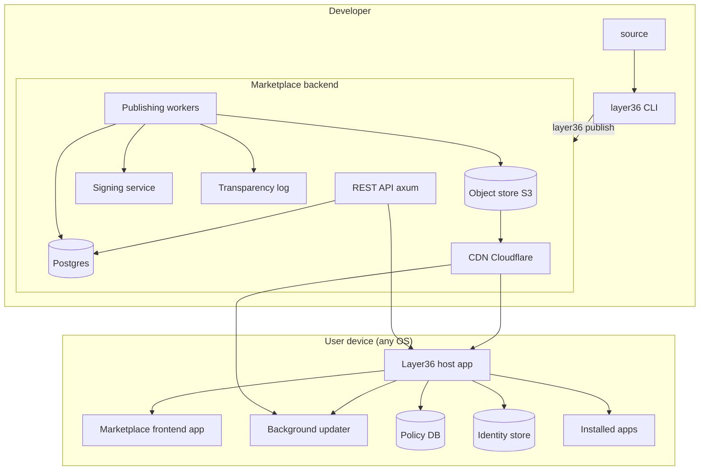
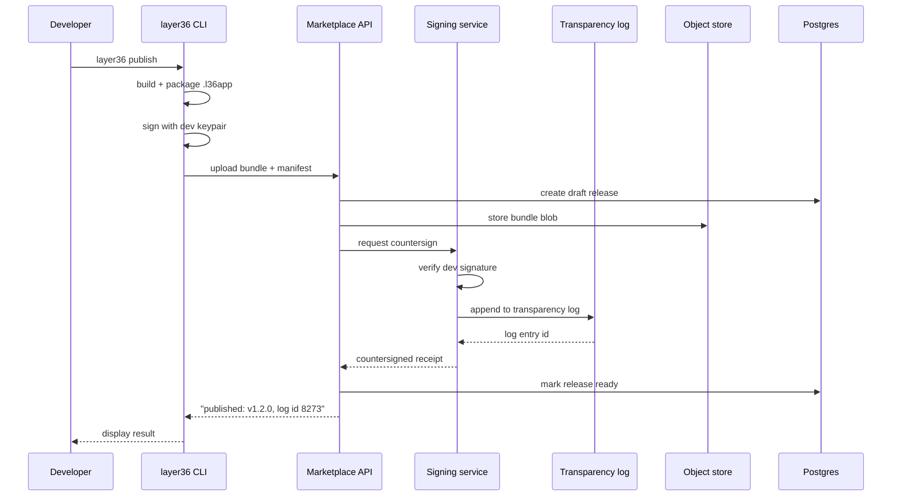
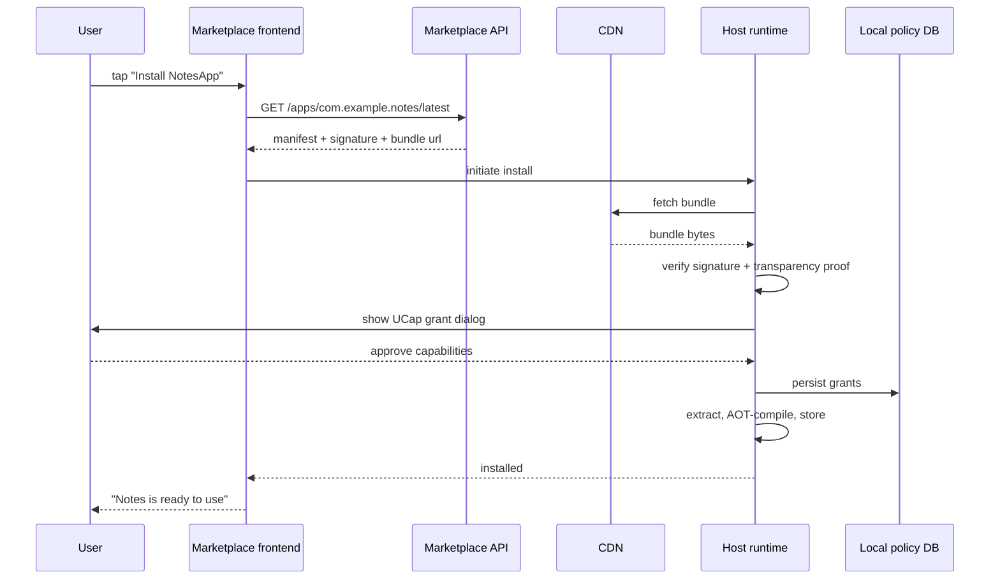
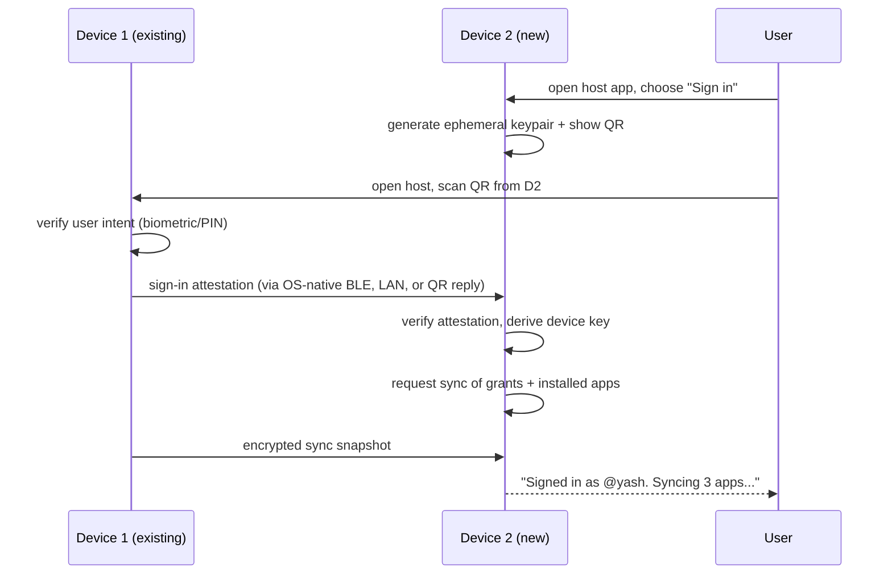
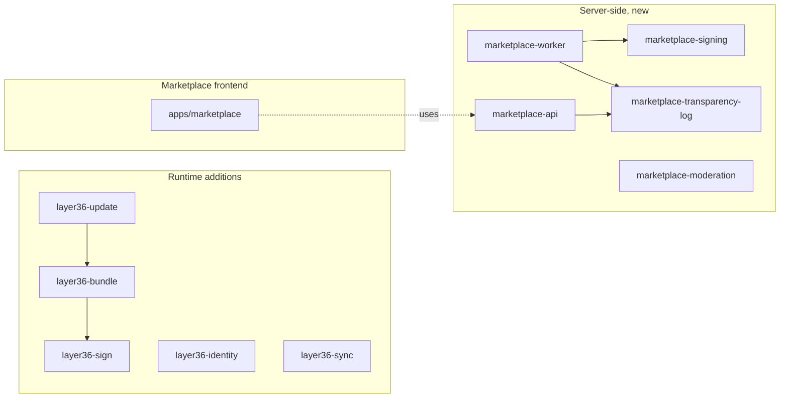
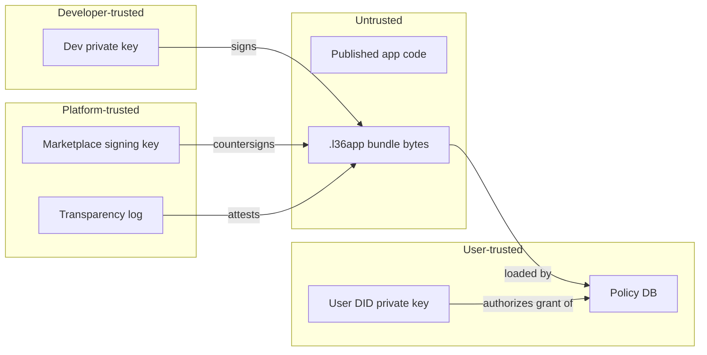
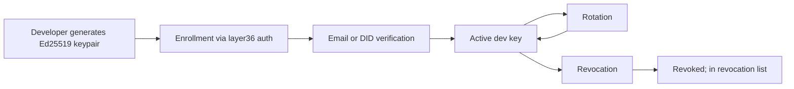
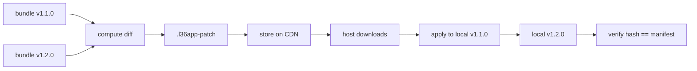
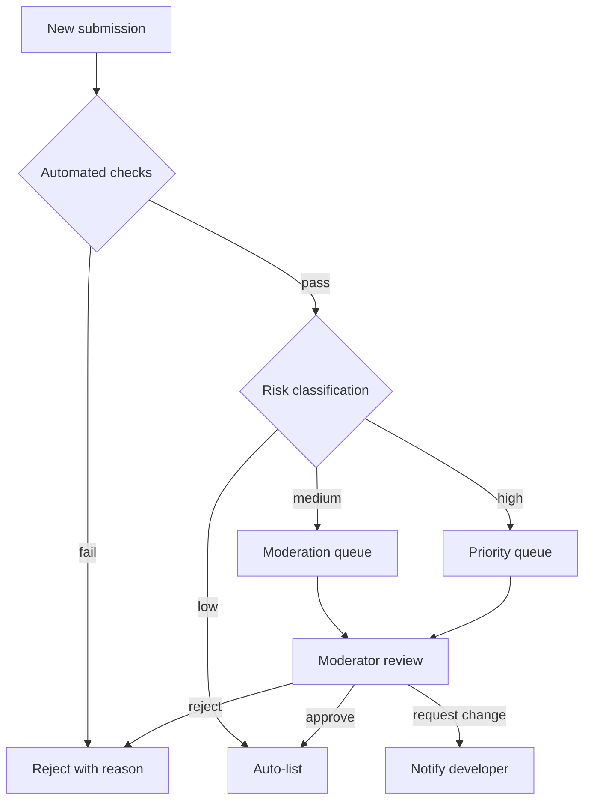

# Layer36 — Phase 6 Detailed Plan: Distribution & Identity

> **Phase:** 6 of 8
> **Duration:** Months 19–22 (120 calendar days, ~70–90 engineering days of work)
> **Phase sentence:** *Users discover, install, update, and sign in across devices.*
> **Prerequisite:** Phase 5 complete — SDK productized, UAPI v0.4 frozen, IDE extensions shipped.
> **Supersedes:** sidecar `manifest.toml` (replaced by in-bundle manifest in `.l36app`).
> **Superseded by:** nothing.

---

## Table of Contents

0. [How to Use This Document](#0-how-to-use-this-document)
1. [Phase Objective](#1-phase-objective)
2. [Prerequisites from Phase 5](#2-prerequisites-from-phase-5)
3. [Success Criteria](#3-success-criteria)
4. [What Phase 6 Is and Is Not](#4-what-phase-6-is-and-is-not)
5. [The Phase 6 Shift](#5-the-phase-6-shift)
6. [Architecture](#6-architecture)
7. [Technology Decisions](#7-technology-decisions)
8. [Bundle Format (`.l36app`)](#8-bundle-format-l36app)
9. [Developer Signing & Transparency Log](#9-developer-signing--transparency-log)
10. [Delta Updates](#10-delta-updates)
11. [Marketplace Backend](#11-marketplace-backend)
12. [Marketplace Frontend (Itself a Layer36 App)](#12-marketplace-frontend-itself-a-layer36-app)
13. [Discovery, Categories, Search](#13-discovery-categories-search)
14. [Reviews, Ratings, Moderation](#14-reviews-ratings-moderation)
15. [Identity: DIDs and `layer36:identity`](#15-identity-dids-and-layer36identity)
16. [Cross-Device Sync](#16-cross-device-sync)
17. [UCap v0.4 (Persistent Grants + Revocation)](#17-ucap-v04-persistent-grants--revocation)
18. [Background Update Service](#18-background-update-service)
19. [Age Rating & Content Policy](#19-age-rating--content-policy)
20. [Week-by-Week Breakdown](#20-week-by-week-breakdown)
21. [Task Details](#21-task-details)
22. [Code Skeletons](#22-code-skeletons)
23. [Testing Strategy](#23-testing-strategy)
24. [Performance & Scale Targets](#24-performance--scale-targets)
25. [Security & Threat Model v0.6](#25-security--threat-model-v06)
26. [Documentation Deliverables](#26-documentation-deliverables)
27. [Architecture Decision Records](#27-architecture-decision-records)
28. [Legal & Compliance (no longer deferrable)](#28-legal--compliance-no-longer-deferrable)
29. [Exit Criteria Checklist](#29-exit-criteria-checklist)
30. [Phase 6 Risks](#30-phase-6-risks)
31. [Handoff to Phase 7](#31-handoff-to-phase-7)
32. [Appendices](#32-appendices)

---

## 0. How to Use This Document

Phase 6 is operationally and legally the heaviest phase. Every prior phase was mostly a code problem. Phase 6 is a code problem *and* a backend-ops problem *and* a trust problem *and* a legal problem. Running this phase poorly means shipping a marketplace that gets abused, an identity system that leaks user data, or a signing pipeline that produces unverifiable builds — any of which ends the project faster than a Phase 3 widget bug.

- Read §5 (The Phase 6 Shift) before anything else. It names the change in mode.
- §28 (Legal & Compliance) is no longer deferrable. Trademark, privacy policy, terms of service, GDPR, export control, DSA — all land this phase.
- Task IDs in §21 match Build Plan §7.7.
- Phase 6 is the last phase before v1.0. Ship a broken Phase 6 and Phase 7 hardening cannot save it.

---

## 1. Phase Objective

### 1.1 One-sentence objective

**A user downloads the Layer36 host app, creates a cross-device identity in under 60 seconds, installs three apps from a discoverable marketplace, and each app recognizes them as the same user when they pick up a different device — and a developer publishes their app to that marketplace through `layer36 deploy` in under 5 minutes.**

### 1.2 Why this matters

Phases 1–5 made Layer36 technically real. Phase 6 makes it *socially* real — the point at which strangers can trust strangers' code because the platform mediates that trust. A platform without a marketplace is a curiosity. A platform without identity is a tool. A platform with both becomes infrastructure. Phase 6 is the hinge between Layer36-as-interesting-tech and Layer36-as-something-users-depend-on.

### 1.3 The seven deliverables of Phase 6

1. **`.l36app` bundle format** — the signed, versioned, inspectable format every app ships in.
2. **Developer signing + transparency log** — Sigstore-style immutable record of every app ever published.
3. **Marketplace backend** — Postgres + S3 + axum, serving discovery, install, updates.
4. **Marketplace frontend** — itself a Layer36 app, deep dogfood of the platform.
5. **Identity UAPI (`layer36:identity`)** — DID-based; users own their account and carry it between devices.
6. **Background update service** — per-host, keeps apps current with delta patches.
7. **UCap v0.4** — persistent grants, revocation, audit log.

---

## 2. Prerequisites from Phase 5

Before touching a single line of Phase 6 code, verify:

- [ ] All Phase 5 exit criteria met.
- [ ] 60-second walkthrough benchmark passing on all five platforms.
- [ ] `layer36` CLI stable with all 19 subcommands.
- [ ] UAPI v0.4 frozen: `storage`, `crypto`, `ipc`, `notifications`.
- [ ] IDE extensions published to VS Code + JetBrains marketplaces.
- [ ] C/C++ and Python bindings shipped.
- [ ] ADRs 0001 through 0044 merged.
- [ ] Hot reload, DAP, LSP stable.

If any box is unchecked, finish Phase 5 first. A marketplace built on shaky DX means every developer complaint is ambiguous — is the problem the marketplace or the SDK?

---

## 3. Success Criteria

Phase 6 is **done** when, and only when, every row below is true.

| # | Criterion | Measured How |
|---|-----------|--------------|
| 1 | `.l36app` bundle format frozen; spec published | Spec document |
| 2 | Developer can run `layer36 publish` from their machine and reach the marketplace in < 5 min | Timed walkthrough |
| 3 | User can install an app from the marketplace in < 30 s (10 MB app) | Timed walkthrough |
| 4 | Delta update of a 1 MB patch applies in < 500 ms | Timer |
| 5 | A new user completes identity creation + sign-in on 2 devices in < 60 s | Timed walkthrough |
| 6 | The same identity authenticates the user across Windows, macOS, Linux, iOS, Android | Manual test |
| 7 | Revoking a capability immediately invalidates in-flight uses | Scripted test |
| 8 | Marketplace frontend is itself a Layer36 app, shipping from its own `.l36app` bundle | Self-hosting confirmed |
| 9 | Transparency log is append-only, publicly queryable, tamper-evident | Audit test |
| 10 | Marketplace backend handles 10k req/s steady-state with p99 < 200 ms | Load test |
| 11 | Background update service keeps installed apps current within 24 h of release | Time-to-update measurement |
| 12 | Privacy policy, terms of service, DPA, DSA notices all published | Legal review sign-off |
| 13 | Moderation playbook + queue functional | 10 test submissions reviewed in < 48 h |
| 14 | Age ratings applied per submission | Flow works end-to-end |
| 15 | ADRs 0045 through at least 0058 merged | Git log |

---

## 4. What Phase 6 Is and Is Not

### 4.1 Phase 6 IS

- A first-class app bundle format with signing, versioning, and attestation.
- A public marketplace with search, discovery, reviews.
- A developer portal for publishing, version management, analytics.
- An immutable transparency log a la Sigstore.
- Delta updates with binary diffing.
- DID-based identity (`did:key` and `did:web`).
- Per-user cross-device sync of app grants and preferences.
- Persistent UCap grants with a revocation flow.
- Background update service on each host.
- Age rating system with basic moderation tooling.
- Terms, privacy policy, developer agreement, DSA transparency report.
- The trademark actually filed.

### 4.2 Phase 6 is NOT

- Not a payment system. Paid apps, in-app purchases, subscriptions — all deferred post-v1.0.
- Not a component / library registry for developer dependencies. Apps only; library registry is a separate concern.
- Not telemetry / analytics. Apps on the marketplace do not report usage data by default; opt-in analytics is a separate concern.
- Not the App Store / Play Store strategy. That's Phase 7+.
- Not ad networks, not promoted listings.
- Not user-to-user messaging, social features, or community around apps.
- Not email notifications at scale. Transactional email for signing/publishing, nothing more.
- Not push notifications implementation (interface defined Phase 5; the server-side push infrastructure is post-v1.0).
- Not federated marketplaces. One central marketplace in v1.0; federation deferred.
- Not a plugin/extension marketplace. Apps only.

### 4.3 Discipline

Phase 6 wants to be everything — storefront, community, ID provider, app-analytics platform, ad network. None of those survive into v1.0. The discipline: if a feature isn't required for a user to *discover, install, update, and sign in to* an app, it's post-v1.0.

---

## 5. The Phase 6 Shift

### 5.1 What changes

Phases 1–5 had one type of user: developers using Layer36. Phase 6 introduces a second type: **end users using apps built on Layer36**. These two audiences have almost nothing in common:

| Developer | End user |
|---|---|
| Tolerates CLI | Needs GUI |
| Tolerates errors | Must never see them |
| Reads docs | Skims at best |
| Wants power | Wants safety |
| Trusts the platform by choice | Trusts the platform or abandons it |
| Cares about build time | Cares about install time |
| 60s walkthrough is fine | 60s is 3x too long |

Every Phase 6 decision is judged against *both* audiences.

### 5.2 What also changes

- **Operational posture.** We now run a service. 24/7 uptime expectations begin here.
- **Legal posture.** We now handle user data. GDPR, CCPA, DSA — all apply.
- **Trust posture.** We now mediate between developers and users. Bad actors (both directions) become a real threat.
- **Economic posture.** We now serve files over CDN at scale. Costs start mattering.

### 5.3 The guiding principle

In Phase 6, the platform's job is to be **boring and reliable** rather than clever. Every "clever" marketplace innovation we might invent has been tried elsewhere and mostly failed. The wins are in execution quality: fast discovery, trustworthy reviews, quick installs, clean updates, easy sign-in, clear privacy.

Recorded in ADR-0045 as the Phase 6 design philosophy.

---

## 6. Architecture

### 6.1 System overview at end of Phase 6



### 6.2 Publishing flow



### 6.3 Install flow



### 6.4 Identity flow (new device sign-in)



### 6.5 Crate layout at end of Phase 6



### 6.6 Trust boundaries (Phase 6)

The big expansion: the marketplace itself is now a trust anchor.



Four distinct trust zones; compromise of any one has a bounded blast radius. Compromise of all three signing keys (dev + marketplace + transparency) simultaneously is the worst case — and the design makes that require independent attacks.

---

## 7. Technology Decisions

Each item frozen for Phase 6 unless noted. ADR references in §27.

### 7.1 Bundle format container: **zip with deterministic ordering**

- Well-understood, widely tooled.
- Deterministic mode (sorted entries, fixed timestamps) for reproducible builds.
- Existing Rust crate (`zip`) already a Phase 2 dependency.
- **Recorded:** ADR-0046.

### 7.2 Signing scheme: **Ed25519 + Sigstore-style transparency**

- Ed25519 for developer keys (fast, small, well-audited).
- Sigstore's Rekor-like append-only log for transparency.
- Merkle-tree-backed; public proofs of inclusion.
- **Recorded:** ADR-0047.

### 7.3 Delta update format: **`bsdiff`-style binary patches**

- Proven in production (iOS uses similar; Chromium uses Courgette).
- Rust implementations mature (`qbsdiff` crate).
- Typical delta size 5–15% of full bundle.
- **Recorded:** ADR-0048.

### 7.4 Marketplace backend stack: **Rust + axum + Postgres + S3**

- Axum chosen for ecosystem consistency (Tokio, hyper, tower).
- Postgres for relational data (apps, versions, users, reviews).
- S3-compatible object store for bundles (Cloudflare R2 in production; minio for dev).
- **Recorded:** ADR-0049.

### 7.5 CDN: **Cloudflare**

- Cloudflare Workers for edge logic (signature verification, cache decisions).
- R2 for object storage (no egress fees).
- DDoS mitigation, SSL, analytics included.
- Free tier generous enough for early launch; Pro/Business upgrade triggered by traffic.
- **Recorded:** ADR-0050.

### 7.6 Identity: **DIDs (`did:key` primary, `did:web` secondary)**

- `did:key` — self-contained, no DNS dependency, works offline.
- `did:web` — bridges to HTTPS-served identity for organizations.
- No blockchain-anchored DID methods in v0.1 (avoid regulatory complexity).
- **Recorded:** ADR-0051.

### 7.7 Credential format: **W3C Verifiable Credentials (VC) with JWT encoding**

- Standards-aligned so Layer36 identities interoperate with OpenID-Connect bridges if/when added.
- JWT encoding for ubiquitous tool support.
- **Recorded:** ADR-0052.

### 7.8 Cross-device sync: **end-to-end encrypted, content-addressed blobs**

- User's data encrypted with keys derived from their DID.
- Server stores only encrypted blobs it cannot read.
- Content-addressed (hash-named) for deduplication.
- **Recorded:** ADR-0053.

### 7.9 Sync transport: **HTTPS with optional WebSocket push**

- HTTPS for initial sync and updates.
- WebSocket for live push when online (users on different devices see updates within seconds).
- Falls back to polling if WebSocket unavailable.
- **Recorded:** ADR-0054.

### 7.10 Policy DB: **SQLite, per-user, encrypted at rest**

- Each user has a local SQLite DB in OS-specific secure location.
- Encrypted with a key tied to the user's DID.
- Synced as an encrypted blob between devices.
- **Recorded:** ADR-0055.

### 7.11 Background update service

- Per-OS native service:
  - macOS: `launchd` LaunchAgent.
  - Windows: Windows Service.
  - Linux: `systemd --user` unit.
  - iOS / Android: silent background (limited by platform).
- Checks for updates every N hours (default 24).
- Downloads deltas in background, applies on next app launch.
- **Recorded:** ADR-0056.

### 7.12 Moderation queue: **custom + community hybrid**

- Every new app goes through automated checks first (signature valid, size, size limits, manifest schema).
- Human review for: first submission from a new dev, apps requesting high-risk caps, apps flagged by users.
- Community flagging visible in Phase 7+; Phase 6 is staff-only.
- **Recorded:** ADR-0057.

### 7.13 Age rating system: **self-declared + verified categories**

- Developers self-declare age rating per submission (all ages / 12+ / 17+).
- Layer36 moderation verifies sensitive categories.
- Aligns with IARC (International Age Rating Coalition) where applicable.
- **Recorded:** ADR-0058.

### 7.14 What we DEFER

| Feature | Deferred to |
|---|---|
| Payments / IAP | Post-v1.0 |
| Revenue share to developers | Post-v1.0 (N/A without payments) |
| Component / library registry | Post-v1.0 |
| Federated marketplaces | Post-v1.0 |
| Promoted listings / ads | Never |
| Blockchain identity methods | Post-v1.0 |
| Formal verification of signing service | Post-v1.0 |
| Email/SMS 2FA | Phase 7 |
| Passkey (WebAuthn) for sign-in | Phase 7 |

---

## 8. Bundle Format (`.l36app`)

### 8.1 Layout

```
myapp.l36app/
├── manifest.toml          # app metadata, capabilities, entry point
├── code.wasm              # main component (pre-AOT-compiled optional sibling: code.cwasm)
├── modules/               # lazy-loaded additional components
├── assets/                # images, fonts, shaders
├── locale/                # translations (fluent format)
├── schema/                # storage schemas (SQL migrations)
├── aot/                   # pre-compiled native for each target triple (optional)
│   ├── aarch64-apple-ios.cwasm
│   ├── aarch64-linux-android.cwasm
│   ├── ...
├── signature.json         # Ed25519 signature block
├── attest.json            # reproducible-build + transparency log proof
└── ORDER                  # file listing for canonical hashing
```

### 8.2 Canonical hash

- Files listed in `ORDER` in deterministic order.
- Each file's SHA-256 computed.
- A Merkle tree built from file hashes.
- Root hash is the bundle's canonical identifier.

This hash is what the developer signs and what the transparency log records.

### 8.3 Manifest in full (v1.0)

```toml
[app]
id          = "com.example.notes"
name        = "Notes"
version     = "1.2.0"
entry       = "code.wasm"
world       = "layer36:app/full@0.4.0"
runtime-min = "0.6.0"

[metadata]
authors     = ["Jane Dev <jane@example.com>"]
homepage    = "https://notes.example.com"
source      = "https://github.com/example/notes"
license     = "MIT"
categories  = ["productivity"]
keywords    = ["notes", "writing"]
age-rating  = "all"

[[capabilities]]
cap        = "fs.read:~/Documents/notes/**"
rationale  = "Read saved notes"
required   = true

# ... more capabilities

[mobile]
min-ios     = "15.0"
min-android = "29"
orientations = ["portrait", "landscape"]

[ios]
info-plist-usage.nsCameraUsageDescription = "Attach photos to notes"

[android]
uses-permissions = ["android.permission.CAMERA"]

[locales]
default    = "en"
supported  = ["en", "de", "es", "fr", "hi", "ja", "zh"]

[assets]
icon       = "assets/icon.png"
splash     = "assets/splash.png"

[storage]
# Schema migrations applied in order
migrations = [
  "schema/001-initial.sql",
  "schema/002-add-tags.sql",
]

[dependencies]
# Declared runtime dependencies, for transparency
# Not used by runtime; informational for marketplace display
"layer36-core" = "0.6.0"
```

### 8.4 Versioning

- `app.version` follows semver.
- Marketplace enforces monotonically increasing versions per app.
- Downgrades not allowed through normal update channel (only via explicit `layer36 rollback` by user).

### 8.5 Bundle size limits

- Maximum 500 MB compressed. Larger blobs (games with heavy assets) use `modules/` lazy loading.
- Single file within bundle ≤ 100 MB.
- AOT artifacts excluded from size for iOS mandatory-AOT case.

### 8.6 Reproducible builds

- Deterministic file ordering.
- Timestamps set to manifest-declared release date.
- Rust toolchain version pinned in `rust-toolchain.toml`.
- `layer36 build --reproducible` produces identical output for identical input.
- Attestation file records build environment.

---

## 9. Developer Signing & Transparency Log

### 9.1 Dev key lifecycle



### 9.2 Signature block format

```json
{
  "version": 1,
  "bundle_hash": "sha256:3b2f...",
  "algorithm": "ed25519",
  "dev_key_id": "did:key:z6Mk...",
  "dev_signature": "base64:...",
  "marketplace_countersignature": "base64:...",
  "transparency_log_entry": "https://transparency.layer36.dev/log/8273",
  "issued_at": "2026-11-03T12:34:56Z"
}
```

### 9.3 Transparency log design

- Append-only.
- Merkle-tree-based inclusion proofs.
- Every entry contains: bundle hash, dev key id, marketplace countersignature hash, timestamp.
- Log root published hourly; signed by log operator.
- Clients can verify any entry against the current log root.

### 9.4 Why transparency matters

Transparency means a malicious marketplace operator cannot secretly sign a malicious app for a targeted user: any signed bundle must appear in the public log, and the developer can detect fraudulent signatures by monitoring the log for their own app id.

### 9.5 Revocation

Two revocation classes:

| Class | Example | Mechanism |
|---|---|---|
| Dev key revocation | Developer's key stolen | Added to CRL served by marketplace; hosts refresh daily |
| App-version revocation | Published version found malicious | Added to CRL; hosts refresh hourly; already-installed apps receive "update required" |

Revocation lists are transparency-logged too.

### 9.6 Trusted root

The marketplace's signing key is the trust root for Layer36 v1.0. It's stored in a hardware security module (HSM) managed by the Layer36 team. Rotation procedure documented; emergency rotation rehearsed before Phase 6 exit.

---

## 10. Delta Updates

### 10.1 Why bother

Full download of a 50 MB bundle every minor update costs bandwidth and user patience. Typical diffs are 5–15% of full size. For mobile users on limited data plans, this is the difference between "updates happen automatically" and "updates are annoying."

### 10.2 Delta pipeline



### 10.3 Patch format

- Header: from-version, to-version, expected-result-hash.
- Body: stream of bsdiff operations over the canonical file order.
- Ed25519-signed by marketplace.

### 10.4 Patch matrix

For each new version we publish:
- Full bundle.
- Delta from previous version.
- Delta from N-1 (one version further back) — catches users who missed one release.

Further back than N-2 → fall back to full download.

### 10.5 Application rules

- Patches applied only when verified hash matches expected result.
- Failure → discard patch, download full bundle.
- Apply during app idle time (not mid-launch).
- Rollback window: old version kept on disk until patched version has successfully run once.

---

## 11. Marketplace Backend

### 11.1 Service inventory

| Service | Purpose | Technology |
|---|---|---|
| `marketplace-api` | Public REST API | Rust + axum |
| `marketplace-worker` | Async processing (publishing, delta computation) | Rust + Tokio queues |
| `marketplace-signing` | Countersignature, HSM access | Rust + isolated service |
| `marketplace-transparency-log` | Rekor-style log | Rust + existing Sigstore crates where possible |
| `marketplace-moderation` | Moderator dashboard, queue | Rust + HTML or Layer36 app |
| `marketplace-identity` | DID resolver, identity helpers | Rust |

### 11.2 Data model (key tables)

```sql
-- apps
CREATE TABLE app (
  id               TEXT PRIMARY KEY,          -- com.example.notes
  name             TEXT NOT NULL,
  owner_did        TEXT NOT NULL,
  created_at       TIMESTAMPTZ NOT NULL,
  updated_at       TIMESTAMPTZ NOT NULL,
  visibility       TEXT NOT NULL CHECK (visibility IN ('draft','listed','hidden','removed'))
);

CREATE TABLE app_version (
  id               BIGSERIAL PRIMARY KEY,
  app_id           TEXT NOT NULL REFERENCES app(id),
  version          TEXT NOT NULL,              -- semver string
  bundle_hash      TEXT NOT NULL UNIQUE,
  bundle_url       TEXT NOT NULL,
  size_bytes       BIGINT NOT NULL,
  manifest         JSONB NOT NULL,
  published_at     TIMESTAMPTZ NOT NULL,
  transparency_id  TEXT NOT NULL,
  status           TEXT NOT NULL CHECK (status IN ('pending','approved','revoked')),
  UNIQUE (app_id, version)
);

CREATE TABLE app_delta (
  id              BIGSERIAL PRIMARY KEY,
  from_version_id BIGINT REFERENCES app_version(id),
  to_version_id   BIGINT REFERENCES app_version(id),
  patch_url       TEXT NOT NULL,
  patch_size      BIGINT NOT NULL,
  UNIQUE (from_version_id, to_version_id)
);

CREATE TABLE developer (
  did              TEXT PRIMARY KEY,
  display_name     TEXT,
  email_verified   BOOLEAN NOT NULL DEFAULT false,
  created_at       TIMESTAMPTZ NOT NULL,
  status           TEXT NOT NULL DEFAULT 'active'
);

CREATE TABLE review (
  id               BIGSERIAL PRIMARY KEY,
  app_id           TEXT NOT NULL REFERENCES app(id),
  user_did         TEXT NOT NULL,
  rating           SMALLINT NOT NULL CHECK (rating BETWEEN 1 AND 5),
  body             TEXT,
  created_at       TIMESTAMPTZ NOT NULL,
  updated_at       TIMESTAMPTZ NOT NULL,
  UNIQUE (app_id, user_did)
);

CREATE TABLE moderation_queue (
  id               BIGSERIAL PRIMARY KEY,
  app_version_id   BIGINT NOT NULL REFERENCES app_version(id),
  reason           TEXT NOT NULL,
  status           TEXT NOT NULL DEFAULT 'pending',
  reviewer_did     TEXT,
  decision         TEXT,
  note             TEXT,
  enqueued_at      TIMESTAMPTZ NOT NULL,
  decided_at       TIMESTAMPTZ
);

-- plus: categories, tags, install_count (anonymous aggregate), flag tables
```

### 11.3 API endpoints (v1)

```
# App discovery
GET    /v1/apps                         # paginated, filterable, search
GET    /v1/apps/:id                     # detail
GET    /v1/apps/:id/latest              # manifest + bundle url
GET    /v1/apps/:id/versions            # version history
GET    /v1/apps/:id/versions/:ver       # specific version
GET    /v1/apps/:id/reviews             # paginated reviews

# Install / update
GET    /v1/apps/:id/install/:version    # signed manifest
GET    /v1/delta?from=:h1&to=:h2        # delta url

# Developer
POST   /v1/developer/enroll             # starts enrollment
POST   /v1/developer/verify             # email / DID verification
POST   /v1/apps                         # create app record (reserves id)
POST   /v1/apps/:id/versions            # upload new version (multipart)
PATCH  /v1/apps/:id                     # update metadata
DELETE /v1/apps/:id/versions/:ver       # request revocation

# Reviews
POST   /v1/apps/:id/reviews             # user posts review
PATCH  /v1/apps/:id/reviews/:id         # user edits own review
POST   /v1/apps/:id/flag                # flag an app or review

# Identity / auth
POST   /v1/auth/challenge               # get challenge for DID sign-in
POST   /v1/auth/verify                  # verify signed challenge

# Transparency
GET    /v1/transparency/root            # current log root
GET    /v1/transparency/entry/:id       # entry details + proof
```

### 11.4 Rate limits

- Per-IP: 300 req/min anonymous.
- Per-DID: 3000 req/min authenticated.
- Publish: 10 per developer per hour.
- Review: 1 per user per app per 30 days.

Implemented via Cloudflare at edge plus application-level enforcement.

### 11.5 Monitoring

- Metrics: OpenTelemetry → Grafana Cloud.
- Logs: structured JSON; shipped to managed ELK or Loki.
- Alerts: PagerDuty or Opsgenie for on-call rotation.
- SLOs documented in §24.

---

## 12. Marketplace Frontend (Itself a Layer36 App)

### 12.1 Why itself a Layer36 app

The marketplace frontend is the highest-profile Layer36 app in existence. If it isn't *itself* built on Layer36, we've lost the argument for the platform before we make it.

Also: if the frontend is a Layer36 app, it benefits from every Phase 3–5 improvement automatically — native feel on each host, offline capability, cross-device state sync for the user's install history.

### 12.2 Features (v1)

- Home: featured apps, new releases, categories.
- Search: fulltext + filters (category, rating, size, age rating, platform).
- App detail: description, screenshots, reviews, version history, UCap request summary.
- Install / update button with real-time progress.
- Library: user's installed apps, last-used, size on disk.
- Account: DID management, device list, grant audit log.
- Developer portal (same app, different tab): published apps, version uploads, analytics (install counts only), review responses.

### 12.3 UX rules

- No pop-ups pushing features.
- No badges / red-dot notifications unless urgent (security update).
- Privacy by default: no tracking, no telemetry.
- Dark mode follows system.
- Full keyboard navigation, full screen-reader accessibility.

### 12.4 LOC budget

~5,000 LOC of Rust. Larger than `layer36-notes` but deliberately bounded so it remains understandable and portable. If we can't build the marketplace in 5k LOC of Layer36, the platform is too hard to build on.

### 12.5 Language

Rust. First-class, eating our own dog food at the highest visibility.

---

## 13. Discovery, Categories, Search

### 13.1 Categories (v1)

10 top-level categories. Deliberately small — more categories means poorer discovery.

- Productivity
- Creativity
- Developer Tools
- Education
- Games
- Health & Fitness
- Lifestyle
- Utilities
- Reference
- Social

Categories are editorial. Developers pick 1–2 at submission time; moderation confirms.

### 13.2 Search

- Backed by Postgres full-text search in v1 (simpler to operate than Elasticsearch).
- Fields: name, description, keywords.
- Results ranked by: text match score, install count, rating, recency.
- No personalization in v1 — results are the same for every signed-in user.

### 13.3 Featured content

- Weekly editorial picks, chosen by Layer36 team.
- No paid promotion ever in v1.
- Featured section labeled explicitly as editorial.

### 13.4 Anti-abuse

- Keyword stuffing triggers moderation queue.
- Similar-name detection (trademark / squatting); flagged to moderation.
- Developer reputation signal computed from: publish history, flag-to-review ratio, resolved-complaint count.

---

## 14. Reviews, Ratings, Moderation

### 14.1 Review system

- 1–5 star rating + optional text.
- One review per user per app, editable.
- Version-pinned: reviews show which version they were written for.
- Developer can reply once per review (public).
- Rating averaged over last 2 years; older reviews still visible.

### 14.2 Who can review

- Only users who have actually installed the app.
- Install is attested by host runtime; server validates.
- Prevents drive-by bombing.

### 14.3 Flagging

- Users can flag apps or reviews.
- Flagged items enter moderation queue.
- High-frequency flagging from new accounts weighted down (sybil mitigation).

### 14.4 Moderation queue workflow



### 14.5 Moderation staffing

- Phase 6 launches with 1–2 moderators (could be contractors).
- Coverage hours: 9am–9pm in primary market timezone.
- SLA: first response within 48 h for initial submissions; 24 h for updates of listed apps.
- Playbook lives in `docs/internal/moderation/`.

### 14.6 Appeals process

- Developer can appeal rejection.
- Different moderator reviews appeals (never the original rejecter).
- Final decision published (reason visible to developer; users never see rejection histories).

---

## 15. Identity: DIDs and `layer36:identity`

### 15.1 Design principles

- **User owns their identity.** Not Layer36. Not the marketplace.
- **Self-sovereign.** Works without any central server.
- **Portable.** Users carry identity between devices.
- **Pseudonymous by default.** Real name optional.
- **Upgradeable.** v1 uses `did:key`; future methods slot in without breaking apps.

### 15.2 What a Layer36 identity is

Technically: an Ed25519 keypair. The public key is the identity; the private key is held on device in the OS secure store.

For user: an avatar, a display name (optional), and a set of devices.

### 15.3 `layer36:identity@0.1.0`

```wit
// wit/layer36/identity.wit
package layer36:identity@0.1.0;

interface types {
    record identity-id {
        did: string,              // "did:key:z6Mk..."
    }

    record user-profile {
        id: identity-id,
        display-name: option<string>,
        avatar-url: option<string>,
    }

    variant identity-error {
        not-signed-in,
        permission-denied,
        user-cancelled,
        other(string),
    }
}

interface current {
    use types.{user-profile, identity-error};

    /// Returns the currently signed-in user, if any.
    profile: func() -> result<user-profile, identity-error>;

    /// Request the user to prove ownership of their identity
    /// (e.g., biometric confirmation). Returns a signed challenge
    /// response the app can forward to a server.
    authenticate: func(challenge: list<u8>) -> result<list<u8>, identity-error>;
}

interface sign {
    use types.{identity-error};

    /// Sign arbitrary bytes with the user's identity key.
    /// Requires user consent via biometric or PIN.
    sign: func(data: list<u8>) -> result<list<u8>, identity-error>;

    /// Get the user's public key.
    public-key: func() -> list<u8>;
}

world consumer {
    import current;
    import sign;
}
```

Note what's absent: no `login`, no `logout`, no `register`. Identity is managed by the runtime at the host level, not by the app. Apps don't have user tables; they use the user's DID as the primary key for their server-side records.

### 15.4 App-side pattern

```rust
// Typical app authenticating a user
use layer36::identity::{current, sign};

fn sign_in_to_my_server() -> Result<AuthToken> {
    let profile = current::profile()?;
    let challenge = fetch_challenge_from_server()?;
    let signature = current::authenticate(&challenge)?;
    let token = send_to_server(&profile.id.did, &challenge, &signature)?;
    Ok(token)
}
```

Server verifies signature against the DID's resolvable public key. No password. No username. No email required.

### 15.5 Optional email

- Users can optionally attach an email for recovery.
- Email stored client-side in Phase 6 (synced encrypted); server-side verification tokens only.
- Email is never a primary identifier; DID always is.

### 15.6 Recovery

- Option 1: recovery code shown at identity creation; user stores offline.
- Option 2: paired-device recovery — sign in on new device by approving on existing device.
- Option 3 (v0.2): social recovery with trusted contacts.

Lose all devices + lose recovery code = identity lost. Documented clearly at creation time.

### 15.7 Identity creation flow

```
1. User opens Layer36 host app for first time.
2. Host shows: "Welcome. Create an identity to use Layer36 apps."
3. User taps "Create".
4. Runtime generates Ed25519 keypair.
5. User picks display name (optional, max 50 chars, no uniqueness constraint).
6. Runtime shows recovery code (QR + text) — user saves.
7. Done. User is now @display-name with a DID.
```

Elapsed: 30–60 seconds, measured on a stopwatch.

### 15.8 DID resolution

- `did:key`: self-contained, no network needed; decodes directly to public key.
- `did:web`: resolves via HTTPS GET to `https://<domain>/.well-known/did.json`.
- Resolver cached with TTL from DID document.

---

## 16. Cross-Device Sync

### 16.1 What syncs

| Item | Synced | Why |
|---|---|---|
| Identity profile (name, avatar) | Yes | Same user appearance across devices |
| Installed apps list | Yes | Add device, existing apps install automatically |
| UCap grants per app | Yes | Permissions persist across devices |
| Recovery code | No | User holds this offline |
| App-private data | No | Apps own their sync via `net` or `storage` |

### 16.2 Sync protocol

- User's state represented as an encrypted blob ("sync snapshot").
- Encryption key derived from user's identity private key.
- Server stores the encrypted blob keyed by DID hash.
- Server CANNOT read contents.

Snapshot format:

```
{
  "version": 1,
  "updated_at": "...",
  "profile": { ... },
  "installed_apps": [ { id, version }, ... ],
  "ucap_grants": [ { app_id, cap, mode }, ... ]
}
```

Encrypted with `XChaCha20-Poly1305` using key derived from user's Ed25519 private key via HKDF.

### 16.3 Sync frequency

- On launch.
- On any local change (grant, install, uninstall).
- Debounced 5 s to batch rapid changes.

### 16.4 Conflicts

- Last-write-wins at snapshot level.
- Per-item resolution: vector-clock-like per-record timestamps allow merging (e.g., grants on device A and installs on device B both preserved).

### 16.5 Offline behavior

- Sync is optional. Device works offline indefinitely.
- Pending changes queued; flushed on reconnect.

### 16.6 Privacy

- Server sees: encrypted blob size, access timestamps, IP addresses (CDN logs).
- Server does NOT see: what apps, what grants, what profile.
- Access logs retained 30 days; metrics beyond that are aggregated.

---

## 17. UCap v0.4 (Persistent Grants + Revocation)

### 17.1 What changes from v0.3

| v0.3 (Phase 4) | v0.4 (Phase 6) |
|---|---|
| Session-only grants | Persistent via policy DB |
| In-memory only | SQLite + encrypted |
| No revocation UI | Full revocation flow |
| No audit log | Complete grant history |
| No cross-device | Synced via §16 |

### 17.2 Policy DB schema (expanded from Phase 4)

```sql
CREATE TABLE ucap_grant (
  app_id       TEXT NOT NULL,
  capability   TEXT NOT NULL,
  mode         TEXT NOT NULL CHECK (mode IN ('always','session','once','deny')),
  granted_at   INTEGER NOT NULL,
  expires_at   INTEGER,
  granted_by   TEXT,                         -- user DID
  device_id    TEXT,                         -- created on which device
  PRIMARY KEY (app_id, capability)
);

CREATE TABLE ucap_audit (
  id           INTEGER PRIMARY KEY AUTOINCREMENT,
  app_id       TEXT NOT NULL,
  capability   TEXT NOT NULL,
  event        TEXT NOT NULL,                -- granted/denied/revoked/used
  timestamp    INTEGER NOT NULL,
  details      TEXT                           -- JSON
);
```

### 17.3 Revocation flow

- Settings app lists granted capabilities per app.
- User taps "Revoke."
- All in-flight UAPI calls involving that cap receive `permission-denied` on their next operation.
- Sync propagates revocation to other devices within seconds.

### 17.4 Expiring grants

- Apps can request time-bounded grants: "camera for 1 hour."
- User approves; grant auto-expires.
- Useful for one-off QR scans, photo taking, etc.

### 17.5 Audit log UX

- Settings app shows "Activity" tab per app.
- Last 30 days of UAPI-call granularity (at the capability level).
- Exportable as JSON for privacy-conscious users.

---

## 18. Background Update Service

### 18.1 What it does

- Per-OS native service.
- Checks marketplace every N hours (default 24).
- Downloads available deltas / bundles in background.
- Applies update on next clean shutdown of the app.
- Records last-update time, status.

### 18.2 Per-host implementation

| Host | Service type | Notes |
|---|---|---|
| macOS | LaunchAgent | User-level, wakes on login |
| Windows | Windows Service | System-level, user-isolated |
| Linux | systemd --user unit | User-level |
| iOS | Background App Refresh | Very limited; user must enable |
| Android | WorkManager + foreground service | Limited by Doze mode |

### 18.3 Trust posture

Auto-updates apply without prompt if:
- Version number is monotonic (no downgrade).
- Capability set is a subset of previously granted (no new caps).
- Signature and transparency proof valid.

Auto-updates pause for prompt if:
- New capabilities requested.
- Major version bump (`x.y.z` → `(x+1).0.0`).
- Developer identity changed.

### 18.4 Bandwidth considerations

- Deltas preferred.
- Scheduled during idle / charging / Wi-Fi where the OS supports detection.
- User can force-check via "Check for updates" in settings.

### 18.5 Failure handling

- Download interrupted → resume on next check.
- Apply failure → rollback to previous, log.
- Three consecutive failures → surface to user.

---

## 19. Age Rating & Content Policy

### 19.1 Rating levels

| Label | Meaning |
|---|---|
| `all` | No age-sensitive content |
| `12+` | Mild violence, suggestive themes |
| `17+` | Mature themes, strong language, limited nudity, gambling simulation |
| `adults-only` | Explicit content (not permitted in v1 marketplace) |

### 19.2 Self-declaration + verification

- Developer declares at submission.
- Moderation verifies any declaration ≥ 12+ with a sampled review.
- False declarations → account warning; repeated → developer suspension.

### 19.3 Content policy (v1)

**Always prohibited:**
- Content depicting minors in sexual contexts.
- Doxxing, targeted harassment.
- Malware, remote access tools disguised as apps.
- Fraud, phishing, financial scams.
- Illegal goods/services in applicable jurisdictions.

**Restricted (requires explicit category):**
- Gambling simulations (17+).
- Alcohol, tobacco references (12+).
- Weapons content (12+ non-realistic, 17+ realistic).

**Permitted with labeling:**
- Strong language, violence, mature themes (17+).

### 19.4 DSA obligations (EU)

- Act as "hosting service provider" under Digital Services Act.
- Publish transparency report annually.
- Provide notice-and-action mechanism (§14.3 flagging is this).
- Appoint legal representative in EU if required (size-dependent).

Legal counsel signoff required before Phase 6 launch; see §28.

### 19.5 Parental controls

- Host app has per-identity age settings.
- When age set, marketplace filters out higher-rated apps.
- Identity creation suggests age (17+ by default; lower with verification).

---

## 20. Week-by-Week Breakdown

Sized for 16 weeks calendar, ~70–90 engineering days. This phase has significant non-code work (legal, moderation setup, ops) — budget for it.

### Weeks 1–2: Architecture, ADRs, bundle format

- Write ADRs 0045–0058.
- Finalize `.l36app` format spec.
- Design signing and transparency log schemes.
- Start legal engagement: trademark filing, privacy policy drafting.

### Weeks 3–4: Bundle packer/unpacker + signing client

- `crates/bundle/` implementation.
- `crates/sign/` dev-side signing.
- `layer36 build` updated to produce signed bundles.
- Reproducible build mode.

### Weeks 5–6: Marketplace backend skeleton

- axum API scaffold.
- Postgres schema + migrations.
- S3-compatible storage integration.
- Publishing endpoint end-to-end (without moderation yet).

### Week 7: Transparency log

- Merkle tree implementation.
- Log append + inclusion proofs.
- Public read API.
- Client-side verification in runtime.

### Week 8: Delta updates

- Patch computation workers.
- Client-side application in runtime.
- Delta matrix strategy.

### Weeks 9–10: Identity + DIDs

- `layer36:identity` UAPI.
- Per-host secure key storage (keychain/keystore/TPM).
- DID creation flow in host app.
- Cross-device sign-in (QR + attestation).

### Week 11: Cross-device sync

- End-to-end encrypted snapshot format.
- Sync service endpoints.
- Client-side merge logic.
- WebSocket push.

### Week 12: UCap v0.4 — persistent grants + revocation

- Policy DB migration.
- Revocation UI in host app.
- Audit log.
- Grant sync integration.

### Week 13: Marketplace frontend app

- Start building `apps/marketplace` as a Layer36 app.
- Home, search, detail pages.
- Install/update integration.

### Week 14: Background update service

- Per-host service implementations.
- Update check + apply flow.
- Auto-update trust rules.

### Week 15: Moderation tooling + age rating

- Moderation dashboard (web or Layer36 app).
- Queue + workflow.
- Age rating flows.
- Legal review of content policy.

### Week 16: Launch prep, load test, exit criteria, retro

- Load test the backend.
- Run staged launch with 10 test developers.
- Confirm all exit criteria.
- Retrospective.
- Phase 7 kickoff plan.

---

## 21. Task Details

Matches Build Plan §7.7.

### P6-BUNDLE-01 — `.l36app` format spec

**Estimate:** 3 days.
**Branch:** `p6-bundle-01-spec`.
**Acceptance:**
- Spec in `docs/rfc/0010-l36app-format.md`.
- Reviewed with one external security-minded reviewer.
- Published as normative.

### P6-BUNDLE-02 — Packer / unpacker

**Estimate:** 3 days.
**Branch:** `p6-bundle-02-packer`.
**Acceptance:**
- `crates/bundle/` creates and reads `.l36app` files.
- Reproducible mode verified: same input → identical output across machines.

### P6-BUNDLE-03 — Delta update diff

**Estimate:** 5 days.
**Branch:** `p6-bundle-03-delta`.
**Acceptance:**
- Produces and applies bsdiff-style patches.
- Patch matrix generation as server job.
- Client applies with integrity verification.

### P6-SIGN-01 — Dev key enrollment

**Estimate:** 3 days.
**Branch:** `p6-sign-01-enrollment`.
**Acceptance:**
- `layer36 auth` flow: generate keypair, verify email/DID, enroll with marketplace.
- Keys stored in OS keychain.

### P6-SIGN-02 — Signature verification in runtime

**Estimate:** 3 days.
**Branch:** `p6-sign-02-verify`.
**Acceptance:**
- Runtime rejects unsigned bundles by default.
- Dev mode can skip verification with explicit flag.
- Revocation list checked.

### P6-SIGN-03 — Transparency log

**Estimate:** 5 days.
**Branch:** `p6-sign-03-transparency`.
**Acceptance:**
- Append-only log with Merkle root.
- Public read API.
- Runtime verifies inclusion proof on install.

### P6-MP-01 — Marketplace schema

**Estimate:** 2 days.
**Branch:** `p6-mp-01-schema`.
**Acceptance:**
- Postgres migrations in `services/marketplace/migrations/`.
- Reviewed for indices and query patterns.

### P6-MP-02 — Upload pipeline

**Estimate:** 5 days.
**Branch:** `p6-mp-02-upload`.
**Acceptance:**
- `POST /v1/apps/:id/versions` multipart upload.
- Signature verification before acceptance.
- Storage in S3-compatible object store.
- Background worker produces delta and moderation queue entry.

### P6-MP-03 — Search + discovery

**Estimate:** 3 days.
**Branch:** `p6-mp-03-search`.
**Acceptance:**
- Postgres FTS search.
- Category browse.
- Pagination.

### P6-MP-04 — Reviews + ratings

**Estimate:** 3 days.
**Branch:** `p6-mp-04-reviews`.
**Acceptance:**
- Post/edit/flag reviews.
- Install-attested for review privilege.

### P6-MP-05 — Categories + featured

**Estimate:** 2 days.
**Branch:** `p6-mp-05-categories`.
**Acceptance:**
- Taxonomy seeded.
- Editorial featured mechanism.

### P6-MP-06 — Age rating + moderation

**Estimate:** 5 days.
**Branch:** `p6-mp-06-moderation`.
**Acceptance:**
- Submission flow with age rating.
- Moderation queue + dashboard.
- 10-submission test run: all handled in < 48 h.

### P6-MP-07 — Marketplace frontend

**Estimate:** 10 days.
**Branch:** `p6-mp-07-frontend`.
**Acceptance:**
- `apps/marketplace` builds and runs on all five platforms.
- Home, search, detail, install, library, account tabs.
- Self-hosting: frontend itself distributes via marketplace.

### P6-ID-01 — `did:key` implementation

**Estimate:** 3 days.
**Branch:** `p6-id-01-didkey`.
**Acceptance:**
- Generate, encode, decode `did:key` values.
- Verify signatures against `did:key` public keys.

### P6-ID-02 — `did:web` resolver

**Estimate:** 3 days.
**Branch:** `p6-id-02-didweb`.
**Acceptance:**
- Fetches + caches DID documents.
- Handles rotation.

### P6-ID-03 — `layer36:identity` UAPI

**Estimate:** 3 days.
**Branch:** `p6-id-03-uapi`.
**Acceptance:**
- WIT merged.
- Host adapter implementations on all five platforms.

### P6-ID-04 — Keychain integration

**Estimate:** 3 days.
**Branch:** `p6-id-04-keychain`.
**Acceptance:**
- macOS Keychain, Windows DPAPI, Linux Secret Service, iOS Keychain, Android Keystore all storing identity private keys.
- Biometric-gated access on mobile.

### P6-ID-05 — Cross-device sync

**Estimate:** 5 days.
**Branch:** `p6-id-05-sync`.
**Acceptance:**
- QR-based device pairing.
- Encrypted snapshot sync.
- Merge resolution.

### P6-UPD-01 — Background update service

**Estimate:** 5 days.
**Branch:** `p6-upd-01-service`.
**Acceptance:**
- Per-OS service installed with Layer36 host.
- Checks, downloads, applies updates.
- Respects trust rules.

### P6-UPD-02 — Rollback mechanism

**Estimate:** 3 days.
**Branch:** `p6-upd-02-rollback`.
**Acceptance:**
- Previous version retained until new one succeeds once.
- User-visible "Roll back" in settings.

---

## 22. Code Skeletons

### 22.1 Bundle packer

```rust
// crates/bundle/src/pack.rs
use zip::{ZipWriter, write::FileOptions};
use std::path::Path;

pub struct BundleBuilder {
    writer: ZipWriter<std::io::BufWriter<std::fs::File>>,
    order: Vec<String>,
}

impl BundleBuilder {
    pub fn new(out: &Path) -> std::io::Result<Self> {
        let file = std::fs::File::create(out)?;
        Ok(Self {
            writer: ZipWriter::new(std::io::BufWriter::new(file)),
            order: Vec::new(),
        })
    }

    pub fn add_file(&mut self, name: &str, data: &[u8]) -> std::io::Result<()> {
        let opts = FileOptions::default()
            .compression_method(zip::CompressionMethod::Deflated)
            .last_modified_time(deterministic_time());
        self.writer.start_file(name, opts)?;
        use std::io::Write;
        self.writer.write_all(data)?;
        self.order.push(name.to_string());
        Ok(())
    }

    pub fn finalize(mut self) -> std::io::Result<()> {
        // Sort for determinism
        self.order.sort();

        // Write ORDER file
        let order_content = self.order.join("\n");
        self.writer.start_file("ORDER", FileOptions::default())?;
        use std::io::Write;
        self.writer.write_all(order_content.as_bytes())?;

        self.writer.finish()?;
        Ok(())
    }
}

fn deterministic_time() -> zip::DateTime {
    zip::DateTime::from_date_and_time(2026, 1, 1, 0, 0, 0).unwrap()
}
```

### 22.2 Canonical hash

```rust
// crates/bundle/src/hash.rs
use sha2::{Sha256, Digest};

pub fn canonical_hash(bundle_path: &std::path::Path) -> std::io::Result<[u8; 32]> {
    let mut archive = zip::ZipArchive::new(std::fs::File::open(bundle_path)?)?;
    let mut order_file = archive.by_name("ORDER")?;
    let mut order_text = String::new();
    use std::io::Read;
    order_file.read_to_string(&mut order_text)?;
    drop(order_file);

    let mut top = Sha256::new();
    for entry_name in order_text.lines() {
        let mut file = archive.by_name(entry_name)?;
        let mut hasher = Sha256::new();
        let mut buf = [0u8; 8192];
        loop {
            let n = file.read(&mut buf)?;
            if n == 0 { break; }
            hasher.update(&buf[..n]);
        }
        let file_hash = hasher.finalize();
        top.update(entry_name.as_bytes());
        top.update(&file_hash);
    }
    let final_hash = top.finalize();
    Ok(final_hash.into())
}
```

### 22.3 Identity keygen + sign

```rust
// crates/identity/src/lib.rs
use ed25519_dalek::{SigningKey, Signature, Signer, Verifier, VerifyingKey};
use rand::rngs::OsRng;

pub struct Identity {
    pub did: String,
    signing_key: SigningKey,
}

impl Identity {
    pub fn generate() -> Self {
        let mut rng = OsRng;
        let signing_key = SigningKey::generate(&mut rng);
        let public = signing_key.verifying_key();
        let did = encode_did_key(public.as_bytes());
        Self { did, signing_key }
    }

    pub fn sign(&self, data: &[u8]) -> Signature {
        self.signing_key.sign(data)
    }

    pub fn public_key(&self) -> VerifyingKey {
        self.signing_key.verifying_key()
    }
}

fn encode_did_key(pk: &[u8]) -> String {
    // multicodec prefix 0xed01 for Ed25519 public key
    let mut multicodec = vec![0xed, 0x01];
    multicodec.extend_from_slice(pk);
    format!("did:key:z{}", multibase::encode(multibase::Base::Base58Btc, &multicodec))
}

pub fn verify_did_key(did: &str, data: &[u8], sig: &Signature) -> Result<(), VerifyError> {
    let pk = decode_did_key(did)?;
    pk.verify(data, sig).map_err(|_| VerifyError::InvalidSignature)
}
```

### 22.4 Marketplace API: publish endpoint

```rust
// services/marketplace-api/src/routes/publish.rs
use axum::{Json, extract::{State, Path}, body::Bytes};

pub async fn publish_version(
    State(state): State<AppState>,
    Path(app_id): Path<String>,
    headers: axum::http::HeaderMap,
    body: Bytes,
) -> Result<Json<PublishResult>, ApiError> {
    let dev_did = state.auth.verify_request_signature(&headers, &body)?;

    // Parse bundle
    let bundle = Bundle::read_from_bytes(&body)
        .map_err(ApiError::InvalidBundle)?;

    let manifest = bundle.manifest()?;
    if manifest.app.id != app_id {
        return Err(ApiError::IdMismatch);
    }

    // Check ownership
    state.db.verify_ownership(&app_id, &dev_did).await?;

    // Verify dev signature on bundle
    bundle.verify_dev_signature()?;

    // Check version monotonicity
    state.db.verify_version_strictly_greater(&app_id, &manifest.app.version).await?;

    // Enqueue for background processing
    let version_id = state.db.create_pending_version(&app_id, &manifest).await?;
    state.storage.put_bundle(&bundle.canonical_hash(), body.clone()).await?;

    state.worker_tx.send(WorkerJob::NewVersion { version_id, app_id }).await?;

    Ok(Json(PublishResult {
        version_id,
        status: "pending_moderation",
    }))
}
```

### 22.5 Transparency log append

```rust
// services/marketplace-transparency-log/src/lib.rs

pub struct TransparencyLog {
    db: Pool<Postgres>,
    current_root: RwLock<[u8; 32]>,
}

impl TransparencyLog {
    pub async fn append(&self, entry: LogEntry) -> Result<LogEntryReceipt, LogError> {
        let mut tx = self.db.begin().await?;

        let id: i64 = sqlx::query_scalar(
            "INSERT INTO log_entry (bundle_hash, dev_did, signature, timestamp)
             VALUES ($1, $2, $3, $4) RETURNING id"
        )
            .bind(&entry.bundle_hash)
            .bind(&entry.dev_did)
            .bind(&entry.signature)
            .bind(entry.timestamp)
            .fetch_one(&mut *tx).await?;

        // Insert into Merkle tree leaf
        let leaf_hash = hash_entry(&entry);
        sqlx::query("INSERT INTO merkle_leaf (id, hash) VALUES ($1, $2)")
            .bind(id)
            .bind(&leaf_hash[..])
            .execute(&mut *tx).await?;

        // Recompute path (for simplicity; production uses batched updates)
        let new_root = self.recompute_root(&mut tx).await?;

        tx.commit().await?;

        *self.current_root.write().await = new_root;

        Ok(LogEntryReceipt {
            entry_id: id,
            root_hash: new_root,
            proof: self.inclusion_proof(id).await?,
        })
    }
}
```

### 22.6 Host: install flow

```rust
// crates/host-runtime/src/install.rs

pub async fn install_app(
    bundle_url: &str,
    app_id: &str,
) -> Result<InstalledApp, InstallError> {
    // 1. Download
    let bytes = download(bundle_url).await?;

    // 2. Verify signature + transparency
    let bundle = Bundle::read_from_bytes(&bytes)?;
    bundle.verify_dev_signature()?;
    bundle.verify_marketplace_signature()?;
    bundle.verify_transparency_proof().await?;

    // 3. Check revocation list
    if state.revocation.is_revoked(&bundle.dev_did(), bundle.canonical_hash()) {
        return Err(InstallError::Revoked);
    }

    // 4. Ask user about new caps
    let manifest = bundle.manifest()?;
    let ucap_decision = ucap::prompt_for_grants(&manifest.capabilities).await?;
    if ucap_decision.denied {
        return Err(InstallError::UserCancelled);
    }

    // 5. Extract to app dir
    let app_dir = platform::app_storage_dir(app_id);
    bundle.extract_to(&app_dir)?;

    // 6. AOT compile if needed (iOS; Android does JIT at first run)
    #[cfg(target_os = "ios")]
    compile_aot(&app_dir).await?;

    // 7. Persist grants
    state.policy.persist_grants(app_id, &ucap_decision.grants).await?;

    // 8. Register with OS (icon, menu entry, etc.)
    platform::register_app(&manifest).await?;

    // 9. Sync state
    state.sync.push_snapshot().await.ok();  // non-blocking

    Ok(InstalledApp { id: app_id.to_string(), version: manifest.app.version })
}
```

### 22.7 Delta update application

```rust
// crates/bundle/src/delta_apply.rs

pub fn apply_patch(
    base_bundle: &Path,
    patch: &Path,
    out_bundle: &Path,
) -> Result<(), PatchError> {
    let header = read_patch_header(patch)?;

    // Verify base
    let base_hash = canonical_hash(base_bundle)?;
    if base_hash != header.from_hash {
        return Err(PatchError::BaseMismatch);
    }

    // Apply bsdiff operations
    let base_bytes = std::fs::read(base_bundle)?;
    let patch_bytes = std::fs::read(patch)?;
    let result = qbsdiff::Bspatch::new(&patch_bytes[header.body_offset..])?
        .apply(&base_bytes)?;

    // Verify result
    let result_hash = sha256(&result);
    if result_hash != header.to_hash {
        return Err(PatchError::ResultMismatch);
    }

    std::fs::write(out_bundle, &result)?;
    Ok(())
}
```

---

## 23. Testing Strategy

### 23.1 New levels

| Level | Tool | What's new |
|---|---|---|
| Unit | cargo test | Bundle, signing, DID, sync modules |
| Integration | custom | Full publish → install → update |
| Load | k6 / locust | Backend under realistic load |
| Adversarial | custom | Malicious bundles, tampered patches, fake signatures |
| Legal / privacy | manual | DSA compliance checklist; GDPR data-subject-request flow |

### 23.2 Load test plan

Target during Week 16:
- 10k concurrent users browsing marketplace.
- 1k concurrent app installs.
- 100 publish events per minute from developers.

Must sustain without error for 30 minutes.

### 23.3 Adversarial suite

| Attack | Expected behavior |
|---|---|
| Unsigned bundle | Rejected at install |
| Bundle with wrong dev signature | Rejected |
| Bundle without transparency proof | Rejected |
| Malformed manifest | Rejected, clear error |
| Downgrade attempt | Rejected by marketplace server |
| Revoked bundle install | Rejected by client runtime |
| Replay attack on auth | Challenge rotation prevents |
| Sybil reviews | Install attestation prevents most; flagging catches rest |

### 23.4 Privacy test plan

- Submit data subject access request → receive user data within 30 days.
- Submit delete request → confirmed erasure; sync propagates.
- Verify no PII in logs.
- Verify TLS 1.3 enforced on all endpoints.

### 23.5 Frontend accessibility test

- Marketplace frontend passes VoiceOver / Narrator / TalkBack tests.
- Keyboard navigation works end-to-end.
- All color contrast ratios ≥ AA.

---

## 24. Performance & Scale Targets

| Metric | Target | Measured how |
|---|---|---|
| Publish (`layer36 publish`) end to end | < 5 min (5 MB bundle) | Timer |
| Install (10 MB bundle, good connection) | < 30 s | Timer |
| Delta apply (1 MB patch) | < 500 ms | Timer |
| Marketplace API p99 latency | < 200 ms | Prometheus |
| Marketplace API steady-state throughput | 10k req/s | Load test |
| Identity creation | < 60 s including recovery save | Timer |
| Cross-device sign-in | < 60 s from QR scan to synced | Timer |
| Transparency log append | < 500 ms | Prometheus |
| Transparency inclusion proof lookup | < 100 ms | Prometheus |
| Background update check | < 5 s bandwidth per week typical user | Telemetry aggregate |
| Marketplace backend uptime | 99.9% | Status page |

---

## 25. Security & Threat Model v0.6

### 25.1 New surfaces

- A public server that accepts binaries.
- A signing service with access to HSM.
- A user identity store on every device.
- A CDN serving signed content.
- A moderation pipeline that reviewers run with elevated privileges.

### 25.2 STRIDE delta vs v0.5

| Category | Threat | Mitigation |
|---|---|---|
| S | Attacker creates apps impersonating known developer | Dev key enrollment verifies ownership of identifier; transparency log detects impersonation |
| T | Marketplace silently alters binaries | Transparency log makes this detectable |
| R | Developer denies publishing a malicious version | Transparency log records all versions with signatures |
| I | Marketplace leaks user install list | Sync snapshots encrypted client-side; server cannot read |
| D | Publish flood attack | Rate limits + moderation queue |
| D | Transparency log exhaustion | Rate limits + append quotas per dev |
| E | Signing service compromise | HSM; separation between API and signing; audit logs; rotation procedure |

### 25.3 Key risks explicitly named

- **Signing key theft.** Mitigated by HSM; recovery procedure documented; rehearsed.
- **Malicious app uploaded and downloaded before revocation.** Mitigated by: moderation for high-risk caps, revocation list fast-refresh (hourly), user-visible revocation notifications.
- **User identity key loss.** Mitigated by recovery code + paired-device; accepted risk otherwise.
- **DDoS on marketplace.** Mitigated by Cloudflare + rate limits + static CDN fallback for browse.

### 25.4 Defense-in-depth summary

Four independent checks before a bundle runs:
1. Dev signature valid.
2. Marketplace countersignature valid.
3. Transparency log inclusion proof valid.
4. Not in revocation list.

Any one failing → bundle rejected.

### 25.5 Incident response

- Security mailbox (`security@layer36.dev`) monitored during business hours.
- PGP key published.
- Response targets: ack 24h, initial assessment 72h, disclosed within 90 days per §11 of Phase 0's SECURITY.md.

---

## 26. Documentation Deliverables

### 26.1 Spec docs

- `docs/book/src/spec/l36app-format.md` — bundle format spec.
- `docs/book/src/spec/signing.md` — signing + transparency log spec.
- `docs/book/src/spec/identity.md` — DID usage, recovery.
- `docs/book/src/spec/sync.md` — sync protocol.

### 26.2 Developer-facing

- `docs/book/src/publishing/first-publish.md` — tutorial.
- `docs/book/src/publishing/versioning.md` — semver in Layer36 context.
- `docs/book/src/publishing/dev-portal.md` — managing your apps.
- `docs/book/src/publishing/moderation.md` — what gets reviewed, how, SLAs.

### 26.3 User-facing

- `docs/book/src/users/getting-started.md` — creating identity, installing first app.
- `docs/book/src/users/managing-apps.md` — updates, uninstalls, revocations.
- `docs/book/src/users/cross-device.md` — sign-in on multiple devices.
- `docs/book/src/users/privacy.md` — what data is collected, what isn't.

### 26.4 Legal

- Terms of Service (developers + users).
- Privacy Policy.
- Developer Agreement.
- Content Policy.
- DSA Transparency Report (initial).
- DPA (Data Processing Agreement) for enterprise developers.

### 26.5 Operational

- `docs/internal/runbook/` — on-call procedures.
- `docs/internal/moderation/` — moderator playbook.
- `docs/internal/incident-response/` — security incidents.

### 26.6 Threat model v0.6

Updates `docs/book/src/security/threat-model.md`.

---

## 27. Architecture Decision Records

Expected ADRs in Phase 6 (minimum 14):

| ID | Title | Week |
|---|---|---|
| 0045 | Phase 6 design philosophy: boring and reliable | W1 |
| 0046 | Bundle container: zip with deterministic ordering | W1 |
| 0047 | Signing: Ed25519 + Sigstore-style transparency | W1 |
| 0048 | Delta: bsdiff-style binary patches | W1 |
| 0049 | Backend stack: Rust + axum + Postgres + S3 | W1 |
| 0050 | CDN: Cloudflare | W1 |
| 0051 | Identity: `did:key` + `did:web` | W2 |
| 0052 | Credentials: W3C VC with JWT encoding | W2 |
| 0053 | Sync: E2E encrypted content-addressed blobs | W2 |
| 0054 | Sync transport: HTTPS + WebSocket push | W2 |
| 0055 | Policy DB: SQLite encrypted at rest | W2 |
| 0056 | Background update service architecture | W2 |
| 0057 | Moderation: custom + community hybrid | W2 |
| 0058 | Age rating: self-declared + verified | W2 |

Further ADRs as decisions surface.

---

## 28. Legal & Compliance (no longer deferrable)

### 28.1 Minimum legal deliverables before launch

| Item | Owner | Status deadline |
|---|---|---|
| Trademark filing (USPTO, EUIPO, JPO, CNIPA, IP India) | Legal counsel | Week 2 |
| Privacy Policy | Counsel + team | Week 8 |
| Terms of Service (dev + user) | Counsel + team | Week 8 |
| Developer Agreement | Counsel + team | Week 10 |
| Content Policy | Team + legal review | Week 12 |
| DSA compliance (EU) | Counsel | Week 14 |
| GDPR data processing record | Team | Week 14 |
| CCPA disclosures (California) | Counsel | Week 14 |
| Export control classification (crypto) | Counsel | Week 10 |

### 28.2 GDPR specifics

- Legal basis for each data category documented.
- DSAR (Data Subject Access Request) process: 30-day response.
- DPO (Data Protection Officer) appointed if size triggers.
- Privacy by design documented in architecture.

### 28.3 Children's privacy (COPPA / equivalent)

- Age gate at identity creation.
- No directed-at-children marketing.
- Age-rated apps filter visibility.

### 28.4 Tax & corporate

- Deferred most; note: accepting developer uploads may trigger obligations in some jurisdictions.
- Defer IP ownership clarification until this phase: confirm Layer36 entity owns the IP, founder's employer has no claim.

### 28.5 Accessibility law

- EU EAA (European Accessibility Act) effective 2025.
- Our marketplace (as a consumer-facing digital service) is in scope.
- Must be WCAG 2.1 AA compliant.
- Document compliance publicly.

### 28.6 Insurance

- Cyber liability insurance.
- E&O (errors & omissions).
- D&O if we've incorporated formally.

### 28.7 What we're explicitly NOT doing

- Not complying with app store rules (we're not on App Store / Play Store yet).
- Not accepting payment (no payment-related regulation).
- Not distributing weapons/drugs/gambling content (avoiding those regulatory categories).

### 28.8 Counsel engagement

Retain counsel by Week 1. Expected spend: $15–30k across the phase. Budget for this; it is not optional.

---

## 29. Exit Criteria Checklist

### Bundle format
- [ ] `.l36app` spec published.
- [ ] Reproducible builds verified.
- [ ] Canonical hash deterministic across platforms.
- [ ] `layer36 build` produces signed bundles.

### Signing + transparency
- [ ] Dev key enrollment flow works.
- [ ] Keys stored in OS keychains.
- [ ] Transparency log append + lookup + proofs work.
- [ ] Runtime verifies all three signatures on install.
- [ ] Revocation list fresh within 1h.

### Delta updates
- [ ] Patches < 15% of full bundle typical.
- [ ] Apply < 500 ms for 1 MB patch.
- [ ] Falls back to full download on patch failure.

### Marketplace backend
- [ ] API serves all endpoints per §11.3.
- [ ] Load test 10k req/s sustained.
- [ ] p99 latency < 200 ms.
- [ ] 99.9% uptime target with monitoring.

### Marketplace frontend
- [ ] `apps/marketplace` built as Layer36 app.
- [ ] Runs on all 5 platforms.
- [ ] Self-hosts: distributes itself via marketplace.
- [ ] Accessibility WCAG 2.1 AA.

### Identity
- [ ] `did:key` + `did:web` implemented.
- [ ] `layer36:identity` UAPI on all hosts.
- [ ] Identity creation < 60 s.
- [ ] Cross-device sign-in < 60 s.
- [ ] Recovery code flow tested.

### Sync
- [ ] E2E encryption verified.
- [ ] Grant + install list syncs across devices within seconds.
- [ ] Offline operation supported indefinitely.
- [ ] Merge resolution handles all conflict types.

### UCap v0.4
- [ ] Persistent policy DB.
- [ ] Revocation invalidates immediately.
- [ ] Audit log visible to user.
- [ ] Synced across devices.

### Background update
- [ ] Service runs on all 5 platforms.
- [ ] Updates apply within 24h.
- [ ] Rollback mechanism tested.

### Moderation
- [ ] Queue + dashboard functional.
- [ ] 10 test submissions handled within SLA.
- [ ] Appeals flow documented and tested.

### Age rating
- [ ] Flow works end-to-end.
- [ ] Filter by age rating works client-side.

### Performance
- [ ] All §24 targets met within 10%.

### Legal
- [ ] All §28 deliverables complete.
- [ ] Counsel sign-off on launch readiness.

### ADRs
- [ ] ADR-0045 through ADR-0058 merged.

### External validation
- [ ] 10 external developers publish apps during Week 16 staged launch.
- [ ] 100 external users complete identity creation.
- [ ] 0 P0 bugs open at exit.
- [ ] Retrospective written.
- [ ] Phase 7 kickoff issue opened.

---

## 30. Phase 6 Risks

### 30.1 Technical risks

| Risk | Likelihood | Impact | Mitigation |
|---|---|---|---|
| Transparency log correctness bugs | Medium | Critical | Use well-tested crypto crates; external review; simple initial impl |
| Signing key compromise | Low | Catastrophic | HSM; monitored access; rotation procedure; split signing across services |
| Delta patches corrupt on edge cases | Medium | High | Verify result hash always; fall back to full download |
| Sync merge conflicts lose data | Medium | High | Never destructive; backup snapshots; versioned |
| DDoS or traffic spike overwhelms backend | Medium | High | Cloudflare; auto-scale read replicas; static CDN fallback for browse |
| Malicious bundle slips past moderation | High | High | Defense-in-depth; fast revocation; user flagging; playbook |
| Identity recovery fails for real users | Medium | Medium | Simple documented recovery flow; multiple options; support channel |

### 30.2 Process risks

| Risk | Likelihood | Impact | Mitigation |
|---|---|---|---|
| Legal work delays launch | High | Critical | Start Week 1; budget; retain counsel early |
| Moderation staffing inadequate | High | High | 1–2 moderators contracted before Week 10 |
| Marketplace frontend ambition scope | High | Medium | 5k LOC cap; feature freeze Week 13 |
| Scope creep: "let's add payments / ads / plugins" | Very High | High | Deferred list is a live doc; every request deferred by default |
| Backend ops burden | High | High | Cloud-managed services where possible; single on-call in v1 |

### 30.3 Business risks

| Risk | Likelihood | Impact | Mitigation |
|---|---|---|---|
| Too few developers publish | High | Medium | Week 16 staged launch + personal invites to 50 developers |
| Too few users install | High | Medium | ParkSure apps anchor; content partners for launch week |
| Legal complaint in EU | Medium | High | DSA compliance up front; counsel engaged |
| Bad actor submits malware and gets press | Medium | High | Moderation; incident response plan; transparency about rejection rate |

### 30.4 Tripwires

Stop and reassess if:
- Week 6 and API skeleton cannot handle a publish.
- Week 10 and identity flow takes > 3 min.
- Week 12 and marketplace frontend doesn't load on all 5 platforms.
- Week 14 and load tests fail at 1k req/s.
- Legal counsel signals unable to sign off.

---

## 31. Handoff to Phase 7

### 31.1 What Phase 7 inherits

- Working marketplace with early adopters.
- Signed bundle format.
- Identity + sync working.
- Moderation SLAs being met.
- Legal posture in place.
- Operational on-call established.

### 31.2 What Phase 7 does

- Migrates ParkSure end-to-end.
- External security audit + remediation.
- Performance final pass.
- Documentation pass.
- Localization.
- Accessibility audit.
- Public launch.

### 31.3 What Phase 7 must NOT touch

- Bundle format — frozen.
- Signing + transparency log — stable.
- Identity scheme — stable.
- UCap policy schema — additive only.
- Core API endpoints — backward compatible.

### 31.4 Lessons-learned capture

Before Phase 7 kickoff:
- Operational surprises in running the marketplace.
- Moderation edge cases.
- Developer feedback on publishing flow.
- User feedback on install + identity flows.
- Legal items surfaced during operation.

---

## 32. Appendices

### Appendix A — Complete UAPI index at end of Phase 6

Modules in WIT package `layer36:*`:

```
io/{stdio,log}                @0.1.0   (Phase 2)
fs/files                      @0.1.0   (Phase 2)
net/http-client               @0.1.0   (Phase 2)
time/{clock,sleep}            @0.1.0   (Phase 2)
locale/{info,format}          @0.1.0   (Phase 2)
ui/{window,tree,events,dialog,clipboard,menu,
    touch,navigation,haptic,settings}  @0.1.0   (Phase 3 + 4)
gfx/{canvas2d,gpu3d}          @0.1.0   (Phase 3)
audio/{playback,capture}      @0.1.0   (Phase 3)
sensors/{motion,location,camera}       @0.1.0   (Phase 4)
lifecycle/{events,state}      @0.1.0   (Phase 4)
storage/{kv,sql}              @0.1.0   (Phase 5)
crypto/{hash,symmetric,asymmetric,random}  @0.1.0   (Phase 5)
ipc/channel                   @0.1.0   (Phase 5)
notifications/local           @0.1.0   (Phase 5)
identity/{current,sign}       @0.1.0   (Phase 6)
```

### Appendix B — Capability quick reference (full)

```
# Auto-granted (no prompt)
io.stdout, io.stderr, io.log
time.clock, time.monotonic, time.sleep
locale.info, locale.format
ui.window:create
ui.dialog:*
gfx.gpu:basic

# Requires explicit grant
io.stdin
fs.read:<glob>, fs.write:<glob>, fs.list:<glob>, fs.remove:<glob>, fs.mkdir:<glob>
net.connect:<host>:<port>
ui.clipboard:read, ui.clipboard:write
ui.menu:system
ui.dropzone:<mime>
gfx.gpu:compute
audio.playback
audio.capture
sensors.motion:basic
sensors.location:coarse, sensors.location:fine
sensors.camera:front, sensors.camera:rear
ipc.listen:<name>, ipc.connect:<peer-app-id>
notifications.local
identity.sign:user
storage.sql:app, storage.kv:app     # usually auto-granted
```

### Appendix C — CLI additions in Phase 6

```bash
# Authentication
layer36 auth enroll             # generate dev keypair + enroll
layer36 auth rotate             # rotate dev keypair
layer36 auth revoke             # revoke a key

# Publishing
layer36 publish                 # build + sign + upload
layer36 publish --dry-run       # validate without upload
layer36 versions                # list versions of current app
layer36 rollback <version>      # revert user's install

# Identity
layer36 identity create         # create user identity
layer36 identity info           # show current identity
layer36 identity export         # export recovery code
layer36 identity add-device     # start device pairing (shows QR)
layer36 identity pair <qr>      # complete pairing

# Marketplace
layer36 marketplace install <app-id>
layer36 marketplace uninstall <app-id>
layer36 marketplace list        # list installed apps
layer36 marketplace update      # check + apply updates

# Caps
layer36 cap list                # caps granted per app
layer36 cap revoke <app> <cap>
layer36 cap audit               # show audit log
```

### Appendix D — Retrospective template

Save as `docs/book/src/phase6/retro.md`.

```markdown
# Phase 6 Retrospective

**Planned:** 16 weeks / **Actual:** <X> weeks
**Written:** YYYY-MM-DD
**Author:** @handle

## What shipped
- …

## What didn't ship and why
- …

## Technical surprises
- Bundle format: …
- Signing / transparency: …
- Identity: …
- Sync: …
- Backend ops: …

## Process surprises
- Moderation: …
- Legal: …

## Developer feedback highlights
- …

## User feedback highlights
- …

## Operational lessons (first phase with an SLO)
- Incidents: …
- On-call load: …

## Concrete changes to the main Build Plan
- …

## Concrete changes to the Phase 7 plan before we start it
- …
```

### Appendix E — Launch communication plan

Not a launch blog post — just the operational checklist for Week 16's staged launch:

**Day -14:** Invite 50 developer candidates. Share private early-access.
**Day -7:** Invite 500 users to early-access marketplace.
**Day -3:** Final legal sign-off. Final load test.
**Day 0:** Open signups (not public launch — that's Phase 7).
**Day +7:** Retrospective week 16 complete; Phase 7 kickoff.

Public launch is Phase 7. Week 16 is a staged, careful opening — enough real traffic to prove the system works, not so much that a bug becomes a crisis.

---

---

## Development Log

> **Phase Status:** Not started  
> **Started:** —  
> **Completed:** —  
> **Last Updated:** 2026-05-01

### Progress Summary

_Not started. Awaiting completion of all [Phase 5 exit criteria](#3-success-criteria)._

---

### Exit Criteria Status

Full criteria in [§3 Success Criteria](#3-success-criteria). Check off as each criterion is met.

| # | Criterion | Status |
|---|-----------|--------|
| 1 | `.l36app` bundle format frozen; spec published | Not done |
| 2 | Developer can `layer36 publish` and reach marketplace in < 5 min | Not done |
| 3 | User can install a 10 MB app from marketplace in < 30 s | Not done |
| 4 | Delta update of a 1 MB patch applies in < 500 ms | Not done |
| 5 | New user completes identity creation + sign-in on 2 devices in < 60 s | Not done |
| 6 | Same identity authenticates user across all 5 platforms | Not done |
| 7 | Revoking a capability immediately invalidates in-flight uses | Not done |
| 8 | Marketplace frontend is itself a `.l36app` bundle (self-hosted) | Not done |
| 9 | Transparency log is append-only, publicly queryable, tamper-evident | Not done |
| 10 | Marketplace backend handles 10k req/s at p99 < 200 ms (load test) | Not done |
| 11 | Background update service keeps apps current within 24 h of release | Not done |
| 12 | Privacy policy, ToS, DPA, DSA notices published and legally reviewed | Not done |
| 13 | Moderation playbook + queue functional; 10 test submissions reviewed in < 48 h | Not done |
| 14 | Age ratings applied per submission (end-to-end flow works) | Not done |
| 15 | ADRs 0045 through at least 0058 merged | Not done |

---

### Completed Tasks

| Task ID | Task | Completed | Notes |
|---------|------|-----------|-------|
| — | — | — | — |

---

### In Progress

| Task ID | Task | Started | Blockers |
|---------|------|---------|----------|
| — | — | — | — |

---

### ADRs Filed This Phase

| ADR | Title | Status | Merged |
|-----|-------|--------|--------|
| ADR-0045 | `.l36app` bundle format spec | Pending | — |
| ADR-0046 | Signing model: Ed25519 + Sigstore-style transparency log | Pending | — |
| ADR-0047 | Delta update diffing algorithm | Pending | — |
| ADR-0048 | DID method selection (`did:key` + `did:web`) | Pending | — |
| ADR-0049 | Marketplace backend stack (axum + Postgres + S3) | Pending | — |

_ADRs 0050–0058 to be determined during Phase 6 work._

---

### Blockers & Open Questions

_None currently. Note: legal counsel must be engaged in Week 1 of this phase — ToS, privacy policy, DPA, DSA, and trademark filing are all time-sensitive._

---

### Notes & Learnings

_Nothing yet. Add time-stamped notes as work progresses: signing infrastructure decisions, DID resolution edge cases, moderation policy decisions, legal counsel findings, marketplace backend scaling observations, things to carry into Phase 7._

---

## Closing

Phase 6 is the phase that turns a platform into infrastructure. Before Phase 6, developers could build Layer36 apps, but only if they knew the person who built Layer36; every install was by side-channel, every update was by email. After Phase 6, a developer in one country publishes an app, a user in another country discovers it, and the platform mediates everything between them — identity, integrity, updates, permissions — without either person having to trust the other directly, and without the platform violating either party's trust.

That mediation is the hardest software engineering problem in this plan. Phases 1–5 were about doing things; Phase 6 is about standing between people while doing them. Cryptography, law, moderation, operations — every one of these is a domain where mistakes are public, costly, and reputationally permanent. Four months is barely enough. Spend it well. Hire counsel in Week 1. Stand up the transparency log early. Keep the marketplace frontend simple. Don't add features. Don't add payments. Don't add plugins. Ship what this document describes and nothing else, and in Phase 7, Layer36 becomes the thing it was always meant to be.

— end of document —
