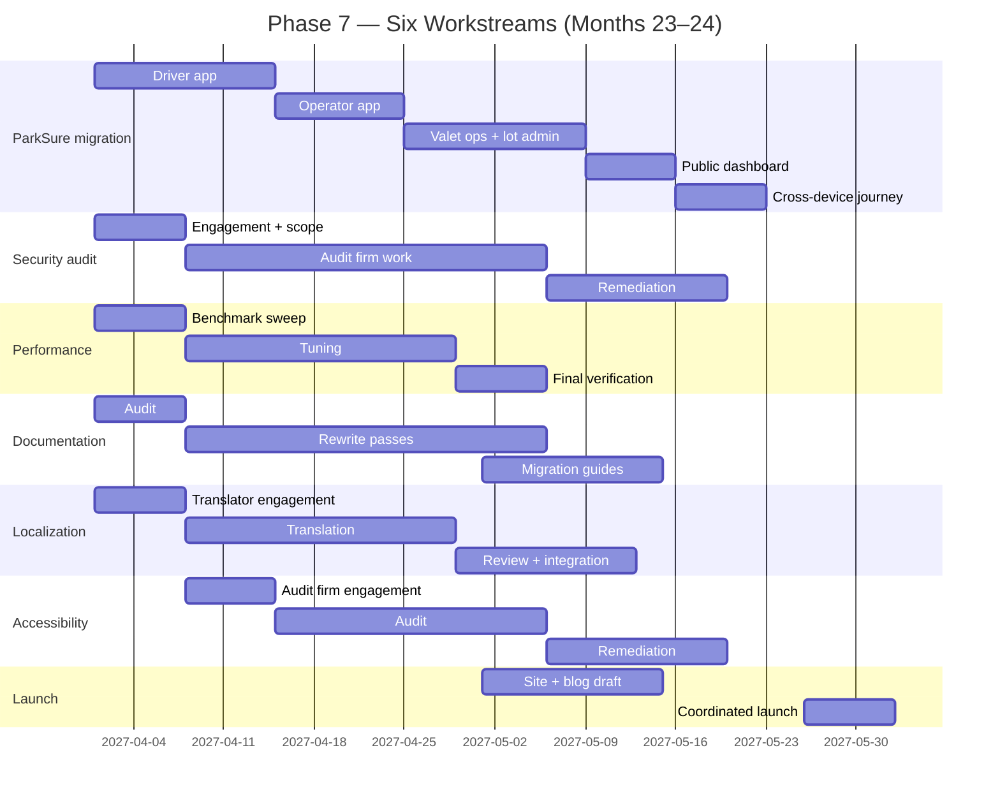
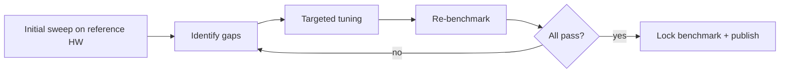

# Layer36 — Phase 7 Detailed Plan: v1.0 Hardening

> **Phase:** 7 of 8 (final phase before v1.0 launch)
> **Duration:** Months 23–24 (60 calendar days, ~40–50 engineering days of work)
> **Phase sentence:** *Make every piece of Layer36 launch-quality, migrate ParkSure end-to-end, and ship v1.0 in public.*
> **Prerequisite:** Phase 6 complete — marketplace, signing, identity, sync all operational.
> **Supersedes:** nothing.
> **Superseded by:** v1.0 maintenance phase (post-launch, out of scope of this plan).

---

## Table of Contents

0. [How to Use This Document](#0-how-to-use-this-document)
1. [Phase Objective](#1-phase-objective)
2. [Prerequisites from Phase 6](#2-prerequisites-from-phase-6)
3. [Success Criteria (= v1.0 Launch Gate)](#3-success-criteria--v10-launch-gate)
4. [What Phase 7 Is and Is Not](#4-what-phase-7-is-and-is-not)
5. [The Phase 7 Mindset](#5-the-phase-7-mindset)
6. [Six Workstreams](#6-six-workstreams)
7. [ParkSure Migration](#7-parksure-migration)
8. [External Security Audit](#8-external-security-audit)
9. [Performance Final Pass](#9-performance-final-pass)
10. [Documentation Completion](#10-documentation-completion)
11. [Localization (i18n / l10n)](#11-localization-i18n--l10n)
12. [Accessibility Audit](#12-accessibility-audit)
13. [Launch Coordination](#13-launch-coordination)
14. [Bug Triage & Stabilization](#14-bug-triage--stabilization)
15. [Week-by-Week Breakdown](#15-week-by-week-breakdown)
16. [Task Details](#16-task-details)
17. [Code Skeletons](#17-code-skeletons)
18. [Testing Strategy](#18-testing-strategy)
19. [Performance Targets (Final)](#19-performance-targets-final)
20. [Security & Threat Model v1.0](#20-security--threat-model-v10)
21. [Documentation Deliverables](#21-documentation-deliverables)
22. [Architecture Decision Records](#22-architecture-decision-records)
23. [Launch-Week Readiness](#23-launch-week-readiness)
24. [Exit Criteria Checklist](#24-exit-criteria-checklist)
25. [Phase 7 Risks](#25-phase-7-risks)
26. [Post-v1.0 Roadmap](#26-post-v10-roadmap)
27. [Appendices](#27-appendices)

---

## 0. How to Use This Document

Phase 7 is unlike every other phase in this plan. The previous seven phases were about *building* Layer36. Phase 7 is about making sure what was built actually holds up to the world. There is almost no new architecture, almost no new code beyond bug fixes, almost no new APIs. Instead, there is intense discipline: every promise made in Phases 1–6 must be verified, every rough edge must be smoothed, every component must be production-ready, and the platform must stand on its own without the founder personally vouching for it.

- This document is shorter than Phases 5 and 6 — proportional to its scope. The work is real but most of it is judgment, not engineering.
- Read §5 (Phase 7 Mindset) first. The discipline shift is the hardest part.
- The exit criteria in §24 *are* the launch criteria. There is no Phase 8 in this plan; v1.0 ships when §24 is green.
- Task IDs in §16 match Build Plan §7.8.
- Two months is short. Don't add. Subtract.

---

## 1. Phase Objective

### 1.1 One-sentence objective

**Every Layer36 component is production-ready, ParkSure runs end-to-end on Layer36, security has been audited by people who weren't involved in building it, and on launch day a stranger reads about Layer36 on Hacker News, installs it, builds an app, and ships it — and nothing breaks.**

### 1.2 Why this matters

The first 24 hours of v1.0 launch decide whether Layer36 gets a second look from the world. A platform that's "almost ready" at launch is a platform that gets dismissed in one tweet and never recovers. Phase 7 is the difference between a fair shot and a missed one. It's two months of un-glamorous work — bug fixes, doc polish, perf tuning, audit response, localization review — that determine whether the previous 22 months of architectural cleverness reach anyone.

### 1.3 The seven deliverables of Phase 7

1. **ParkSure migrated** — all 6 client apps (driver, operator, valet ops, lot admin, event ops, public dashboard) running as a single Layer36 codebase.
2. **External security audit** — third-party firm reviews runtime, crypto, signing, marketplace; findings remediated.
3. **Performance pass** — every metric in §19 hit on reference hardware.
4. **Documentation** — every public API has examples; every concept has a guide; every error has remediation.
5. **Localization** — runtime + marketplace translated to en, de, fr, es, hi, ja, zh.
6. **Accessibility audit** — WCAG 2.1 AA compliance verified for marketplace; full screen-reader pass for `layer36-notes` on all 5 platforms.
7. **Public launch** — coordinated blog, HN, Product Hunt, press, video demo, all on Day 0.

---

## 2. Prerequisites from Phase 6

Before touching a single line of Phase 7 work, verify:

- [ ] All Phase 6 exit criteria met.
- [ ] Marketplace API serving real traffic (10 dev partners + 100 user partners).
- [ ] Identity + sync working across all 5 platforms.
- [ ] Bundle signing + transparency log live.
- [ ] Background update service deployed.
- [ ] Moderation queue functional with SLA met.
- [ ] Legal: ToS, Privacy Policy, Developer Agreement, DSA notices live.
- [ ] Trademark filings submitted in primary jurisdictions.
- [ ] ADRs 0001 through 0058 merged.
- [ ] Counsel sign-off on Phase 6 launch readiness.

If any box is unchecked, finish Phase 6 first. Phase 7 cannot fix Phase 6 bugs and ship v1.0 in two months.

---

## 3. Success Criteria (= v1.0 Launch Gate)

Phase 7 is **done** when, and only when, every row below is true. These rows are the v1.0 launch gate. Do not ship without them all green.

| # | Criterion | Measured how |
|---|-----------|--------------|
| 1 | ParkSure: all 6 client apps run on Layer36 in production | ParkSure team sign-off |
| 2 | Single ParkSure codebase replaces previous 6 native codebases | Git history confirms |
| 3 | External security audit complete; all P0/P1 findings remediated | Audit report + remediation matrix |
| 4 | All v1.0 performance targets met within 5% on reference hardware | Benchmark dashboard |
| 5 | UAPI reference: every function has at least one code example | Auto-generated check in CI |
| 6 | Migration guides exist from Electron, Flutter, React Native | Three docs published |
| 7 | Localization complete in 7 target locales for runtime + marketplace | Translation review sign-off |
| 8 | Accessibility audit: WCAG 2.1 AA pass for marketplace; screen reader pass for `layer36-notes` on 5 platforms | Audit firm report |
| 9 | Marketing site (layer36.dev) live with documentation, tutorials, blog | Public URL working |
| 10 | Launch blog post written and ready | Draft reviewed |
| 11 | Coordinated launch communications drafted (HN, Product Hunt, Twitter/X, press) | Launch playbook in `docs/internal/launch/` |
| 12 | Zero P0 bugs open at launch gate | Bug tracker |
| 13 | < 10 P1 bugs open at launch gate | Bug tracker |
| 14 | On-call rotation staffed for launch week | Schedule confirmed |
| 15 | Marketplace running for 14 consecutive days at 99.9% uptime | Status page |
| 16 | Public launch executed and surviving 24 hours without P0 incident | Post-launch review |

---

## 4. What Phase 7 Is and Is Not

### 4.1 Phase 7 IS

- Migrating ParkSure as the flagship dogfood case.
- An external security audit and the work to remediate it.
- Performance tuning to meet every documented target.
- Documentation rewrites and pass-throughs.
- Translation review across seven languages.
- Accessibility audit and remediation.
- Marketing site (layer36.dev) and the launch blog post.
- Coordinated public launch.
- Bug bash, bug bash, bug bash.
- 24/7 on-call rotation training.

### 4.2 Phase 7 is NOT

- Not a feature phase. Zero new UAPIs. Zero new languages. Zero new platforms.
- Not a redesign. The platform's shape is what Phase 6 left it.
- Not a new architecture. ADRs 0059+ are reserved for genuinely critical mid-flight decisions; the goal is none.
- Not "phase 1 of v2." That conversation starts after launch.
- Not a fundraise pitch deck. Funding work happens in parallel but is not part of this plan's scope.
- Not the time to add features users have requested. Their requests go to the v2 backlog.

### 4.3 Anti-discipline: the temptation to add

The single biggest threat to Phase 7 is the urge to add "just one more thing." A polished launch with seven solid features beats a launch with eight features and one half-broken one. Every PR opened in Phase 7 is reviewed against the question: **"does this fix something already promised, or does this add a new promise?"** If the latter, it goes to v2.

---

## 5. The Phase 7 Mindset

### 5.1 What changes

Phases 1–6 selected for engineers who like building things. Phase 7 selects for engineers who like *finishing* them. These are different skills. Building is generative — make a thing that wasn't there. Finishing is reductive — remove every reason for the thing not to work.

### 5.2 Three operational shifts

1. **From "ship it" to "is this true?"** Every claim in documentation must be verified by running the code. Every performance number must be from current hardware, not from three months ago. Every "feature complete" must mean someone external can use it.

2. **From individual ownership to backstop ownership.** During Phases 1–6, the founder probably knew every part of the system intimately. In Phase 7, the audit firm, the docs reviewer, the translator, the accessibility consultant — none of them have that context. Their job is to find what the founder missed. The founder's job is to thank them.

3. **From engineering hours to elapsed hours.** Audit firms take 4 weeks. Translation review takes 3 weeks. Legal sign-off takes 2 weeks. These aren't engineering tasks; they're *waiting* tasks with hard dependencies. Schedule them as the critical path, not as background work.

### 5.3 The "boring" win condition

Phase 7 is won when launch day is boring. Boring means: the install works, the first build works, the marketplace doesn't fall over, the docs are findable, the audit report has no nasty surprises, and the team isn't firefighting at 3am. Boring is the highest praise an engineering team can earn.

### 5.4 Recorded in

ADR-0059: Phase 7 mindset. Short and direct. Read by every contributor before they push their first Phase 7 PR.

---

## 6. Six Workstreams

Phase 7 runs six concurrent workstreams. Each has a different rhythm; mixing them up wastes time.



The pattern: kick off everything that has external dependencies in Week 1. Stay engineering-busy on the items that don't. Converge in the final two weeks.

---

## 7. ParkSure Migration

### 7.1 Why ParkSure is the flagship case

ParkSure already exists. It already has six native client codebases. It is already the founder's company, so the migration is feasible and the dogfooding is real. No other case study makes the argument as cleanly: "we replaced six codebases with one, and here's the diff."

### 7.2 The six clients

| Client | Audience | Platforms |
|---|---|---|
| Driver app | End users parking their cars | iOS, Android |
| Operator app | ParkSure staff | iOS, Android |
| Valet ops | Valet attendants on duty | iOS, Android, occasional desktop |
| Lot admin | Lot operators / owners | Web, occasional desktop |
| Event ops | Event-day staff | iOS, Android |
| Public dashboard | Anyone (parking availability lookup) | Web, mobile-web |

Six codebases, three target platform sets, mixed native + web. After migration: **one Layer36 codebase**, all targets.

### 7.3 Migration order

Driver app first because:
- Most ambient use, biggest QA surface.
- Touches every UAPI (UI, sensors, payments-stub, location, camera for QR, lifecycle, sync).
- Bugs surface fastest with most users.

Then operator app — staff are tolerant of bugs, give feedback rapidly. Then valet ops + lot admin together (similar UX). Public dashboard last — most read-only, lowest risk.

### 7.4 Migration target

Each client app:
- Same feature set as production (no scope creep into "let's add X while we're rewriting").
- Single codebase in Rust (likely; could be TypeScript if team prefers).
- Manifest declares all required UCap caps with rationales.
- Cross-device sync via `layer36:identity` so a driver who installs on phone and tablet is recognized as same user.

### 7.5 What ParkSure gains

| Before | After |
|---|---|
| Six separate codebases | One |
| Three teams (iOS, Android, web) | One |
| Six release cycles | One |
| Six bug backlogs | One |
| Per-platform feature drift | Consistent |
| New OS version → six tests | One |

### 7.6 What ParkSure pays

- Initial migration effort (~6 weeks of focused work).
- Acceptance of Layer36 limitations: no third-party SDKs that don't have Layer36 bindings (e.g., specific payment providers — handle through HTTP in v1).
- Slightly different UX per host (intentional — natives feel native).

### 7.7 The migration playbook

Each app follows:

```
1. Inventory features in the existing app. Document.
2. Create Layer36 project from `rust-mobile` template.
3. Port screens one at a time. Native rendering on each host.
4. Move backend integration. ParkSure server unchanged.
5. Add UCap declarations.
6. QA on iOS + Android + (where applicable) web.
7. Cross-device sign-in test.
8. Performance comparison vs old app.
9. Beta with internal team.
10. Production rollout.
```

### 7.8 Cross-device journey test

The single test that proves ParkSure-on-Layer36 works:

```
A driver opens the app on their iPhone, books a parking spot.
The driver puts the iPhone away, opens the app on their Android tablet.
The booking is there. Their identity is recognized. No login flow.
At the lot, the driver opens the app on a third device (display screen at the parking entrance scanning their QR).
The booking is recognized. Entry granted.
```

If this works, Layer36 is everything we said it was. If it doesn't, we don't ship.

### 7.9 Rollback plan

ParkSure's existing apps stay on production until Layer36-ParkSure has run for 14 days at SLA. Switch is gradual: percentage rollout via app version distribution. Revert = roll back distribution percentages.

---

## 8. External Security Audit

### 8.1 Why an external audit

The team that built Layer36 knows Layer36 too well. Subtle assumptions bake in over 22 months. An external auditor's job is to break those assumptions on purpose, professionally, before adversaries break them in production.

### 8.2 Firm selection

Three firms qualified for Layer36's surface:
- **Trail of Bits** — strong in cryptography, runtime sandboxing.
- **NCC Group** — broad; experienced with platform-scale audits.
- **Cure53** — specialized in browser/sandbox security; good for our boundary work.

Selection criteria: prior WASM/runtime experience, willingness to work in 4-week window, references on similar projects. Chosen firm: documented in ADR-0060.

### 8.3 Scope of audit

Audit firm reviews:

1. **Runtime sandbox.** WASM ↔ host adapter boundary.
2. **UCap policy enforcement.** Capability matching, revocation, race conditions.
3. **Bundle signing + transparency log.** Cryptographic correctness.
4. **Identity (`layer36:identity`).** DID handling, key storage, sync encryption.
5. **Marketplace backend.** API auth, rate limits, injection, privilege escalation.
6. **Background update service.** Code-running-as-elevated-privileges.

Audit excludes:
- Apps built on Layer36 (their developers' responsibility).
- Cloud infra outside our service code (Cloudflare, AWS).
- Third-party libraries (we audit the integration; not the library itself).

### 8.4 Engagement timeline

- **Week 1:** Engagement signed, scope frozen, repo + docs handed off.
- **Weeks 2–5:** Audit work. Weekly sync calls. Findings drip in.
- **Weeks 5–6:** Final report. Remediation begins.
- **Weeks 6–8:** Remediation work + retest.
- **End of audit:** Public statement (with audit firm's permission) summarizing findings + fixes.

### 8.5 Findings classification

Standard CVSS-aligned:
- **P0 (Critical):** must fix before launch. Examples: signature bypass, sandbox escape.
- **P1 (High):** must fix before launch unless mitigation documented. Examples: timing attacks, privilege escalation in narrow conditions.
- **P2 (Medium):** fix in v1.0.x patch series within 90 days.
- **P3 (Low):** track, fix when convenient.

### 8.6 What we publish

- Public summary of audit (post-launch).
- Audit firm name and methodology.
- Number of findings per severity, summarized.
- We do NOT publish full report; some details remain confidential per industry practice.
- We DO publish the fix commits with their CVE if applicable.

### 8.7 Bug bounty kickoff

Phase 7 launches Layer36 Bug Bounty. Initial rewards:
- P0: $5,000–25,000.
- P1: $1,500–5,000.
- P2: $250–1,500.
- P3: $50–250.

Scoped to runtime, marketplace, identity, signing. Hosted via HackerOne or Intigriti — TBD by Week 4.

### 8.8 Cost

Budget: $40,000–$80,000 for the audit, depending on firm and scope. This is real money; the Layer36 budget anticipates it. Counsel sign-off on the audit contract is also part of legal scope.

---

## 9. Performance Final Pass

### 9.1 What we measure

Every metric promised across Phases 1–6, in one consolidated benchmark suite. Reference machines documented in §19.

### 9.2 Process



### 9.3 Categories under review

| Category | Source phase |
|---|---|
| CLI cold start, hot start | Phase 1 |
| UAPI dispatch overhead | Phase 2 |
| GUI cold start, frame time, layout | Phase 3 |
| Mobile cold start (AOT-cached), warm start | Phase 4 |
| Battery drain | Phase 4 |
| 60-second walkthrough | Phase 5 |
| Hot reload swap latency | Phase 5 |
| Marketplace API p99 latency, throughput | Phase 6 |
| Install time | Phase 6 |
| Delta apply time | Phase 6 |
| Identity creation time | Phase 6 |
| Cross-device sync time | Phase 6 |

### 9.4 Tuning targets

The areas most likely to need work, based on prior phase retrospectives:

- **iOS cold start with AOT cache.** Pre-launch this was just under target; expect 10–20% gap to close.
- **Marketplace API p99.** Cold-cache requests to S3 are slow; warm-up + edge caching needed.
- **Hot reload on Android over Wi-Fi.** Network latency dominates; investigate USB-tethered fallback.
- **Mobile RSS for `layer36-notes`.** Likely 130 MB; target 120; identify allocation hot spots.

### 9.5 What we won't do

- Not micro-optimization of code paths that don't show up in profiles.
- Not algorithm rewrites unless they're load-bearing for a missed target.
- Not feature changes to "make perf easier."

### 9.6 Public benchmark page

Final results published at `layer36.dev/benchmarks` with reproducible methodology. This is a credibility document; rivals will read it line by line.

---

## 10. Documentation Completion

### 10.1 The audit

Walk every page. Three categories of finding:

| Finding | Action |
|---|---|
| Outdated (refers to old API / old phase) | Update or delete |
| Missing (concept exists, doc doesn't) | Write |
| Wrong (doc claims X, code does Y) | Fix one or the other |

### 10.2 Documentation set at v1.0

Roughly the structure that should exist at launch:

```
docs.layer36.dev/
├── /                           # Landing
├── getting-started/
│   ├── install
│   ├── first-app-rust
│   ├── first-app-go
│   ├── first-app-typescript
│   └── first-app-mobile
├── tutorials/
│   ├── build-a-todo-app
│   ├── build-a-chat-app
│   ├── build-a-game
│   └── build-a-utility
├── reference/
│   ├── uapi/                   # Auto-generated from WIT
│   ├── manifest
│   ├── cli
│   ├── ucap
│   ├── errors                  # Every error code documented
│   └── glossary
├── concepts/
│   ├── why-layer36
│   ├── architecture
│   ├── widget-protocol
│   ├── lifecycle
│   ├── capabilities
│   ├── identity
│   └── signing-and-trust
├── languages/
│   ├── rust
│   ├── go
│   ├── typescript
│   ├── c-cpp
│   └── python
├── platforms/
│   ├── windows
│   ├── macos
│   ├── linux
│   ├── ios
│   └── android
├── publishing/
│   ├── first-publish
│   ├── versioning
│   ├── moderation
│   └── revenue            # placeholder for post-v1.0
├── migration/
│   ├── from-electron
│   ├── from-flutter
│   └── from-react-native
├── operations/
│   ├── monitoring         # for Layer36 itself, useful for self-hosters
│   └── status-page-readiness
├── policy/
│   ├── content
│   ├── developer-agreement
│   ├── privacy
│   ├── terms
│   └── transparency
├── community/
│   ├── code-of-conduct
│   ├── contributing
│   └── governance
└── blog/
    ├── 0001-announcing-layer36      # Phase 0
    ├── 0002-phase-1-complete
    ├── ...
    └── 00xx-launching-v1
```

### 10.3 Migration guides

The three "from X" guides serve a specific GTM purpose: they tell developers stuck maintaining Flutter/Electron/RN codebases that they have a path out. Each guide is written from a real porting experience (the Layer36 team picks a small Flutter/Electron/RN project, ports it, documents what changed).

### 10.4 Quality gate

A documentation page is "done" when:
- A reader who has never seen Layer36 can complete the task it describes.
- All code samples in it run as written, in CI.
- Cross-references to other pages are correct.
- It loads in under 2 seconds.

### 10.5 Process

External technical writer engaged in Week 1. Reviews + co-authors with engineering. Founder reviews each major section before merge.

---

## 11. Localization (i18n / l10n)

### 11.1 Target locales (v1.0)

Seven, chosen for: combined developer + user reach, content quality of available translators, and Layer36's geographical priorities (Singapore + India + Europe + East Asia).

| Locale | Code |
|---|---|
| English (US) | en-US |
| German | de-DE |
| Spanish | es-ES |
| French | fr-FR |
| Hindi | hi-IN |
| Japanese | ja-JP |
| Chinese (Simplified) | zh-CN |

### 11.2 What gets localized

- Runtime UI strings (UCap dialogs, error messages, system prompts).
- `layer36` CLI strings.
- Marketplace frontend strings.
- Marketing site strings (layer36.dev).
- Top-tier docs (getting-started + tutorials only — full reference stays en-US for v1.0).

### 11.3 Format

Fluent (`.ftl`) format from Mozilla. Modern, supports plurals and gender, widely tooled.

```fluent
# Example: marketplace-frontend
install-button = Install
install-progress = Installing { $appName }… { $percent } %
review-count = { $count ->
    [one] 1 review
   *[other] { $count } reviews
}
```

### 11.4 Translation source

- Professional translation services for first pass.
- Native-speaker review (often a contractor in-region) for cultural / idiom appropriateness.
- Avoid machine-only translation for user-facing copy.

### 11.5 Translator engagement timeline

- Week 1: agency engagement, glossary handoff, style guide.
- Weeks 2–4: first translation pass.
- Weeks 4–6: review.
- Week 6: integration.
- Weeks 7–8: bug fixes.

### 11.6 What doesn't get localized in v1.0

- Full UAPI reference (en-US only; community translations welcomed post-launch).
- Blog posts (English only).
- Internal moderation tools (English only).
- Transparency log entries (English only).

These ship en-US; localization is a v1.0.x or v2 stretch goal.

### 11.7 Right-to-left

Arabic, Hebrew, and other RTL locales are post-v1.0. Layout engine supports RTL but we haven't tested it in production. Adding now risks breaking everything; defer.

---

## 12. Accessibility Audit

### 12.1 Standard

WCAG 2.1 Level AA. Recognized standard, regulatory force in EU (EAA) and US (Section 508).

### 12.2 Scope

Two parts:

- **Marketplace frontend:** primary focus. WCAG 2.1 AA across all flows (browse, search, detail, install, account, library).
- **`layer36-notes` flagship:** screen reader pass on all five platforms.

Apps built on Layer36 by other developers are their own responsibility. We provide the primitives (accesskit integration in Phase 3, a11y tree); developers use them.

### 12.3 Audit firm

Recommended: a specialist a11y firm (Deque, Level Access, AccessibilityWorks). 2-week engagement. Cost: $10–20k.

### 12.4 What gets tested

| Test | Target |
|---|---|
| Color contrast | All UI elements ≥ 4.5:1 ratio (text), ≥ 3:1 (UI components) |
| Keyboard navigation | All flows usable without mouse |
| Screen reader (VoiceOver, Narrator, TalkBack, JAWS, NVDA, Orca) | All controls announce role + state correctly |
| Focus indicators | Visible on all focusable elements |
| Reduced motion | Respects `prefers-reduced-motion` |
| Text resizing | Layout intact at 200% zoom |
| Error messages | Available to assistive tech, not just visual |
| Form labels | All inputs have programmatic labels |
| Alt text | All meaningful images have alt text |
| Heading structure | Logical, no skipped levels |
| Language attributes | Set correctly per locale |

### 12.5 Remediation

Findings classified P0/P1/P2 same as security audit. P0/P1 fix before launch. P2 within 90 days.

### 12.6 Public statement

`docs.layer36.dev/policy/accessibility` with VPAT (Voluntary Product Accessibility Template) at launch.

---

## 13. Launch Coordination

### 13.1 Launch date selection

Picked 4 weeks before launch. Tuesday, ~10am ET (favorable for HN, US East press timezone, EU afternoon).

Avoid:
- Major industry events (re:Invent, WWDC, Google I/O) — gets buried.
- Holiday weeks.
- Other big platform launches (monitored as best as possible).

### 13.2 Channels

| Channel | Asset | Owner |
|---|---|---|
| layer36.dev | Marketing site landing | Founder + designer |
| Blog | "Launching Layer36 v1.0" post | Founder |
| Hacker News | Show HN post | Founder, prepared |
| Product Hunt | Featured launch | Product Hunt veteran assist |
| Twitter/X | Launch thread | Founder |
| LinkedIn | Long-form post | Founder |
| Reddit | r/programming, r/rust, r/webassembly carefully | Founder |
| YouTube | 3-minute demo video | Founder + video editor |
| Press | TechCrunch, The Register, Lobste.rs | PR consultant or self |
| Mailing list | Existing subscribers (Phase 0+) | Founder |
| Podcast | One pre-recorded interview | Founder |
| Discord | Pinned launch message | Founder |

### 13.3 Sequence on Launch Day

```
T-24h  : Final smoke test on production marketplace. Status page green.
T-12h  : Pre-flight check: launch posts staged, social scheduled.
T-1h   : On-call team paged; running pre-launch monitoring drills.
T-0    : Blog post goes live. Status page shows "Public Launch" annotation.
T+0:01 : HN post submitted.
T+0:05 : Twitter/X thread posted.
T+0:15 : Mailing list email queued.
T+0:30 : Product Hunt submission (PH timezone is GMT-8 dawn — staggered).
T+1h   : Founder available for on-thread responses.
T+2h   : First metrics check (marketplace load, signups).
T+6h   : First incident review.
T+24h  : Day-1 retrospective (internal only).
T+72h  : Public Day-3 update (blog or thread).
T+1w   : Day-7 retrospective with full team.
T+30d  : Day-30 retrospective + planning for v1.0.x.
```

### 13.4 Runbook for the first 24 hours

The team's job during launch day, in priority order:

1. **Monitor & respond to incidents.** PagerDuty active. SLO breach → page.
2. **Engage on threads.** Founder + 1–2 others answering HN, Twitter, Discord.
3. **Watch for content moderation.** Surge of new app submissions expected; queue may need extra hands.
4. **Track metrics.** Sign-ups, installs, app submissions, error rates. Real-time dashboard.
5. **Don't ship code.** Code freeze for 48 hours unless P0 fix.

### 13.5 Pre-recorded demo video

3 minutes. Shows: install Layer36, run `layer36 new`, hit save, see app, install ParkSure from marketplace, sign in on second device, see same data.

Production: simple screencast + voiceover. No fancy editing. Honesty over polish.

### 13.6 Launch metrics targets

These are aspirational; missing them is fine. Hitting them is "successful launch."

| Metric | Day 1 | Day 7 | Day 30 |
|---|---|---|---|
| Stars on GitHub | 1k | 5k | 15k |
| Discord members | 500 | 2k | 5k |
| Marketplace installs | 1k | 10k | 50k |
| Apps published | 5 | 30 | 100 |
| Identity signups | 500 | 5k | 25k |
| Press mentions | 5 | 20 | 50 |

These numbers are *targets*, not predictions. The launch is successful even at half these numbers if the platform itself works smoothly.

---

## 14. Bug Triage & Stabilization

### 14.1 Bug bash weeks

Two dedicated bug bashes during Phase 7:
- **Week 4:** Internal bash. Whole team uses every flow on every platform. Log everything.
- **Week 7:** External bash. Invite 50 trusted users for one weekend. Pay them with Layer36 swag + early-access flair.

### 14.2 Triage process

```
New bug filed
    ↓
Auto-label by area
    ↓
Triage (daily, 30 min)
    ↓
Severity assigned (P0/P1/P2/P3)
    ↓
Owner assigned
    ↓
Track to resolution
```

### 14.3 Severity rubric

| Severity | Meaning | SLA |
|---|---|---|
| P0 | Blocks launch; data loss; security; majority of users affected | Fix today |
| P1 | Significantly degrades launch experience; minority affected; clear workaround missing | Fix this week |
| P2 | Quality issue; small impact; clear workaround | Fix in v1.0.x |
| P3 | Cosmetic; rarely seen | Backlog |

### 14.4 What blocks launch

- Any open P0.
- More than 10 open P1.
- Any unfixed P0/P1 from external security audit.
- Any unfixed P0/P1 from accessibility audit.
- Any failing exit criterion in §24.

### 14.5 Bug ownership

Single owner per bug. Owner is responsible for: investigation, fix, testing, merge. No "team owns it" — that means nobody owns it.

### 14.6 Fix verification

P0/P1 fixes get a regression test added. No "trust me, it's fixed" merges.

---

## 15. Week-by-Week Breakdown

### Week 1

- Engage external security audit firm.
- Engage technical writer.
- Engage translation agency.
- Engage accessibility audit firm.
- ParkSure migration: driver app — start.
- Performance benchmark sweep — baseline.
- ADR-0059 (Phase 7 mindset).

### Week 2

- ParkSure: driver app continues.
- Audit firm: scope freeze + handoff.
- Translation: glossary + style guide.
- Docs audit: identify gaps.
- Performance: identify gaps.

### Week 3

- ParkSure: driver app finish.
- Audit firm: active.
- Translation: in progress.
- Docs: rewrites in priority order.
- Performance: tuning hot paths.

### Week 4

- ParkSure: operator app.
- Audit firm: active.
- Internal bug bash (5 days).
- Docs: continued.
- Performance: continued.

### Week 5

- ParkSure: valet ops + lot admin.
- Audit firm: final report.
- A11y audit firm: report due.
- Translation: review begins.
- Docs: migration guides.

### Week 6

- ParkSure: public dashboard + cross-device journey.
- Audit firm: remediation begins.
- A11y remediation begins.
- Translation: integration.
- Marketing site draft.

### Week 7

- ParkSure: production rollout begins.
- External bug bash (weekend).
- Audit + a11y remediation continues.
- Launch blog post draft.
- Demo video first cut.

### Week 8 (final week)

- ParkSure: stable on production.
- Audit + a11y P0/P1 closed.
- Documentation complete.
- Localization complete.
- Marketing site complete.
- Launch playbook reviewed.
- 14-day uptime check rolling.
- Launch.

---

## 16. Task Details

Matches Build Plan §7.8.

### P7-PARK-01 — ParkSure architecture review for Layer36 port

**Estimate:** 3 days.
**Branch:** `p7-park-01-arch-review`.
**Acceptance:**
- All 6 ParkSure clients inventoried.
- Per-client UAPI dependency list.
- Migration order finalized.
- Risks documented per client.

### P7-PARK-02 — Port driver app

**Estimate:** 10 days.
**Branch:** `parksure/driver-layer36`.
**Acceptance:**
- Feature parity with current production.
- Runs on iOS + Android.
- All UCap caps documented + granted on first run.
- Performance ≥ current production.

### P7-PARK-03 — Port operator app

**Estimate:** 10 days.
**Branch:** `parksure/operator-layer36`.
**Acceptance:**
- Same as P7-PARK-02 for operator workflows.

### P7-PARK-04 — Port valet ops + lot admin

**Estimate:** 10 days.
**Branch:** `parksure/valet-and-admin-layer36`.
**Acceptance:**
- Both apps run on iOS, Android, desktop where applicable.

### P7-PARK-05 — Port public dashboard

**Estimate:** 5 days.
**Branch:** `parksure/dashboard-layer36`.
**Acceptance:**
- Runs on web (where Layer36 browser host applies if available) + mobile + desktop.
- Read-only public access.

### P7-PARK-06 — Cross-device user journey end-to-end

**Estimate:** 5 days.
**Branch:** `parksure/cross-device-test`.
**Acceptance:**
- The test in §7.8 passes consistently.
- Documented as a public Layer36 case study.

### P7-SEC-01 — External security audit

**Estimate:** 20 days elapsed.
**Acceptance:**
- Audit complete.
- All P0/P1 findings remediated.
- Public summary published.

### P7-SEC-02 — Audit remediation

**Estimate:** 10 days.
**Branch:** `p7-sec-02-remediation`.
**Acceptance:**
- Each P0/P1 has a fix commit referenced from audit report.
- Regression tests added.

### P7-PERF-01 — Meet §1.3 and §19 targets

**Estimate:** 20 days (parallel).
**Branches:** various (per-area).
**Acceptance:**
- Every metric within 5% of target.
- Public benchmark page published.

### P7-DOC-01 — Documentation pass (every UAPI fn)

**Estimate:** 15 days (parallel).
**Branch:** `p7-doc-01-pass`.
**Acceptance:**
- Every UAPI function has at least one example.
- CI checks for missing docs.
- All concepts have a guide page.

### P7-DOC-02 — Migration guide(s)

**Estimate:** 5 days.
**Branch:** `p7-doc-02-migration`.
**Acceptance:**
- Three guides: from Electron, Flutter, React Native.
- Each documents an actual port done internally.

### P7-I18N-01 — Localize runtime + marketplace

**Estimate:** 10 days (parallel with translators).
**Branch:** `p7-i18n-01-localize`.
**Acceptance:**
- 7 locales complete for in-scope strings.
- Native-speaker reviewers signed off.
- Locale switch in marketplace works.

### P7-A11Y-01 — Accessibility audit

**Estimate:** 5 days remediation post-audit.
**Branch:** `p7-a11y-01-audit-fixes`.
**Acceptance:**
- WCAG 2.1 AA pass for marketplace.
- Screen reader pass for `layer36-notes` on all 5 platforms.
- VPAT published.

### P7-LAUNCH-01 — Marketing site

**Estimate:** 5 days.
**Branch:** `layer36-marketing/launch`.
**Acceptance:**
- layer36.dev live with hero, value prop, links to docs/marketplace/Discord/GitHub.
- Performance budget met.
- A11y AA.

### P7-LAUNCH-02 — Launch blog, HN post, demo video

**Estimate:** 3 days.
**Branch:** `p7-launch-02-content`.
**Acceptance:**
- Blog post drafted, reviewed.
- HN draft prepared.
- Demo video uploaded to YouTube.
- Twitter thread drafted.

### P7-LAUNCH-03 — Press outreach

**Estimate:** 3 days (elapsed earlier).
**Acceptance:**
- TechCrunch, The Register, Lobste.rs, Hacker Newsletter contacted under embargo.
- Three confirm coverage interest.

---

## 17. Code Skeletons

Phase 7 has very little new code. Most "skeletons" are configuration, scripts, and templates.

### 17.1 Documentation example check (CI)

```rust
// xtask/src/uapi_doc_check.rs
//
// Walks wit/ files; for each function, ensures the markdown reference
// in docs/book/src/reference/uapi/ contains at least one example.

fn main() -> anyhow::Result<()> {
    let wit_files = glob::glob("wit/layer36/*.wit")?;
    let mut missing = Vec::new();

    for path in wit_files.flatten() {
        let module = parse_wit(&path)?;
        for func in module.functions() {
            let doc_path = format!(
                "docs/book/src/reference/uapi/{}/{}.md",
                module.name(),
                func.name()
            );
            if !std::path::Path::new(&doc_path).exists() {
                missing.push(format!("{}::{}", module.name(), func.name()));
                continue;
            }
            let body = std::fs::read_to_string(&doc_path)?;
            if !body.contains("```rust") && !body.contains("```ts") && !body.contains("```go") {
                missing.push(format!("{}::{} (no example)", module.name(), func.name()));
            }
        }
    }

    if missing.is_empty() {
        println!("All UAPI functions documented with examples.");
        Ok(())
    } else {
        for m in &missing {
            println!("MISSING: {}", m);
        }
        anyhow::bail!("{} UAPI functions missing docs/examples", missing.len());
    }
}
```

### 17.2 Locale switch in marketplace frontend

```rust
// apps/marketplace/src/i18n.rs
use fluent::{FluentBundle, FluentResource};
use std::sync::OnceLock;

static BUNDLES: OnceLock<std::collections::HashMap<String, FluentBundle<FluentResource>>> =
    OnceLock::new();

pub fn t(locale: &str, key: &str, args: &[(&str, &fluent::FluentValue)]) -> String {
    let bundles = BUNDLES.get_or_init(load_all_bundles);
    let bundle = bundles
        .get(locale)
        .or_else(|| bundles.get("en-US"))
        .expect("en-US fallback bundle missing");

    let msg = bundle.get_message(key).expect(&format!("missing key {key}"));
    let pattern = msg.value().expect("no value");

    let mut errors = Vec::new();
    let mut fluent_args = fluent::FluentArgs::new();
    for (k, v) in args {
        fluent_args.set(*k, (*v).clone());
    }
    bundle.format_pattern(pattern, Some(&fluent_args), &mut errors).into_owned()
}
```

### 17.3 ParkSure manifest excerpt

```toml
[app]
id      = "com.parksure.driver"
name    = "ParkSure Driver"
version = "1.0.0"
entry   = "driver.wasm"
world   = "layer36:app/full@0.4.0"
runtime-min = "1.0.0"

[metadata]
authors    = ["ParkSure"]
homepage   = "https://parksure.io"
license    = "Proprietary"
categories = ["lifestyle", "utilities"]
age-rating = "all"

[[capabilities]]
cap        = "net.connect:*.parksure.io:443"
rationale  = "Sync your bookings"
required   = true

[[capabilities]]
cap        = "sensors.location:fine"
rationale  = "Find parking near you"
required   = false

[[capabilities]]
cap        = "sensors.camera:rear"
rationale  = "Scan QR codes at parking entrances"
required   = false

[[capabilities]]
cap        = "notifications.local"
rationale  = "Remind you when your booking starts"
required   = false

[[capabilities]]
cap        = "identity.sign:user"
rationale  = "Authenticate with the ParkSure server"
required   = true

[mobile]
min-ios       = "15.0"
min-android   = "29"
orientations  = ["portrait"]

[ios]
info-plist-usage.nsCameraUsageDescription = "Scan QR codes at parking entrance"
info-plist-usage.nsLocationWhenInUseUsageDescription = "Find parking near you"

[android]
uses-permissions = [
  "android.permission.CAMERA",
  "android.permission.ACCESS_FINE_LOCATION",
]

[locales]
default   = "en"
supported = ["en", "de", "es", "fr", "hi", "ja", "zh"]
```

### 17.4 Launch-day status page metric labels

```yaml
# infra/prometheus/launch-rules.yml
groups:
  - name: launch_day_slo
    interval: 30s
    rules:
      - record: marketplace_api_p99_seconds
        expr: histogram_quantile(0.99, rate(http_request_duration_seconds_bucket{service="marketplace-api"}[5m]))

      - alert: MarketplaceApiP99High
        expr: marketplace_api_p99_seconds > 0.2
        for: 5m
        labels: { severity: warning, team: oncall }
        annotations:
          summary: "Marketplace API p99 above 200 ms"
          runbook: "https://docs.layer36.dev/runbook/marketplace-latency"

      - alert: SignupFailureRateHigh
        expr: rate(identity_creation_failures_total[5m]) / rate(identity_creation_attempts_total[5m]) > 0.01
        for: 5m
        labels: { severity: critical, team: oncall }
        annotations:
          summary: "Identity signup failure rate above 1%"

      - alert: PublishingBackedUp
        expr: marketplace_publish_queue_depth > 100
        for: 10m
        labels: { severity: warning, team: oncall }
```

---

## 18. Testing Strategy

### 18.1 Test categories in Phase 7

Mostly leveraging what exists; adding launch-specific:

| Category | Phase 7 emphasis |
|---|---|
| Unit | Stable; running |
| Integration | Stable; running |
| Cross-host diff | Critical; full matrix every PR |
| Snapshot | Stable |
| Fuzz | 24h budget per night |
| Load | Repeated load tests under launch traffic profile |
| Disaster | New: outage drills (CDN down, Postgres failover) |
| Rollback | New: versioned rollback drills |

### 18.2 Launch readiness drills

Three drills before launch:

- **D-14: CDN outage drill.** Simulate Cloudflare outage. Verify static fallback, marketplace browse degrades gracefully.
- **D-7: Postgres failover drill.** Failover primary. Verify zero data loss, < 30 s downtime.
- **D-3: Surge drill.** Traffic-replay 5x peak. Verify SLOs hold or document degradation gracefully.

### 18.3 Bug bashes (already in §14.1)

Two formal bashes plus continuous testing.

### 18.4 Acceptance testing for ParkSure

ParkSure's existing QA suite runs against the Layer36-built clients. Pass rate ≥ 98% required for switchover.

---

## 19. Performance Targets (Final)

These are the v1.0 launch targets. Same as targets accumulated through Phases 1–6, consolidated and confirmed for launch readiness.

### 19.1 Reference hardware

| Class | Spec |
|---|---|
| Mid-range desktop | Intel Core i5 12th gen / AMD Ryzen 5 5600, 16 GB RAM, NVMe SSD |
| Apple Silicon | M2 / M3 base config |
| Mid-range Windows | Surface Laptop / equivalent, 16 GB |
| Mid-range Linux | Same Intel/AMD spec running Ubuntu 24.04 |
| iPhone reference | iPhone 13 |
| Android reference | Pixel 6 |
| Tablet | iPad 10th gen |

### 19.2 v1.0 performance gate

| Metric | Target |
|---|---|
| Hello-world cold start (CLI) | < 100 ms cold, < 20 ms warm |
| GUI cold start | < 300 ms to first frame |
| GUI warm start | < 80 ms |
| Steady-state frame time (GUI) | ≤ 16.7 ms |
| iOS cold start (AOT-cached) | < 800 ms |
| Android cold start (cached) | < 800 ms |
| Mobile battery (typical app idle) | ≤ 2% per hour |
| 60-second walkthrough | ≤ 60 s |
| Hot reload (desktop, small change) | < 1 s |
| Marketplace API p99 | < 200 ms |
| Marketplace API throughput | 10k req/s sustained |
| Identity creation | < 60 s |
| Cross-device sign-in | < 60 s |
| App install (10 MB) | < 30 s |
| Delta apply (1 MB patch) | < 500 ms |

Miss > 5% blocks launch.

### 19.3 Performance benchmark page

`layer36.dev/benchmarks` with:
- Methodology (machines, OS versions, Layer36 version).
- All metrics with measured values and targets.
- Comparison to Flutter, Electron, React Native (where comparable).
- Reproducibility instructions.

---

## 20. Security & Threat Model v1.0

### 20.1 What v1.0 represents

The threat model is no longer a draft. v1.0 is the reference document for everything Layer36 protects against, what it doesn't, and how. It is the document users, developers, and auditors will cite.

### 20.2 Final threat model structure

`docs.layer36.dev/security/threat-model` contains:

1. **Trust zones** (developer, marketplace, runtime, host OS, user).
2. **STRIDE inventory per zone.**
3. **Mitigations table.**
4. **Out-of-scope items, explicitly named** (side channels, supply chain on dependencies we don't control, physical attacks).
5. **Reporting process** with PGP key, response SLA, disclosure timeline.

### 20.3 What changed for v1.0

Most threats and mitigations were established by Phase 6. v1.0 adds:

- External audit findings either fixed or documented as accepted residual risk.
- Bug bounty program live.
- Public CVE process documented.

### 20.4 Out-of-scope items at v1.0

Be explicit:

- Side-channel attacks (Spectre, rowhammer) — rely on OS / hardware mitigations.
- Supply chain on third-party dependencies — cargo-deny + audit checks; not formal verification.
- Physical access to user devices.
- Compromised OS layer (rooted phone, jailbroken iOS).
- Endpoint security on developer machines (IDE compromise, key theft from disk).

These are listed not because they're unimportant but because users deserve to know what's not covered.

---

## 21. Documentation Deliverables

### 21.1 Final documentation suite

By end of Phase 7, the documentation site contains everything in §10.2 with these characteristics:

- Every page reviewed.
- Every code sample CI-tested.
- Every cross-link verified.
- Every error message has a remediation page.
- All UAPI functions have at least one example.
- Migration guides for Electron / Flutter / React Native exist and are honest about tradeoffs.
- Status page exists (`status.layer36.dev`) with public uptime.

### 21.2 Internal documentation

For ourselves and future maintainers:

- Runbooks for common operational scenarios.
- Onboarding doc for a new engineer (how to get productive in week 1).
- Architecture overview showing every running service and its role.
- Decisions log (ADRs 0001 through 0060+).
- Phase retrospectives 0–7.

### 21.3 The launch blog post

Length: 1500–2500 words. Structure:

- Lede: what Layer36 is in one sentence.
- The problem: every app is written six times today.
- The bet: WebAssembly + native widget lowering + first-class capability model.
- What we built: short tour of the platform.
- What works: ParkSure case study.
- What's next: post-v1.0 roadmap teaser.
- How to try: install + first command.
- Acknowledgments.
- Open questions / honest limitations.

Honesty in the post is more compelling than salesmanship. Name what doesn't work yet.

---

## 22. Architecture Decision Records

Phase 7 expects very few ADRs. The discipline is to NOT make new architectural decisions in Phase 7. Expected:

| ID | Title | Week |
|---|---|---|
| 0059 | Phase 7 mindset: finishing, not building | W1 |
| 0060 | Audit firm selection: <chosen firm> | W1 |
| 0061 | Bug bounty program structure | W3 |
| 0062 | Launch-day on-call rotation | W6 |

Anything beyond these is a sign that scope discipline broke.

---

## 23. Launch-Week Readiness

### 23.1 Two-week launch countdown

```
Day -14:  All audit findings P0/P1 closed. Code freeze.
Day -10:  Localization integrated. A11y findings closed.
Day -7:   ParkSure migration complete and stable.
Day -5:   Disaster drills complete.
Day -3:   Final smoke test on production. Status page check.
Day -2:   Launch communications staged. Embargo briefings.
Day -1:   On-call rotation activated. Final go/no-go meeting.
Day  0:   Launch.
Day +1:   First public retrospective; visible response on threads.
Day +7:   Day-7 retrospective + first patch release decisions.
```

### 23.2 Go / no-go criteria

The go/no-go meeting on Day -1 reviews:

- All §24 exit criteria green.
- No P0 bugs open.
- Audit firm sign-off received.
- A11y audit firm sign-off received.
- Legal sign-off received.
- ParkSure on production for ≥ 7 days at SLA.
- On-call rotation confirmed.
- Embargo agreements confirmed with press.

If any item is yellow, postpone by 1 week. Postponement is cheap; failed launch is expensive.

### 23.3 No-launch fallback

If launch is postponed, the work continues. Most likely cause of postponement: late P1 finding from security or accessibility audit. New target: 2 weeks after fix. Reassess weekly.

### 23.4 Launch-day staffing

| Role | Person | Hours covered |
|---|---|---|
| Founder (founder) | Y | 0–24 |
| On-call eng | hire #1 | 0–12 |
| On-call eng (relief) | hire #2 | 12–24 |
| Community engagement | dedicated person | 8–22 |
| Moderation | moderation team | 9–21 |
| PR / press handling | PR consultant | 0–12 |

Total minimum: 4 people. Smaller team = founder gets exhausted = bad decisions on Day 0.

### 23.5 Launch-week budget

- Cloud overprovisioned by 5x normal capacity for the week.
- Cloudflare Pro plan minimum (Business preferred).
- Sentry / monitoring upgrade.
- Press release distribution.
- Incidental: hosting for press kit, banner ads if elected.

Budget: $5–15k for launch week alone.

---

## 24. Exit Criteria Checklist

This list = v1.0 launch gate. Do not launch with any item red.

### ParkSure
- [ ] All 6 ParkSure clients running on Layer36 in production.
- [ ] Single Layer36 codebase replaces 6 native codebases.
- [ ] Cross-device user journey test passes consistently.
- [ ] Performance ≥ existing native production app.
- [ ] ParkSure team formal sign-off.

### Security
- [ ] External audit complete.
- [ ] All P0/P1 audit findings remediated and verified.
- [ ] Public audit summary drafted.
- [ ] Bug bounty program live.
- [ ] Security incident response runbook updated.

### Performance
- [ ] All §19 targets within 5%.
- [ ] Public benchmark page live.
- [ ] Performance regression CI active.

### Documentation
- [ ] Every UAPI function has at least one example.
- [ ] All concepts have a guide page.
- [ ] All error codes have remediation docs.
- [ ] Migration guides from Electron, Flutter, React Native.
- [ ] Internal runbooks complete.

### Localization
- [ ] 7 locales complete for in-scope strings.
- [ ] Native-speaker reviewers signed off.
- [ ] Locale switch works in marketplace.

### Accessibility
- [ ] WCAG 2.1 AA pass for marketplace.
- [ ] Screen reader pass on all 5 platforms for `layer36-notes`.
- [ ] VPAT published.
- [ ] Accessibility statement on docs site.

### Operational
- [ ] 14 consecutive days at 99.9% marketplace uptime.
- [ ] Disaster drills passed (CDN, DB, surge).
- [ ] On-call rotation staffed.
- [ ] Status page live.
- [ ] Monitoring + alerting verified.

### Launch
- [ ] Marketing site (layer36.dev) live.
- [ ] Launch blog post drafted + reviewed.
- [ ] Demo video recorded + uploaded.
- [ ] Launch playbook in `docs/internal/launch/`.
- [ ] Press contacted under embargo (≥ 3 confirmed).
- [ ] Mailing list ready.
- [ ] HN, Twitter, Product Hunt drafts staged.

### Quality
- [ ] Zero P0 bugs.
- [ ] < 10 P1 bugs.
- [ ] Bug bash conducted (internal + external).
- [ ] Regression suite green for ≥ 7 consecutive days.

### ADRs
- [ ] ADR-0059 through ADR-0062 merged.

### Legal
- [ ] All Phase 6 legal items confirmed in force.
- [ ] Trademark filings progressed (registered or in active prosecution).
- [ ] Insurance in place.

### Final go/no-go
- [ ] Go/no-go meeting held on Day -1.
- [ ] All sign-offs received (audit firm, a11y firm, legal, ParkSure team).
- [ ] Launch executed.
- [ ] 24-hour post-launch review confirms no P0 incident.

---

## 25. Phase 7 Risks

### 25.1 Schedule risks

| Risk | Likelihood | Impact | Mitigation |
|---|---|---|---|
| Audit firm finds P0 late, can't remediate by Day 0 | Medium | Critical | Engage firm Week 1; weekly syncs; budget remediation buffer in Week 7 |
| Localization slips because of one locale | High | Medium | Soft-launch locale: ship 6, push 7th to v1.0.1 |
| ParkSure migration runs over | High | High | Order matters: critical clients first; defer least-critical to post-launch |
| External a11y audit late | Medium | Medium | Engage early; prefer firms with proven 2-week turnaround |
| Press embargo broken | Low | Medium | Stagger embargo briefings; minimal advance notice |
| Bug bash surfaces large surprise | High | High | Schedule both bashes in first 7 weeks; leave Week 8 as buffer |

### 25.2 Quality risks

| Risk | Likelihood | Impact | Mitigation |
|---|---|---|---|
| ParkSure-on-Layer36 underperforms native version | Medium | High | Performance comparison early; tune; if can't close gap, document and accept for v1.0 |
| New regressions from audit fixes | Medium | High | Regression test every fix; run full suite before merge |
| Translations are technically wrong but stylistically off | High | Medium | Native-speaker review; community feedback channel post-launch |
| Last-minute legal item (e.g., new EU regulation) | Low | Critical | Counsel monitors; documented response process |

### 25.3 Launch-day risks

| Risk | Likelihood | Impact | Mitigation |
|---|---|---|---|
| Marketplace falls over from launch traffic | Medium | Critical | 5x overprovisioning; Cloudflare cache; static fallback ready |
| Security incident during launch week | Medium | Catastrophic | On-call rotation; pre-rehearsed incident response |
| Negative response from community ("just another Electron") | Medium | Medium | Demo video shows native feel; ParkSure case study; honest blog post |
| Founder burnout in launch week | High | High | Mandatory rest day in Week 7; 4-person staffing on Day 0 |

### 25.4 Post-launch risks

| Risk | Likelihood | Impact | Mitigation |
|---|---|---|---|
| Adoption flat after Week 1 | High | Medium | Plan for Week 2 follow-up content; engage early adopters |
| Bug surge in real-world use exceeds team capacity | Medium | High | Triage strict; deferred work to v1.0.1 / v1.0.2 |
| Media misrepresents the project | Medium | Medium | Have prepared FAQ; Discord moderators briefed; founder-led correction |

### 25.5 Tripwires

Stop and reassess if:
- Week 4 and audit findings P0 are open with no remediation path.
- Week 5 and ParkSure driver app is not running on production.
- Week 6 and accessibility audit can't conclude in time.
- Week 7 and any §24 item is red with no plan.
- Day -3 and disaster drill fails.

Each tripwire = launch postponed by 1+ week and a re-plan.

---

## 26. Post-v1.0 Roadmap

### 26.1 What v1.0 doesn't ship (deliberate)

Per all prior phase plans:
- Payments / IAP.
- Plugin / extension system.
- Component / library registry.
- Web/browser host (full WASM-in-browser experience).
- Full Swift, Kotlin, Java app authoring.
- Smartwatch / TV / car platforms.
- AR / VR / XR.
- Federated marketplaces.
- Push notification infrastructure.
- Background tasks.
- In-app purchases.
- DRM.
- Promoted listings / ads.

### 26.2 The v1.0.x maintenance phase

First 90 days post-launch:
- Bug fixes.
- P2 audit findings.
- P2 a11y findings.
- 7th locale if it slipped.
- Performance regressions found in production.
- Documentation improvements from feedback.

### 26.3 The v2 conversation

Started 30 days post-launch, not before. Lessons from v1.0 in production must inform v2 priorities. Likely candidates:
- Push notifications (most-requested missing feature).
- Background tasks.
- In-app purchases (with revenue-share model).
- Web host target.
- Component/library registry.

### 26.4 Why a clean v1.0.x phase matters

Users who install v1.0 deserve a stable platform. Shipping v1.0.1 with major new features confuses the message. v1.0.x is *only* for fixes. v2 starts as its own planning effort.

---

## 27. Appendices

### Appendix A — Launch-day timeline (detailed)

```
T-72h (Friday before launch):
  - Code freeze.
  - All teams: final smoke tests.
  - Status page reviewed.
  - On-call schedule confirmed.

T-48h (Saturday):
  - Light testing only.
  - Founder rest day.
  - Marketing assets staged.

T-24h (Sunday):
  - Final infrastructure sanity check.
  - Pre-launch metrics baseline.
  - Communications calendar reviewed.

T-12h (Monday evening):
  - On-call team paged in.
  - Final dashboards open.
  - Press embargo briefings continue.

T-1h:
  - Final smoke test.
  - Status page annotated "Launching".
  - All hands ready.

T-0 (Tuesday 10am ET):
  - Blog post live.
  - Status page: public.
  - Marketing site: hero swap.

T+1m: HN post.
T+5m: Twitter thread.
T+15m: Mailing list (US morning).
T+30m: Product Hunt (PH timezone is GMT-8 morning).

T+1h: Founder on threads.
T+2h: First metrics review.
T+4h: Sustained traffic check.

T+8h: End-of-US-day check.
T+12h: Asia-morning traffic begins.
T+18h: EU-morning traffic.
T+24h: Day-1 retrospective (internal).

Day +3: Public Day-3 update post.
Day +7: Day-7 retrospective.
Day +14: Day-14 retrospective + v1.0.1 planning.
Day +30: Public Day-30 update + v2 conversation begins.
```

### Appendix B — Final exit criteria summary table

(Single-page reference of §24, for printing.)

| Area | Criterion | Status |
|---|---|---|
| ParkSure | All 6 clients on Layer36 in prod | ☐ |
| Security | Audit complete, P0/P1 closed | ☐ |
| Performance | All targets within 5% | ☐ |
| Docs | UAPI examples, concepts, migration guides | ☐ |
| L10n | 7 locales | ☐ |
| A11y | WCAG 2.1 AA + screen reader | ☐ |
| Ops | 14d/99.9%, drills passed | ☐ |
| Launch | Site, blog, video, playbook | ☐ |
| Quality | 0 P0, < 10 P1 | ☐ |
| ADRs | 0059–0062 | ☐ |
| Legal | Phase 6 items in force | ☐ |
| Go/no-go | Day -1 sign-off | ☐ |
| Day +1 | No P0 incident | ☐ |

### Appendix C — Retrospective template

Save as `docs/book/src/phase7/retro.md` shortly after launch.

```markdown
# Phase 7 / v1.0 Launch Retrospective

**Planned:** 8 weeks / **Actual:** <X> weeks
**Launch date:** YYYY-MM-DD
**Written:** YYYY-MM-DD (Day +14)
**Author:** @handle

## What shipped
- v1.0.0 with all §24 criteria green.

## Launch-day metrics
- Stars: …
- Discord: …
- Installs: …
- Apps published: …
- Press: …
- Incidents: …

## What went well
- …

## What went badly
- …

## What surprised us
- …

## ParkSure migration lessons
- …

## Audit lessons
- …

## Documentation lessons
- …

## Localization lessons
- …

## Accessibility lessons
- …

## Launch-day lessons
- …

## Concrete plans for v1.0.1
- …

## Concrete questions to answer before v2 planning
- …

## Personal reflection (founder)
- …
```

### Appendix D — Post-launch weekly cadence

For the first 90 days after v1.0:

```
Monday:    triage + sprint planning (60 min)
Tuesday:   build / fix
Wednesday: build / fix; community engagement window (2h founder time)
Thursday:  build / fix; perf + doc focus
Friday:    release prep (if releasing); retro (15 min)
Weekend:   on-call only; no shipping unless P0
```

Weekly release cadence for first 4 weeks; then biweekly. Avoid daily releases (fatigues users); avoid monthly (loses urgency).

### Appendix E — A founder's note for launch day

The plan in this document covers everything technical. It does not cover the part that matters most: that on launch day, the founder will be tired. The audit went late. The translation reviewer found something at the last minute. ParkSure's production switch had a hiccup.

The temptation will be to push. To answer one more thread. To respond to one more critic. To fix one more bug live. **Don't.**

Phase 7 done well means launch day looks boring on the outside while the founder rests on the inside, watching the dashboards calmly because everything that *can* be done has been done, and what's happening now is the result of two years of disciplined work, not last-minute heroism.

If launch day doesn't feel boring, the launch wasn't ready. That's a sign Phase 7 wasn't done. Go back. Finish. Then ship.

---

## Closing

---

## Development Log

> **Phase Status:** Not started  
> **Started:** —  
> **Completed:** —  
> **Last Updated:** 2026-05-01

### Progress Summary

_Not started. Awaiting completion of all [Phase 6 exit criteria](#3-success-criteria). This is the v1.0 launch phase — no new features, only quality, hardening, and shipment._

---

### Exit Criteria Status (= v1.0 Launch Gate)

Full criteria in [§3 Success Criteria](#3-success-criteria--v10-launch-gate). Every row must be green before v1.0 ships.

| # | Criterion | Status |
|---|-----------|--------|
| 1 | ParkSure: all 6 client apps running on Layer36 in production (team sign-off) | Not done |
| 2 | Single ParkSure codebase replaces all 6 previous native codebases | Not done |
| 3 | External security audit complete; all P0/P1 findings remediated | Not done |
| 4 | All v1.0 performance targets met within 5% on reference hardware | Not done |
| 5 | UAPI reference: every public function has ≥ 1 code example (CI-verified) | Not done |
| 6 | Migration guides from Electron, Flutter, React Native published (3 docs) | Not done |
| 7 | Localization complete in 7 locales for runtime + marketplace | Not done |
| 8 | Accessibility audit: WCAG 2.1 AA for marketplace; screen reader pass for `layer36-notes` on 5 platforms | Not done |
| 9 | Marketing site (layer36.dev) live with docs, tutorials, blog | Not done |
| 10 | Launch blog post written and reviewed | Not done |
| 11 | Coordinated launch communications drafted (HN, Product Hunt, Twitter/X, press) | Not done |
| 12 | Zero P0 bugs open at launch gate | Not done |
| 13 | < 10 P1 bugs open at launch gate | Not done |
| 14 | On-call rotation staffed for launch week | Not done |
| 15 | Marketplace running at 99.9% uptime for 14 consecutive days pre-launch | Not done |
| 16 | Public launch executed and surviving first 24 hours without P0 incident | Not done |

---

### Completed Tasks

| Task ID | Task | Completed | Notes |
|---------|------|-----------|-------|
| — | — | — | — |

---

### In Progress

| Task ID | Task | Started | Blockers |
|---------|------|---------|----------|
| — | — | — | — |

---

### Security Audit Tracker

| Firm | Engagement Status | Start | Report | Findings | Remediated |
|------|-------------------|-------|--------|----------|-----------|
| TBD (Trail of Bits or equiv.) | Not engaged | — | — | — | — |

---

### ParkSure Migration Tracker

| App | Status | Notes |
|-----|--------|-------|
| Driver app | Not started | |
| Operator app | Not started | |
| Valet ops app | Not started | |
| Lot admin app | Not started | |
| Event ops app | Not started | |
| Public dashboard | Not started | |

---

### ADRs Filed This Phase

| ADR | Title | Status | Merged |
|-----|-------|--------|--------|

_Phase 7 should require zero new ADRs. If an ADR is opened here, document why in the Notes section._

---

### Blockers & Open Questions

_None currently._

---

### Notes & Learnings

_Nothing yet. Add time-stamped notes as work progresses: security audit findings summary, ParkSure migration surprises, performance regression root causes, localization issues, post-launch incident retrospectives._

---

Phase 7 is unromantic. There are no architectural breakthroughs, no clever new abstractions, no feature reveals. There is just discipline — every promise verified, every rough edge filed down, every risk planned for. Two months of saying "no" to additions and "yes" to finishing.

The founders of every successful platform have a moment in their telling of the story where they describe something that sounds like Phase 7 — the months before launch when they stopped building and started polishing, when they invited strangers to break their work, when they wrote the docs they thought were boring and turned out to be the docs that made everything else findable. The platforms that don't have that phase in their story are the ones nobody remembers.

When v1.0 ships, the work doesn't end — it changes shape. The platform gets its real test from real users, not the imagined ones who shaped Phases 1–6. Some of what was built will turn out to be wrong; some will turn out to be more important than expected. v1.0 is not the goal. v1.0 is the moment Layer36 earns the right to be measured by reality.

Spend Phase 7 the way it deserves to be spent. Finish the thing. Ship.

— end of document —

— end of Layer36 planning suite —
