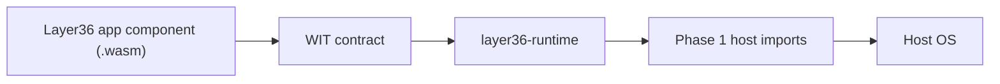
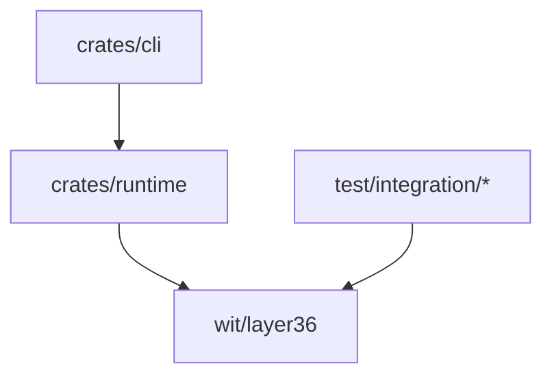

# Architecture

Layer36 is a portable app runtime. Apps compile to WebAssembly components and
import Layer36 host capabilities through WIT interfaces. Host adapters implement
those capabilities on each platform.

Phase 1 keeps that architecture deliberately thin: one component, one temporary
host interface, one CLI command, and no app bundle format yet.

## Phase 1 Runtime

The Phase 1 runtime is the smallest useful proof of the future system:

| Layer | Phase 1 implementation |
|---|---|
| App format | WebAssembly Component Model `.wasm` component |
| Interface contract | `wit/layer36/phase1.wit` |
| Runtime engine | Wasmtime 43.0.2 |
| Host API | `print(string)` and `exit(s32)` |
| Command surface | `layer36 run`, `layer36 version`, `layer36 doctor` |
| Safety controls | No WASI filesystem/network/env imports, fuel limit, memory cap |

The current execution path is:

1. `layer36 run <file.wasm>` reads the component from disk.
2. `layer36-runtime` creates a Wasmtime engine configured for the Component
   Model.
3. The runtime compiles the component and links only the Phase 1 host imports.
4. The component's exported `run()` function is invoked.
5. `print` writes through the host, and `exit` records the requested exit code.

## Crates

`crates/runtime` owns component loading, host import wiring, limits, and runtime
errors. `crates/cli` owns command parsing, exit-code mapping, version output,
and local developer diagnostics.

## Trust Boundary

The WebAssembly component is untrusted. The runtime and host imports are trusted
Phase 1 code. The host OS is outside the project boundary.

Phase 1 does not claim an adversarial sandbox. It proves the execution model and
records the exact limits in the [Phase 1 threat model](phase1/threat-model.md).

## Later Phases

Phase 2 replaces the temporary `phase1.wit` interface with the first real UAPI
modules and capability policy. Phase 3 adds UI and graphics. Phases 4 through 7
add mobile hosts, developer tooling, distribution, identity, signing, and
hardening.
