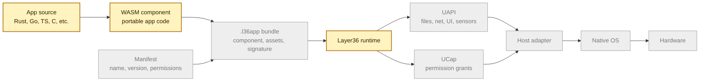
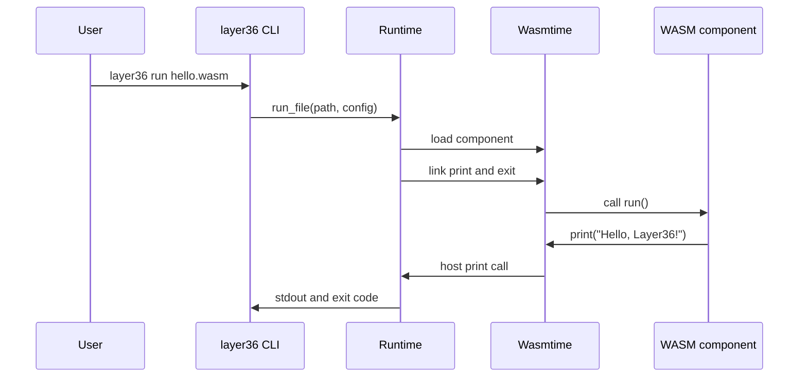
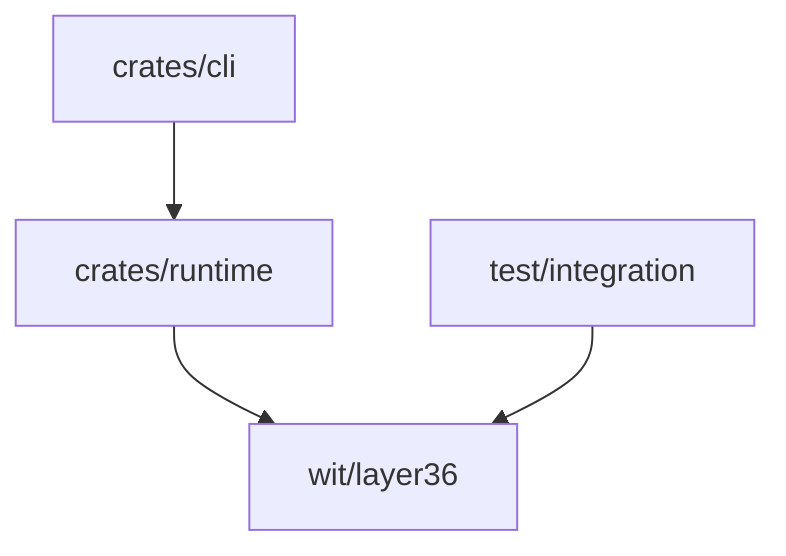

# Architecture

Layer36 has one job: keep app code above the platform line.

An app should not need to know whether it is running on Linux, Windows, macOS,
Android, or iOS for common work. It should call Layer36. The host adapter should
do the platform work.

## Full Shape Of The System

Phase 1 has only the yellow part: a WASM component, the runtime, and a temporary
host interface. The real UAPI, app bundle, permissions, and host adapters start
in later phases.

## Runtime Flow Today

## What Phase 1 Proves

Phase 1 proves that the loader works. The CI pipeline builds one hello-world
component, stores its SHA-256 hash, and runs those exact bytes on:

- Linux
- macOS
- Windows

That matters because the promise is not """three hosts can build similar source."""
The promise is """one app artifact can run on different hosts."""

## Crates Today

`crates/runtime` owns loading, Wasmtime setup, host imports, fuel, memory
limits, and runtime errors.

`crates/cli` owns arguments, output, exit codes, and developer diagnostics.

## Trust Boundary

The WASM component is untrusted. The runtime and host imports are trusted
project code. The operating system is outside the project boundary.

Phase 1 is not a hardened security sandbox. It avoids filesystem, network, env,
and process access, but it is still a developer proof. Real permission work
starts with UCap in Phase 2.

## Later Phases

Phase 2 replaces the temporary Phase 1 WIT file with real UAPI modules. Phase 3
adds desktop UI and graphics. Phase 4 adds mobile hosts. Later phases add the
SDK, app bundles, signing, identity, updates, and release hardening.
