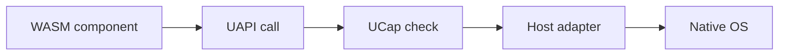

# Core Concepts

These words show up everywhere in Layer36. This page keeps them plain.

| Concept | Meaning |
|---------|---------|
| **WASM component** | The portable program file that Layer36 runs. |
| **Runtime** | The `layer36` engine installed on a host machine. |
| **UAPI** | The common app API. Apps call this instead of calling each OS directly. |
| **UCap** | The permission system. It decides what an app is allowed to use. |
| **Host adapter** | The code that turns a Layer36 API call into a native OS call. |
| **`.l36app` bundle** | The future app package containing code, assets, manifest, and signature. |
| **Manifest** | The file that describes an app and the permissions it asks for. |
| **Marketplace** | The future distribution, update, and identity layer. |

## How They Fit

Example: a Layer36 app wants to read a file.

1. The app calls the Layer36 file API.
2. UCap checks whether that app has a grant for the file path.
3. The host adapter calls the native file API for the current OS.
4. The app gets a result that looks the same on every host.

Phase 1 only proves the runtime path. Phase 2 begins the real UAPI and UCap
work.
