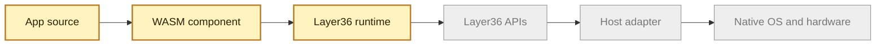

# Introduction

Layer36 is an attempt to make apps portable in the way files are portable.

The goal is simple to say and hard to build:

> Write one app. Run it on Windows, Linux, macOS, Android, iOS, ChromeOS, and
> the web through the same Layer36 runtime model.

Today every platform has its own SDK, app format, permission model, UI rules,
and hardware APIs. That is why the same product often becomes six different
codebases. Layer36 puts one common layer in the middle.

## The Core Idea

An app compiles to WebAssembly. The app does not call Windows, Android, or iOS
directly. It calls Layer36 APIs. Each host then translates those calls into the
native platform underneath.

What exists today is the first working runtime proof: one `.wasm` file runs
through `layer36` on Linux, macOS, and Windows. The wider platform APIs are the
next phase.

## What We Have Built So Far

- A Rust workspace and public GitHub project.
- A `layer36` CLI with `run`, `version`, and `doctor`.
- A Wasmtime based runtime that loads WebAssembly components.
- A temporary Phase 1 host interface with `print` and `exit`.
- CI that runs the same `.wasm` bytes on Linux, macOS, and Windows.
- A prerelease, `v0.1.0-rc1`, with platform archives and checksums.
- Early docs, threat model, benchmarks, and architecture records.

## What We Have Not Built Yet

- Real app APIs for files, network, time, locale, UI, graphics, sensors, or
  identity.
- A `.l36app` bundle format.
- Mobile hosts.
- Security strong enough for untrusted third party apps.
- A developer SDK or app store.

So the honest status is: **the runtime proof works, the platform is not done**.

## Why WebAssembly?

WebAssembly gives Layer36 a portable, compact, sandboxed program format. The
Component Model gives it typed interfaces between app code and host code. WIT
lets us describe those interfaces in a language neutral way.

Layer36 is the missing product layer around those pieces: APIs, permissions,
host adapters, tools, packaging, and distribution.
