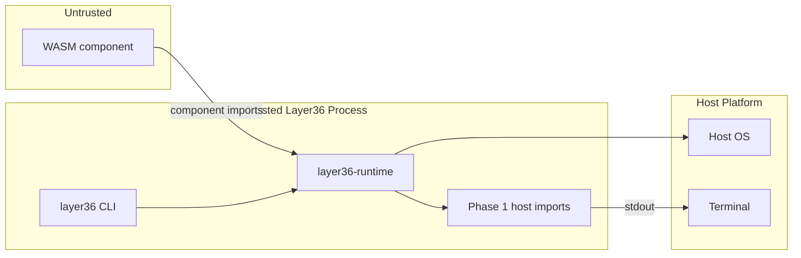

# Phase 1 Threat Model v0.1

Layer36 Phase 1 is a proof-of-concept runtime. It can load a WebAssembly
component, register a temporary `layer36:phase1/host` interface, call the
component's exported `run` function, and route `print`/`exit` back to the CLI.

This threat model is intentionally narrow. It records what Phase 1 defends
today, what it only partially defends, and what must wait for later phases.

## Scope

In scope:

- `layer36 run <component.wasm>`
- The `layer36-runtime` Wasmtime embedding
- The temporary `layer36:phase1/host` WIT imports:
  - `print(msg: string)`
  - `exit(code: s32)`
- Runtime fuel and memory limits
- CLI error classification for invalid components, traps, and limit failures

Out of scope:

- Real UAPI modules such as filesystem, network, UI, sensors, and identity
- `.l36app` bundles, manifests, signing, and marketplace distribution
- Long-running app lifecycle, windows, background services, and updates
- Running adversarial WebAssembly as a hardened security boundary

## Assets

| Asset | Why It Matters |
|---|---|
| Host process memory | The runtime must not let a component corrupt host memory. |
| Host filesystem and network | Phase 1 should not expose either to components. |
| Terminal output | Components can write through `print`; users should know that output is untrusted. |
| Runtime availability | Components should not trivially hang or exhaust the host. |
| Build and dependency integrity | Wasmtime and cargo dependencies are part of the trusted base. |

## Trust Boundaries

Phase 1 has one primary trust boundary: the WebAssembly component is untrusted;
the Layer36 runtime, CLI, Wasmtime engine, and host OS are trusted.

## STRIDE Analysis

| Category | Threat | Current Mitigation | Residual Risk |
|---|---|---|---|
| Spoofing | A component pretends to be a trusted Layer36 app. | Phase 1 has no app identity, no install flow, and no marketplace. Components are run directly by path. | Users may infer trust from filenames or local paths. Deferred to Phase 6 signing and identity. |
| Tampering | A component attempts to corrupt runtime memory or modify host state. | WebAssembly linear memory is sandboxed by Wasmtime. Phase 1 exposes no filesystem, network, environment, or process-spawning host imports. | Wasmtime bugs or unsafe host code could still be exploitable. Dependency advisories are tracked with `cargo-deny`. |
| Repudiation | A component denies having printed output or exited with a code. | CLI stdout/stderr and process exit code are observable by the caller. | No durable audit log exists. Deferred to Phase 2 logging UAPI and later policy/audit work. |
| Information Disclosure | A component reads host files, env vars, memory, network data, or secrets. | Phase 1 registers only `print` and `exit`; no WASI filesystem, network, env, or clock capabilities are linked. | Side channels, engine vulnerabilities, and terminal escape output are not fully mitigated. |
| Denial of Service | A component loops forever or grows memory until the process/host is unhealthy. | `--fuel` enables Wasmtime fuel metering; `--mem-limit` uses a Wasmtime resource limiter; limit failures return exit code `4`. | Fuel is opt-in for now. CPU and wall-clock timeouts are not enforced by default. |
| Elevation of Privilege | A component escapes the WASM sandbox and executes host code. | Layer36 relies on Wasmtime's sandbox and keeps the host import surface tiny. | A Wasmtime or codegen vulnerability could break this assumption. Security response depends on upstream patches. |

## Current Controls

- No filesystem host imports.
- No network host imports.
- No environment variable host imports.
- No app-to-app IPC.
- No native plugin loading.
- No bundle install/update path.
- Wasmtime Component Model validation rejects invalid components.
- `cargo-deny` checks advisories, licenses, bans, and sources.
- `layer36 run --fuel N` can bound instruction execution.
- `layer36 run --mem-limit MB` bounds each linear memory.

## Required User Warning

Phase 1 users must treat `layer36 run foo.wasm` like running a local developer
tool, not like installing a sandboxed app from a store.

> Layer36 is pre-alpha. Do not run untrusted WASM through `layer36` in Phase 1.
> Treat `layer36 run foo.wasm` exactly as you would treat running a local
> executable from a developer checkout. The sandbox is real, but the platform is
> not adversarially hardened yet. Real capability boundaries arrive in Phase 2.

## Deferred Items

| Deferred Item | Target Phase | Notes |
|---|---:|---|
| Capability declarations and grants | Phase 2 | UCap begins when real UAPI modules exist. |
| Filesystem/network permission enforcement | Phase 2 | First useful CLI apps will need explicit capabilities. |
| Structured runtime logging and audit records | Phase 2 | Needed for debugging and repudiation controls. |
| GUI/window security boundaries | Phase 3 | UI introduces input, focus, clipboard, accessibility, and rendering risk. |
| Mobile platform sandbox integration | Phase 4 | iOS/Android require adapter-specific review. |
| Bundle manifests and deterministic package verification | Phase 5 | Developer SDK starts producing app bundles. |
| Code signing, release trust, and marketplace moderation | Phase 6 | Required before user-facing distribution. |
| External security audit | Phase 7 | Must happen before v1.0. |

## Review Triggers

Update this threat model when any of these happen:

- A new host import is added.
- A WASI interface is linked into the runtime.
- The runtime gains filesystem, network, clock, IPC, UI, or device access.
- `layer36 run` starts reading manifests or bundle metadata.
- Wasmtime is upgraded across a major version.
- A security advisory affects Wasmtime, WIT tooling, or Layer36 runtime code.
