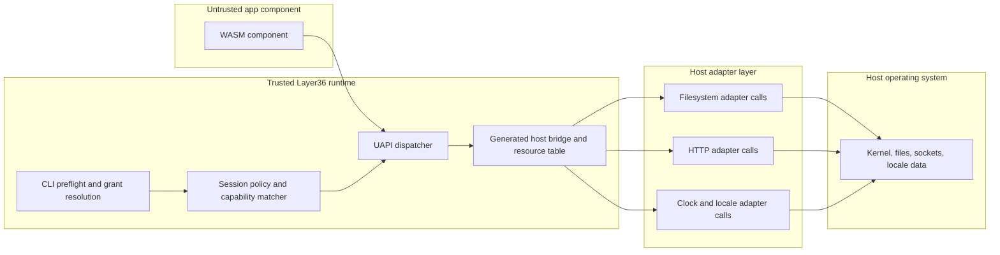

# Phase 2 Threat Model v0.2

Phase 2 is where Layer36 starts doing real host work: file reads and writes,
network requests, clock access, locale formatting, and manifest-based grants.

So this threat model is about one thing: **do we enforce capability checks
before host access, every time, in every path?**

## Scope

In scope:

- `layer36 run` with Phase 2 `layer36:app/cli@0.1.0` components
- UAPI modules: `io`, `fs`, `net`, `time`, `locale`
- Manifest parsing and capability validation
- Session grants (`--grant`, `--auto-grant`, prompt flow)
- Runtime dispatcher and host adapter boundary checks
- Current local adapter behavior and guardrails

Out of scope:

- GUI and input stack (Phase 3)
- Mobile host adapters (Phase 4)
- Bundle signing and marketplace trust (Phase 6)
- Full policy database and revocation UX (later UCap phases)

## Assets We Protect

| Asset | Why it matters |
|---|---|
| Host filesystem | Prevent reads and writes outside granted paths. |
| Host network | Prevent unauthorized outbound requests. |
| Runtime process stability | Avoid crashes, panics, and unbounded memory or handle growth. |
| Capability intent | Manifest and launch grants must match actual runtime behavior. |
| User trust | App output and grant prompts must stay clear and predictable. |

## Trust Boundaries

## Main Attack Surfaces

1. Manifest capability parsing and normalization
2. Grant matching rules for paths and `net.connect` resources
3. Resource handles reused across calls after open
4. URL parsing and HTTP request framing
5. Localhost fixture and test behavior on restricted runners
6. Runtime limits for reads, writes, list sizes, and resource table growth

## STRIDE Summary

| Type | Example in Phase 2 | Current controls | Residual risk |
|---|---|---|---|
| Spoofing | A random component claims to be a trusted app | Manifest identity is explicit during grant flows | No signing chain yet |
| Tampering | Bypass policy and reach adapter directly | Dispatcher enforces checks before adapter calls | New call paths can drift if not tested |
| Repudiation | App denies requested or effective grants | `--dump-caps` and grant logging paths exist | No central audit backend yet |
| Information disclosure | Read outside granted sandbox path | Path normalization and grant checks happen before adapter calls | Symlink and host edge cases still need continued hardening |
| Denial of service | Oversized reads, writes, response bodies, or handles | Explicit bounds on reads/writes/listings, response caps, resource caps | Benchmark and fuzz evidence still growing |
| Elevation of privilege | Escape WASM and execute host behavior outside UAPI | Wasmtime isolation + narrow host surface | Depends on upstream engine correctness |

## Required Security Invariants

These are non-negotiable in Phase 2:

1. Every UAPI call that can touch host resources must pass capability checks first.
2. Handle-based methods (`file` and stream resources) must re-check grants before use.
3. Denials must happen before adapter and OS calls.
4. Manifest parsing must reject malformed capability resources early.
5. Runtime limits must fail safely with clear errors, not panic.

## What Is Already True

- Capability strings are validated and normalized at parse time.
- Runtime policy checks gate filesystem and network operations.
- File and stdio handle methods do capability re-checks.
- Multiple guardrails exist for large reads, writes, and listings.
- Resource tables are bounded and released handles can be reused.
- URL and host parsing is stricter than the initial draft.

## What Still Needs Work

- Full cross-host proof over long CI windows
- TinyGo runtime fixture lane completion
- Always-on TypeScript runtime fixture lane in hosted CI
- Longer fuzz soak evidence and additional target depth
- Security review pass before UAPI v0.1 freeze

## Review Triggers

Update this model whenever:

- a new UAPI module is added
- capability semantics change
- host adapter behavior changes for path, network, clock, or locale
- resource model or table limits change
- a new CI signal reveals a security or safety drift
