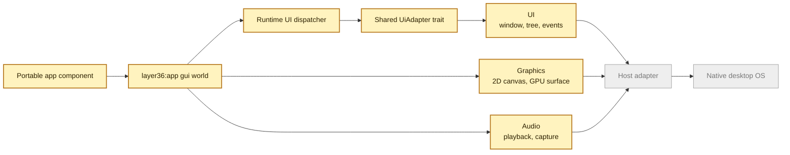

# Phase 3 UAPI Draft

This page explains the first Phase 3 contract in simple terms.

Phase 2 proved that a portable app can ask Layer36 for files, network, time,
locale, and terminal input or output. Phase 3 adds the first desktop app shape.
The app still does not call macOS, Windows, or Linux directly. It asks Layer36
for a window, input events, drawing, and audio. The host adapter translates
those requests.



## What Exists Now

The first draft lives under `wit/layer36/phase3`.

It defines:

- `layer36:app@0.2.0` with a `gui` world
- `layer36:ui@0.1.0` for windows, widget trees, events, dialogs, clipboard, and menus
- `layer36:gfx@0.1.0` for simple 2D drawing and an early 3D surface shape
- `layer36:audio@0.1.0` for playback and capture stream shape

The checker is:

```bash
scripts/check-phase3-uapi.sh
```

That checker proves the WIT parses, the expected packages are present, the
`gui` world imports the intended interfaces, the world exports `run`, public
names follow the repo style, and the new error types include
`permission-denied`.

The CLI also recognizes this manifest world now:

```toml
[app]
id = "com.example.notes"
name = "Notes"
version = "0.1.0"
entry = "notes.wasm"
world = "layer36:app/gui@0.2.0"
```

`layer36 manifest check` accepts that world and labels it as a Phase 3 GUI
draft. `layer36 run` does not launch it yet. It exits early with a clear message
that the GUI runtime is not implemented. This is intentional. We want the
manifest and tooling path to be real before we add windows.

The first Phase 3 capability names are also wired into the manifest and policy
layer:

| Capability | Meaning today |
|---|---|
| `ui.window:create` | A GUI app may ask for a window. This is a default grant. |
| `ui.dialog:*` | File dialogs are allowed by default for the draft GUI shape. |
| `ui.clipboard:read` and `ui.clipboard:write` | Clipboard access is sensitive and must be granted explicitly. |
| `ui.dropzone:<mime-type>` | Drag and drop can be scoped by MIME type. |
| `gfx.gpu:basic` | Basic GPU-backed drawing is a default grant. |
| `gfx.gpu:compute` | Compute access is explicit. |
| `audio.playback` | Playback is defined, but not default yet. |
| `audio.capture` | Microphone capture is explicit. |

This does not grant real desktop access yet. It means Phase 3 manifests can
name the same permissions the future runtime will enforce.

The repo also has a small shared UI model now: `adapter-common::ui`. It has a
`UiAdapter` trait and an in-memory `DraftUiAdapter`. The draft adapter can
create window records, validate titles and sizes, track show or close state,
and collect window events. This gives the runtime one stable shape to call
while native adapters are still being built. It is not AppKit, Win32, GTK, or a
real event loop yet.

The runtime now has a first UI dispatcher scaffold too: `runtime::phase3_ui`.
It checks the same capability policy before it calls the shared UI adapter.
Window create, show, resize, redraw, and close all pass through that boundary.
Clipboard read and write are shaped through the adapter too, but the draft
implementation still returns unsupported after the permission check. That lets
us test the security path before native clipboard integration exists.

The macOS, Linux, and Windows adapter crates also expose Phase 3 UI adapter
entry points now. Each one currently uses the same headless draft backend and
has a blank-window smoke test. That means the host crates are wired into the UI
contract, but they still do not open real OS windows.

## What It Does Not Mean Yet

This is not a finished desktop UI layer.

It does not open a real window yet. It does not draw a real frame yet. It does
not mean the API is frozen. It is the first contract shape that lets us build
the runtime and host adapter work in the right direction.

## Why Start Here

For Layer36, the contract is the platform boundary. If the contract is vague,
each host adapter will drift. Starting with WIT gives us one shared language for
the app, runtime, SDKs, and host adapters.

The next proof should be small and visible:

1. Add a host adapter prototype that can create one real window.
2. Add a simple event loop.
3. Add a tiny draw call that paints something visible.
4. Add a small notes app skeleton that uses the same path.
5. Keep capability checks at the dispatcher boundary as native code is added.
