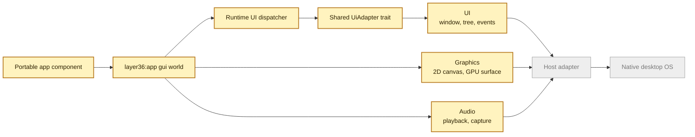

# Phase 3 UAPI Draft

This page explains the first Phase 3 contract in simple terms.

Phase 2 proved that a portable app can ask Layer36 for files, network, time,
locale, and terminal input or output. Phase 3 adds the first desktop app shape.
The app still does not call macOS, Windows, or Linux directly. It asks Layer36
for a window, input events, drawing, and audio. The host adapter translates
those requests.



## What Exists Now

The first draft lives under `wit/layer36/phase3`.

It defines:

- `layer36:app@0.2.0` with a `gui` world
- `layer36:ui@0.1.0` for windows, widget trees, events, dialogs, clipboard, and menus
- `layer36:gfx@0.1.0` for simple 2D drawing and an early 3D surface shape
- `layer36:audio@0.1.0` for playback and capture stream shape

The checker is:

```bash
scripts/check-phase3-uapi.sh
```

That checker proves the WIT parses, the expected packages are present, the
`gui` world imports the intended interfaces, the world exports `run`, public
names follow the repo style, and the new error types include
`permission-denied`.

The CLI also recognizes this manifest world now:

```toml
[app]
id = "com.example.notes"
name = "Notes"
version = "0.1.0"
entry = "notes.wasm"
world = "layer36:app/gui@0.2.0"
```

`layer36 manifest check` accepts that world and labels it as a Phase 3 GUI
draft. `layer36 run` does not launch it yet. It exits early with a clear message
that the GUI runtime is not implemented. This is intentional. We want the
manifest and tooling path to be real before we add windows.

The first Phase 3 capability names are also wired into the manifest and policy
layer:

| Capability | Meaning today |
|---|---|
| `ui.window:create` | A GUI app may ask for a window. This is a default grant. |
| `ui.dialog:*` | File dialogs are allowed by default for the draft GUI shape. |
| `ui.clipboard:read` and `ui.clipboard:write` | Clipboard access is sensitive and must be granted explicitly. |
| `ui.dropzone:<mime-type>` | Drag and drop can be scoped by MIME type. |
| `gfx.gpu:basic` | Basic GPU-backed drawing is a default grant. |
| `gfx.gpu:compute` | Compute access is explicit. |
| `audio.playback` | Playback is defined, but not default yet. |
| `audio.capture` | Microphone capture is explicit. |

This does not grant real desktop access yet. It means Phase 3 manifests can
name the same permissions the future runtime will enforce.

The repo also has a small shared UI model now: `adapter-common::ui`. It has a
`UiAdapter` trait and an in-memory `DraftUiAdapter`. The draft adapter can
create window records, validate titles and sizes, track show or close state,
and collect window events. This gives the runtime one stable shape to call
while native adapters are still being built. It is not AppKit, Win32, GTK, or a
real event loop yet.

The runtime now has a first UI dispatcher scaffold too: `runtime::phase3_ui`.
It checks the same capability policy before it calls the shared UI adapter.
Window create, show, resize, redraw, and close all pass through that boundary.
Clipboard read and write are shaped through the adapter too, but the draft
implementation still returns unsupported after the permission check. That lets
us test the security path before native clipboard integration exists.

The macOS, Linux, and Windows adapter crates also expose Phase 3 window and UI
adapter entry points now. Each one currently uses the same headless draft
backend and has a blank-window smoke test. The adapter info says that clearly.
It also records the native backend each host is aiming at: AppKit on macOS, and
winit on Linux and Windows. That means the host crates are wired into the UI
contract, but they still do not open real OS windows.

The runtime can now discover the current host UI adapter too. `Phase3UiRuntime`
owns the session guard and the selected adapter, then hands out a dispatcher
that checks permissions before calling that adapter. It also reports adapter
capability info such as host family, backend name, and whether native windows
or a native event loop are enabled. Today those values still say headless draft.

The Rust side now has a named `WindowAdapter` boundary too. Window lifecycle,
redraw, event polling, close requests, resize, focus, theme, and scale changes
sit in that lower layer. `UiAdapter` builds on it with widget trees, input, and
clipboard. This keeps the first native window backend smaller than the full
widget bridge.

That window boundary now has the first native handle handoff. In plain terms,
Layer36 has a stable `WindowId`, while the host has a real object such as an
AppKit `NSWindow`, a winit window, or a Win32 window. The new
`NativeWindowHandle` token lets a host adapter attach that native object to the
Layer36 id, look it up later, and detach it. macOS has the first AppKit handoff
method. The default backend is still headless draft, so this does not open a
real window yet.

macOS now has the first opt-in native window prototype behind that handoff. The
`AppKitWindowBackend` can create an owned AppKit `NSWindow` on the main thread,
attach its raw handle to the Layer36 window id, and show it through the shared
window path. The normal adapter still reports headless draft because native
event capture, drawing, and app-facing loop wiring are not finished yet.

The same prototype now has a small event bridge. It can queue close requests,
resize events, focus changes, and display-scale changes through the shared
`WindowAdapter` path. It can also read a native snapshot from AppKit: content
size, focus, visibility, and backing scale. That snapshot is not a full event
loop yet. It is the checked handoff point that real AppKit delegates can call
next.

The prototype also has `AppKitWindowSession` now. This is the first event-loop
state object for macOS. It owns the native window, remembers the last snapshot,
and refreshes only changed state into the shared event queue. That keeps the
next delegate work small: callbacks can update the session instead of reaching
into loose helper methods.

The macOS adapter now exports `AppKitWindowNativeEvent` and
`AppKitWindowEventState` too. These are not Objective-C delegates yet. They are
the Rust shape those delegates will call: close request, resize, focus, display
scale, or a full snapshot. This lets us test the event behavior before adding
the unsafe AppKit callback object.

Redraw requests are part of that path now. In plain terms, when the future
AppKit view needs to paint again, it can ask Layer36 for a redraw through the
same shared window event queue. That keeps drawing requests beside resize,
focus, scale, and close events instead of making a separate one-off path.

There is also a small Rust delegate bridge now. It uses AppKit-style callback
names such as resize, become key, resign key, backing-scale change, display
needed, and should close. The bridge translates those callbacks into the tested
native event state. That means the real Objective-C delegate can stay small:
call into Rust and let Rust handle the event rules.

AppKit now has draw-surface state too. It records the Layer36 window id, logical
size, display scale, clear color, redraw count, and frame number. A redraw
request from that surface goes through the same delegate bridge as a future
native AppKit view. This still does not paint pixels. It is the small state
object the next `NSView` painter will use.

ADR-0013 and RFC-0003 now define how widgets lower once a native backend exists.
A widget should become a native control when the host has a semantic match. If
it does not, Layer36 uses a drawn fallback with the same layout, input,
accessibility, and permission rules.

The shared Rust model has started too. `adapter-common::ui` now has stable
widget IDs, widget kinds, labels, role hints, small style hints, and parent-link
validation. That is the local model the next layout and native-lowering code
can use before the WIT bindings are wired end to end.

The runtime can now move draft widget trees through the adapter boundary. The
dispatcher checks the current GUI grant, then calls the selected adapter to set
a root widget, upsert child nodes, remove nodes, move focus, and inspect draft
widget state. This is still headless, but it proves the runtime path that later
native widgets will use.

The first layout path is wired too. `crates/layout` maps that shared widget
tree into Taffy and returns a `LayoutSnapshot`: one logical rectangle per stable
`WidgetId`. The Phase 3 dispatcher can request that snapshot for a draft window
after the same UI capability check. This does not draw anything yet. It gives
native widgets, drawn fallback, hit testing, and accessibility one geometry
answer to share.

There is also a prepared layout path now. The runtime can prepare the window's
widget tree once, then recompute layout for repeated viewport changes without
rebuilding the engine tree each time. That is the shape the future event loop
should use between widget mutations.

Layout has its first input-facing helper too. The layout crate can hit-test a
point against the computed rectangles and return the deepest widget under that
point. The runtime now has a draft pointer route that uses that helper. It
takes a window, viewport, logical x and y, button state, and modifiers, then
queues a pointer event with the widget ID if a hit was found. This is still not
a native mouse or touch event loop, but the routing shape is now in code.

Keyboard and text input have a draft route too. The runtime can take a key name,
button state, and modifiers, look up the window's focused widget, and queue a
portable key event. It can also queue committed text input for that same focused
widget. This is not IME support yet. It is the route that native keyboard and
IME commit events will use.

Theme and scale changes have draft routes too. A native host can later tell the
runtime that the system moved between light and dark mode, or that a window
changed scale because it moved between displays. Scale values are checked before
they enter the queue, so a bad host value cannot silently reach app code.

The event queue now has a single-event poll path as well as a batch drain path.
That matters because the planned UI API exposes `events.poll()`. Native host
event loops can feed the queue first, then app code can consume events one by
one in stable FIFO order.

Basic host window events have draft routes now too. A future native backend can
queue "close requested", "window resized", and "window focus changed" without
closing the app window by itself. The app still decides how to respond.

## What It Does Not Mean Yet

This is not a finished desktop UI layer.

There is an opt-in AppKit window prototype on macOS, but the default runtime is
still headless. It does not draw a real frame yet. It does not mean the API is
frozen. It is the first contract and adapter shape that lets us build the
runtime and host work in the right direction.

## Why Start Here

For Layer36, the contract is the platform boundary. If the contract is vague,
each host adapter will drift. Starting with WIT gives us one shared language for
the app, runtime, SDKs, and host adapters.

The next proof should be small and visible:

1. Record prepared and cold layout benchmark numbers on the target hosts.
2. Connect the real Objective-C delegate object to the tested Rust delegate bridge.
3. Attach an AppKit `NSView` to the draw-surface state and paint one visible frame.
4. Add the first Linux and Windows native window prototypes.
5. Connect real host input events to the draft pointer, key, and text routes.
6. Add a small notes app skeleton that uses the same path.
7. Keep capability checks at the dispatcher boundary as native code is added.
