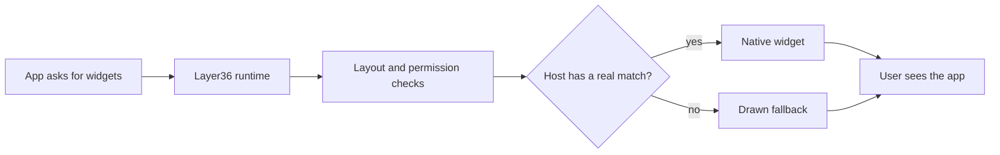
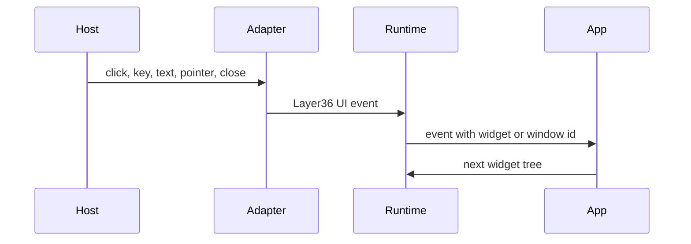

# Widget Protocol

Layer36 does not want every desktop app to look like the same painted surface.
It also does not want every app developer to write three different UIs for
Windows, macOS, and Linux.

The Phase 3 answer is a small widget tree. The app says what it wants. The host
adapter decides how to make it feel right on that machine.

## The Basic Idea

For common controls, Layer36 should use real host widgets. A button should be a
real button. A text field should use the host text system where possible. A menu
should follow host menu rules.

For surfaces that do not have a good native match, Layer36 draws them itself.
That gives apps room for canvas, custom lists, charts, and later richer
graphics.

## Why This Direction

There are three common ways to build cross platform desktop UI:

| Approach | What it means | Why Layer36 is not using it as the main path |
|---|---|---|
| Draw everything | The framework paints every control itself | Easier to match pixels, but often feels less native |
| Use only native controls | Every widget is a host widget | Good feel, but too rigid for custom app surfaces |
| Embed a browser | The app is a web UI in a desktop shell | Useful elsewhere, but not the Layer36 desktop goal |

Layer36 uses a mixed path. Native where the host has the right control. Drawn
where the app needs its own surface.

## The Native Three Of Five Rule

A widget belongs in the core protocol only when at least three of these hosts
have a native control with the same meaning:

- Windows
- macOS
- Linux
- iOS
- Android

This keeps the core set small. It also keeps the API close to what real
platforms already know how to do.

## First Widget Set

The first set is intentionally small:

| Widget | First use |
|---|---|
| Window root | Put the app in a host window |
| Stack | Arrange controls vertically or horizontally |
| Text | Show labels and short text |
| Button | Trigger actions |
| Text field | Edit one line |
| Text area | Edit note content |
| List | Show notes |
| Scroll | Move through long content |
| Checkbox | Basic on or off state |
| Menu | App and window commands |
| Canvas | Custom drawing later |

That is enough to build the first `layer36-notes` app without turning Phase 3
into a full design system.

## How Events Move

The host creates raw events. Layer36 turns those into stable events that the app
can understand.

The first code path already handles draft window lifecycle events. It also has
a routed pointer event path now: the runtime can take a logical pointer
position, run layout hit testing, and queue an event with the target widget ID.
It also has key and text input routing through the focused widget. The next
steps are a real native window, a host event loop, then a tiny widget tree with
text and a button.

## Current Status

Done now:

- Phase 3 UI, graphics, and audio WIT drafts exist.
- GUI manifests are recognized.
- Phase 3 permission names exist.
- `adapter-common::ui` has the first host-neutral widget tree types:
  `WidgetId`, `WidgetKind`, `WidgetNode`, `WidgetStyle`, and `WidgetTree`.
- The shared UI adapter and runtime dispatcher can now set a root widget,
  update child nodes, remove nodes, move focus, and inspect draft widget state.
- `layer36-layout` can compute Taffy-backed rectangles for the shared widget
  tree and return them by stable widget ID.
- The runtime dispatcher can ask for a layout snapshot for the widget tree
  stored on a draft window.
- The runtime dispatcher can also prepare a layout tree for repeated passes,
  which is the path future event loops should use between widget mutations.
- The layout crate has a first hit-test helper. It can use the layout snapshot
  to find the deepest widget under a point.
- The runtime can queue a routed pointer event after hit testing, so a future
  native mouse or touch event can already become a stable Layer36 event with a
  window ID and optional widget ID.
- The runtime can queue routed key events and committed text input for the
  focused widget, which gives native keyboard and IME commit events a stable
  place to land later.
- The adapter and runtime can poll one queued UI event at a time in FIFO order,
  which matches the planned `events.poll()` app-facing shape.
- The runtime has a UI dispatcher scaffold.
- macOS, Linux, and Windows adapters expose headless draft UI entry points.
- The runtime can choose the current host adapter.
- ADR-0013 and RFC-0003 now describe the widget lowering rule.

Pending:

- real native window backend
- host event loop that feeds real pointer, key, and text events into the queue
- widget tree lowering
- larger layout style coverage and recorded large-tree benchmark results on all target hosts
- IME composition events
- accessibility tree
- `layer36-notes`

This is the right direction for the universal platform goal. We are building the
contract first, then the runtime boundary, then the host adapters. That keeps
the platform from becoming one app demo with no reusable core.
