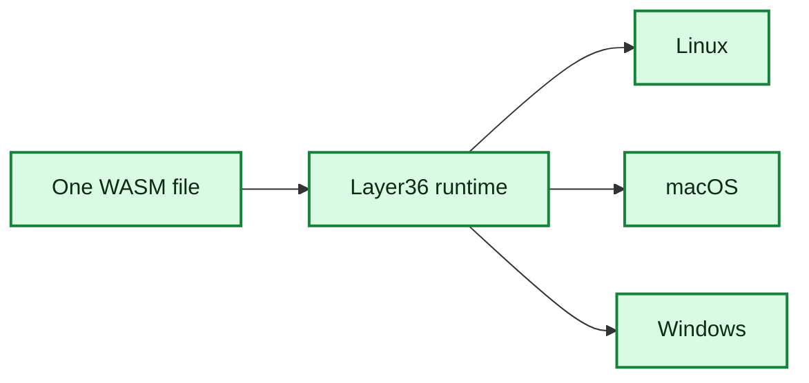

# Phase 1: Runtime Proof

**Status:** Engineering done; exit checks still open
**Estimate:** done
**Goal:** Prove one `.wasm` file runs through Layer36 on Linux, macOS, and
Windows.

## Done

- `crates/runtime` embeds Wasmtime.
- `crates/cli` builds the `layer36` command.
- `layer36 run`, `layer36 version`, and `layer36 doctor` work.
- A small hello-world WASM component prints `Hello, Layer36!`.
- Runtime fuel and memory limits fail with clear errors.
- CI builds one hello `.wasm` artifact and runs the same bytes on Linux, macOS,
  and Windows.
- `v0.1.0-rc1` is published with five archives and `SHA256SUMS`.
- Quickstart, architecture notes, benchmarks, threat model, and retrospective
  are published.
- ADR-0002 and ADR-0003 are merged.

## What This Means

We have proven the base runtime path:

That is a real milestone. It does not mean Layer36 can run full apps yet. It
means the engine can load a portable component and execute it consistently on
three desktop hosts.

## Still Important

- Keep `main` green for five consecutive days.
- Ask one external user to run the quickstart and record whether it takes 10
  minutes or less.
- Confirm there are no open P0 issues.
- Open the Phase 2 kickoff issue.

These are governance and validation gates. The engineering base is ready for
Phase 2.
