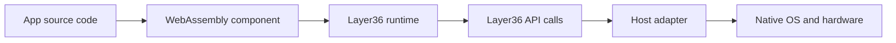

# Layer36 for Everyone

Updated on May 18, 2026.

This page explains the project in plain language. It is written for people who are not deep in systems programming.

## The Problem We Are Solving

Most software teams build the same product many times.

- One code path for Windows
- One for macOS
- One for Linux
- One for Android
- One for iOS
- One for web

That costs time, money, and focus.

Layer36 is trying to reduce that duplication. The long term goal is one app model that can run across many hosts.

## The Basic Idea

The app runs as a WebAssembly component. WebAssembly is a portable binary format.  
The app does not call host APIs directly. It calls Layer36 APIs.  
The host adapter translates those calls to the real operating system.



## What Is Working Right Now

1. The runtime can execute one component on Linux, macOS, and Windows.
2. The Phase 2 API surface is active for CLI style apps:
   - file access
   - network requests
   - time and locale
   - standard input and output
3. Sample apps are implemented:
   - `layer36-clock`
   - `layer36-cat`
   - `layer36-curl`
4. Capability checks are in place, so apps only get access they request and are granted.
5. Language fixture automation is active:
   - TypeScript fixtures are built automatically in CI
   - Go fixture promotion is now attempted automatically when TinyGo tools are available
   - strict Go modes fail clearly if Go fixtures are missing or not import-pure
6. The Rust sample apps now have a repeatable evidence recorder, so each host
   can produce the same kind of proof file for clock, cat, and curl.
7. Phase 2 now has a simple readiness command that reads the exit ledger and
   shows what is done, what has proof in progress, and what is still blocked.
8. Hosted CI and Pages stability can now be recorded as a plain evidence file.
   The strict exit bundle fails if either hosted workflow does not show a
   completed green run in the selected review window.
9. Self-hosted full-gate history can now be recorded the same way. The strict
   exit bundle fails if that history does not show a completed green run, and
   the report can be narrowed to the final review date window.
10. The exit bundle now has a final review mode, so the fuller Phase 2 packet
    can be collected with one command when the final candidate is ready.
11. The outside developer walkthrough now has a checker, so a filled timing
   report must include the basics before we count it as Phase 2 evidence.
12. The Phase 2 retrospective and Phase 3 kickoff issue now exist as drafts, and
    CI checks that they stay in draft form until exit evidence is ready.
13. The UAPI freeze decision now has its own packet and checker, so we cannot
    accidentally call the API frozen before the final evidence is reviewed.

## Current Build Timeline

Green is complete. Yellow is active. Gray is planned.

```mermaid
flowchart LR
    P0["Phase 0 Foundation"] --> P1["Phase 1 Runtime proof"] --> P2["Phase 2 UAPI v0.1"] --> P3["Phase 3 Desktop UI"] --> P4["Phase 4 Mobile hosts"] --> P5["Phase 5 Developer SDK"] --> P6["Phase 6 Distribution"] --> P7["Phase 7 v1 hardening"]

    classDef done fill:#d9fbe3,stroke:#16833a,color:#102a17,stroke-width:2px;
    classDef current fill:#fff3bf,stroke:#b7791f,color:#2d2100,stroke-width:2px;
    classDef pending fill:#eeeeee,stroke:#999999,color:#777777,stroke-width:1px;

    class P0,P1 done;
    class P2 current;
    class P3,P4,P5,P6,P7 pending;
```



## How Close We Are to the Big Goal

The vision is a full 6 by 6 host matrix.

- We have strong desktop runtime proof.
- We have early useful API coverage for command line apps.
- We do not have full GUI, mobile, or store distribution yet.

So we are beyond concept stage, but not near final product stage yet.

## Progress Snapshot

This is a simple status view for non technical readers.

| Area | Status today |
|---|---|
| Runtime base | Working |
| Security model (capability checks) | Working in current Phase 2 scope |
| CLI sample apps | Working |
| Phase 2 proof tracking | Working, with a readiness command and evidence pages |
| CI and docs stability proof | Working, with a GitHub run-history recorder |
| Self-hosted full-gate proof | Ready to record through GitHub run history |
| UAPI freeze decision path | Working, with a draft packet and CI checker |
| Outside walkthrough proof | Ready to collect, with a timing packet and checker |
| Phase 3 handoff | Drafted and checked in CI, waiting for Phase 2 exit evidence |
| Desktop GUI path | Not started in implementation |
| Mobile host path | Not started in implementation |
| Packaging and app store style distribution | Not started in implementation |

## Phase 2 In Simple Terms

Phase 2 is close in engineering terms. The app can call Layer36 for files,
network, time, locale, and terminal input or output. Those calls go through
permission checks before native host code runs.

The remaining Phase 2 work is mostly proof, not a rewrite:

- freeze the API contract after review
- fill the UAPI freeze decision packet
- collect clean Linux, macOS, and Windows evidence
- decide whether Go is promoted now or marked experimental
- run longer fuzz and benchmark checks
- have one outside developer follow the tutorial and pass the filled-packet check

To check the current gate state from the repo:

```bash
scripts/phase2-exit-readiness.sh
```

## Key Terms in Simple Words

- **WebAssembly (WASM)**: A portable binary format that can run on different systems through a runtime.
- **Runtime**: The engine that loads and executes the app component.
- **UAPI**: The app facing API that Layer36 exposes. This is how apps ask for files, network, time, and more.
- **Host adapter**: The translation layer from Layer36 calls to native operating system calls.
- **Capability**: A specific permission, such as reading files from one path or connecting to one network endpoint.

## What Happens Next

The main Phase 2 work still open is:

1. Final UAPI freeze review.
2. Cross host evidence for the sample apps and adapters.
3. Keep Go experimental for runtime parity until its compiled components stop
   importing host APIs directly.
4. Longer fuzz, benchmark, and dependency signoff runs.
5. One timed outside developer walkthrough using the packet checker.
6. Finalize the retrospective and open the Phase 3 kickoff issue.

When those are done, we can exit Phase 2 and start Phase 3 desktop UI work.
