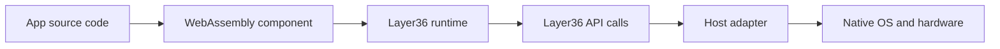

# Layer36 for Everyone

Updated on May 21, 2026.

This page explains the project in plain language. It is written for people who are not deep in systems programming.

## The Problem We Are Solving

Most software teams build the same product many times.

- One code path for Windows
- One for macOS
- One for Linux
- One for Android
- One for iOS
- One for web

That costs time, money, and focus.

Layer36 is trying to reduce that duplication. The long term goal is one app model that can run across many hosts.

## The Basic Idea

The app runs as a WebAssembly component. WebAssembly is a portable binary format.  
The app does not call host APIs directly. It calls Layer36 APIs.  
The host adapter translates those calls to the real operating system.



## What Is Working Right Now

1. The runtime can execute one component on Linux, macOS, and Windows.
2. The Phase 2 API surface is active for CLI style apps:
   - file access
   - network requests
   - time and locale
   - standard input and output
3. Sample apps are implemented:
   - `layer36-clock`
   - `layer36-cat`
   - `layer36-curl`
4. Capability checks are in place, so apps only get access they request and are granted.
5. Language fixture automation is active:
   - TypeScript fixtures are built automatically in CI
   - Go fixture promotion is now attempted automatically when TinyGo tools are available
   - strict Go modes fail clearly if Go fixtures are missing or not import-pure
6. The Rust sample apps now have a repeatable evidence recorder, so each host
   can produce the same kind of proof file for clock, cat, and curl.
7. Phase 2 now has a simple readiness command that reads the exit ledger and
   shows what is done, what has proof in progress, and what is still blocked.
   The full mode lists every open proof item and next step for handoff.
8. Hosted CI and Pages stability can now be recorded as a plain evidence file.
   The strict exit bundle fails if either hosted workflow does not show a
   completed green run in the selected review window.
9. Hosted full CI now has its own evidence recorder, so we can tell the
   difference between normal fast CI and the heavier Linux, macOS, Windows
   proof run. The latest full run passed the three host lanes and the evidence
   compare jobs for language variants, UCap, adapters, and samples.
10. Self-hosted full-gate history can now be recorded the same way. The strict
   exit bundle fails if that history does not show a completed green run, and
   the report can be narrowed to the final review date window.
11. The exit bundle now has a final review mode, so the fuller Phase 2 packet
    can be collected with one command when the final candidate is ready.
12. Fuzz runs now have a markdown evidence recorder too, so short smoke runs and
    longer self-hosted soak runs can be reviewed in the same format.
13. The outside developer walkthrough now has a checker, so a filled timing
   report must include the basics before we count it as Phase 2 evidence.
   A local rehearsal script now checks that the Rust walkthrough path works
   before we hand it to a reviewer.
14. The Phase 2 retrospective and Phase 3 kickoff issue now exist as drafts, and
    CI checks that they stay in draft form until exit evidence is ready.
15. The UAPI freeze decision now has its own packet and checker, so we cannot
    accidentally call the API frozen before the final evidence is reviewed.
16. Phase 3 has started at the contract layer. The first desktop `gui` world
    and the first `ui`, `gfx`, and `audio` API drafts now parse and have a
    checker. This is not a finished GUI yet. It is the first map for the work.
17. Phase 3 now has the first permission names for desktop UI, graphics, and
    audio. It also has a small in-memory window model that lets us test window
    IDs, sizes, titles, and events before we connect real native windows.
18. The runtime now has a first UI dispatcher scaffold. In simple terms, a
    future window request now has a checked path inside the runtime before any
    native window code is called.
19. The runtime now talks to a shared UI adapter trait instead of direct draft
    storage. In simple terms, the plug point for real macOS, Windows, and Linux
    window adapters is now in place.
20. The macOS, Linux, and Windows adapter crates now each expose that UI plug
    point. Today it is still headless, but each host crate can run the same
    blank-window smoke path.
21. The runtime can now select the current host UI adapter. In simple terms,
    the runtime can ask macOS, Linux, or Windows for the UI adapter path instead
    of only using a test object.
22. Phase 3 now has a written widget rule. In simple terms, use native controls
    when the host has a real match, and use drawn fallback surfaces when it does
    not.
23. The shared adapter code now has the first widget tree model. In simple
    terms, Layer36 can represent stable widget IDs, widget types, labels, roles,
    and parent links before it connects them to real OS controls.
24. The runtime can now move that draft widget tree through the UI adapter
    boundary. In simple terms, Layer36 can set a root widget, add or update
    child widgets, remove widgets, and track focus before real native controls
    exist.
25. The first layout layer now exists. In simple terms, Layer36 can take the
    draft widget tree and calculate rectangles for each widget. Nothing is
    drawn yet, but native controls, drawn fallback, hit testing, and
    accessibility can now share the same position and size answer.
26. Layout now has deeper proof. In simple terms, it is tested across 100
    generated screen shapes, has a large-tree benchmark target, and can answer
    "which widget is under this point?" before real mouse or touch events are
    connected.
27. Layout now has a faster repeated-frame path. In simple terms, Layer36 can
    prepare the layout tree once and reuse it when only the window size changes.
    The local prepared 10,000-widget path is under the Phase 3 budget now, but
    we still need formal Linux, macOS, and Windows evidence before calling that
    exit item done.
28. Pointer routing has started. In simple terms, Layer36 can now take a
    pointer position, ask layout which widget is under it, and queue an event
    with that widget ID. Real native mouse and touch events are still pending,
    but the runtime route they will use now exists.
29. Keyboard and text routing have started too. In simple terms, Layer36 can
    now send a key press or committed typed text to the focused widget. Full
    native keyboard handling and IME composition are still pending, but the
    runtime route is in place.
30. Event polling has started. In simple terms, the runtime can now hand one UI
    event at a time to the future app-facing `events.poll()` path. Real native
    event loops still need to feed this queue.
31. Basic host window events have routes now. In simple terms, a future native
    window can tell Layer36 that the user tried to close it, resized it, or
    moved focus, and the app can decide what to do next.
32. Theme and display scale events have routes now. In simple terms, a future
    native window can tell Layer36 that dark mode changed or that the window
    moved to a screen with a different scale. This is needed for correct DPI
    behavior before we draw real pixels.
33. The window layer has a clearer name now. In simple terms, `WindowAdapter`
    is the lower layer for creating windows and reading host window events.
    `UiAdapter` sits above it for widgets, input, and clipboard. The host
    adapters also say which real backend they are aiming at next: AppKit on
    macOS, winit on Linux and Windows.
34. The native window handoff has started. In simple terms, Layer36 has its own
    stable window id, and the operating system has its own real window object.
    We now have a checked place to connect those two. macOS has the first AppKit
    handoff method. It still does not show a real window yet.
35. macOS now has the first real native window prototype. In simple terms,
    Layer36 can create an AppKit `NSWindow`, keep it alive, attach it to the
    Layer36 window id, and show it. This path is opt-in for now. The normal
    adapter still stays headless until native events and drawing are ready.
36. The macOS window prototype now has event bridge points. In simple terms,
    the real AppKit window has a checked place to report close requests, resize,
    focus changes, and display scale changes back into the Layer36 event queue.
    The next step is connecting AppKit delegate callbacks to those bridge points.
37. The macOS window prototype now has session state. In simple terms, one
    object owns the AppKit window, remembers the last native state, and only
    reports changes. That is the shape a real event loop needs before it starts
    receiving AppKit callbacks.

## Current Build Timeline

Green is complete. Yellow is active. Gray is planned.

```mermaid
flowchart LR
    P0["Phase 0 Foundation"] --> P1["Phase 1 Runtime proof"] --> P2["Phase 2 UAPI v0.1"] --> P3["Phase 3 Desktop UI"] --> P4["Phase 4 Mobile hosts"] --> P5["Phase 5 Developer SDK"] --> P6["Phase 6 Distribution"] --> P7["Phase 7 v1 hardening"]

    classDef done fill:#d9fbe3,stroke:#16833a,color:#102a17,stroke-width:2px;
    classDef current fill:#fff3bf,stroke:#b7791f,color:#2d2100,stroke-width:2px;
    classDef pending fill:#eeeeee,stroke:#999999,color:#777777,stroke-width:1px;

    class P0,P1 done;
    class P2 current;
    class P3 current;
    class P4,P5,P6,P7 pending;
```



## How Close We Are to the Big Goal

The vision is a full 6 by 6 host matrix.

- We have strong desktop runtime proof.
- We have early useful API coverage for command line apps.
- We do not have full GUI, mobile, or store distribution yet.

So we are beyond concept stage, but not near final product stage yet.

## Progress Snapshot

This is a simple status view for non technical readers.

| Area | Status today |
|---|---|
| Runtime base | Working |
| Security model (capability checks) | Working in current Phase 2 scope |
| CLI sample apps | Working |
| Phase 2 proof tracking | Working, with a readiness command and evidence pages |
| CI and docs stability proof | Working, with a GitHub run-history recorder |
| Hosted full cross-host proof | Latest full Linux, macOS, Windows run is green |
| Self-hosted full-gate proof | Ready to record through GitHub run history |
| Fuzz proof | Ready to record as smoke or longer soak evidence |
| UAPI freeze decision path | Working, with a draft packet and CI checker |
| Outside walkthrough proof | Ready to collect, with a timing packet, checker, and local rehearsal |
| Phase 3 handoff | Started at contract level, still waiting on Phase 2 outside review for formal phase close |
| Desktop GUI path | WIT draft, GUI manifest recognition, first capability names, draft window model, explicit `WindowAdapter`, native window handle handoff, shared widget tree model, draft widget-tree dispatch, first Taffy-backed layout wrapper, 100 generated layout-shape tests, 1k/10k layout benchmark target, prepared repeated-layout path, first layout hit-test helper, draft window, pointer, key, text, FIFO polling, host window, theme, and scale event routes, shared UI adapter trait, runtime UI dispatcher, host adapter entry points, runtime host adapter discovery, planned native backend reporting, the widget lowering rule, an opt-in macOS AppKit window prototype, AppKit event bridge targets, and AppKit window session state are in place. Real AppKit delegate wiring, drawing, Linux windows, and Windows windows are still pending |
| Mobile host path | Not started in implementation |
| Packaging and app store style distribution | Not started in implementation |

## Phase 2 In Simple Terms

Phase 2 is close in engineering terms. The app can call Layer36 for files,
network, time, locale, and terminal input or output. Those calls go through
permission checks before native host code runs.

The remaining Phase 2 work is mostly proof, not a rewrite:

- freeze the API contract after review
- fill the UAPI freeze decision packet
- include the green hosted full CI run in the final evidence bundle
- decide whether Go is promoted now or marked experimental
- run longer fuzz and benchmark checks
- have one outside developer follow the tutorial and pass the filled-packet check

To check the current gate state from the repo:

```bash
scripts/phase2-exit-readiness.sh
```

## Key Terms in Simple Words

- **WebAssembly (WASM)**: A portable binary format that can run on different systems through a runtime.
- **Runtime**: The engine that loads and executes the app component.
- **UAPI**: The app facing API that Layer36 exposes. This is how apps ask for files, network, time, and more.
- **Host adapter**: The translation layer from Layer36 calls to native operating system calls.
- **Capability**: A specific permission, such as reading files from one path or connecting to one network endpoint.

## What Happens Next

The main Phase 2 work still open is:

1. Final UAPI freeze review.
2. Cross host evidence for the sample apps and adapters.
3. Keep Go experimental for runtime parity until its compiled components stop
   importing host APIs directly.
4. Longer fuzz, benchmark, and dependency signoff runs.
5. One timed outside developer walkthrough using the packet checker.
6. Finalize the retrospective and external Phase 2 review packet.

Phase 3 has started carefully with contracts, a shared draft window model, a
runtime dispatcher path, and the native handle handoff needed by real OS
windows. The first opt-in AppKit window prototype now exists on macOS, with
bridge points and session state for the main window events. The next useful
step is real AppKit delegate wiring and a simple drawn surface before expanding
sideways.
