# Roadmap

This roadmap is an estimate, not a promise. Early phases may move faster because
the project is still small. Later phases depend on hardware access, app store
rules, security review, and real users.

The current state is:

- **Phase 0 is mostly done.** The repo, docs, CI, issues, labels, and release
  setup exist. Community and public launch items remain.
- **Phase 1 engineering is done.** One shared `.wasm` component runs through the
  Layer36 runtime on Linux, macOS, and Windows in CI.
- **Phase 2 is the next real build phase.** It turns the runtime proof into a
  useful app API.

## System Timeline

Green means built or proven. Yellow means built enough for the current proof.
Gray means planned.

```mermaid
flowchart LR
    P0["0. Foundation<br/>repo, docs, CI"]
    P1["1. Runtime proof<br/>same WASM on 3 desktops"]
    P2["2. UAPI v0.1<br/>files, network, time, locale"]
    P3["3. Desktop UI<br/>native windowed app"]
    P4["4. Mobile hosts<br/>iOS and Android"]
    P5["5. SDK<br/>templates, debug, hot reload"]
    P6["6. Distribution<br/>bundles, signing, identity"]
    P7["7. v1.0<br/>real product migration"]

    P0 --> P1 --> P2 --> P3 --> P4 --> P5 --> P6 --> P7

    classDef done fill:#d9fbe3,stroke:#16833a,color:#102a17,stroke-width:2px;
    classDef current fill:#fff3bf,stroke:#b7791f,color:#2d2100,stroke-width:2px;
    classDef pending fill:#eeeeee,stroke:#999999,color:#777777,stroke-width:1px;

    class P0 done;
    class P1 current;
    class P2,P3,P4,P5,P6,P7 pending;
```

## Phase Table

| # | Phase | Goal | Estimate | Status |
|---|-------|------|----------|--------|
| 0 | Foundation | Make the project real enough to work in public. | Done enough for development; external items pending | Mostly done |
| 1 | Runtime proof | Run one WASM component on Linux, macOS, and Windows. | Done | Engineering done |
| 2 | UAPI v0.1 | Build useful CLI APIs and sample apps. | est. 4 to 8 weeks | Next |
| 3 | Desktop UI | Run one GUI app on Windows, macOS, and Linux. | est. 6 to 10 weeks | Planned |
| 4 | Mobile hosts | Run the same app on iOS and Android. | est. 8 to 12 weeks | Planned |
| 5 | Developer SDK | Make project creation, debug, and packaging smooth. | est. 6 to 10 weeks | Planned |
| 6 | Distribution | Add bundles, signing, updates, and identity. | est. 8 to 12 weeks | Planned |
| 7 | v1.0 hardening | Migrate a real app and clean up for public launch. | est. after Phase 6 | Planned |

## What Must Happen Before Phase 2 Is Official

The code is ready enough to start Phase 2 design and scaffolding. The formal
Phase 1 exit still has a few real-world checks:

- Keep `main` green for five consecutive days.
- Have one external person complete the quickstart in 10 minutes or less.
- Confirm there are no open P0 issues.
- Open the Phase 2 kickoff issue from the prepared governance draft.

Those are not code blockers for design work. They are release discipline
blockers. We should keep them visible.

## Phase 2 In One Sentence

Phase 2 makes Layer36 useful: a WASM app should be able to read files, make a
small HTTP request, ask for time and locale, and print stable output on Linux,
macOS, and Windows.

Full planning details live in the `Plan/` directory.
