# Roadmap

This roadmap is an estimate, not a promise. Early phases may move faster because
the project is still small. Later phases depend on hardware access, app store
rules, security review, and real users.

The current state is:

- **Phase 0 is mostly done.** The repo, docs, CI, issues, labels, and release
  setup exist. Community and public launch items remain.
- **Phase 1 engineering is done.** One shared `.wasm` component proved the base
  runtime path.
- **Phase 2 is active and close in engineering terms.** Layer36 now has UAPI
  slices for CLI-style apps, UCap manifests and launch grants, sample apps, and
  repeatable evidence scripts. Formal Phase 2 exit still needs final
  cross-host evidence, UAPI freeze review, and an outside developer walkthrough.
- **Phase 3 has started at the contract layer.** The first `gui` world and the
  `ui`, `gfx`, and `audio` WIT drafts now parse and have a CI checker. This does
  not freeze the API and does not replace Phase 2's remaining outside review.

## System Timeline

Green means built or proven. Yellow means built enough for the current proof.
Gray means planned.

```mermaid
flowchart LR
    P0["0. Foundation<br/>repo, docs, CI"]
    P1["1. Runtime proof<br/>same WASM on 3 desktops"]
    P2["2. UAPI v0.1<br/>files, network, time, locale"]
    P3["3. Desktop UI<br/>native windowed app"]
    P4["4. Mobile hosts<br/>iOS and Android"]
    P5["5. SDK<br/>templates, debug, hot reload"]
    P6["6. Distribution<br/>bundles, signing, identity"]
    P7["7. v1.0<br/>real product migration"]

    P0 --> P1 --> P2 --> P3 --> P4 --> P5 --> P6 --> P7

    classDef done fill:#d9fbe3,stroke:#16833a,color:#102a17,stroke-width:2px;
    classDef current fill:#fff3bf,stroke:#b7791f,color:#2d2100,stroke-width:2px;
    classDef pending fill:#eeeeee,stroke:#999999,color:#777777,stroke-width:1px;

    class P0 done;
    class P1 done;
    class P2 current;
    class P3 current;
    class P4,P5,P6,P7 pending;
```

## Phase Table

| # | Phase | Goal | Estimate | Status |
|---|-------|------|----------|--------|
| 0 | Foundation | Make the project real enough to work in public. | Done enough for development; external items pending | Mostly done |
| 1 | Runtime proof | Run one WASM component on Linux, macOS, and Windows. | Done | Engineering done |
| 2 | UAPI v0.1 | Build useful CLI APIs and sample apps. | in progress | Active; exit evidence in progress |
| 3 | Desktop UI | Run one GUI app on Windows, macOS, and Linux. | est. 6 to 10 weeks | Started with WIT draft |
| 4 | Mobile hosts | Run the same app on iOS and Android. | est. 8 to 12 weeks | Planned |
| 5 | Developer SDK | Make project creation, debug, and packaging smooth. | est. 6 to 10 weeks | Planned |
| 6 | Distribution | Add bundles, signing, updates, and identity. | est. 8 to 12 weeks | Planned |
| 7 | v1.0 hardening | Migrate a real app and clean up for public launch. | est. after Phase 6 | Planned |

## What Must Happen Before Phase 2 Exits

The code has moved well past Phase 1. Phase 2 should not be called closed until
the evidence is crisp:

- Freeze UAPI v0.1 after final review.
- Collect clean Linux, macOS, and Windows evidence for the sample apps and UCap
  denial paths.
- Keep benchmark, dependency, and fuzz evidence current for the final commit.
- Complete one timed outside developer walkthrough.
- Finalize the Phase 2 retrospective.
- Keep Phase 3 implementation limited to draft contracts and prototypes until
  the Phase 2 outside review is complete.

## Phase 2 In One Sentence

Phase 2 makes Layer36 useful: a WebAssembly app can call Layer36 for files,
network, time, locale, and terminal I/O, and the runtime can enforce explicit
capability grants before host access.

Full planning details live in the `Plan/` directory.
