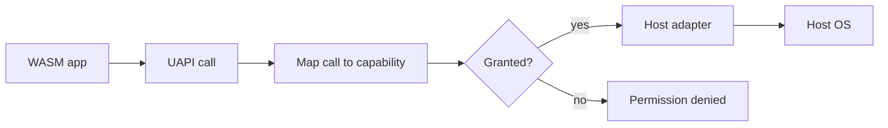

# UAPI Overview

UAPI means Universal API.

It is the standard app API every Layer36 app will call. Instead of calling
Windows files, macOS files, Linux files, Android files, or iOS files directly,
an app calls the Layer36 file API. The host adapter then does the native work.

Phase 2 starts this layer.

## Planned Modules

```text
layer36:
  io/              stdio, pipes, stdout, stderr
  fs/              files, paths, metadata
  net/             HTTP first, more network APIs later
  time/            clocks and timers
  locale/          language, region, formatting
  ui/              windows, widgets, layout, input
  gfx/             2D drawing and GPU work
  audio/           playback and capture
  sensors/         motion, location, camera, mic
  storage/         key-value, SQL, object storage
  crypto/          hashes, signing, encryption, random
  identity/        user identity and signing
  notify/          system notifications
  accessibility/   screen readers and reduced-motion settings
  platform/        device info and host capabilities
```

## Phase 2 Scope

Phase 2 only covers:

- `io`
- `fs`
- `net`
- `time`
- `locale`

That is enough to build the first useful CLI apps without pretending the whole
platform is ready.

The first Phase 2 draft is checked into `wit/layer36/phase2`. It is a review
draft, not a frozen compatibility promise yet.

The generated reference page is built from those WIT files:
[UAPI Reference](../reference/uapi/index.md).

The contract checker validates the current package shape:

```bash
sh scripts/check-uapi.sh
```

It parses the WIT package, checks the `cli` world imports and `run` export,
checks package versions and kebab-case names, and verifies protected filesystem
and network errors include `permission-denied`.

## App Manifest

Phase 2 apps can also carry a sidecar `manifest.toml`.

The manifest says:

- what the app is called
- which `.wasm` file is the entry point
- which UAPI world it targets
- which capabilities it wants

Example:

```toml
[app]
id = "com.example.hello"
name = "Hello"
version = "1.0.0"
entry = "hello.wasm"
world = "layer36:app/cli@0.1.0"

[[capabilities]]
cap = "fs.read:~/Documents/notes/**"
rationale = "Read saved notes"
required = true

[[capabilities]]
cap = "net.connect:api.example.com:443"
rationale = "Sync to cloud"
required = false
```

You can validate the file today:

```bash
cargo run -p layer36-cli -- manifest check manifest.toml
```

To read it in human form:

```bash
cargo run -p layer36-cli -- manifest explain manifest.toml
```

This prints app identity, every requested capability, whether the capability is
default-granted, and whether a launch grant is needed.

You can also create a starter manifest from the CLI:

```bash
cargo run -p layer36-cli -- manifest init \
  --id com.example.notes \
  --name Notes \
  --entry notes.wasm \
  --cap io.stdout \
  --cap 'fs.read:./notes/**' \
  --output manifest.toml
```

By default, `manifest init` prints TOML to stdout. Use `--output` to write a
file, and `--force` if you really want to replace an existing file.

You can also print the capability strings this runtime understands:

```bash
cargo run -p layer36-cli -- manifest capabilities
```

For scripts and editor tools, the manifest inspection commands can print JSON
too:

```bash
cargo run -p layer36-cli -- manifest check --format json manifest.toml
cargo run -p layer36-cli -- manifest explain --format json manifest.toml
cargo run -p layer36-cli -- manifest capabilities --format json
```

That JSON includes the app identity, capability counts, each requested
capability, whether it is a default grant, and whether a launch grant is needed.

`layer36 run` also reads `manifest.toml` when it sits next to the `.wasm` file:

```bash
cargo run -p layer36-cli -- run app.wasm --grant 'fs.read:~/Documents/notes/**'
cargo run -p layer36-cli -- run app.wasm --auto-grant
cargo run -p layer36-cli -- run --prompt app.wasm
cargo run -p layer36-cli -- run --dump-caps app.wasm
cargo run -p layer36-cli -- run --dump-caps --dump-caps-format json app.wasm
```

For now, this starts as a launch-time session check. If a required capability is
missing and no prompt is available, Layer36 exits before the component starts.
When `--prompt` is passed, or when the command is running in a real terminal,
Layer36 can ask for the missing manifest capabilities and add them to the
current run session.

The manifest entry is checked too. If `manifest.toml` says `entry = "app.wasm"`
but you run a different file, Layer36 stops before grant resolution. That keeps
a manifest from accidentally applying to the wrong component.

`--dump-caps` is for debugging. It resolves the same session policy as a real
run, prints the effective capabilities, and exits before the component starts.
That makes it easier to understand why a UAPI call is allowed or denied. Use
`--dump-caps-format json` when a script needs the resolved grants, app identity,
and component path.

For a local audit trail, pass `--log-grants`:

```bash
cargo run -p layer36-cli -- run \
  --manifest manifest.toml \
  --auto-grant \
  --log-grants layer36-grants.log \
  app.wasm
```

This appends the app identity and effective session grants to a text log. Full
signed audit records are later work; this is the Phase 2 developer-facing proof.
Use `--log-grants-format jsonl` when a script needs one structured audit record
per line:

```bash
cargo run -p layer36-cli -- run \
  --manifest manifest.toml \
  --auto-grant \
  --log-grants layer36-grants.jsonl \
  --log-grants-format jsonl \
  app.wasm
```

The runtime now also has the next piece: a UAPI guard. It is small, but it is
the path every future adapter should use before it touches the host OS.

Simple version:

1. App calls a UAPI function.
2. Runtime turns that call into a capability string.
3. The session policy checks whether that capability was granted.
4. Only then does the host adapter read the file, write the file, or connect to
   the network.



Today this guard is in the real Phase 2 path for the imports we have wired so
far. That is why the sample apps can prove both outcomes: granted calls reach a
host adapter, denied calls return a UAPI error first.

## Dispatcher Scaffold

The runtime now has the first dispatcher layer too:

```text
WIT import -> UapiDispatcher -> UapiGuard -> HostAdapter trait -> native OS
```

The value of this step is that the boundary is testable:

- a denied `fs.open` does not call the file adapter
- a denied `net.fetch` does not call the network adapter
- a granted call reaches the adapter
- file and network permission failures are mapped to module-level errors
- file handles carry opened path and mode, so later file reads, writes, seeks,
  and stats re-check the right grant
- stdio stream handles remember whether they are stdin, stdout, or stderr, so
  later stream reads, writes, and flushes re-check the right grant too
- policy coverage tests check that every supported capability name has a UAPI
  call mapping and that the current dispatcher adapter surface is reached
  through the policy gate

The bridge between generated WIT types and dispatcher types now exists too.
It converts things like `open-mode`, HTTP requests, file stats, locale IDs, and
WIT module errors into the runtime's internal structs and enums. That keeps the
future import code simple: receive a WIT value, convert it, call the dispatcher,
convert the result back.

The first generated host implementation now exists as well. It wires Wasmtime's
generated Phase 2 traits to the dispatcher for:

- HTTP fetch
- path-level filesystem calls such as `stat`, `list`, `mkdir`, and `rename`
- time and sleep
- locale info and formatting
- logging
- stdio

That host implementation also has the first resource table. When an app opens a
file or asks for stdio, the runtime gives it a resource ID owned by the host.
Later reads, writes, seeks, stats, and flushes use that ID to find the real host
handle and call the adapter. This keeps handles inside the runtime instead of
letting guest code pass around raw host IDs.

This host is now installed into the real `layer36 run` path. The runtime still
tries the Phase 1 world first for the original proof app. If that world does
not match, it tries the Phase 2 `cli` world and installs the generated UAPI
imports.

The local adapter is still small on purpose. It can handle stdio, basic files,
time, locale, and plain HTTP request framing. Relative filesystem paths now go
through the runtime sandbox root instead of the process working directory by
accident. The default root is `.`, and `layer36 run --sandbox-root <dir>` lets a
run point app-relative paths at a specific directory. Path cleanup and
filesystem grant matching share the same rules, so simple separator differences
do not change permission behavior, and `..` traversal is rejected before host
I/O. Relative sandbox paths also get a first symlink escape check: existing
targets must resolve inside the sandbox root, and new files must have a real
parent inside the sandbox root. That keeps a simple `fixtures/file.txt` style
path from quietly following a symlink to another part of the host. On Unix and
Windows hosts, file open now also refuses a final symlink during the actual
open call. That shrinks the race between checking a path and opening it.
Remove and rename calls now have a shared operation-intent check as well, so a
component cannot use `.` or `/` as a destructive target before native filesystem
I/O begins.

The HTTP path is only a first useful slice: good enough for localhost and fixed
test servers, not yet a full web client. `get(url)` remains the simple body-only
path. `fetch(req)` can send the selected method, app headers, and a buffered
body, while the host controls transport headers such as `Host`, `Connection`,
and `Content-Length`. Responses above 1 MiB are rejected by default so local
tests do not accidentally depend on unbounded host reads. Use
`--max-http-response-bytes` to lower or raise that limit for a run. When the
response is too large, the app receives `net-error.body-too-large`, not a vague
network failure. Timeouts and malformed responses also cross the WIT boundary as
`net-error.timeout` and `net-error.protocol`. The shared parser now rejects
whitespace, control characters, empty ports, and port `0` before the host builds
the request line. It also rejects unsupported authority forms in this early
slice. App-provided header values now reject control characters, and
`Transfer-Encoding` is now host-controlled with `Host`, `Connection`, and
`Content-Length`. HTTPS, redirects, streaming, and deeper protocol work are
still open.

The time adapter now uses shared host-clock code for the first clock slice:
fixed test time, wall-clock milliseconds since Unix epoch, monotonic elapsed
nanoseconds, and blocking sleep. The API remains small, but the behavior is no
longer duplicated in the runtime alone. The shared helper now also protects time
edge cases by saturating monotonic nanoseconds instead of wrapping and rejecting
out-of-range Unix-millisecond values.

The locale adapter also uses shared host-locale code for its first slice:
environment locale detection, timezone fallback, simple BCP 47-style cleanup,
and deterministic placeholder formatting. The placeholder is not the final
answer. It exists so early tests stay stable while the later ICU4X work lands in
one shared adapter module.

The first proof component lives at `test/integration/phase2-smoke`. It reads a
file, checks time and locale, and writes output through the Phase 2 imports.
This is the first end-to-end proof that the UAPI path is more than generated
types. The matching denial test runs the same component without `fs.read`; the
host returns permission denied before native file access happens.

The first named sample app is `apps/layer36-clock`. It uses the same Phase 2
world but focuses on time, locale, and stdout. A hidden `--test-time` runner
flag lets the test suite freeze wall-clock time, which keeps the sample output
stable across machines.

The next sample is `apps/layer36-cat`. It forced one important addition:
Layer36-native app arguments. You pass app arguments after `--`:

```bash
layer36 run --grant fs.read:fixtures/** layer36_cat.wasm -- fixtures/a.txt fixtures/b.txt
```

Inside the component, those arguments come from `layer36:io/args.raw`. The first
draft returns a newline-separated string. That is intentionally simple while the
CLI UAPI is still taking shape.

If a requested file is missing from the session grants, the sample prints a
short permission-denied message and exits with code `5`. The same happens when
the app has a grant for one path glob but asks for a different file outside
that glob.

The third sample is `apps/layer36-curl`. It uses those same app arguments for a
URL, then calls `layer36:net/http-client.get`:

```bash
layer36 run --grant net.connect:127.0.0.1:8080 layer36_curl.wasm -- http://127.0.0.1:8080/file.txt
```

The important part is the grant. Layer36 checks `net.connect:HOST:PORT` before
the adapter opens a socket. If the grant is missing, the app gets permission
denied, exits with code `5`, and the host network is never touched.
If the response is too large, times out, or cannot be parsed as HTTP, the sample
prints a specific error instead of a generic fetch failure.

## Rust Binding Checkpoint

The runtime has a feature named `phase2-bindings` that asks Wasmtime to generate
Rust host bindings from the Phase 2 WIT:

```bash
cargo test -p layer36-runtime --features phase2-bindings
```

This is not the public SDK yet. It is a safety check for us while the WIT is
still moving. It tells us whether the current WIT names turn into usable Rust
names before we build adapter code on top of them.

The first guest-side Rust SDK crate has started now too:

```rust
use layer36::{
    io::{stdio, streams::OutputStreamExt},
    locale::{self, DateStyle},
    time,
    Guest,
};
```

It lives at `crates/bindings-rust` and builds as package `layer36`. For now it
is a thin facade over generated WIT imports, plus a few helpers for app
arguments, text output, file reads and writes, HTTP GET, time, and locale.

The Rust sample apps now use that facade instead of raw generated module paths.
That gives us a real app-facing surface to improve.

Read the short guide here: [Rust SDK](rust-sdk.md).
