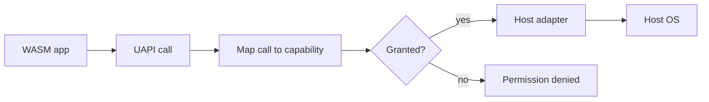

# UAPI Overview

UAPI means Universal API.

It is the standard app API every Layer36 app will call. Instead of calling
Windows files, macOS files, Linux files, Android files, or iOS files directly,
an app calls the Layer36 file API. The host adapter then does the native work.

Phase 2 starts this layer.

## Planned Modules

```text
layer36:
  io/              stdio, pipes, stdout, stderr
  fs/              files, paths, metadata
  net/             HTTP first, more network APIs later
  time/            clocks and timers
  locale/          language, region, formatting
  ui/              windows, widgets, layout, input
  gfx/             2D drawing and GPU work
  audio/           playback and capture
  sensors/         motion, location, camera, mic
  storage/         key-value, SQL, object storage
  crypto/          hashes, signing, encryption, random
  identity/        user identity and signing
  notify/          system notifications
  accessibility/   screen readers and reduced-motion settings
  platform/        device info and host capabilities
```

## Phase 2 Scope

Phase 2 only covers:

- `io`
- `fs`
- `net`
- `time`
- `locale`

That is enough to build the first useful CLI apps without pretending the whole
platform is ready.

The first Phase 2 draft is checked into `wit/layer36/phase2`. It is a review
draft, not a frozen compatibility promise yet.

## App Manifest

Phase 2 apps can also carry a sidecar `manifest.toml`.

The manifest says:

- what the app is called
- which `.wasm` file is the entry point
- which UAPI world it targets
- which capabilities it wants

Example:

```toml
[app]
id = "com.example.hello"
name = "Hello"
version = "1.0.0"
entry = "hello.wasm"
world = "layer36:app/cli@0.1.0"

[[capabilities]]
cap = "fs.read:~/Documents/notes/**"
rationale = "Read saved notes"
required = true

[[capabilities]]
cap = "net.connect:api.example.com:443"
rationale = "Sync to cloud"
required = false
```

You can validate the file today:

```bash
cargo run -p layer36-cli -- manifest check manifest.toml
```

`layer36 run` also reads `manifest.toml` when it sits next to the `.wasm` file:

```bash
cargo run -p layer36-cli -- run app.wasm --grant fs.read:~/Documents/notes/**
cargo run -p layer36-cli -- run app.wasm --auto-grant
```

For now, this is a preflight check. If a required capability is missing,
Layer36 exits before the component starts.

The runtime now also has the next piece: a UAPI guard. It is small, but it is
the path every future adapter should use before it touches the host OS.

Simple version:

1. App calls a UAPI function.
2. Runtime turns that call into a capability string.
3. The session policy checks whether that capability was granted.
4. Only then does the host adapter read the file, write the file, or connect to
   the network.



Today this guard is tested inside the runtime. The generated Phase 2 dispatcher
still needs to call it for each real WIT import.

## Dispatcher Scaffold

The runtime now has the first dispatcher layer too:

```text
WIT import -> UapiDispatcher -> UapiGuard -> HostAdapter trait -> native OS
```

Right now, the host adapter traits are still stubs. That is expected. The value
of this step is that the boundary is testable:

- a denied `fs.open` does not call the file adapter
- a denied `net.fetch` does not call the network adapter
- a granted call reaches the adapter
- file and network permission failures are mapped to module-level errors

The bridge between generated WIT types and dispatcher types now exists too.
It converts things like `open-mode`, HTTP requests, file stats, locale IDs, and
WIT module errors into the runtime's internal structs and enums. That keeps the
future import code simple: receive a WIT value, convert it, call the dispatcher,
convert the result back.

The first generated host implementation now exists as well. It wires Wasmtime's
generated Phase 2 traits to the dispatcher for:

- HTTP fetch
- path-level filesystem calls such as `stat`, `list`, `mkdir`, and `rename`
- time and sleep
- locale info and formatting
- logging
- stdio

That host implementation also has the first resource table. When an app opens a
file or asks for stdio, the runtime gives it a resource ID owned by the host.
Later reads, writes, seeks, stats, and flushes use that ID to find the real host
handle and call the adapter. This keeps handles inside the runtime instead of
letting guest code pass around raw host IDs.

This host is now installed into the real `layer36 run` path. The runtime still
tries the Phase 1 world first for the original proof app. If that world does
not match, it tries the Phase 2 `cli` world and installs the generated UAPI
imports.

The local adapter is still small on purpose. It can handle stdio, basic files,
time, and locale. HTTP returns a clear unsupported error until we add the real
network adapter.

The first proof component lives at `test/integration/phase2-smoke`. It reads a
file, checks time and locale, and writes output through the Phase 2 imports.
This is the first end-to-end proof that the UAPI path is more than generated
types. The matching denial test runs the same component without `fs.read`; the
host returns permission denied before native file access happens.

The first named sample app is `apps/layer36-clock`. It uses the same Phase 2
world but focuses on time, locale, and stdout. A hidden `--test-time` runner
flag lets the test suite freeze wall-clock time, which keeps the sample output
stable across machines.

The next sample is `apps/layer36-cat`. It forced one important addition:
Layer36-native app arguments. You pass app arguments after `--`:

```bash
layer36 run --grant fs.read:fixtures/** layer36_cat.wasm -- fixtures/a.txt fixtures/b.txt
```

Inside the component, those arguments come from `layer36:io/args.raw`. The first
draft returns a newline-separated string. That is intentionally simple while the
CLI UAPI is still taking shape.

## Rust Binding Checkpoint

The runtime has a feature named `phase2-bindings` that asks Wasmtime to generate
Rust host bindings from the Phase 2 WIT:

```bash
cargo test -p layer36-runtime --features phase2-bindings
```

This is not the public SDK yet. It is a safety check for us while the WIT is
still moving. It tells us whether the current WIT names turn into usable Rust
names before we build adapter code on top of them.
