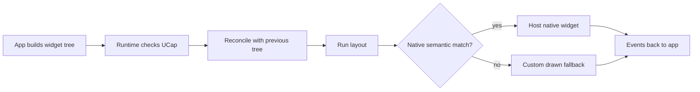
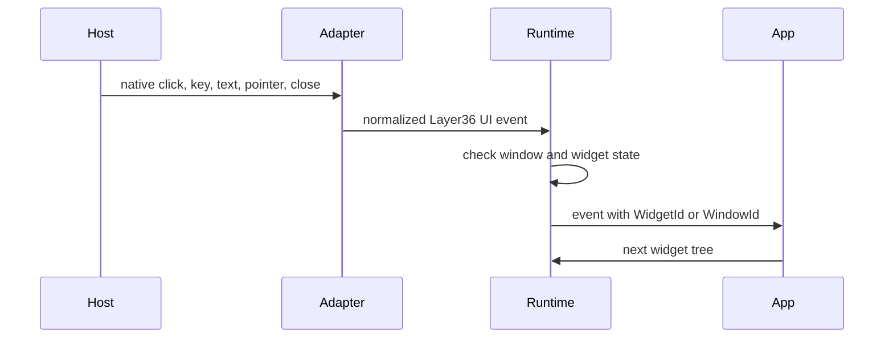

# RFC-0003: Layer36 Phase 3 Widget Protocol

**Status:** Draft  
**Date:** 2026-05-21  
**Author:** @incyashraj  
**Related ADR:** `docs/adr/0013-widget-lowering-strategy.md`

---

## Summary

Layer36 apps should describe a small widget tree. The runtime and host adapter
then turn that tree into native widgets where the host has a good match, or into
custom drawn UI where it does not.

This RFC defines the first protocol shape for that work. It does not freeze the
Phase 3 UI API. It gives the next native window, layout, and notes app work a
shared target.

---

## Goals

- One widget tree that works on Windows, macOS, and Linux.
- Native controls for common widgets such as button, text field, list, menu,
  and checkbox.
- Custom drawing for canvas, rich surfaces, and controls that do not have a
  good native match.
- Stable widget identity so input, focus, state, and accessibility can survive
  across frames.
- A small first widget set that is enough for `layer36-notes`.

---

## Non Goals

- No design system in Phase 3.
- No browser based UI shell.
- No mobile specific widgets yet.
- No complete component library.
- No promise that all widgets look identical across hosts.

---

## Core Model

An app submits a tree of widget nodes. Each node has a stable `WidgetId`, a
kind, layout hints, accessibility metadata, and optional app state.

The runtime keeps the previous tree and the next tree. It computes the changes,
runs layout, then asks the host adapter to lower each node.

---

## First Widget Set

The first protocol set should stay small:

| Widget | Native path | Fallback path | Needed by notes app |
|---|---|---|---|
| Window root | host window content view | drawn root surface | yes |
| Stack | host layout container where useful | layout only | yes |
| Text | native label where useful | drawn text | yes |
| Button | native button | drawn button | yes |
| Text field | native single line field | drawn input later | yes |
| Text area | native multiline field | drawn editor later | yes |
| List | native list or table | drawn list later | yes |
| Scroll | native scroll view | drawn scroll later | yes |
| Checkbox | native checkbox | drawn checkbox | maybe |
| Menu | host menu | app drawn fallback only if needed | yes |
| Canvas | no native widget match | drawn canvas | later |

Anything outside this set needs a separate RFC note or an update to this one.

---

## Native Three Of Five Rule

A widget can become a first class Layer36 protocol widget when at least three of
these hosts have a native control with the same meaning:

- Windows
- macOS
- Linux
- iOS
- Android

This rule keeps the protocol close to real platform concepts. If fewer hosts
have the control, we can still support the behavior through a canvas or custom
drawn widget, but it should not become a core widget too early.

---

## Lowering Rules

The adapter gets a widget node after UCap checks and layout planning. It should
then choose one of these paths:

1. Native widget, when the host has a semantic match.
2. Custom drawn fallback, when no semantic match exists.
3. Unsupported with a clear error, when the runtime cannot provide enough input,
   layout, accessibility, or permission behavior yet.

The adapter should not choose a native widget only because it looks close. It
has to behave close enough too.

---

## Widget Identity

Every widget has a stable `WidgetId`. The app owns these IDs. The runtime uses
them for:

- focus
- event routing
- diffing
- accessibility nodes
- preserving host widget handles

If a widget changes kind but keeps the same ID, the runtime should destroy the
old host object and create the new one. If a widget moves but keeps the same
kind and ID, the runtime should keep the host object where possible.

---

## Event Flow

Events travel back from host to app through the runtime.

The first implementation can start with window events and button click events.
Text input, IME, pointer capture, and accessibility events come after the basic
window path is stable.

---

## Accessibility

Accessibility is part of the widget protocol, not a later theme. Every widget
must carry enough metadata for the runtime to build an accessibility tree.

At minimum, each node needs:

- role
- label or labelled by reference
- enabled or disabled state
- focused state when relevant
- selected state when relevant
- bounds after layout

Custom drawn widgets must provide the same accessibility shape as native
widgets. Otherwise they are not allowed in the default notes app path.

---

## Open Questions

- How much style should be part of v0.1?
- Should `TextArea` use a native widget first, or should the notes editor use a
  custom drawn editor early?
- Which Linux backend should be the first native proof, GTK4 or a smaller
  window plus custom draw path?
- How much menu behavior belongs in `ui` versus a later app shell module?

---

## Acceptance For This RFC

This RFC is useful when the next three pieces can be built against it:

- one native blank window proof
- one tiny widget tree with text and button
- one `layer36-notes` skeleton that can later replace placeholders with real
  native controls
